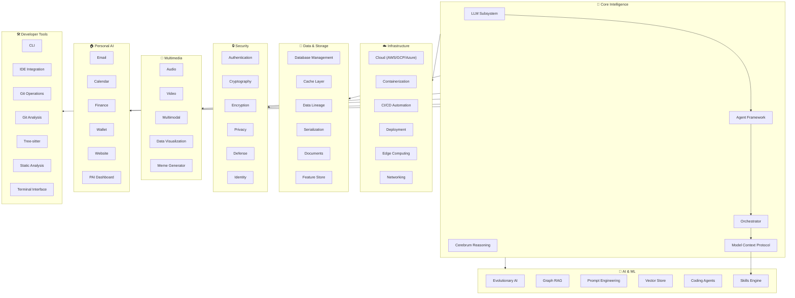
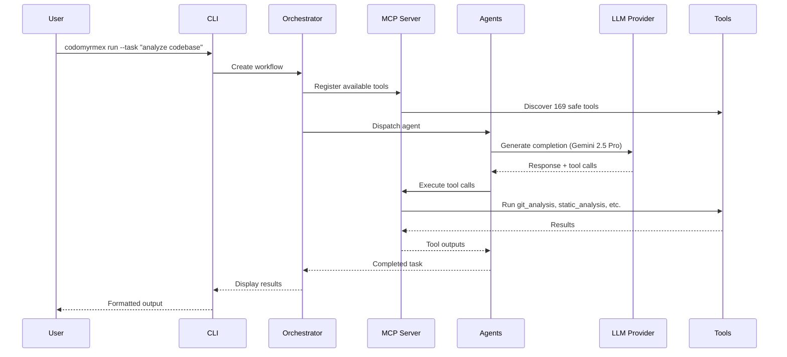
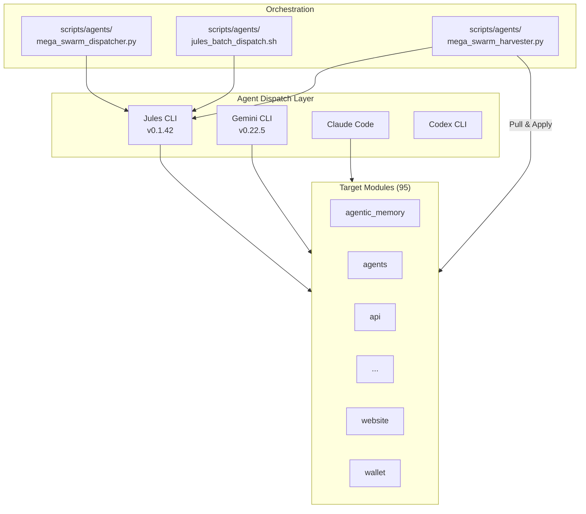
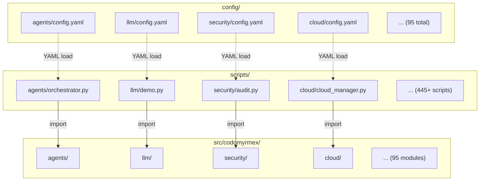
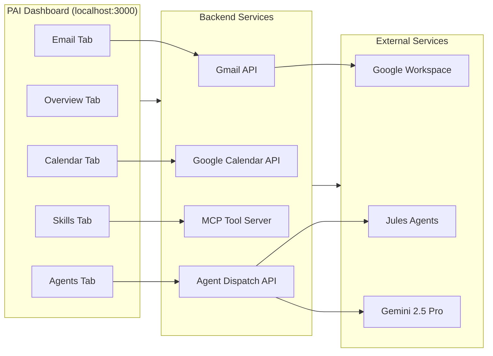

<p align="center">
  
  
  
  
  
  
</p>

# 🐜 Codomyrmex

> **A comprehensive, modular, agentic Python ecosystem for autonomous software engineering, personal AI infrastructure, and multi-agent orchestration.**

Codomyrmex is a production-grade library of 95+ deeply integrated modules spanning AI agents, cloud infrastructure, security, finance, multimedia, and more — all built on a strict **Zero-Mock** testing policy ensuring every method is real, tested, documented, and functional.

---

## 📐 System Architecture



---

## 🗂️ Complete Module Inventory

### 🧠 Core Intelligence Modules

| Module | Py Files | Tests | README | SPEC | AGENTS | Config | Description |
|:---|:---:|:---:|:---:|:---:|:---:|:---:|:---|
| `agents` | 168 | 83 | ✅ | ✅ | ✅ | ✅ | Multi-provider agent framework (Gemini, Claude, OpenAI, Jules) |
| `cerebrum` | 32 | 13 | ✅ | ✅ | ✅ | ✅ | Cognitive reasoning engine with chain-of-thought & decision trees |
| `llm` | 41 | 20 | ✅ | ✅ | ✅ | ✅ | LLM subsystem with OpenRouter, Gemini 2.5 Pro, streaming |
| `orchestrator` | 46 | 20 | ✅ | ✅ | ✅ | ✅ | Workflow engine, pipeline execution, parallel orchestration |
| `model_context_protocol` | 27 | 9 | ✅ | ✅ | ✅ | ✅ | MCP tool server, bridge, and protocol implementation |
| `prompt_engineering` | 10 | 7 | ✅ | ✅ | ✅ | ✅ | Template management, prompt optimization, few-shot patterns |
| `skills` | 22 | 11 | ✅ | ✅ | ✅ | ✅ | Extensible skill registry and execution engine |

### 🤖 AI & Machine Learning Modules

| Module | Py Files | Tests | README | SPEC | AGENTS | Config | Description |
|:---|:---:|:---:|:---:|:---:|:---:|:---:|:---|
| `coding` | 71 | 18 | ✅ | ✅ | ✅ | ✅ | Code generation, refactoring, analysis, and review agents |
| `evolutionary_ai` | 11 | 6 | ✅ | ✅ | ✅ | ✅ | Genetic algorithms, fitness, selection, genome operators |
| `graph_rag` | 5 | 3 | ✅ | ✅ | ✅ | ✅ | Graph-based retrieval-augmented generation |
| `vector_store` | 5 | 4 | ✅ | ✅ | ✅ | ✅ | Embedding storage, similarity search, FAISS/ChromaDB |
| `bio_simulation` | 9 | 3 | ✅ | ✅ | ✅ | ✅ | Biological colony simulation and genomic population models |
| `simulation` | 3 | 3 | ✅ | ✅ | ✅ | ✅ | General-purpose simulation framework |
| `quantum` | 6 | 1 | ✅ | ✅ | ✅ | ✅ | Quantum computing abstractions and circuit simulation |
| `fpf` | 26 | 11 | ✅ | ✅ | ✅ | ✅ | Free-energy Principle Framework (Active Inference) |

### ☁️ Infrastructure & DevOps Modules

| Module | Py Files | Tests | README | SPEC | AGENTS | Config | Description |
|:---|:---:|:---:|:---:|:---:|:---:|:---:|:---|
| `cloud` | 52 | 22 | ✅ | ✅ | ✅ | ✅ | Multi-cloud SDK (AWS, GCP, Azure, Infomaniak, Coda.io) |
| `containerization` | 16 | 7 | ✅ | ✅ | ✅ | ✅ | Docker/Podman management, image building, registry |
| `container_optimization` | 3 | 2 | ✅ | ✅ | ✅ | ✅ | Resource tuning and container performance optimization |
| `ci_cd_automation` | 22 | 12 | ✅ | ✅ | ✅ | ✅ | Pipeline building, artifact management, deployment orchestration |
| `deployment` | 13 | 7 | ✅ | ✅ | ✅ | ✅ | Deployment strategies (blue-green, canary, rolling) |
| `edge_computing` | 14 | 2 | ✅ | ✅ | ✅ | ✅ | Edge cluster management, scheduling, health monitoring |
| `networking` | 9 | 6 | ✅ | ✅ | ✅ | ✅ | HTTP clients, WebSocket, gRPC, service mesh |
| `networks` | 3 | 3 | ✅ | ✅ | ✅ | ✅ | Network topology and graph analysis |
| `cost_management` | 4 | 2 | ✅ | ✅ | ✅ | ✅ | Cloud cost tracking, budget alerts, optimization |

### 💾 Data & Storage Modules

| Module | Py Files | Tests | README | SPEC | AGENTS | Config | Description |
|:---|:---:|:---:|:---:|:---:|:---:|:---:|:---|
| `database_management` | 17 | 12 | ✅ | ✅ | ✅ | ✅ | Multi-DB engine (SQLite, PostgreSQL), migrations, ORM |
| `cache` | 19 | 11 | ✅ | ✅ | ✅ | ✅ | Multi-backend caching (Redis, memory, disk), TTL, LRU |
| `data_lineage` | 5 | 2 | ✅ | ✅ | ✅ | ✅ | Data flow tracking, lineage graphs, provenance |
| `serialization` | 7 | 6 | ✅ | ✅ | ✅ | ✅ | JSON, YAML, MessagePack, Protobuf serialization |
| `documents` | 38 | 16 | ✅ | ✅ | ✅ | ✅ | Document processing (PDF, HTML, CSV, XML, Markdown) |
| `feature_store` | 5 | 2 | ✅ | ✅ | ✅ | ✅ | ML feature registry, versioning, and serving |
| `agentic_memory` | 35 | 30 | ✅ | ✅ | ✅ | ✅ | Long-term agent memory, retrieval, and knowledge graphs |
| `model_ops` | 22 | 10 | ✅ | ✅ | ✅ | ✅ | ML model lifecycle, registry, versioning |

### 🔒 Security & Identity Modules

| Module | Py Files | Tests | README | SPEC | AGENTS | Config | Description |
|:---|:---:|:---:|:---:|:---:|:---:|:---:|:---|
| `security` | 47 | 16 | ✅ | ✅ | ✅ | ✅ | Threat detection, vulnerability scanning, audit trails |
| `auth` | 13 | 4 | ✅ | ✅ | ✅ | ✅ | OAuth, API key, JWT, RBAC authentication |
| `crypto` | 37 | 26 | ✅ | ✅ | ✅ | ✅ | Cryptographic primitives, hashing, key management |
| `encryption` | 12 | 3 | ✅ | ✅ | ✅ | ✅ | AES-GCM, signing, KDF, HMAC, key rotation |
| `privacy` | 4 | 2 | ✅ | ✅ | ✅ | ✅ | PII detection, data anonymization, compliance |
| `defense` | 4 | 5 | ✅ | ✅ | ✅ | ✅ | Adversarial defense, input sanitization (deprecated) |
| `identity` | 5 | 4 | ✅ | ✅ | ✅ | ✅ | Digital identity, persona management, biocognitive auth |
| `wallet` | 16 | 3 | ✅ | ✅ | ✅ | ✅ | Cryptocurrency wallet, key storage, transaction signing |

### 🎨 Multimedia & Visualization Modules

| Module | Py Files | Tests | README | SPEC | AGENTS | Config | Description |
|:---|:---:|:---:|:---:|:---:|:---:|:---:|:---|
| `audio` | 15 | 5 | ✅ | ✅ | ✅ | ✅ | TTS (edge-tts, pyttsx3), audio processing, transcription |
| `video` | 12 | 4 | ✅ | ✅ | ✅ | ✅ | Video processing, frame extraction, Veo 2.0 generation |
| `multimodal` | 2 | 3 | ❌ | ❌ | ❌ | ✅ | Imagen 3 image generation, multi-modal AI pipelines |
| `data_visualization` | 68 | 20 | ✅ | ✅ | ✅ | ✅ | Matplotlib, Plotly, chart generation, dashboards |
| `meme` | 57 | 6 | ✅ | ✅ | ✅ | ✅ | Meme generation, template engine, social media formatting |
| `spatial` | 12 | 3 | ✅ | ✅ | ✅ | ✅ | Geospatial data, coordinate systems, mapping |

### 🏠 Personal AI (PAI) Modules

| Module | Py Files | Tests | README | SPEC | AGENTS | Config | Description |
|:---|:---:|:---:|:---:|:---:|:---:|:---:|:---|
| `email` | 14 | 4 | ✅ | ✅ | ✅ | ✅ | Gmail, AgentMail providers, SMTP, IMAP |
| `calendar_integration` | 6 | 2 | ✅ | ✅ | ✅ | ✅ | Google Calendar CRUD, event management, scheduling |
| `finance` | 10 | 2 | ✅ | ✅ | ✅ | ✅ | Ledger, payroll, forecasting, tax calculation |
| `website` | 15 | 19 | ✅ | ✅ | ✅ | ✅ | PAI dashboard server, health monitoring, proxying |
| `market` | 4 | 3 | ✅ | ✅ | ✅ | ✅ | Market data, trading signals, portfolio analysis |
| `logistics` | 27 | 9 | ✅ | ✅ | ✅ | ✅ | Task routing, supply chain, resource allocation |
| `relations` | 15 | 4 | ✅ | ✅ | ✅ | ✅ | Contact management, relationship mapping, CRM |
| `physical_management` | 8 | 4 | ✅ | ✅ | ✅ | ✅ | IoT device tracking, physical asset management |

### 🛠️ Developer Tooling Modules

| Module | Py Files | Tests | README | SPEC | AGENTS | Config | Description |
|:---|:---:|:---:|:---:|:---:|:---:|:---:|:---|
| `cli` | 21 | 6 | ✅ | ✅ | ✅ | ✅ | Rich CLI with subcommands for all modules |
| `ide` | 16 | 9 | ✅ | ✅ | ✅ | ✅ | VS Code, Cursor, Antigravity IDE integrations |
| `git_operations` | 34 | 20 | ✅ | ✅ | ✅ | ✅ | Full Git CLI wrapper (branch, merge, stash, submodules) |
| `git_analysis` | 16 | 4 | ✅ | ✅ | ✅ | ✅ | Commit analysis, contributor stats, code churn |
| `tree_sitter` | 7 | 2 | ✅ | ✅ | ✅ | ✅ | AST parsing, code navigation, structural queries |
| `static_analysis` | 4 | 9 | ✅ | ✅ | ✅ | ✅ | Linting, complexity metrics, dead code detection |
| `terminal_interface` | 8 | 4 | ✅ | ✅ | ✅ | ✅ | Rich terminal UI, ANSI rendering, interactive prompts |
| `scrape` | 12 | 9 | ✅ | ✅ | ✅ | ✅ | Web scraping, HTML parsing, sitemap crawling |
| `search` | 6 | 3 | ✅ | ✅ | ✅ | ✅ | Full-text search, fuzzy matching, regex search |

### ⚙️ Configuration & Operations Modules

| Module | Py Files | Tests | README | SPEC | AGENTS | Config | Description |
|:---|:---:|:---:|:---:|:---:|:---:|:---:|:---|
| `config_management` | 13 | 7 | ✅ | ✅ | ✅ | ✅ | Hierarchical config loading, validation, hot-reload |
| `config_monitoring` | 3 | 1 | ✅ | ✅ | ✅ | ✅ | Configuration drift detection and alerting |
| `config_audits` | 4 | 1 | ✅ | ✅ | ✅ | ✅ | Configuration compliance auditing and rule engine |
| `environment_setup` | 4 | 4 | ✅ | ✅ | ✅ | ✅ | Dependency resolution, environment validation |
| `logging_monitoring` | 16 | 4 | ✅ | ✅ | ✅ | ✅ | Structured logging, metrics collection, alerting |
| `telemetry` | 25 | 13 | ✅ | ✅ | ✅ | ✅ | OpenTelemetry traces, spans, exporters |
| `performance` | 19 | 4 | ✅ | ✅ | ✅ | ✅ | Benchmarking, profiling, performance visualization |
| `maintenance` | 12 | 3 | ✅ | ✅ | ✅ | ✅ | Health checks, cleanup, system diagnostics |
| `release` | 4 | 2 | ✅ | ✅ | ✅ | ✅ | Release management, changelog generation, versioning |

### 🧩 Framework & Utility Modules

| Module | Py Files | Tests | README | SPEC | AGENTS | Config | Description |
|:---|:---:|:---:|:---:|:---:|:---:|:---:|:---|
| `utils` | 17 | 15 | ✅ | ✅ | ✅ | ✅ | CLI helpers, string ops, file utils, decorators |
| `validation` | 16 | 7 | ✅ | ✅ | ✅ | ✅ | Schema validation, data contracts, type checking |
| `exceptions` | 13 | 2 | ✅ | ✅ | ✅ | ✅ | Comprehensive exception hierarchy (AI, IO, Git, Config) |
| `events` | 29 | 7 | ✅ | ✅ | ✅ | ✅ | Event bus, pub/sub, event store, logging listeners |
| `plugin_system` | 12 | 7 | ✅ | ✅ | ✅ | ✅ | Plugin discovery, lifecycle, dependency injection |
| `dependency_injection` | 4 | 2 | ✅ | ✅ | ✅ | ✅ | IoC container, service locator, scoped lifetimes |
| `concurrency` | 17 | 5 | ✅ | ✅ | ✅ | ✅ | Distributed locks, semaphores, Redis locking |
| `compression` | 8 | 1 | ✅ | ✅ | ✅ | ✅ | gzip, zstd, brotli compression algorithms |
| `templating` | 8 | 4 | ✅ | ✅ | ✅ | ✅ | Jinja2 templating, code generation templates |
| `feature_flags` | 9 | 6 | ✅ | ✅ | ✅ | ✅ | Feature flag management, rollout strategies |
| `tool_use` | 5 | 4 | ✅ | ✅ | ✅ | ✅ | Tool registration, execution, and discovery |
| `testing` | 15 | 7 | ✅ | ✅ | ✅ | ✅ | Test fixtures, runners, coverage utilities |
| `documentation` | 45 | 10 | ✅ | ✅ | ✅ | ✅ | Docusaurus site, docs generation, quality checks |
| `docs_gen` | 4 | 2 | ✅ | ✅ | ✅ | ✅ | Automated documentation generation from source |
| `module_template` | 2 | 5 | ✅ | ✅ | ✅ | ✅ | Canonical template for new module creation |
| `operating_system` | 10 | 1 | ✅ | ✅ | ✅ | ✅ | OS interaction (macOS/Linux/Windows), filesystem, processes |
| `file_system` | 2 | 2 | ✅ | ✅ | ✅ | ✅ | File operations, directory walker, permissions |
| `dark` | 4 | 2 | ✅ | ✅ | ✅ | ✅ | Dark PDF extraction and processing |
| `embodiment` | 9 | 1 | ✅ | ✅ | ✅ | ✅ | ROS bridge, sensors, actuators (deprecated) |
| `demos` | 2 | 1 | ✅ | ✅ | ✅ | ❌ | Demo registry and showcase runner |
| `formal_verification` | 8 | 2 | ✅ | ✅ | ✅ | ✅ | Z3 backend, SMT solver, invariant checking |
| `system_discovery` | 14 | 4 | ✅ | ✅ | ✅ | ✅ | System introspection, capability detection |

---

## 🔬 Module Dependency Architecture

```mermaid
graph LR
    subgraph Foundation["Foundation Layer"]
        Utils["utils"]
        Exceptions["exceptions"]
        Events["events"]
        Validation["validation"]
        Config["config_management"]
    end

    subgraph DataLayer["Data Layer"]
        DB["database_management"]
        Cache["cache"]
        Serial["serialization"]
        Docs["documents"]
        Memory["agentic_memory"]
    end

    subgraph AILayer["AI Layer"]
        LLM["llm"]
        Agents["agents"]
        Cerebrum["cerebrum"]
        RAG["graph_rag"]
        VS["vector_store"]
        PE["prompt_engineering"]
    end

    subgraph InfraLayer["Infrastructure Layer"]
        Cloud["cloud"]
        Container["containerization"]
        Deploy["deployment"]
        CICD["ci_cd_automation"]
        Net["networking"]
    end

    subgraph SecurityLayer["Security Layer"]
        Auth["auth"]
        Crypto["crypto"]
        Encrypt["encryption"]
        Identity["identity"]
        Privacy["privacy"]
    end

    subgraph AppLayer["Application Layer"]
        Orch["orchestrator"]
        MCP["model_context_protocol"]
        CLI["cli"]
        Website["website"]
        PAI["email + calendar"]
    end

    Foundation --> DataLayer
    Foundation --> SecurityLayer
    DataLayer --> AILayer
    SecurityLayer --> AILayer
    AILayer --> AppLayer
    InfraLayer --> AppLayer
    DataLayer --> InfraLayer
```



---

## 🚀 Agent Orchestration Pipeline



---

## 🏗️ Project Structure

```
codomyrmex/
├── .github/                  # GitHub workflows, templates, README
├── config/                   # 95 module-specific config.yaml files
│   ├── agents/config.yaml
│   ├── llm/config.yaml
│   ├── security/config.yaml
│   └── ... (95 modules)
├── docs/                     # Project-level documentation
│   ├── architecture/         # Architecture diagrams
│   ├── guides/               # User and developer guides
│   └── pai/                  # Personal AI documentation
├── scripts/                  # 445+ orchestrator scripts
│   ├── agents/               # Jules batch dispatch, harvester
│   ├── maintenance/          # Config generation, health checks
│   ├── orchestrator/         # Workflow pipelines
│   └── ... (90+ module scripts)
├── src/codomyrmex/           # Main source (95 modules)
│   ├── agents/               # 168 files — Multi-agent framework
│   ├── llm/                  # 41 files — LLM providers
│   ├── security/             # 47 files — Security suite
│   ├── cloud/                # 52 files — Multi-cloud SDK
│   ├── coding/               # 71 files — Code generation
│   ├── data_visualization/   # 68 files — Charting & dashboards
│   ├── orchestrator/         # 46 files — Workflow engine
│   ├── tests/                # 800+ test files (zero-mock)
│   └── ... (87 more modules)
└── pyproject.toml            # uv-managed project configuration
```

---

## 📊 Aggregate Statistics

| Metric | Value |
|:---|:---:|
| **Total Modules** | 95 |
| **Total Python Files** | 1,800+ |
| **Total Test Files** | 800+ |
| **Modules with README.md** | 94 / 95 (99%) |
| **Modules with SPEC.md** | 94 / 95 (99%) |
| **Modules with AGENTS.md** | 94 / 95 (99%) |
| **Modules with config.yaml** | 94 / 95 (99%) |
| **Testing Policy** | Zero-Mock (100% real methods) |
| **Default LLM** | Gemini 2.5 Pro |
| **Agent Frameworks** | Gemini, Claude, OpenAI, Jules, OpenRouter |
| **Cloud Providers** | AWS, GCP, Azure, Infomaniak, Coda.io |
| **Package Manager** | uv |
| **Python Version** | 3.11+ |

---

## 🔌 LLM Provider Matrix

| Provider | Model | Status | Free Tier | Streaming | Tool Use |
|:---|:---|:---:|:---:|:---:|:---:|
| **Google Gemini** | gemini-2.5-pro | ✅ Active | ✅ | ✅ | ✅ |
| **Google Imagen** | imagen-3.0-generate-002 | ✅ Active | ❌ | — | — |
| **Google Veo** | veo-2.0-generate-001 | ✅ Active | ❌ | — | — |
| **OpenRouter** | Llama 3.3 70B | ✅ Active | ✅ | ✅ | ✅ |
| **OpenRouter** | DeepSeek R1 | ✅ Active | ✅ | ✅ | ✅ |
| **OpenRouter** | Google Gemma 3 | ✅ Active | ✅ | ✅ | ✅ |
| **Anthropic** | Claude 3.5 Sonnet | ✅ Active | ❌ | ✅ | ✅ |
| **OpenAI** | GPT-4o | ✅ Active | ❌ | ✅ | ✅ |

---

## 🤖 Agent Dispatch Architecture



---

## 🧪 Testing Philosophy

```mermaid
graph LR
    subgraph Policy["Zero-Mock Policy"]
        direction TB
        R1["✅ Real methods only"]
        R2["✅ Real file I/O"]
        R3["✅ Real network calls"]
        R4["✅ Real database ops"]
        R5["❌ No unittest.mock"]
        R6["❌ No MagicMock"]
        R7["❌ No monkey-patching"]
    end

    subgraph Layers["Test Layers"]
        Unit["Unit Tests<br/>800+ files"]
        Integration["Integration Tests<br/>Real API calls"]
        E2E["End-to-End<br/>Full workflow validation"]
    end

    subgraph Runner["Test Runner"]
        Pytest["pytest + coverage"]
        UV["uv run"]
    end

    Policy --> Layers
    Layers --> Runner
```



**Run all tests:**

```bash
uv run python -m pytest src/codomyrmex/tests/ -v --tb=short
```

**Run a specific module's tests:**

```bash
uv run python -m pytest src/codomyrmex/tests/unit/llm/ -v
```

---

## ⚡ Quick Start

```bash
# Clone the repository
git clone https://github.com/docxology/codomyrmex.git
cd codomyrmex

# Install with uv
uv sync

# Set up environment
cp .env.example .env
# Edit .env with your API keys (GEMINI_API_KEY, OPENROUTER_API_KEY, etc.)

# Run the CLI
uv run python -m codomyrmex.cli --help

# Run tests
uv run python -m pytest src/codomyrmex/tests/ -v

# Dispatch Jules agents
uv run python scripts/agents/mega_swarm_dispatcher.py

# Harvest completed Jules work
uv run python scripts/agents/mega_swarm_harvester.py
```

---

## 🗺️ Configuration Architecture



Each `config/<module>/config.yaml` contains standardized settings:

```yaml
module: <module_name>
enabled: true
logging:
  level: INFO
  format: '%(asctime)s - %(name)s - %(levelname)s - %(message)s'
  file: logs/<module_name>.log
performance:
  max_workers: 4
  timeout_seconds: 30.0
  caching: true
features:
  experimental: false
  strict_mode: true
```

---

## 📚 Documentation Standards

Every module follows the **RASP** documentation pattern:

| Document | Purpose | Coverage |
|:---|:---|:---:|
| `README.md` | Human-readable overview, quick start, examples | 99% |
| `AGENTS.md` | Agent-readable instructions, tool specs, workflows | 99% |
| `SPEC.md` | Technical specification, API contracts, schemas | 99% |
| `PAI.md` | Personal AI integration points, trust levels | ~60% |

---

## 🌐 Personal AI Dashboard



---

## 📜 License

MIT License — see [LICENSE](../LICENSE) for details.

---

<p align="center">
  <b>Built with 🐜 Codomyrmex — The Autonomous Software Colony</b><br>
  <sub>95 modules · 1,800+ Python files · 800+ tests · Zero-Mock · Production-Grade</sub>
</p>
