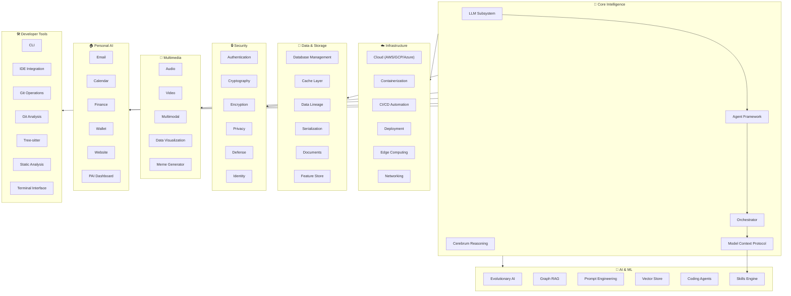
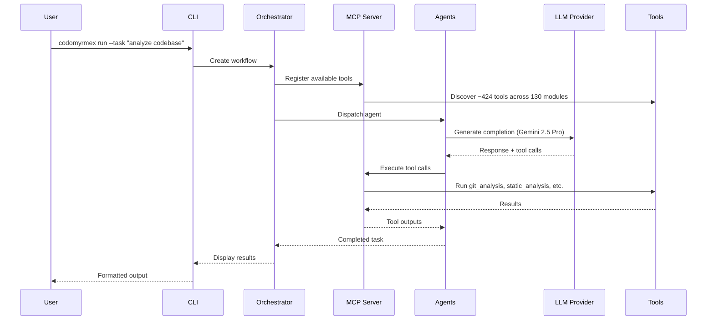
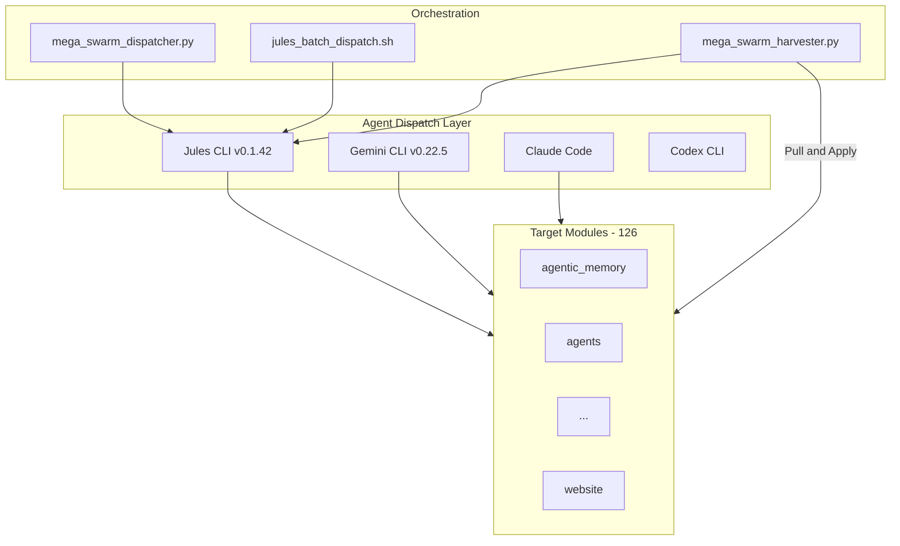
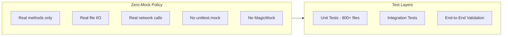
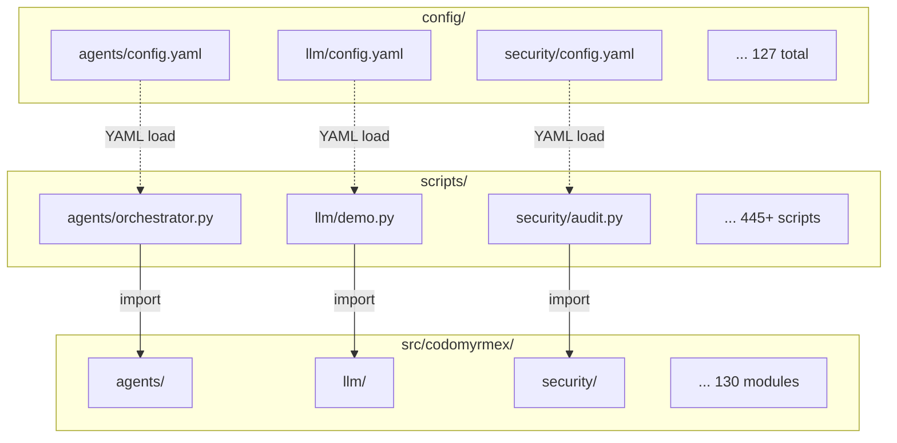

<!-- markdownlint-disable MD033 MD041 MD060 -->
<p align="center">
  <a href="https://github.com/docxology/codomyrmex/actions/workflows/ci.yml"></a>
  <a href="https://github.com/docxology/codomyrmex/actions/workflows/security.yml"></a>
  <a href="https://github.com/docxology/codomyrmex/actions/workflows/auto-merge.yml"></a>
  <br>
  
  
  
  
  
  <br>
  <a href="https://github.com/docxology/codomyrmex/stargazers"></a>
  <a href="https://github.com/docxology/codomyrmex/network/members"></a>
  <a href="https://github.com/docxology/codomyrmex/commits/main"></a>
  <a href="https://github.com/docxology/codomyrmex/issues"></a>
  
  
  
  
</p>

# 🐜 Codomyrmex

> **A comprehensive, modular, agentic Python ecosystem for autonomous software engineering, personal AI infrastructure, and multi-agent orchestration.**

Codomyrmex is a production-grade library of **128 deeply integrated modules** spanning AI agents, cloud infrastructure, security, finance, multimedia, and more — all built on a strict **Zero-Mock** testing policy ensuring every method is real, tested, documented, and functional. The ecosystem includes **3,000+ Python files**, **905+ test files**, **1,029+ documentation pages**, and **36 GitHub Actions workflows**.

---

## 📚 Documentation Hub

### Top-Level Documents

| Document | Description |
|:---|:---|
| [**docs/README.md**](docs/README.md) | Documentation home — full directory guide |
| [**docs/ARCHITECTURE.md**](docs/ARCHITECTURE.md) | System architecture, dependency layers, design patterns |
| [**docs/AGENTS.md**](docs/AGENTS.md) | Agent coordination rules and autonomous workflows |
| [**docs/SPEC.md**](docs/SPEC.md) | Technical specification, API contracts, schemas |
| [**docs/PAI.md**](docs/PAI.md) | Personal AI Infrastructure integration reference |
| [**docs/PAI_DASHBOARD.md**](docs/PAI_DASHBOARD.md) | PAI dashboard GUI reference and tab guide |
| [**docs/index.md**](docs/index.md) | MkDocs site index and navigation entry point |

### Documentation Directories

| Directory | Files | Description |
|:---|:---:|:---|
| [**docs/getting-started/**](docs/getting-started/) | 9 | Quick start, installation, setup, tutorials |
| [**docs/development/**](docs/development/) | 10 | Dev environment, testing strategy, contribution guides |
| [**docs/reference/**](docs/reference/) | 16 | API reference, CLI reference, troubleshooting |
| [**docs/modules/**](docs/modules/) | 126 dirs | Per-module documentation (README, SPEC, AGENTS, PAI per module) |
| [**docs/agents/**](docs/agents/) | 4 | Agent rules, coordination, autonomous operation |
| [**docs/integration/**](docs/integration/) | 11 | External service integration (Google, GitHub, etc.) |
| [**docs/deployment/**](docs/deployment/) | 5 | Production deployment guides and checklists |
| [**docs/security/**](docs/security/) | 11 | Security theory, threat models, audit procedures |
| [**docs/pai/**](docs/pai/) | 10 | PAI dashboard, email, calendar, skill management |
| [**docs/bio/**](docs/bio/) | 15 | Biological & myrmecological perspectives |
| [**docs/cognitive/**](docs/cognitive/) | 11 | Cognitive science & engineering perspectives |
| [**docs/agi/**](docs/agi/) | 14 | AGI theory, emergence, recursive self-improvement |
| [**docs/compliance/**](docs/compliance/) | 5 | Audit reports, policy compliance, SOC2 |
| [**docs/examples/**](docs/examples/) | 8 | Code examples, integration demos, walkthroughs |
| [**docs/project/**](docs/project/) | 9 | Architecture, roadmap, contributing, governance |
| [**docs/project_orchestration/**](docs/project_orchestration/) | 11 | Multi-project workflow guides and pipelines |
| [**docs/skills/**](docs/skills/) | 9 | Skill system lifecycle, governance, authoring |
| [**docs/plans/**](docs/plans/) | 1 | Implementation plans and integration roadmaps |

---

## 📐 System Architecture



---

## 🗂️ Complete Module Inventory

> Every module links directly to its **source**, **docs**, **config**, and **scripts** directories.

### 🧠 Core Intelligence Modules

| Module | Py | Tests | Docs | Config | Scripts | Description |
|:---|:---:|:---:|:---:|:---:|:---:|:---|
| [`agents`](src/codomyrmex/agents/) | 168 | 83 | [📖](docs/modules/agents/) | [⚙️](config/agents/config.yaml) | [📜](scripts/agents/) | Multi-provider agent framework (Gemini, Claude, OpenAI, Jules) |
| [`cerebrum`](src/codomyrmex/cerebrum/) | 32 | 13 | [📖](docs/modules/cerebrum/) | [⚙️](config/cerebrum/config.yaml) | [📜](scripts/cerebrum/) | Cognitive reasoning engine with chain-of-thought & decision trees |
| [`llm`](src/codomyrmex/llm/) | 41 | 20 | [📖](docs/modules/llm/) | [⚙️](config/llm/config.yaml) | [📜](scripts/llm/) | LLM subsystem with OpenRouter, Gemini 2.5 Pro, streaming |
| [`orchestrator`](src/codomyrmex/orchestrator/) | 46 | 20 | [📖](docs/modules/orchestrator/) | [⚙️](config/orchestrator/config.yaml) | [📜](scripts/orchestrator/) | Workflow engine, pipeline execution, parallel orchestration |
| [`model_context_protocol`](src/codomyrmex/model_context_protocol/) | 27 | 9 | [📖](docs/modules/model_context_protocol/) | [⚙️](config/model_context_protocol/config.yaml) | [📜](scripts/model_context_protocol/) | MCP tool server, bridge, and protocol implementation |
| [`prompt_engineering`](src/codomyrmex/prompt_engineering/) | 10 | 7 | [📖](docs/modules/prompt_engineering/) | [⚙️](config/prompt_engineering/config.yaml) | [📜](scripts/prompt_engineering/) | Template management, prompt optimization, few-shot patterns |
| [`skills`](src/codomyrmex/skills/) | 22 | 11 | [📖](docs/modules/skills/) | [⚙️](config/skills/config.yaml) | [📜](scripts/skills/) | Extensible skill registry and execution engine |

### 🤖 AI & Machine Learning Modules

| Module | Py | Tests | Docs | Config | Scripts | Description |
|:---|:---:|:---:|:---:|:---:|:---:|:---|
| [`coding`](src/codomyrmex/coding/) | 71 | 18 | [📖](docs/modules/coding/) | [⚙️](config/coding/config.yaml) | [📜](scripts/coding/) | Code generation, refactoring, analysis, and review agents |
| [`evolutionary_ai`](src/codomyrmex/evolutionary_ai/) | 11 | 6 | [📖](docs/modules/evolutionary_ai/) | [⚙️](config/evolutionary_ai/config.yaml) | [📜](scripts/evolutionary_ai/) | Genetic algorithms, fitness, selection, genome operators |
| [`graph_rag`](src/codomyrmex/graph_rag/) | 5 | 3 | [📖](docs/modules/graph_rag/) | [⚙️](config/graph_rag/config.yaml) | [📜](scripts/graph_rag/) | Graph-based retrieval-augmented generation |
| [`vector_store`](src/codomyrmex/vector_store/) | 5 | 4 | [📖](docs/modules/vector_store/) | [⚙️](config/vector_store/config.yaml) | [📜](scripts/vector_store/) | Embedding storage, similarity search, FAISS/ChromaDB |
| [`bio_simulation`](src/codomyrmex/bio_simulation/) | 9 | 3 | [📖](docs/modules/bio_simulation/) | [⚙️](config/bio_simulation/config.yaml) | [📜](scripts/bio_simulation/) | Biological colony simulation and genomic population models |
| [`simulation`](src/codomyrmex/simulation/) | 3 | 3 | [📖](docs/modules/simulation/) | [⚙️](config/simulation/config.yaml) | [📜](scripts/simulation/) | General-purpose simulation framework |
| [`quantum`](src/codomyrmex/quantum/) | 6 | 1 | [📖](docs/modules/quantum/) | [⚙️](config/quantum/config.yaml) | [📜](scripts/quantum/) | Quantum computing abstractions and circuit simulation |
| [`fpf`](src/codomyrmex/fpf/) | 26 | 11 | [📖](docs/modules/fpf/) | [⚙️](config/fpf/config.yaml) | [📜](scripts/fpf/) | Feed-Parse-Format pipeline (fetch, parse, section export) |

### ☁️ Infrastructure & DevOps Modules

| Module | Py | Tests | Docs | Config | Scripts | Description |
|:---|:---:|:---:|:---:|:---:|:---:|:---|
| [`cloud`](src/codomyrmex/cloud/) | 52 | 22 | [📖](docs/modules/cloud/) | [⚙️](config/cloud/config.yaml) | [📜](scripts/cloud/) | Multi-cloud SDK (AWS, GCP, Azure, Infomaniak, Coda.io) |
| [`containerization`](src/codomyrmex/containerization/) | 16 | 7 | [📖](docs/modules/containerization/) | [⚙️](config/containerization/config.yaml) | [📜](scripts/containerization/) | Docker/Podman management, image building, registry |
| [`container_optimization`](src/codomyrmex/container_optimization/) | 3 | 2 | [📖](docs/modules/container_optimization/) | [⚙️](config/container_optimization/config.yaml) | [📜](scripts/container_optimization/) | Resource tuning and container performance optimization |
| [`ci_cd_automation`](src/codomyrmex/ci_cd_automation/) | 22 | 12 | [📖](docs/modules/ci_cd_automation/) | [⚙️](config/ci_cd_automation/config.yaml) | [📜](scripts/ci_cd_automation/) | Pipeline building, artifact management, deployment orchestration |
| [`deployment`](src/codomyrmex/deployment/) | 13 | 7 | [📖](docs/modules/deployment/) | [⚙️](config/deployment/config.yaml) | [📜](scripts/deployment/) | Deployment strategies (blue-green, canary, rolling) |
| [`edge_computing`](src/codomyrmex/edge_computing/) | 14 | 2 | [📖](docs/modules/edge_computing/) | [⚙️](config/edge_computing/config.yaml) | [📜](scripts/edge_computing/) | Edge cluster management, scheduling, health monitoring |
| [`networking`](src/codomyrmex/networking/) | 9 | 6 | [📖](docs/modules/networking/) | [⚙️](config/networking/config.yaml) | [📜](scripts/networking/) | HTTP clients, WebSocket, gRPC, service mesh |
| [`networks`](src/codomyrmex/networks/) | 3 | 3 | [📖](docs/modules/networks/) | [⚙️](config/networks/config.yaml) | [📜](scripts/networks/) | Network topology and graph analysis |
| [`cost_management`](src/codomyrmex/cost_management/) | 4 | 2 | [📖](docs/modules/cost_management/) | [⚙️](config/cost_management/config.yaml) | [📜](scripts/cost_management/) | Cloud cost tracking, budget alerts, optimization |

### 💾 Data & Storage Modules

| Module | Py | Tests | Docs | Config | Scripts | Description |
|:---|:---:|:---:|:---:|:---:|:---:|:---|
| [`database_management`](src/codomyrmex/database_management/) | 17 | 12 | [📖](docs/modules/database_management/) | [⚙️](config/database_management/config.yaml) | [📜](scripts/database_management/) | Multi-DB engine (SQLite, PostgreSQL), migrations, ORM |
| [`cache`](src/codomyrmex/cache/) | 19 | 11 | [📖](docs/modules/cache/) | [⚙️](config/cache/config.yaml) | [📜](scripts/cache/) | Multi-backend caching (Redis, memory, disk), TTL, LRU |
| [`data_lineage`](src/codomyrmex/data_lineage/) | 5 | 2 | [📖](docs/modules/data_lineage/) | [⚙️](config/data_lineage/config.yaml) | [📜](scripts/data_lineage/) | Data flow tracking, lineage graphs, provenance |
| [`serialization`](src/codomyrmex/serialization/) | 7 | 6 | [📖](docs/modules/serialization/) | [⚙️](config/serialization/config.yaml) | [📜](scripts/serialization/) | JSON, YAML, MessagePack, Protobuf serialization |
| [`documents`](src/codomyrmex/documents/) | 38 | 16 | [📖](docs/modules/documents/) | [⚙️](config/documents/config.yaml) | [📜](scripts/documents/) | Document processing (PDF, HTML, CSV, XML, Markdown) |
| [`feature_store`](src/codomyrmex/feature_store/) | 5 | 2 | [📖](docs/modules/feature_store/) | [⚙️](config/feature_store/config.yaml) | [📜](scripts/feature_store/) | ML feature registry, versioning, and serving |
| [`agentic_memory`](src/codomyrmex/agentic_memory/) | 35 | 30 | [📖](docs/modules/agentic_memory/) | [⚙️](config/agentic_memory/config.yaml) | [📜](scripts/agentic_memory/) | Long-term agent memory, retrieval, and knowledge graphs |
| [`model_ops`](src/codomyrmex/model_ops/) | 22 | 10 | [📖](docs/modules/model_ops/) | [⚙️](config/model_ops/config.yaml) | [📜](scripts/model_ops/) | ML model lifecycle, registry, versioning |

### 🔒 Security & Identity Modules

| Module | Py | Tests | Docs | Config | Scripts | Description |
|:---|:---:|:---:|:---:|:---:|:---:|:---|
| [`security`](src/codomyrmex/security/) | 47 | 16 | [📖](docs/modules/security/) | [⚙️](config/security/config.yaml) | [📜](scripts/security/) | Threat detection, vulnerability scanning, audit trails |
| [`auth`](src/codomyrmex/auth/) | 13 | 4 | [📖](docs/modules/auth/) | [⚙️](config/auth/config.yaml) | [📜](scripts/auth/) | OAuth, API key, JWT, RBAC authentication |
| [`crypto`](src/codomyrmex/crypto/) | 37 | 26 | [📖](docs/modules/crypto/) | [⚙️](config/crypto/config.yaml) | [📜](scripts/crypto/) | Cryptographic primitives, hashing, key management |
| [`encryption`](src/codomyrmex/encryption/) | 12 | 3 | [📖](docs/modules/encryption/) | [⚙️](config/encryption/config.yaml) | [📜](scripts/encryption/) | AES-GCM, signing, KDF, HMAC, key rotation |
| [`privacy`](src/codomyrmex/privacy/) | 4 | 2 | [📖](docs/modules/privacy/) | [⚙️](config/privacy/config.yaml) | [📜](scripts/privacy/) | PII detection, data anonymization, compliance |
| [`defense`](src/codomyrmex/defense/) | 4 | 5 | [📖](docs/modules/defense/) | [⚙️](config/defense/config.yaml) | [📜](scripts/defense/) | Adversarial defense, input sanitization (deprecated) |
| [`identity`](src/codomyrmex/identity/) | 5 | 4 | [📖](docs/modules/identity/) | [⚙️](config/identity/config.yaml) | [📜](scripts/identity/) | Digital identity, persona management, biocognitive auth |
| [`wallet`](src/codomyrmex/wallet/) | 16 | 3 | [📖](docs/modules/wallet/) | [⚙️](config/wallet/config.yaml) | [📜](scripts/wallet/) | Cryptocurrency wallet, key storage, transaction signing |

### 🎨 Multimedia & Visualization Modules

| Module | Py | Tests | Docs | Config | Scripts | Description |
|:---|:---:|:---:|:---:|:---:|:---:|:---|
| [`audio`](src/codomyrmex/audio/) | 15 | 5 | [📖](docs/modules/audio/) | [⚙️](config/audio/config.yaml) | [📜](scripts/audio/) | TTS (edge-tts, pyttsx3), audio processing, transcription |
| [`video`](src/codomyrmex/video/) | 12 | 4 | [📖](docs/modules/video/) | [⚙️](config/video/config.yaml) | [📜](scripts/video/) | Video processing, frame extraction, Veo 2.0 generation |
| [`multimodal`](src/codomyrmex/multimodal/) | 2 | 3 | [📖](docs/modules/multimodal/) | [⚙️](config/multimodal/config.yaml) | [📜](scripts/multimodal/) | Imagen 3 image generation, multi-modal AI pipelines |
| [`data_visualization`](src/codomyrmex/data_visualization/) | 68 | 20 | [📖](docs/modules/data_visualization/) | [⚙️](config/data_visualization/config.yaml) | [📜](scripts/data_visualization/) | Matplotlib, Plotly, chart generation, dashboards |
| [`meme`](src/codomyrmex/meme/) | 57 | 6 | [📖](docs/modules/meme/) | [⚙️](config/meme/config.yaml) | [📜](scripts/meme/) | Meme generation, template engine, social media formatting |
| [`spatial`](src/codomyrmex/spatial/) | 12 | 3 | [📖](docs/modules/spatial/) | [⚙️](config/spatial/config.yaml) | [📜](scripts/spatial/) | Geospatial data, coordinate systems, mapping |

### 🏠 Personal AI (PAI) Modules

| Module | Py | Tests | Docs | Config | Scripts | Description |
|:---|:---:|:---:|:---:|:---:|:---:|:---|
| [`email`](src/codomyrmex/email/) | 14 | 4 | [📖](docs/modules/email/) | [⚙️](config/email/config.yaml) | [📜](scripts/email/) | Gmail, AgentMail providers, SMTP, IMAP |
| [`calendar_integration`](src/codomyrmex/calendar_integration/) | 6 | 2 | [📖](docs/modules/calendar_integration/) | [⚙️](config/calendar_integration/config.yaml) | [📜](scripts/calendar_integration/) | Google Calendar CRUD, event management, scheduling |
| [`finance`](src/codomyrmex/finance/) | 10 | 2 | [📖](docs/modules/finance/) | [⚙️](config/finance/config.yaml) | [📜](scripts/finance/) | Ledger, payroll, forecasting, tax calculation |
| [`website`](src/codomyrmex/website/) | 15 | 19 | [📖](docs/modules/website/) | [⚙️](config/website/config.yaml) | [📜](scripts/website/) | PAI dashboard server, health monitoring, proxying |
| [`market`](src/codomyrmex/market/) | 4 | 3 | [📖](docs/modules/market/) | [⚙️](config/market/config.yaml) | [📜](scripts/market/) | Market data, trading signals, portfolio analysis |
| [`logistics`](src/codomyrmex/logistics/) | 27 | 9 | [📖](docs/modules/logistics/) | [⚙️](config/logistics/config.yaml) | [📜](scripts/logistics/) | Task routing, supply chain, resource allocation |
| [`relations`](src/codomyrmex/relations/) | 15 | 4 | [📖](docs/modules/relations/) | [⚙️](config/relations/config.yaml) | [📜](scripts/relations/) | Contact management, relationship mapping, CRM |
| [`physical_management`](src/codomyrmex/physical_management/) | 8 | 4 | [📖](docs/modules/physical_management/) | [⚙️](config/physical_management/config.yaml) | [📜](scripts/physical_management/) | IoT device tracking, physical asset management |

### 🛠️ Developer Tooling Modules

| Module | Py | Tests | Docs | Config | Scripts | Description |
|:---|:---:|:---:|:---:|:---:|:---:|:---|
| [`cli`](src/codomyrmex/cli/) | 21 | 6 | [📖](docs/modules/cli/) | [⚙️](config/cli/config.yaml) | [📜](scripts/cli/) | Rich CLI with subcommands for all modules |
| [`ide`](src/codomyrmex/ide/) | 16 | 9 | [📖](docs/modules/ide/) | [⚙️](config/ide/config.yaml) | [📜](scripts/ide/) | VS Code, Cursor, Antigravity IDE integrations |
| [`git_operations`](src/codomyrmex/git_operations/) | 34 | 20 | [📖](docs/modules/git_operations/) | [⚙️](config/git_operations/config.yaml) | [📜](scripts/git_operations/) | Full Git CLI wrapper (branch, merge, stash, submodules) |
| [`git_analysis`](src/codomyrmex/git_analysis/) | 16 | 4 | [📖](docs/modules/git_analysis/) | [⚙️](config/git_analysis/config.yaml) | [📜](scripts/git_analysis/) | Commit analysis, contributor stats, code churn |
| [`tree_sitter`](src/codomyrmex/tree_sitter/) | 7 | 2 | [📖](docs/modules/tree_sitter/) | [⚙️](config/tree_sitter/config.yaml) | [📜](scripts/tree_sitter/) | AST parsing, code navigation, structural queries |
| [`static_analysis`](src/codomyrmex/static_analysis/) | 4 | 9 | [📖](docs/modules/static_analysis/) | [⚙️](config/static_analysis/config.yaml) | [📜](scripts/static_analysis/) | Linting, complexity metrics, dead code detection |
| [`terminal_interface`](src/codomyrmex/terminal_interface/) | 8 | 4 | [📖](docs/modules/terminal_interface/) | [⚙️](config/terminal_interface/config.yaml) | [📜](scripts/terminal_interface/) | Rich terminal UI, ANSI rendering, interactive prompts |
| [`scrape`](src/codomyrmex/scrape/) | 12 | 9 | [📖](docs/modules/scrape/) | [⚙️](config/scrape/config.yaml) | [📜](scripts/scrape/) | Web scraping, HTML parsing, sitemap crawling |
| [`search`](src/codomyrmex/search/) | 6 | 3 | [📖](docs/modules/search/) | [⚙️](config/search/config.yaml) | [📜](scripts/search/) | Full-text search, fuzzy matching, regex search |

### ⚙️ Configuration & Operations Modules

| Module | Py | Tests | Docs | Config | Scripts | Description |
|:---|:---:|:---:|:---:|:---:|:---:|:---|
| [`config_management`](src/codomyrmex/config_management/) | 13 | 7 | [📖](docs/modules/config_management/) | [⚙️](config/config_management/config.yaml) | [📜](scripts/config_management/) | Hierarchical config loading, validation, hot-reload |
| [`config_monitoring`](src/codomyrmex/config_monitoring/) | 3 | 1 | [📖](docs/modules/config_monitoring/) | [⚙️](config/config_monitoring/config.yaml) | [📜](scripts/config_monitoring/) | Configuration drift detection and alerting |
| [`config_audits`](src/codomyrmex/config_audits/) | 4 | 1 | [📖](docs/modules/config_audits/) | [⚙️](config/config_audits/config.yaml) | [📜](scripts/config_audits/) | Configuration compliance auditing and rule engine |
| [`environment_setup`](src/codomyrmex/environment_setup/) | 4 | 4 | [📖](docs/modules/environment_setup/) | [⚙️](config/environment_setup/config.yaml) | [📜](scripts/environment_setup/) | Dependency resolution, environment validation |
| [`logging_monitoring`](src/codomyrmex/logging_monitoring/) | 16 | 4 | [📖](docs/modules/logging_monitoring/) | [⚙️](config/logging_monitoring/config.yaml) | [📜](scripts/logging_monitoring/) | Structured logging, metrics collection, alerting |
| [`telemetry`](src/codomyrmex/telemetry/) | 25 | 13 | [📖](docs/modules/telemetry/) | [⚙️](config/telemetry/config.yaml) | [📜](scripts/telemetry/) | OpenTelemetry traces, spans, exporters |
| [`performance`](src/codomyrmex/performance/) | 19 | 4 | [📖](docs/modules/performance/) | [⚙️](config/performance/config.yaml) | [📜](scripts/performance/) | Benchmarking, profiling, performance visualization |
| [`maintenance`](src/codomyrmex/maintenance/) | 12 | 3 | [📖](docs/modules/maintenance/) | [⚙️](config/maintenance/config.yaml) | [📜](scripts/maintenance/) | Health checks, cleanup, system diagnostics |
| [`release`](src/codomyrmex/release/) | 4 | 2 | [📖](docs/modules/release/) | [⚙️](config/release/config.yaml) | [📜](scripts/release/) | Release management, changelog generation, versioning |

### 🧩 Framework & Utility Modules

| Module | Py | Tests | Docs | Config | Scripts | Description |
|:---|:---:|:---:|:---:|:---:|:---:|:---|
| [`utils`](src/codomyrmex/utils/) | 17 | 15 | [📖](docs/modules/utils/) | [⚙️](config/utils/config.yaml) | [📜](scripts/utils/) | CLI helpers, string ops, file utils, decorators |
| [`validation`](src/codomyrmex/validation/) | 16 | 7 | [📖](docs/modules/validation/) | [⚙️](config/validation/config.yaml) | [📜](scripts/validation/) | Schema validation, data contracts, type checking |
| [`exceptions`](src/codomyrmex/exceptions/) | 13 | 2 | [📖](docs/modules/exceptions/) | [⚙️](config/exceptions/config.yaml) | [📜](scripts/exceptions/) | Comprehensive exception hierarchy (AI, IO, Git, Config) |
| [`events`](src/codomyrmex/events/) | 29 | 7 | [📖](docs/modules/events/) | [⚙️](config/events/config.yaml) | [📜](scripts/events/) | Event bus, pub/sub, event store, logging listeners |
| [`plugin_system`](src/codomyrmex/plugin_system/) | 12 | 7 | [📖](docs/modules/plugin_system/) | [⚙️](config/plugin_system/config.yaml) | [📜](scripts/plugin_system/) | Plugin discovery, lifecycle, dependency injection |
| [`dependency_injection`](src/codomyrmex/dependency_injection/) | 4 | 2 | [📖](docs/modules/dependency_injection/) | [⚙️](config/dependency_injection/config.yaml) | [📜](scripts/dependency_injection/) | IoC container, service locator, scoped lifetimes |
| [`concurrency`](src/codomyrmex/concurrency/) | 17 | 5 | [📖](docs/modules/concurrency/) | [⚙️](config/concurrency/config.yaml) | [📜](scripts/concurrency/) | Distributed locks, semaphores, Redis locking |
| [`compression`](src/codomyrmex/compression/) | 8 | 1 | [📖](docs/modules/compression/) | [⚙️](config/compression/config.yaml) | [📜](scripts/compression/) | gzip, zstd, brotli compression algorithms |
| [`templating`](src/codomyrmex/templating/) | 8 | 4 | [📖](docs/modules/templating/) | [⚙️](config/templating/config.yaml) | [📜](scripts/templating/) | Jinja2 templating, code generation templates |
| [`feature_flags`](src/codomyrmex/feature_flags/) | 9 | 6 | [📖](docs/modules/feature_flags/) | [⚙️](config/feature_flags/config.yaml) | [📜](scripts/feature_flags/) | Feature flag management, rollout strategies |
| [`tool_use`](src/codomyrmex/tool_use/) | 5 | 4 | [📖](docs/modules/tool_use/) | [⚙️](config/tool_use/config.yaml) | [📜](scripts/tool_use/) | Tool registration, execution, and discovery |
| [`testing`](src/codomyrmex/testing/) | 15 | 7 | [📖](docs/modules/testing/) | [⚙️](config/testing/config.yaml) | [📜](scripts/testing/) | Test fixtures, runners, coverage utilities |
| [`documentation`](src/codomyrmex/documentation/) | 45 | 10 | [📖](docs/modules/documentation/) | [⚙️](config/documentation/config.yaml) | [📜](scripts/documentation/) | Docusaurus site, docs generation, quality checks |
| [`docs_gen`](src/codomyrmex/docs_gen/) | 4 | 2 | [📖](docs/modules/docs_gen/) | [⚙️](config/docs_gen/config.yaml) | [📜](scripts/docs_gen/) | Automated documentation generation from source |
| [`module_template`](src/codomyrmex/module_template/) | 2 | 5 | [📖](docs/modules/module_template/) | [⚙️](config/module_template/config.yaml) | [📜](scripts/module_template/) | Canonical template for new module creation |
| [`operating_system`](src/codomyrmex/operating_system/) | 10 | 1 | [📖](docs/modules/operating_system/) | [⚙️](config/operating_system/config.yaml) | [📜](scripts/operating_system/) | OS interaction (macOS/Linux/Windows), filesystem |
| [`file_system`](src/codomyrmex/file_system/) | 2 | 2 | [📖](docs/modules/file_system/) | [⚙️](config/file_system/config.yaml) | [📜](scripts/file_system/) | File operations, directory walker, permissions |
| [`dark`](src/codomyrmex/dark/) | 4 | 2 | [📖](docs/modules/dark/) | [⚙️](config/dark/config.yaml) | [📜](scripts/dark/) | Dark PDF extraction and processing |
| [`embodiment`](src/codomyrmex/embodiment/) | 9 | 1 | [📖](docs/modules/embodiment/) | [⚙️](config/embodiment/config.yaml) | [📜](scripts/embodiment/) | ROS bridge, sensors, actuators (deprecated) |
| [`demos`](src/codomyrmex/demos/) | 2 | 1 | [📖](docs/modules/demos/) | [⚙️](config/demos/config.yaml) | [📜](scripts/demos/) | Demo registry and showcase runner |
| [`formal_verification`](src/codomyrmex/formal_verification/) | 8 | 2 | [📖](docs/modules/formal_verification/) | [⚙️](config/formal_verification/config.yaml) | [📜](scripts/formal_verification/) | Z3 backend, SMT solver, invariant checking |
| [`system_discovery`](src/codomyrmex/system_discovery/) | 14 | 4 | [📖](docs/modules/system_discovery/) | [⚙️](config/system_discovery/config.yaml) | [📜](scripts/system_discovery/) | System introspection, capability detection |

### 🧬 ML Training & Optimization Modules

| Module | Py | Docs | Description |
|:---|:---:|:---:|:---|
| [`lora`](src/codomyrmex/lora/) | 3 | [📖](docs/modules/lora/) | LoRA fine-tuning adapters |
| [`peft`](src/codomyrmex/peft/) | 3 | [📖](docs/modules/peft/) | Parameter-efficient fine-tuning |
| [`rlhf`](src/codomyrmex/rlhf/) | 3 | [📖](docs/modules/rlhf/) | Reinforcement learning from human feedback |
| [`dpo`](src/codomyrmex/dpo/) | 3 | [📖](docs/modules/dpo/) | Direct preference optimization |
| [`distillation`](src/codomyrmex/distillation/) | 3 | [📖](docs/modules/distillation/) | Model distillation and compression |
| [`quantization`](src/codomyrmex/quantization/) | 5 | [📖](docs/modules/quantization/) | Model quantization (INT8, FP16) |
| [`distributed_training`](src/codomyrmex/distributed_training/) | 3 | [📖](docs/modules/distributed_training/) | Multi-GPU and distributed training |
| [`autograd`](src/codomyrmex/autograd/) | 4 | [📖](docs/modules/autograd/) | Automatic differentiation engine |
| [`matmul_kernel`](src/codomyrmex/matmul_kernel/) | 3 | [📖](docs/modules/matmul_kernel/) | Custom matrix multiplication kernels |
| [`softmax_opt`](src/codomyrmex/softmax_opt/) | 3 | [📖](docs/modules/softmax_opt/) | Softmax optimization (FlashAttention-style) |
| [`nas`](src/codomyrmex/nas/) | 3 | [📖](docs/modules/nas/) | Neural architecture search |
| [`model_merger`](src/codomyrmex/model_merger/) | 3 | [📖](docs/modules/model_merger/) | Model merging (TIES, SLERP, DARE) |
| [`slm`](src/codomyrmex/slm/) | 3 | [📖](docs/modules/slm/) | Small language model optimization |
| [`ssm`](src/codomyrmex/ssm/) | 3 | [📖](docs/modules/ssm/) | State space models (Mamba) |
| [`eval_harness`](src/codomyrmex/eval_harness/) | 3 | [📖](docs/modules/eval_harness/) | LLM evaluation harness |
| [`logit_processor`](src/codomyrmex/logit_processor/) | 3 | [📖](docs/modules/logit_processor/) | Logit manipulation and processing |
| [`tokenizer`](src/codomyrmex/tokenizer/) | 4 | [📖](docs/modules/tokenizer/) | Custom tokenizer training and management |

### 🔗 Data Pipeline & Infrastructure Modules

| Module | Py | Docs | Description |
|:---|:---:|:---:|:---|
| [`api`](src/codomyrmex/api/) | 31 | [📖](docs/modules/api/) | REST/GraphQL API framework |
| [`collaboration`](src/codomyrmex/collaboration/) | 30 | [📖](docs/modules/collaboration/) | Multi-agent collaboration protocols |
| [`ml_pipeline`](src/codomyrmex/ml_pipeline/) | 2 | [📖](docs/modules/ml_pipeline/) | ML pipeline orchestration |
| [`data_curation`](src/codomyrmex/data_curation/) | 3 | [📖](docs/modules/data_curation/) | Dataset curation and cleaning |
| [`synthetic_data`](src/codomyrmex/synthetic_data/) | 3 | [📖](docs/modules/synthetic_data/) | Synthetic data generation |
| [`text_to_sql`](src/codomyrmex/text_to_sql/) | 3 | [📖](docs/modules/text_to_sql/) | Natural language to SQL translation |
| [`semantic_router`](src/codomyrmex/semantic_router/) | 3 | [📖](docs/modules/semantic_router/) | Semantic intent routing |

### 🧩 Specialized Modules

| Module | Py | Docs | Description |
|:---|:---:|:---:|:---|
| [`ai_gateway`](src/codomyrmex/ai_gateway/) | 3 | [📖](docs/modules/ai_gateway/) | AI gateway and API proxy |
| [`aider`](src/codomyrmex/aider/) | 5 | [📖](docs/modules/aider/) | Aider AI coding assistant integration |
| [`neural`](src/codomyrmex/neural/) | 7 | [📖](docs/modules/neural/) | Neural network primitives |
| [`interpretability`](src/codomyrmex/interpretability/) | 3 | [📖](docs/modules/interpretability/) | Model interpretability and explainability |
| [`image`](src/codomyrmex/image/) | 2 | [📖](docs/modules/image/) | Image processing utilities |
| [`examples`](src/codomyrmex/examples/) | 9 | [📖](docs/modules/examples/) | Reference implementation examples |
| [`pai_pm`](src/codomyrmex/pai_pm/) | 6 | [📖](docs/modules/pai_pm/) | PAI Project Manager server (Bun/TypeScript) |
| [`soul`](src/codomyrmex/soul/) | 4 | [📖](docs/modules/soul/) | Biocognitive identity and persona engine |

---

## 🔬 Module Dependency Architecture


---

## 🚀 Agent Orchestration Pipeline



---

## 🏗️ Project Structure

```text
codomyrmex/
├── .github/                  # 36 GitHub Actions workflows, templates, docs
├── config/                   # 130 module-specific config.yaml files
├── docs/                     # 1,029+ documentation files across 18 directories
│   ├── ARCHITECTURE.md       # System architecture
│   ├── AGENTS.md             # Agent coordination
│   ├── SPEC.md               # Technical specification
│   ├── PAI.md                # Personal AI reference
│   ├── PAI_DASHBOARD.md      # PAI dashboard reference
│   ├── index.md              # MkDocs site index
│   ├── getting-started/      # 9 quick-start docs
│   ├── development/          # 10 dev guides
│   ├── modules/              # 126 per-module doc directories
│   ├── security/             # 11 security guides
│   ├── agi/                  # 14 AGI theory docs
│   └── ... (18 directories)
├── scripts/                  # 445+ orchestrator scripts
│   ├── agents/               # Jules batch dispatch, harvester
│   ├── maintenance/          # Config generation, health checks
│   └── ... (90+ module scripts)
├── src/codomyrmex/           # Main source (130 modules)
│   ├── agents/               # 168 files
│   ├── llm/                  # 41 files
│   ├── security/             # 47 files
│   ├── tests/                # 905+ test files (zero-mock)
│   └── ... (122 more modules)
├── CHANGELOG.md              # Release history
├── CITATION.cff              # Citation metadata
└── pyproject.toml            # uv-managed project config (uv_build backend)
```

---

## 📊 Aggregate Statistics

| Metric | Value |
|:---|:---:|
| **Total Modules** | 127 |
| **Total Python Files** | 3,000+ |
| **Total Test Files** | 905+ |
| **Documentation Files** | 1,029+ |
| **GitHub Workflows** | 36 |
| **MCP Tools** | 424 |
| **Testing Policy** | Zero-Mock (100% real methods) |
| **Default LLM** | Gemini 2.5 Pro |
| **Package Manager** | uv |
| **Python Version** | ≥3.11 |

---

## 🔌 LLM Provider Matrix

| Provider | Model | Status | Free Tier | Streaming | Tool Use |
|:---|:---|:---:|:---:|:---:|:---:|
| **Google Gemini** | gemini-2.5-pro | ✅ | ✅ | ✅ | ✅ |
| **Google Imagen** | imagen-3.0-generate-002 | ✅ | ❌ | — | — |
| **Google Veo** | veo-2.0-generate-001 | ✅ | ❌ | — | — |
| **OpenRouter** | Llama 3.3 70B | ✅ | ✅ | ✅ | ✅ |
| **OpenRouter** | DeepSeek R1 | ✅ | ✅ | ✅ | ✅ |
| **OpenRouter** | Google Gemma 3 | ✅ | ✅ | ✅ | ✅ |
| **Anthropic** | Claude 3.5 Sonnet | ✅ | ❌ | ✅ | ✅ |
| **OpenAI** | GPT-4o | ✅ | ❌ | ✅ | ✅ |

---

## 🤖 Agent Dispatch Architecture



---

## 🧪 Testing Philosophy

> See [docs/development/testing-strategy.md](docs/development/testing-strategy.md) for the full guide.



```bash
# Run all tests
uv run pytest src/codomyrmex/tests/ -v --tb=short

# Run a specific module
uv run pytest src/codomyrmex/tests/unit/llm/ -v

# Lint and format
uv run ruff check .          # lint
uv run ruff format .         # format
uv run ty check src/         # type check
```

---

## 🗺️ Configuration Architecture

> See [config/](config/) for all 130 module configurations.



---

## 🏠 Personal AI Dashboard

> See [docs/pai/](docs/pai/) for the full PAI reference.


---

## ⚡ Quick Start

```bash
# Clone
git clone https://github.com/docxology/codomyrmex.git && cd codomyrmex

# Install (all dev dependencies)
uv sync --all-groups

# Set up environment
cp .env.example .env   # Edit with your API keys

# Run CLI
uv run codomyrmex --help

# Run tests
uv run pytest src/codomyrmex/tests/ -v

# Lint & format
uv run ruff check . && uv run ruff format .

# Dispatch Jules agents
uv run python scripts/agents/mega_swarm_dispatcher.py
```

> See [docs/getting-started/](docs/getting-started/) for the full guide.

---

## 📋 Documentation Standards

Every module follows the **RASP** documentation pattern:

| Document | Purpose | Links |
|:---|:---|:---|
| `README.md` | Human-readable overview | [Root README](README.md), [Docs README](docs/README.md) |
| `AGENTS.md` | Agent-readable instructions | [Root AGENTS](AGENTS.md), [Docs AGENTS](docs/AGENTS.md) |
| `SPEC.md` | Technical specification | [Root SPEC](SPEC.md), [Docs SPEC](docs/SPEC.md) |
| `PAI.md` | Personal AI integration | [Root PAI](PAI.md), [Docs PAI](docs/PAI.md) |

---

## 🏗️ `.github/` Directory Overview

> This directory powers the GitHub-hosted infrastructure for Codomyrmex.

### Workflows (36 total)

| Category | Workflows | Description |
|:---|:---|:---|
| **Core CI/CD** | [ci.yml](workflows/ci.yml), [security.yml](workflows/security.yml), [release.yml](workflows/release.yml), [pre-commit.yml](workflows/pre-commit.yml) | Lint, test, security scan, release |
| **Code Quality** | [code-health.yml](workflows/code-health.yml), [benchmarks.yml](workflows/benchmarks.yml), [documentation.yml](workflows/documentation.yml), [documentation-validation.yml](workflows/documentation-validation.yml) | Quality gates, benchmarks, docs |
| **PR Automation** | [auto-merge.yml](workflows/auto-merge.yml), [pr-labeler.yml](workflows/pr-labeler.yml), [pr-title-check.yml](workflows/pr-title-check.yml), [pr-conflict-check.yml](workflows/pr-conflict-check.yml), [pr-coverage-comment.yml](workflows/pr-coverage-comment.yml), [pr-linter-comments.yml](workflows/pr-linter-comments.yml) | Auto-merge, labeling, coverage |
| **AI Dispatch** | [gemini-dispatch.yml](workflows/gemini-dispatch.yml), [gemini-invoke.yml](workflows/gemini-invoke.yml), [gemini-review.yml](workflows/gemini-review.yml), [gemini-triage.yml](workflows/gemini-triage.yml), [gemini-scheduled-triage.yml](workflows/gemini-scheduled-triage.yml), [jules-dispatch.yml](workflows/jules-dispatch.yml) | Gemini and Jules agent orchestration |
| **Maintenance** | [maintenance.yml](workflows/maintenance.yml), [cleanup-branches.yml](workflows/cleanup-branches.yml), [lock-threads.yml](workflows/lock-threads.yml), [workflow-coordinator.yml](workflows/workflow-coordinator.yml), [workflow-status.yml](workflows/workflow-status.yml) | Repo health, branch cleanup, status |
| **Community** | [first-interaction.yml](workflows/first-interaction.yml), [first-pr-merged.yml](workflows/first-pr-merged.yml), [agent-welcome.yml](workflows/agent-welcome.yml), [agent-metrics.yml](workflows/agent-metrics.yml) | Onboarding, agent welcome |
| **Dependencies** | [dependency-review.yml](workflows/dependency-review.yml), [dependabot-auto-approve.yml](workflows/dependabot-auto-approve.yml), [sbom.yml](workflows/sbom.yml) | Dep review, SBOM generation |

### Community & Configuration Files

| File | Purpose |
|:---|:---|
| [CONTRIBUTING.md](CONTRIBUTING.md) | Contributor guide with PR process and code standards |
| [CODEOWNERS](CODEOWNERS) | Auto-assignment of reviewers by file path |
| [PULL_REQUEST_TEMPLATE.md](PULL_REQUEST_TEMPLATE.md) | Standard PR checklist |
| [ISSUE_TEMPLATE/](ISSUE_TEMPLATE/) | Bug reports, feature requests, Jules tasks, docs issues |
| [dependabot.yml](dependabot.yml) | Automated dependency update configuration |
| [release-drafter.yml](release-drafter.yml) | Auto-generated release notes |
| [FUNDING.yml](FUNDING.yml) | GitHub Sponsors configuration |
| [WORKFLOW_IMPROVEMENTS.md](WORKFLOW_IMPROVEMENTS.md) | Planned workflow enhancements |
| [WORKFLOW_TESTING_GUIDE.md](WORKFLOW_TESTING_GUIDE.md) | Guide for testing GitHub Actions locally |

---

## 📜 License

MIT License — see [LICENSE](LICENSE) for details.

---

<p align="center">
  <b>Built with 🐜 Codomyrmex — The Autonomous Software Colony</b><br>
  <sub>130 modules · 3,000+ Python files · 905+ tests · 1,029+ docs · 36 workflows · Zero-Mock · Production-Grade</sub>
</p>
