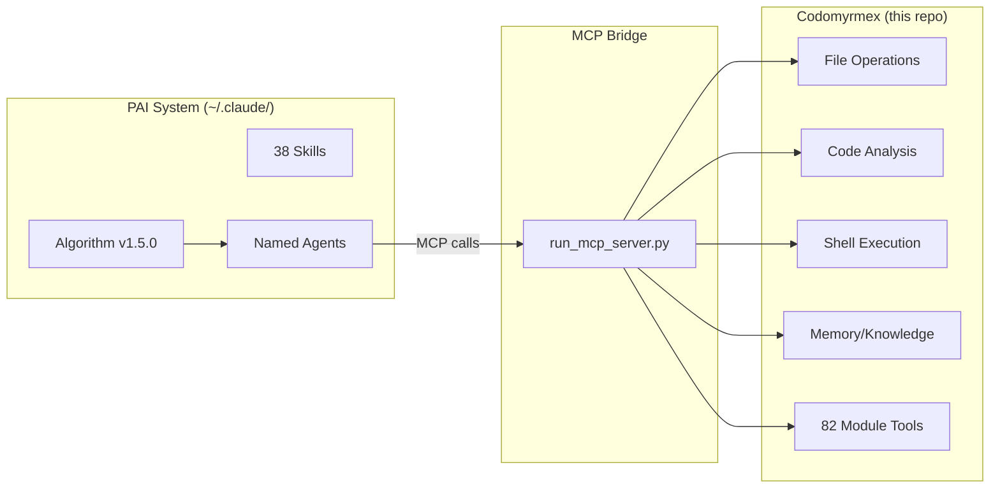

# Codomyrmex &harr; PAI System Bridge

**Version**: v0.5.0 | **Status**: Active | **Last Updated**: February 2026

## What Is PAI?

PAI (Personal AI Infrastructure) is the system at `~/.claude/skills/PAI/`. It is **not** a concept — it is running software:

| Component | Count | Location |
|-----------|-------|----------|
| Algorithm | v1.5.0 | `~/.claude/skills/PAI/SKILL.md` (CORE) |
| Skills | 38 | `~/.claude/skills/` |
| Hooks | 20 | `~/.claude/hooks/` |
| Tools | 59 | `~/.claude/skills/PAI/Tools/` |
| Agents | 13 + subagent types | `~/.claude/skills/PAI/PAIAGENTSYSTEM.md` |
| Memory | WORK / STATE / LEARNING | `~/.claude/skills/PAI/MEMORY/` |

PAI operates inside Claude Code sessions. It runs the Algorithm on every prompt, creates ISC (Ideal State Criteria), selects capabilities, executes work, and verifies results.

## How Codomyrmex Serves PAI

Codomyrmex is a **82-module Python development platform**. PAI agents consume codomyrmex capabilities via the Model Context Protocol (MCP). The relationship is:

```
PAI (TypeScript/Bun, ~/.claude/)  ──MCP──>  Codomyrmex (Python, this repo)
     Algorithm + Skills + Hooks              82 modules of dev-platform tools
```

PAI is the **orchestrator**. Codomyrmex is the **toolbox**.

## MCP Bridge Architecture

The MCP server is the operational bridge between PAI and codomyrmex:



**Server**: `scripts/model_context_protocol/run_mcp_server.py`
**Transports**: stdio (Claude Desktop/Code) and HTTP with Web UI (port 8080)
**Tools**: 18 static tools (15 core + 3 universal proxy) + 97 auto-discovered module tools from 27 modules via `pkgutil` scan. The Codomyrmex PAI Skill (`~/.claude/skills/Codomyrmex/SKILL.md`) surfaces all 115 tools for MCP exposure.
**Web UI**: `http://localhost:8080/` — interactive tool tester, server info, resources, prompts
**Config**: Register in `claude_desktop_config.json` (see [Connecting PAI tutorial](docs/getting-started/tutorials/connecting-pai.md))
**Full docs**: [src/codomyrmex/model_context_protocol/PAI.md](src/codomyrmex/model_context_protocol/PAI.md)

## Algorithm Phase &rarr; Module Mapping

Each phase of the PAI Algorithm maps to specific codomyrmex modules:

| Algorithm Phase | Purpose | Codomyrmex Modules |
|----------------|---------|-------------------|
| **OBSERVE** (1/7) | Understand the request | `pattern_matching`, `search`, `documents`, `system_discovery`, `config_management` |
| **THINK** (2/7) | Select capabilities, expand ISC | `cerebrum`, `agents/core` (ThinkingAgent), `graph_rag`, `relations` |
| **PLAN** (3/7) | Finalize approach | `orchestrator` (workflow DAGs), `logistics`, `plugin_system` (dependency resolution) |
| **BUILD** (4/7) | Create artifacts | `agents/ai_code_editing/`, `coding`, `ci_cd_automation/build/`, `documentation` |
| **EXECUTE** (5/7) | Run the work | `agents` (all providers), `coding` (sandbox), `git_operations`, `containerization`, `cloud`, `events` |
| **VERIFY** (6/7) | Validate against ISC | `coding/static_analysis/`, `security`, `formal_verification`, `crypto`, `performance`, `maintenance` |
| **LEARN** (7/7) | Capture improvements | `agentic_memory`, `logging_monitoring`, `scrape` |

## Per-User Separation

```
~/.claude/                          # PRIVATE (per-user, never committed)
├── skills/PAI/                     # Algorithm, skills, tools, hooks
│   ├── SKILL.md                    # CORE (the Algorithm)
│   ├── Skills/                     # 38 skills
│   ├── Tools/                      # 59 tools
│   ├── USER/                       # Personal data
│   └── MEMORY/                     # WORK, STATE, LEARNING
├── hooks/                          # 20 hooks
├── settings.json                   # Identity, preferences
└── claude_desktop_config.json      # MCP server registrations

codomyrmex/                         # SHARED (this repo, committed)
├── src/codomyrmex/                 # 82 Python modules
├── scripts/model_context_protocol/ # MCP server runner
├── PAI.md                          # THIS FILE (bridge doc)
└── docs/                           # Documentation
```

**Rule**: Personal AI configuration lives in `~/.claude/`. Shared development tooling lives in this repo. The MCP protocol connects them.

## Configuration

### PAI Settings (`~/.claude/skills/PAI/settings.json`)

```json
{
  "principal": { "name": "YourName", "timezone": "America/Los_Angeles" },
  "daidentity": { "name": "PAI", "displayName": "PAI" }
}
```

### MCP Registration (`claude_desktop_config.json`)

```json
{
  "mcpServers": {
    "codomyrmex": {
      "command": "python",
      "args": ["path/to/codomyrmex/scripts/model_context_protocol/run_mcp_server.py", "--transport", "stdio"]
    }
  }
}
```

### Environment Variables

```bash
# Codomyrmex modules (optional — for cloud provider access)
export OPENAI_API_KEY="sk-..."
export ANTHROPIC_API_KEY="sk-..."
export OLLAMA_HOST="http://localhost:11434"
```

## Codomyrmex Module Capabilities

Condensed view of what PAI agents can access:

| Domain | Modules | MCP Tools | PAI Use |
|--------|---------|-----------|---------|
| **AI Agents** | `agents/`, `agents/core/` | 7 | BUILD/EXECUTE — agent execution, reasoning traces, ThinkingAgent |
| **LLM** | `llm/`, `model_context_protocol/` | 6 | Model management, tool schema inspection, text generation |
| **Reasoning** | `cerebrum/`, `graph_rag/`, `coding/pattern_matching/` | 2 | THINK — case-based reasoning, knowledge retrieval |
| **Knowledge** | `documents/`, `agentic_memory/`, `search/` | 6 | OBSERVE/LEARN — memory get/put/search, full-text/fuzzy search |
| **Code Ops** | `coding/`, `git_operations/` | 18 | BUILD/VERIFY — sandbox execution, review, 13 git operations |
| **Verification** | `formal_verification/`, `performance/` | 8 | VERIFY — Z3 constraint solving, benchmark regression detection |
| **Workflow** | `orchestrator/`, `events/`, `logistics/` | 5 | PLAN/EXECUTE — DAG analysis, event bus, scheduler metrics |
| **Security** | `security/`, `crypto/`, `auth/` | 6 | VERIFY — vulnerability/secret scanning, key gen, hash verification |
| **DevOps** | `ci_cd_automation/`, `containerization/`, `cloud/` | 7 | EXECUTE — builds, container management, cloud instances, S3 |
| **Data** | `data_visualization/`, `scrape/`, `config_management/` | 7 | Charting/dashboards, HTML extraction, config get/set/validate |
| **Platform** | `system_discovery/`, `plugin_system/`, `maintenance/`, `logging_monitoring/`, `relations/`, `documentation/` | 8 | Health checks, plugin discovery, RASP auditing, log formatting |
| **Interface** | `cli/`, `terminal_interface/`, `ide/` | — | User interaction, rich output (no MCP tools) |

## RASP Documentation Pattern

**RASP** stands for the four standard documentation files every codomyrmex module carries:

| Letter | File | Purpose |
|--------|------|---------|
| **R** | `README.md` | Module overview, key exports, quick start |
| **A** | `AGENTS.md` | AI agent coordination, operating contracts |
| **S** | `SPEC.md` | Functional specification, design rationale |
| **P** | `PAI.md` | PAI system integration, algorithm phase mapping |

Every codomyrmex module has a `PAI.md` file describing its AI capabilities. These per-module files describe **what that module offers to AI agents**. This root document describes **how the actual PAI system consumes those capabilities**.

| Document | Purpose |
|----------|---------|
| `/PAI.md` (this file) | Authoritative PAI system bridge |
| `src/codomyrmex/PAI.md` | Source-level PAI module map |
| `src/codomyrmex/<module>/PAI.md` | Per-module AI capabilities |
| `docs/modules/PAI.md` | Documentation hub PAI context |

## Getting Started

1. **Have PAI installed**: Check `~/.claude/skills/PAI/SKILL.md` exists
2. **Clone codomyrmex**: `git clone` this repo, run `uv sync`
3. **Connect via MCP**: Follow [Connecting PAI to Codomyrmex](docs/getting-started/tutorials/connecting-pai.md)
4. **Verify**: Start a Claude Code session, invoke the Algorithm, confirm codomyrmex tools are available

## Signposting

### Navigation

- **Self**: [PAI.md](PAI.md) — This document (authoritative bridge)
- **Parent**: [README.md](README.md) — Project root
- **Siblings**:
  - [AGENTS.md](AGENTS.md) — Agent coordination
  - [SPEC.md](SPEC.md) — Functional specification
  - [CLAUDE.md](CLAUDE.md) — Claude Code guidance

### Key References

- [MCP Bridge Docs](src/codomyrmex/model_context_protocol/PAI.md) — Full MCP integration details
- [Agent System Integration](src/codomyrmex/agents/PAI.md) — PAI agent &harr; codomyrmex mapping
- [Source Module Map](src/codomyrmex/PAI.md) — All modules with PAI capabilities
- [Detailed PAI Reference](docs/pai/) — Architecture, tools, API, workflows
- [Connecting Tutorial](docs/getting-started/tutorials/connecting-pai.md) — Step-by-step setup

## Version History

- **v0.4.0** (February 2026) — Bidirectional link completion, docs/pai/ reference, version sync
- **v0.2.0** (February 2026) — Full rewrite: actual PAI system bridge documentation
- **v0.1.0** (February 2026) — Initial generic PAI concept documentation
