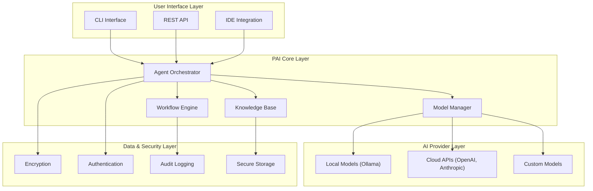

# Codomyrmex Personal AI Infrastructure (PAI)

**Version**: v0.1.0 | **Status**: Active | **Last Updated**: January 2026

## Overview

This document describes how Codomyrmex serves as a **Personal AI Infrastructure** platform - enabling individuals, teams, and organizations to build, deploy, and operate AI-augmented development workflows. Codomyrmex provides the foundational layer for integrating AI capabilities into software development lifecycles.

## What is Personal AI Infrastructure?

Personal AI Infrastructure (PAI) refers to the individualized or team-owned systems that:

1. **Integrate AI Models** - Connect to local (Ollama) and cloud-based (OpenAI, Anthropic, Google) language models
2. **Coordinate AI Agents** - Orchestrate multiple specialized AI agents working on complex tasks
3. **Manage Knowledge** - Maintain context, memory, and learned patterns across sessions
4. **Enable Autonomous Workflows** - Support AI-driven task completion with human oversight
5. **Ensure Privacy & Control** - Keep sensitive data and workflows under your control

## Codomyrmex PAI Capabilities

### AI Model Integration

Codomyrmex provides unified interfaces for working with AI models:

| Capability | Module | Description |
| :--- | :--- | :--- |
| **Local LLM Support** | [llm/](src/codomyrmex/llm/) | Run models locally via Ollama for privacy and cost control |
| **Cloud LLM Access** | [llm/](src/codomyrmex/llm/) | Connect to OpenAI, Anthropic, Google, and other providers |
| **Model Context Protocol** | [model_context_protocol/](src/codomyrmex/model_context_protocol/) | Standardized interfaces for LLM tool use |
| **Inference Engine** | [cerebrum/](src/codomyrmex/cerebrum/) | Advanced reasoning with Bayesian inference |

### Agent Coordination

The platform supports sophisticated multi-agent workflows:

| Capability | Module | Description |
| :--- | :--- | :--- |
| **Agent Framework** | [agents/](src/codomyrmex/agents/) | Base classes and orchestration for AI agents |
| **Provider Integrations** | [agents/claude/](src/codomyrmex/agents/claude/), [agents/codex/](src/codomyrmex/agents/codex/) | Claude, Codex, Jules, Gemini, and more |
| **AI Code Editing** | [agents/ai_code_editing/](src/codomyrmex/agents/ai_code_editing/) | Automated code generation and refactoring |
| **Task Management** | [agents/droid/](src/codomyrmex/agents/droid/) | Agent task orchestration and delegation |

### Knowledge Management

Maintain and leverage knowledge across your development workflows:

| Capability | Module | Description |
| :--- | :--- | :--- |
| **Document Processing** | [documents/](src/codomyrmex/documents/) | Extract, transform, and search documents |
| **Pattern Recognition** | [pattern_matching/](src/codomyrmex/pattern_matching/) | Identify patterns in code and data |
| **Case-Based Reasoning** | [cerebrum/](src/codomyrmex/cerebrum/) | Learn from past cases and apply to new situations |

### Autonomous Workflows

Enable AI to work semi-autonomously with appropriate oversight:

| Capability | Module | Description |
| :--- | :--- | :--- |
| **Workflow Orchestration** | [orchestrator/](src/codomyrmex/orchestrator/) | DAG-based workflow execution |
| **Event System** | [events/](src/codomyrmex/events/) | Pub/sub for agent communication |
| **Plugin Architecture** | [plugin_system/](src/codomyrmex/plugin_system/) | Extend capabilities dynamically |
| **Safe Execution** | [coding/](src/codomyrmex/coding/) | Sandboxed code execution with observability |

### Security & Privacy

Keep your AI infrastructure secure and private:

| Capability | Module | Description |
| :--- | :--- | :--- |
| **Security Scanning** | [security/](src/codomyrmex/security/) | Vulnerability detection and compliance |
| **Encryption** | [encryption/](src/codomyrmex/encryption/) | Data protection at rest and in transit |
| **Authentication** | [auth/](src/codomyrmex/auth/) | Identity and access management |
| **Local Processing** | [llm/ollama/](src/codomyrmex/llm/) | Keep sensitive data on-premises |

## PAI Architecture



## Getting Started with PAI

### 1. Set Up Local AI Models (Recommended)

```bash
# Install Ollama
curl https://ollama.ai/install.sh | sh

# Pull a model
ollama pull llama2

# Verify in Codomyrmex
uv run python -c "from codomyrmex.llm import check_ollama_status; print(check_ollama_status())"
```

### 2. Configure AI Providers

```yaml
# config/llm/providers.yaml
providers:
  ollama:
    enabled: true
    base_url: "http://localhost:11434"
    default_model: "llama2"

  openai:
    enabled: false  # Enable if you have an API key
    api_key: "${OPENAI_API_KEY}"
```

### 3. Use AI Agents

```python
from codomyrmex.agents import AgentOrchestrator
from codomyrmex.agents.ai_code_editing import AICodeEditor

# Initialize orchestrator
orchestrator = AgentOrchestrator()

# Use AI code editing
editor = AICodeEditor()
result = editor.refactor(
    code="def old_function(): pass",
    instruction="Add type hints and docstring"
)
```

### 4. Set Up Workflows

```python
from codomyrmex.orchestrator import WorkflowEngine

# Define a workflow
workflow = WorkflowEngine()
workflow.add_task("analyze", static_analysis.analyze)
workflow.add_task("generate_docs", documentation.generate, depends_on=["analyze"])
workflow.add_task("review", ai_code_editing.review, depends_on=["analyze"])

# Execute
result = workflow.run(project_path="./my_project")
```

## PAI Configuration

### Environment Variables

```bash
# AI Provider Keys (optional - only if using cloud providers)
export OPENAI_API_KEY="sk-..."
export ANTHROPIC_API_KEY="sk-..."

# Local Configuration
export CODOMYRMEX_LOG_LEVEL="INFO"
export CODOMYRMEX_CACHE_DIR="~/.codomyrmex/cache"
```

### Configuration Files

| File | Purpose |
| :--- | :--- |
| `config/llm/providers.yaml` | AI model provider configuration |
| `config/llm/models.yaml` | Model-specific settings |
| `config/security/api_keys.yaml` | Secure API key storage |
| `config/workflows/default.yaml` | Default workflow configurations |

## PAI Best Practices

### 1. Start Local, Scale to Cloud

Begin with local models (Ollama) for:
- Development and testing
- Sensitive data processing
- Cost optimization

Scale to cloud providers when you need:
- Higher performance models
- Specialized capabilities
- Production workloads

### 2. Implement Proper Oversight

- Review AI-generated code before deployment
- Use the security module to scan AI outputs
- Maintain audit logs of AI actions
- Set appropriate permission boundaries

### 3. Manage Context Effectively

- Use the documents module for RAG (Retrieval Augmented Generation)
- Maintain project-specific knowledge bases
- Leverage pattern matching for code intelligence

### 4. Secure Your Infrastructure

- Encrypt sensitive configuration
- Use authentication for API access
- Run security scans on AI-generated code
- Keep audit trails of AI interactions

## Module PAI Documentation

Each major module has its own PAI documentation:

| Module | PAI Document | Focus |
| :--- | :--- | :--- |
| Source Code | [src/codomyrmex/PAI.md](src/codomyrmex/PAI.md) | Core PAI implementations |
| Agents | [src/codomyrmex/agents/PAI.md](src/codomyrmex/agents/PAI.md) | Agent coordination |
| LLM | [src/codomyrmex/llm/PAI.md](src/codomyrmex/llm/PAI.md) | Model management |
| Cerebrum | [src/codomyrmex/cerebrum/PAI.md](src/codomyrmex/cerebrum/PAI.md) | Reasoning engine |
| Documentation | [docs/PAI.md](docs/PAI.md) | PAI guides |

## Signposting

### Navigation

- **Self**: [PAI.md](PAI.md) - This document
- **Parent**: [README.md](README.md) - Project root
- **Siblings**:
  - [AGENTS.md](AGENTS.md) - Agent coordination
  - [SPEC.md](SPEC.md) - Functional specification
  - [SECURITY.md](SECURITY.md) - Security policies
- **Children**:
  - [src/codomyrmex/PAI.md](src/codomyrmex/PAI.md) - Source PAI
  - [docs/PAI.md](docs/PAI.md) - Documentation PAI

### Related Resources

- [Model Context Protocol](src/codomyrmex/model_context_protocol/README.md)
- [Agent Framework](src/codomyrmex/agents/README.md)
- [LLM Integration](src/codomyrmex/llm/README.md)
- [Cerebrum Reasoning](src/codomyrmex/cerebrum/README.md)
- [Workflow Orchestration](src/codomyrmex/orchestrator/README.md)

## Version History

- **v0.1.0** (January 2026) - Initial PAI documentation

---

**Codomyrmex PAI** - Your foundation for AI-augmented development.
