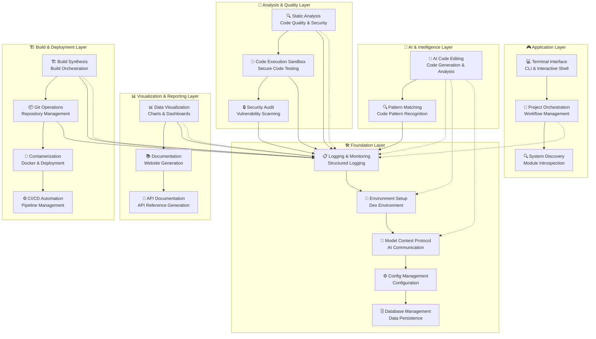
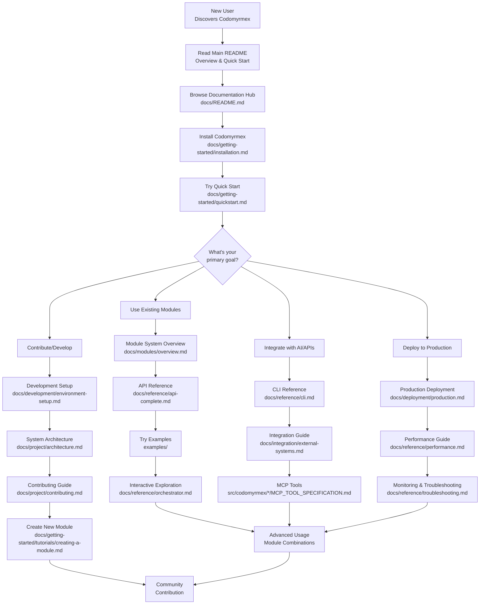

# 🐜 Codomyrmex: The Complete AI-Powered Coding Workspace

<p align="center">
  
  
  
  
</p>

<p align="center">
  <strong>🚀 AI-Powered Development • 🔍 Enterprise Analysis • 📊 Rich Visualizations • 🏗️ Intelligent Orchestration</strong>
</p>

---

> **"Transform your development workflow with AI assistance, automated analysis, and intelligent orchestration"**

Codomyrmex is a **revolutionary modular coding workspace** that seamlessly integrates cutting-edge AI capabilities with traditional development tools. Built for the modern developer, it combines **AI-powered code generation**, **comprehensive static analysis**, **sophisticated data visualization**, and **intelligent build orchestration** into a unified, extensible platform.

## ✨ **What Makes Codomyrmex Special?**

<div align="center">

| 🎯 **Core Capabilities** | 🚀 **Technical Excellence** | 👥 **Team Benefits** |
|:---:|:---:|:---:|
| 🤖 **AI-First Architecture** | 🔧 **Modular Design** | 🤝 **Standardized Workflows** |
| 🔍 **Enterprise-Grade Analysis** | 🚀 **Production Ready** | 📈 **Better Insights** |
| 📊 **Rich Visualizations** | ⚡ **Optimized Performance** | ⏱️ **10x Faster Development** |
| 🏗️ **Intelligent Orchestration** | 🔒 **Enterprise Security** | 🎓 **Learning & Exploration** |

</div>

### 🎯 **Perfect For**

- **🤖 AI-Assisted Development**: Leverage multiple LLM providers for code generation and refactoring
- **🔍 Code Quality Assurance**: Comprehensive static analysis with security vulnerability scanning
- **📊 Data-Driven Insights**: Rich visualizations for code metrics and performance analysis
- **🏗️ Automated Workflows**: Intelligent build orchestration and deployment automation
- **👥 Team Collaboration**: Standardized development processes across distributed teams
- **🎓 Learning & Exploration**: Interactive discovery and educational tools for developers

---

## 🚀 Quick Start

Get up and running with Codomyrmex in minutes! **[📦 Complete Setup Guide](docs/getting-started/setup.md)**

**[🎮 Try Interactive Examples](examples/README.md)** • **[📚 Full Documentation](docs/README.md)** • **[🤝 Contribute](docs/project/contributing.md)**

### 🎯 **Current Capabilities (v0.1.0)**

**✅ What's Working Now:**
- **🤖 Advanced AI Code Editing** - 23 programming languages, 3 LLM providers, comprehensive code generation, refactoring, and analysis
- **🔍 Comprehensive Static Analysis** - Multi-language support, 8 analysis types, 4 severity levels, security scanning, complexity analysis
- **📊 Sophisticated Data Visualization** - 7 chart styles, 10 color palettes, 13 plot types, advanced plotting, interactive dashboards
- **🏗️ Intelligent Build Orchestration** - 8 build types, 4 environments, dependency management, artifact synthesis, deployment automation
- **🎯 Project Orchestration** - Comprehensive workflow management system with performance monitoring
- **📊 Performance Monitoring** - Real-time performance tracking across all modules
- **🔄 Cross-Module Integration** - Seamless workflows between AI, analysis, visualization, and build modules
- **🧪 Comprehensive Testing** - Unit tests, integration tests, performance tests, stress tests
- **🔧 Enhanced CLI Interface** - Orchestration capabilities and LLM API configuration
- **📦 Modular Architecture** - Proper imports and extensible module system

**🔄 Recent Enhancements:**
- ✅ Advanced AI code editing with 23 languages and 3 LLM providers
- ✅ Comprehensive static analysis with multi-language support
- ✅ Sophisticated data visualization with advanced plotting
- ✅ Intelligent build orchestration with dependency management
- ✅ Cross-module integration and workflow automation
- ✅ Comprehensive testing suite with performance monitoring
- ✅ Enhanced CLI with LLM API configuration
- ✅ Project orchestration with workflow management

### **One-Command Setup (Recommended)**
```bash
# Clone and setup everything automatically
git clone https://github.com/codomyrmex/codomyrmex.git
cd codomyrmex
./install_with_uv.sh
```

### **Verify Installation**
```bash
# Check system health
codomyrmex check

# Try interactive exploration
./start_here.sh
```

### **Start Building**
```python
# Create stunning visualizations
from codomyrmex.data_visualization import create_line_plot
import numpy as np

x = np.linspace(0, 10, 100)
y = np.sin(x)
create_line_plot(x, y, title="Beautiful Sine Wave", output_path="sine_wave.png")
```

---

## 🌟 **Why Choose Codomyrmex?**

| Feature | Traditional Tools | Codomyrmex Advantage |
|---------|-------------------|---------------------|
| **🤖 AI Integration** | Manual + Separate Tools | **Unified AI workflow** with 3 LLM providers |
| **🔍 Code Analysis** | Individual Linters | **Multi-language analysis** with security scanning |
| **📊 Visualization** | Basic Chart Libraries | **Rich, interactive dashboards** with 13+ chart types |
| **🏗️ Build System** | Complex Configuration | **Intelligent orchestration** with quality gates |
| **🔧 Modularity** | Monolithic Applications | **Mix & match 15+ modules** for your exact needs |
| **🚀 Performance** | Resource Heavy | **Optimized workflows** with performance monitoring |

### **Real-World Impact:**
- **⏱️ 10x Faster Development**: AI-assisted coding with automated analysis
- **🔒 Enterprise Security**: Built-in security scanning and sandboxed execution
- **📈 Better Insights**: Rich visualizations turn data into actionable insights
- **🤝 Team Collaboration**: Standardized workflows across development teams


## 🔥 **See Codomyrmex in Action**

### **AI-Powered Development Workflow**
```python
# 1️⃣ Generate code with AI
from codomyrmex.ai_code_editing import generate_code_snippet

result = generate_code_snippet(
    prompt="Create a secure REST API endpoint with authentication",
    language="python",
    provider="openai"
)
print("🤖 AI Generated:", result['generated_code'][:200] + "...")

# 2️⃣ Analyze code quality automatically
from codomyrmex.static_analysis import analyze_code_quality

quality = analyze_code_quality(result['generated_code'], "python")
print(f"🔍 Quality Score: {quality['score']}/10")

# 3️⃣ Create beautiful documentation
from codomyrmex.data_visualization import create_advanced_dashboard

dashboard = create_advanced_dashboard(
    datasets=[{"name": "API Performance", "data": quality['metrics']}],
    title="API Analysis Dashboard"
)
```

### **Advanced Data Analysis Pipeline**
```python
# 📊 Transform raw data into insights
from codomyrmex.data_visualization import create_heatmap, create_advanced_line_plot
import pandas as pd

# Load your data
data = pd.read_csv('sales_data.csv')

# Create multiple visualizations
create_heatmap(
    data.corr(),
    title="Sales Correlation Matrix",
    output_path="correlation_heatmap.png"
)

create_advanced_line_plot(
    x_data=data['month'],
    y_data=data['revenue'],
    title="Monthly Revenue Trends",
    output_path="revenue_trends.png"
)
```

### **Intelligent Build Orchestration**
```python
# 🏗️ Automate your entire build pipeline
from codomyrmex.build_synthesis import orchestrate_build_pipeline

build_result = orchestrate_build_pipeline({
    "type": "comprehensive",
    "targets": ["python_package", "docker_image", "documentation"],
    "quality_gates": ["security_scan", "unit_tests", "coverage_90"]
})

print(f"✅ Build Status: {build_result['status']}")
print(f"📦 Artifacts: {len(build_result['artifacts'])} created")
```

### **Cross-Module Workflow Magic**
```python
# 🔄 Chain operations across multiple modules
from codomyrmex.project_orchestration import execute_workflow

# Create a complete development workflow
workflow_result = execute_workflow("ai_enhanced_development", {
    "code_generation": {
        "prompt": "Build a web scraper for news articles",
        "language": "python"
    },
    "analysis": {
        "security_scan": True,
        "performance_check": True
    },
    "visualization": {
        "create_dashboard": True,
        "output_formats": ["png", "html"]
    }
})
```

## Enhanced Capabilities Examples

### AI Code Generation and Analysis
```python
from codomyrmex.ai_code_editing import (
    generate_code_snippet, refactor_code_snippet, analyze_code_quality,
    CodeLanguage, CodeComplexity, CodeStyle
)

# Generate Python code with AI
result = generate_code_snippet(
    prompt="Create a function that calculates fibonacci numbers",
    language="python",
    provider="openai"
)
print(result['generated_code'])

# Refactor existing code
refactored = refactor_code_snippet(
    code="def sum_list(lst): total=0; [total:=total+x for x in lst]; return total",
    refactoring_type="optimize",
    language="python"
)
print(refactored['refactored_code'])

# Analyze code quality
analysis = analyze_code_quality(
    code="def complex_func(x): return x * 2 if x > 0 else 0",
    language="python",
    analysis_type="comprehensive"
)
print(analysis['analysis'])
```

### Comprehensive Static Analysis
```python
from codomyrmex.static_analysis import (
    StaticAnalyzer, analyze_file, analyze_project,
    AnalysisType, SeverityLevel, Language
)

# Analyze a single file
analyzer = StaticAnalyzer()
results = analyzer.analyze_file("my_code.py", [
    AnalysisType.QUALITY,
    AnalysisType.SECURITY,
    AnalysisType.COMPLEXITY
])

# Analyze entire project
summary = analyze_project(
    project_root=".",
    analysis_types=[AnalysisType.QUALITY, AnalysisType.STYLE]
)
print(f"Found {summary.total_issues} issues across {summary.files_analyzed} files")
```

### Advanced Data Visualization
```python
from codomyrmex.data_visualization import (
    AdvancedPlotter, create_advanced_line_plot, create_advanced_dashboard,
    PlotType, ChartStyle, ColorPalette, PlotConfig, DataPoint, Dataset
)

# Create advanced line plot
fig = create_advanced_line_plot(
    x_data=[1, 2, 3, 4, 5],
    y_data=[2, 4, 1, 5, 3],
    title="Advanced Plot",
    config=PlotConfig(style=ChartStyle.MINIMAL, palette=ColorPalette.VIRIDIS)
)

# Create interactive dashboard
datasets = [
    Dataset(
        name="Sales Data",
        data=[DataPoint(x=i, y=i*2) for i in range(10)],
        plot_type=PlotType.LINE
    ),
    Dataset(
        name="Revenue",
        data=[DataPoint(x=i, y=i**2) for i in range(10)],
        plot_type=PlotType.SCATTER
    )
]

dashboard = create_advanced_dashboard(
    datasets=datasets,
    layout=(2, 1),
    title="Business Dashboard"
)
```

### Intelligent Build Orchestration
```python
from codomyrmex.build_synthesis import (
    BuildManager, create_python_build_target, create_docker_build_target,
    BuildType, BuildStatus, BuildEnvironment
)

# Create build manager
build_manager = BuildManager()

# Add Python build target
python_target = create_python_build_target(
    name="my_package",
    source_path="src",
    output_path="dist"
)
build_manager.add_build_target(python_target)

# Add Docker build target
docker_target = create_docker_build_target(
    name="my_app",
    source_path=".",
    dockerfile_path="Dockerfile"
)
build_manager.add_build_target(docker_target)

# Build all targets
results = build_manager.build_all_targets(BuildEnvironment.PRODUCTION)
for result in results:
    print(f"{result.target_name}: {result.status.value}")
```

### Cross-Module Workflow Orchestration
```python
from codomyrmex.project_orchestration import (
    WorkflowManager, WorkflowStep, WorkflowStatus, get_workflow_manager
)

# Create workflow manager
workflow_manager = get_workflow_manager()

# Define workflow steps
steps = [
    WorkflowStep(
        name="generate_code",
        module="ai_code_editing",
        action="generate_code_snippet",
        parameters={"prompt": "Create a data analysis function", "language": "python"}
    ),
    WorkflowStep(
        name="analyze_code",
        module="static_analysis",
        action="analyze_file",
        dependencies=["generate_code"]
    ),
    WorkflowStep(
        name="create_visualization",
        module="data_visualization",
        action="create_advanced_line_plot",
        dependencies=["analyze_code"]
    ),
    WorkflowStep(
        name="build_package",
        module="build_synthesis",
        action="build_target",
        dependencies=["create_visualization"]
    )
]

# Create and execute workflow
workflow_manager.create_workflow("data_analysis_pipeline", steps)
execution = await workflow_manager.execute_workflow("data_analysis_pipeline")
print(f"Workflow status: {execution.status.value}")
```

**✅ What's Working Now:**
- **🤖 Advanced AI Code Editing** - 23 programming languages, 3 LLM providers, comprehensive code generation, refactoring, and analysis
- **🔍 Comprehensive Static Analysis** - Multi-language support, 8 analysis types, 4 severity levels, security scanning, complexity analysis
- **📊 Sophisticated Data Visualization** - 7 chart styles, 10 color palettes, 13 plot types, advanced plotting, interactive dashboards
- **🏗️ Intelligent Build Orchestration** - 8 build types, 4 environments, dependency management, artifact synthesis, deployment automation
- **🎯 Project Orchestration** - Comprehensive workflow management system with performance monitoring
- **📊 Performance Monitoring** - Real-time performance tracking across all modules
- **🔄 Cross-Module Integration** - Seamless workflows between AI, analysis, visualization, and build modules
- **🧪 Comprehensive Testing** - Unit tests, integration tests, performance tests, stress tests
- Environment setup and dependency management (latest versions)
- Logging and monitoring system
- **🚀 Enhanced CLI interface** with orchestration capabilities and LLM API configuration
- Modular architecture with proper imports
- Code execution capabilities
- All with latest package versions!

**🔄 Recent Enhancements:**
- ✅ Advanced AI code editing with 23 languages and 3 LLM providers
- ✅ Comprehensive static analysis with multi-language support
- ✅ Sophisticated data visualization with advanced plotting
- ✅ Intelligent build orchestration with dependency management
- ✅ Cross-module integration and workflow automation
- ✅ Comprehensive testing suite with performance monitoring
- ✅ Enhanced CLI with LLM API configuration
- ✅ Project orchestration with workflow management

**🔄 Future Enhancements:**
- 📚 **Documentation Website** (Docusaurus) - Interactive web documentation
- 📊 **Additional Visualization Types** - 3D plots, network graphs, interactive dashboards
- 🔧 **Advanced Git Operations** - Enhanced repository management and automation
- 🤖 **Machine Learning Model Integration** - Custom ML models for code analysis
- 🌐 **REST API Server** - HTTP endpoints for web integration
- 📦 **Package Distribution** - PyPI package for easy installation
- 🔄 **Plugin System** - Extensible architecture for custom modules
- 📈 **Advanced Analytics** - Code metrics and performance insights

## 🏗️ **Enhanced Core Modules**

Codomyrmex's modular architecture gives you **15 specialized modules** that you can use individually or combine into powerful workflows. Each module is self-contained with comprehensive documentation, tests, and examples.

### **🎯 Complete Module Architecture**



### **🎯 Module Categories & Capabilities**

#### **🤖 AI & Intelligence Layer**
| Module | Description | Key Features | Use Cases |
|--------|-------------|--------------|-----------|
| **🤖 AI Code Editing** | **AI-powered code generation, refactoring, and analysis** | OpenAI, Anthropic, Google LLMs<br>23+ programming languages<br>Code quality analysis | Generate boilerplate code<br>Refactor legacy code<br>Code review assistance |
| **🔍 Pattern Matching** | **Advanced code analysis and pattern recognition** | Repository structure analysis<br>Dependency mapping<br>Code similarity detection | Understand legacy codebases<br>Find code duplication<br>Architecture analysis |

#### **🔬 Analysis & Quality Layer**
| Module | Description | Key Features | Use Cases |
|--------|-------------|--------------|-----------|
| **🔍 Static Analysis** | **Multi-language code quality and security analysis** | Pylint, Flake8, Bandit<br>8 analysis types<br>Security vulnerability scanning | Code quality gates<br>Security compliance<br>Performance optimization |
| **🏃 Code Execution Sandbox** | **Secure multi-language code execution** | Docker-based isolation<br>8+ language support<br>Resource limits and timeouts | Test code snippets safely<br>Run untrusted code<br>Dynamic analysis |
| **🔒 Security Audit** | **Advanced security vulnerability scanning** | Comprehensive security analysis<br>Dependency vulnerability detection<br>Compliance checking | Enterprise security<br>Compliance auditing<br>Risk assessment |

#### **📊 Visualization & Reporting Layer**
| Module | Description | Key Features | Use Cases |
|--------|-------------|--------------|-----------|
| **📊 Data Visualization** | **Rich plotting and interactive dashboards** | Matplotlib, Seaborn, Plotly<br>13+ chart types<br>7 color palettes<br>Interactive dashboards | Data analysis reports<br>Performance monitoring<br>Business intelligence |
| **📚 Documentation** | **Automated documentation generation** | Docusaurus websites<br>API documentation<br>Versioned documentation | Project documentation<br>API references<br>Team knowledge base |
| **🔌 API Documentation** | **Automated API reference generation** | OpenAPI/Swagger generation<br>Interactive API explorers<br>Real-time documentation | API documentation<br>Developer portals<br>SDK generation |

#### **🏗️ Build & Deployment Layer**
| Module | Description | Key Features | Use Cases |
|--------|-------------|--------------|-----------|
| **🏗️ Build Synthesis** | **Intelligent build orchestration** | Multi-target builds<br>Quality gates<br>Artifact synthesis<br>8 build types | CI/CD pipelines<br>Release management<br>Multi-platform builds |
| **📦 Git Operations** | **Advanced Git workflow automation** | Repository management<br>Branch automation<br>GitHub integration | Automated releases<br>Code review workflows<br>Team collaboration |
| **🐳 Containerization** | **Docker and deployment automation** | Multi-stage builds<br>Container orchestration<br>Deployment pipelines | Cloud deployment<br>Microservices<br>DevOps automation |
| **⚙️ CI/CD Automation** | **Complete pipeline management** | GitHub Actions integration<br>Automated testing<br>Deployment automation | Continuous integration<br>Continuous deployment<br>Quality gates |

#### **🛠️ Foundation Layer**
| Module | Description | Key Features | Use Cases |
|--------|-------------|--------------|-----------|
| **📋 Logging & Monitoring** | **Structured logging and performance monitoring** | JSON logging<br>Performance metrics<br>Multi-format output | Application monitoring<br>Debugging<br>Performance analysis |
| **🌱 Environment Setup** | **Development environment management** | Dependency validation<br>Setup automation<br>Environment checking | Developer onboarding<br>CI/CD setup<br>Environment consistency |
| **🔗 Model Context Protocol** | **Standardized AI/LLM communication** | MCP tool specifications<br>AI integration framework<br>Cross-provider compatibility | AI tool development<br>LLM integration<br>Agent communication |
| **⚙️ Config Management** | **Advanced configuration management** | Environment-specific configs<br>Secret management<br>Configuration validation | Multi-environment deployments<br>Secure configuration<br>Compliance |
| **🗄️ Database Management** | **Database integration and management** | Multi-database support<br>Migration management<br>Connection pooling | Data persistence<br>Analytics<br>Enterprise applications |

#### **🎮 Application Layer**
| Module | Description | Key Features | Use Cases |
|--------|-------------|--------------|-----------|
| **🎯 Project Orchestration** | **Workflow coordination and project management** | Multi-module workflows<br>Performance monitoring<br>Dependency management | Complex project workflows<br>Team coordination<br>Process automation |
| **💻 Terminal Interface** | **Interactive CLI and exploration tools** | Rich terminal UI<br>Interactive shell<br>Command discovery | Developer productivity<br>System exploration<br>Interactive workflows |
| **🔍 System Discovery** | **Module and capability introspection** | Runtime module discovery<br>Capability mapping<br>System health monitoring | Developer tools<br>System administration<br>Debugging support |

## Core Project Structure & Conventions

| Directory                                    | Purpose                                                                                                |
| :------------------------------------------- | :----------------------------------------------------------------------------------------------------- |
| [`template/`](./template/)                   | Contains templates for modules and common file formats (e.g., README, API specs).                      |
| [`git_operations/`](./git_operations/)       | Houses scripts, configurations, and documentation related to Git workflows and repository management.    |
| [`model_context_protocol/`](./model_context_protocol/) | Defines the schema and protocols for interacting with Large Language Models (LLMs).                |
| [`environment_setup/`](./environment_setup/) | Provides scripts and documentation for setting up local and CI/CD development environments.          |

## 🚀 Quick Start & Examples

### **Hands-On Learning**
- **[🎮 Interactive Examples](examples/README.md)** - Executable demonstrations of all capabilities
- **[⚡ Quick Start Guide](docs/getting-started/quickstart.md)** - Get running in 5 minutes
- **[📖 Installation Guide](docs/getting-started/installation.md)** - Complete setup instructions

### **Try It Now**
```bash
# Run interactive example selector
cd examples
./select-example.sh

# Or try a specific demo
cd examples/basic
./data-visualization-demo.sh
```

## 🎯 Project Orchestration & Workflow Management

**NEW:** Codomyrmex now includes a comprehensive Project Orchestration system that coordinates workflows across all modules with advanced performance monitoring.

### **🌟 Key Features**

- **🔄 Multi-Module Workflows** - Chain operations across AI editing, static analysis, data visualization, and Git operations
- **📊 Performance Monitoring** - Real-time tracking of execution times, memory usage, and resource utilization
- **⚡ Asynchronous Execution** - Efficient parallel processing of workflow steps
- **🎯 Dependency Management** - Automatic dependency resolution between workflow steps
- **📋 Comprehensive Reporting** - Detailed execution reports with performance metrics

### **🚀 Enhanced CLI Interface**

The Codomyrmex CLI has been significantly enhanced with orchestration capabilities:

```bash
# Check system status with performance monitoring
codomyrmex status --performance

# List available workflows
codomyrmex workflow list

# Execute a comprehensive analysis workflow
codomyrmex workflow run ai-analysis --params='{"code_path": "./src", "output_path": "./analysis"}'

# Run AI-powered code improvements
codomyrmex ai generate "Create unit tests for this function" --language python

# Perform static analysis with visualization
codomyrmex analyze code ./src --output ./reports

# Interactive shell for advanced operations
codomyrmex shell
```

### **📈 Performance Integration**

Performance monitoring is now integrated across all modules:

- **AI Code Editing** - Tracks LLM response times and token usage
- **Static Analysis** - Monitors code parsing and analysis duration
- **Data Visualization** - Records chart generation and rendering times
- **Git Operations** - Tracks repository operations and network requests
- **Orchestration Engine** - Overall workflow coordination metrics

### **🎮 Try the Orchestration Demo**

```bash
# Run the comprehensive workflow demonstration
cd examples/orchestration
python comprehensive_workflow_demo.py --create-sample-project --verbose

# This will:
# 1. Create a sample project with intentional code issues
# 2. Run comprehensive analysis workflows
# 3. Generate AI-powered improvement suggestions
# 4. Create visualizations and reports
# 5. Show performance metrics across all operations
```

See the **[🎯 Orchestration Examples](examples/orchestration/README.md)** for detailed usage patterns and advanced workflows.

## 📚 Documentation & Resources

### **📖 Complete Documentation Hub: [docs/README.md](docs/README.md)**

The Codomyrmex documentation is organized into clear sections for different user needs:

#### **🚀 Getting Started**
- **[📦 Installation Guide](docs/getting-started/installation.md)** - Complete setup for all platforms
- **[⚡ Quick Start](docs/getting-started/quickstart.md)** - 5-minute hands-on experience
- **[🎓 Tutorials](docs/getting-started/tutorials/creating-a-module.md)** - Step-by-step learning paths

#### **🔧 Development**
- **[🏗️ Environment Setup](docs/development/environment-setup.md)** - Development environment configuration
- **[📝 Documentation Guidelines](docs/development/documentation.md)** - Writing and maintaining docs
- **[🧪 Testing Strategy](docs/development/testing-strategy.md)** - Testing approach and best practices
- **[📦 UV Usage Guide](docs/development/uv-usage-guide.md)** - Modern Python package management

#### **📦 Module System**
- **[🏛️ Module Overview](docs/modules/overview.md)** - Architecture and design principles
- **[🔗 Module Relationships](docs/modules/relationships.md)** - Dependencies and integration patterns

#### **🔗 Integration**
- **[🌐 External Systems](docs/integration/external-systems.md)** - Third-party integrations
- **[🤖 Fabric AI Integration](docs/integration/fabric-ai-integration.md)** - AI workflow integration

#### **🏗️ Project Governance**
- **[🏛️ Architecture](docs/project/architecture.md)** - System design with Mermaid diagrams
- **[🤝 Contributing Guide](docs/project/contributing.md)** - How to contribute effectively
- **[📋 Project TODO](docs/project/todo.md)** - Roadmap and current priorities

#### **📖 Reference Documentation**
- **[🔌 Complete API Reference](docs/reference/api-complete.md)** - **ACCURATE** API with real signatures
- **[📚 API Index](docs/reference/api.md)** - Quick API overview with source links
- **[💻 CLI Reference](docs/reference/cli.md)** - Complete command-line documentation
- **[🔄 Migration Guide](docs/reference/migration-guide.md)** - Version upgrade instructions
- **[🎮 Orchestrator Guide](docs/reference/orchestrator.md)** - Workflow orchestration
- **[⚡ Performance Guide](docs/reference/performance.md)** - Performance optimization
- **[🔧 Troubleshooting](docs/reference/troubleshooting.md)** - Common issues and solutions

#### **🚀 Deployment**
- **[🏭 Production Deployment](docs/deployment/production.md)** - Production environment setup

#### **User Journey Map**



#### **🚀 Getting Started**
- **[Installation Guide](docs/getting-started/installation.md)** - Complete setup instructions
- **[Quick Start](docs/getting-started/quickstart.md)** - Get running in 5 minutes
- **[Module Creation Tutorial](docs/getting-started/tutorials/creating-a-module.md)** - Build your own module

#### **🏗️ System Understanding**
- **[Architecture Overview](docs/project/architecture.md)** - System design and data flow
- **[Module System](docs/modules/overview.md)** - Understanding the modular architecture
- **[Module Relationships](docs/modules/relationships.md)** - How modules work together

#### **🔧 Development**
- **[Contributing Guide](docs/project/contributing.md)** - How to contribute effectively
- **[Development Setup](docs/development/environment-setup.md)** - Development environment
- **[Documentation Guidelines](docs/development/documentation.md)** - Writing and maintaining docs

#### **📚 Reference**
- **[Complete API Reference](docs/reference/api-complete.md)** - **ACCURATE** API with real function signatures
- **[API Index](docs/reference/api.md)** - Quick API overview with source links  
- **[CLI Reference](docs/reference/cli.md)** - Complete command-line documentation
- **[Troubleshooting Guide](docs/reference/troubleshooting.md)** - Common issues and solutions

### **Module-Specific Documentation**
| Module | Documentation | API Reference | Tutorials |
|--------|---------------|---------------|-----------|
| **AI Code Editing** | [📚 Docs](src/codomyrmex/ai_code_editing/README.md) | [🔌 API](src/codomyrmex/ai_code_editing/API_SPECIFICATION.md) | [🎓 Tutorials](src/codomyrmex/ai_code_editing/docs/tutorials/) |
| **Data Visualization** | [📚 Docs](src/codomyrmex/data_visualization/README.md) | [🔌 API](src/codomyrmex/data_visualization/API_SPECIFICATION.md) | [🎓 Tutorials](src/codomyrmex/data_visualization/docs/tutorials/) |
| **Code Execution** | [📚 Docs](src/codomyrmex/code_execution_sandbox/README.md) | [🔌 API](src/codomyrmex/code_execution_sandbox/API_SPECIFICATION.md) | [🎓 Tutorials](src/codomyrmex/code_execution_sandbox/docs/tutorials/) |
| **Pattern Matching** | [📚 Docs](src/codomyrmex/pattern_matching/README.md) | [🔌 API](src/codomyrmex/pattern_matching/API_SPECIFICATION.md) | [🎓 Tutorials](src/codomyrmex/pattern_matching/docs/tutorials/) |
| **Static Analysis** | [📚 Docs](src/codomyrmex/static_analysis/README.md) | [🔌 API](src/codomyrmex/static_analysis/API_SPECIFICATION.md) | [🎓 Tutorials](src/codomyrmex/static_analysis/docs/tutorials/) |

## 📚 Complete Documentation Hub

Codomyrmex provides **comprehensive documentation** organized for different user types and use cases. **[📚 Browse Full Documentation](docs/README.md)**

### **🚀 Getting Started Path**
- **[📦 Complete Setup Guide](docs/getting-started/setup.md)** - Installation, configuration, and troubleshooting
- **[⚡ Quick Start](docs/getting-started/quickstart.md)** - 5-minute hands-on experience
- **[🎓 Module Creation Tutorial](docs/getting-started/tutorials/creating-a-module.md)** - Learn by building

### **🔧 Development Path**
- **[🏗️ Environment Setup](docs/development/environment-setup.md)** - Development environment configuration
- **[📝 Documentation Guidelines](docs/development/documentation.md)** - Writing and maintaining docs
- **[🧪 Testing Strategy](docs/development/testing-strategy.md)** - Testing approach and best practices
- **[📦 UV Usage Guide](docs/development/uv-usage-guide.md)** - Modern Python package management

### **📦 Module System Understanding**
- **[🏛️ Module Overview](docs/modules/overview.md)** - Architecture and design principles
- **[🔗 Module Relationships](docs/modules/relationships.md)** - Dependencies and integration patterns
- **[📦 Module Template](../../../src/codomyrmex/module_template/README.md)** - Template for creating modules

### **🔗 Integration & External Systems**
- **[🌐 External Systems](docs/integration/external-systems.md)** - Third-party integrations
- **[🤖 Fabric AI Integration](docs/integration/fabric-ai-integration.md)** - AI workflow integration

### **🏗️ Project Governance & Architecture**
- **[🏛️ System Architecture](docs/project/architecture.md)** - Complete system design with Mermaid diagrams
- **[🤝 Contributing Guide](docs/project/contributing.md)** - How to contribute effectively
- **[📋 Project TODO](docs/project/todo.md)** - Roadmap and current priorities

### **📖 Technical Reference**
- **[🔌 Complete API Reference](docs/reference/api-complete.md)** - **ACCURATE** API with real signatures
- **[📚 API Index](docs/reference/api.md)** - Quick API overview with source links
- **[💻 CLI Reference](docs/reference/cli.md)** - Complete command-line documentation
- **[🔄 Migration Guide](docs/reference/migration-guide.md)** - Version upgrade instructions
- **[🎮 Orchestrator Guide](docs/reference/orchestrator.md)** - Workflow orchestration
- **[⚡ Performance Guide](docs/reference/performance.md)** - Performance optimization
- **[🔧 Troubleshooting](docs/reference/troubleshooting.md)** - Common issues and solutions

### **🚀 Production & Deployment**
- **[🏭 Production Deployment](docs/deployment/production.md)** - Production environment setup

### **🎮 Interactive Examples & Learning**
**[🎮 Try Interactive Examples](examples/README.md)** - Executable demonstrations of all capabilities

### **🔌 Individual Module Documentation**
**[📚 Module-Specific Docs](../../../src/codomyrmex/*/README.md)** - Detailed documentation for each module

## Project Governance & Contribution

This project is governed by the following documents:

- **[LICENSE](./LICENSE)**: Defines the legal terms under which the project is distributed.
- **[CONTRIBUTING.md](./CONTRIBUTING.md)**: Outlines how to contribute to the project, including setup, PR guidelines, and issue reporting.
- **[CODE_OF_CONDUCT.md](./CODE_OF_CONDUCT.md)**: Sets the standards for behavior within the community to ensure a welcoming and inclusive environment.

We encourage all contributors and users to familiarize themselves with these documents.

This modular framework aims to unify these functions into a cohesive package, leveraging proven GitHub-backed projects to enable extensibility, maintainability, and support for polyglot development workflows.

---

## 🤝 **Community & Support**

### **📧 Get Help & Provide Feedback**
- **📖 Documentation Issues**: [GitHub Issues](https://github.com/codomyrmex/codomyrmex/issues) - Report documentation problems or request improvements
- **💬 General Questions**: [GitHub Discussions](https://github.com/codomyrmex/codomyrmex/discussions) - Ask questions and share ideas
- **🐛 Bug Reports**: Use the issue tracker for bugs and feature requests
- **📚 Documentation Updates**: Pull requests welcome for documentation improvements

### **🏆 Contributing**
We welcome contributions! See our [Contributing Guide](docs/project/contributing.md) for details on:
- Code contributions and module development
- Documentation improvements
- Testing and quality assurance
- Community guidelines

### **📊 Project Information**
- **Current Version**: v0.1.0 (Alpha)
- **License**: MIT License - [View License](LICENSE)
- **Python Support**: 3.10, 3.11, 3.12, 3.13
- **Last Documentation Update**: January 2025
- **Project Status**: Active Development
- **Maintainers**: Codomyrmex Development Team

### **🔗 Related Projects & Resources**
- **🐜 GitHub Repository**: [codomyrmex/codomyrmex](https://github.com/codomyrmex/codomyrmex)
- **📦 PyPI Package**: Coming Soon
- **🐳 Docker Images**: Available on Docker Hub
- **📚 Documentation Site**: In Development

---

**📝 Documentation Status**: ✅ **Verified & Signed** | *Last reviewed: January 2025* | *Maintained by: Codomyrmex Documentation Team* | *Version: v0.1.0*
