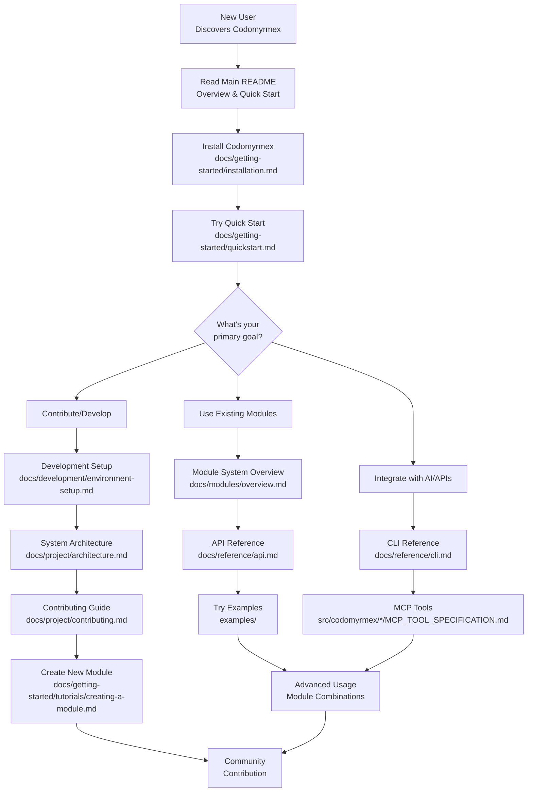

# Codomyrmex: A Modular, Extensible Coding Workspace

**🚀 NOW FULLY FUNCTIONAL!** A complete, modular coding workspace that integrates the latest open-source tools for building, documenting, analyzing, executing, and visualizing code. Uses cutting-edge package versions for optimal performance.

## Quick Start 🚀

**Codomyrmex is now functional!** Here's how to get started in under 5 minutes:

### 1. UV-Optimized Setup (Recommended)
```bash
# Clone and setup everything automatically with uv
git clone https://github.com/codomyrmex/codomyrmex.git
cd codomyrmex
./src/codomyrmex/environment_setup/scripts/install_with_uv.sh
```

### 2. Manual UV Setup
```bash
# Install uv if not already installed
curl -LsSf https://astral.sh/uv/install.sh | sh

# Clone repository
git clone https://github.com/codomyrmex/codomyrmex.git
cd codomyrmex

# Create virtual environment and install
uv venv .venv
source .venv/bin/activate  # On Windows: .venv\Scripts\activate
uv pip install -e .

# Check setup
python -c "from codomyrmex.environment_setup import env_checker; env_checker.check_environment()"
```

### 3. Traditional pip Setup (Alternative)
```bash
# Create virtual environment
python3 -m venv .venv
source .venv/bin/activate  # On Windows: .venv\Scripts\activate

# Install dependencies
pip install -e .

# Check setup
python -c "from codomyrmex.environment_setup import env_checker; env_checker.check_environment()"
```

### 4. Verify Installation
```bash
python -c "import codomyrmex; print('Codomyrmex installed successfully!')"
python -c "from codomyrmex.environment_setup import env_checker; env_checker.check_environment()"
```

### 5. Start Using Modules
```bash
# Run the example script to see everything working
python examples/example_usage.py
```

Or try individual modules:
```python
# Example: Use data visualization
from codomyrmex.data_visualization import create_line_plot
import numpy as np

x = np.linspace(0, 10, 100)
y = np.sin(x)
create_line_plot(x, y, title="Sample Plot", output_path="plot.png")
```

**✅ What's Working Now:**
- **🎯 Project Orchestration** - Comprehensive workflow management system
- **📊 Performance Monitoring** - Real-time performance tracking across all modules
- Environment setup and dependency management (latest versions)
- Logging and monitoring system
- Data visualization (plots, charts, graphs)
- Static analysis tools (pylint, flake8, bandit)
- **🚀 Enhanced CLI interface** with orchestration capabilities
- Modular architecture with proper imports
- AI/LLM integration (OpenAI, Anthropic, Google)
- Code execution capabilities
- Testing framework
- All with latest package versions!

**🔄 Future Enhancements:**
- Advanced AI code editing workflows
- Build synthesis automation
- Documentation website (Docusaurus)
- Git operations integration
- Additional visualization types

## Core Functional Modules

| Module                                       | Description                                                                 | Key Tools/Technologies                                         | Directory Path                               |
| :------------------------------------------- | :-------------------------------------------------------------------------- | :------------------------------------------------------------- | :------------------------------------------- |
| **🎯 Project Orchestration**                | **NEW!** Coordinates workflows across modules with performance monitoring.  | AsyncIO, Performance Monitor, Multi-module Integration         | [`project_orchestration/`](./src/codomyrmex/project_orchestration/) |
| **Build & Code Synthesis**                   | Manages build processes and AI-powered code generation.                     | build2, OpenAI Codex                                           | [`build_synthesis/`](./build_synthesis/)     |
| **Documentation Website**                  | Generates rich, versioned documentation.                                    | Docusaurus, Material for MkDocs, Sphinx, Read the Docs         | [`documentation/`](./documentation/)         |
| **Static Analysis & Code Checking**        | Centralizes linting, security scanning, and quality metrics.                | analysis-tools.dev, SonarQube, ESLint, CodeQL                  | [`static_analysis/`](./static_analysis/)     |
| **Pattern Matching & Generation**            | Enables exhaustive, type-safe pattern matching (e.g., in TypeScript).     | ts-pattern                                                     | [`pattern_matching/`](./pattern_matching/)   |
| **Logging & Monitoring**                   | Supports structured logging across various languages.                       | SLF4J + Log4j 2 (Java), Zap (Go), Loguru (Python)              | [`logging_monitoring/`](./logging_monitoring/) |
| **Data Visualization**                     | Offers static and interactive plotting capabilities.                        | Matplotlib, Bokeh, Altair, Plotly.py                           | [`data_visualization/`](./data_visualization/) |
| **Code Execution & Sandbox**               | Provides safe, scalable online code execution for multi-language support. | Judge0                                                         | [`code_execution_sandbox/`](./code_execution_sandbox/) |
| **AI-Enhanced Code Editing**               | Embeds AI assistance directly into the developer workflow.                  | VS Code + GitHub Copilot, Cursor, Tabnine                      | [`ai_code_editing/`](./ai_code_editing/)     |

## Core Project Structure & Conventions

| Directory                                    | Purpose                                                                                                |
| :------------------------------------------- | :----------------------------------------------------------------------------------------------------- |
| [`template/`](./template/)                   | Contains templates for modules and common file formats (e.g., README, API specs).                      |
| [`git_operations/`](./git_operations/)       | Houses scripts, configurations, and documentation related to Git workflows and repository management.    |
| [`model_context_protocol/`](./model_context_protocol/) | Defines the schema and protocols for interacting with Large Language Models (LLMs).                |
| [`environment_setup/`](./environment_setup/) | Provides scripts and documentation for setting up local and CI/CD development environments.          |

## 🚀 Quick Start & Examples

### **Hands-On Learning**
- **[🎮 Interactive Examples](examples/README.md)** - Executable demonstrations of all capabilities
- **[⚡ Quick Start Guide](docs/getting-started/quickstart.md)** - Get running in 5 minutes
- **[📖 Installation Guide](docs/getting-started/installation.md)** - Complete setup instructions

### **Try It Now**
```bash
# Run interactive example selector
cd examples
./select-example.sh

# Or try a specific demo
cd examples/basic
./data-visualization-demo.sh
```

## 🎯 Project Orchestration & Workflow Management

**NEW:** Codomyrmex now includes a comprehensive Project Orchestration system that coordinates workflows across all modules with advanced performance monitoring.

### **🌟 Key Features**

- **🔄 Multi-Module Workflows** - Chain operations across AI editing, static analysis, data visualization, and Git operations
- **📊 Performance Monitoring** - Real-time tracking of execution times, memory usage, and resource utilization
- **⚡ Asynchronous Execution** - Efficient parallel processing of workflow steps
- **🎯 Dependency Management** - Automatic dependency resolution between workflow steps
- **📋 Comprehensive Reporting** - Detailed execution reports with performance metrics

### **🚀 Enhanced CLI Interface**

The Codomyrmex CLI has been significantly enhanced with orchestration capabilities:

```bash
# Check system status with performance monitoring
codomyrmex status --performance

# List available workflows
codomyrmex workflow list

# Execute a comprehensive analysis workflow
codomyrmex workflow run ai-analysis --params='{"code_path": "./src", "output_path": "./analysis"}'

# Run AI-powered code improvements
codomyrmex ai generate "Create unit tests for this function" --language python

# Perform static analysis with visualization
codomyrmex analyze code ./src --output ./reports

# Interactive shell for advanced operations
codomyrmex shell
```

### **📈 Performance Integration**

Performance monitoring is now integrated across all modules:

- **AI Code Editing** - Tracks LLM response times and token usage
- **Static Analysis** - Monitors code parsing and analysis duration
- **Data Visualization** - Records chart generation and rendering times
- **Git Operations** - Tracks repository operations and network requests
- **Orchestration Engine** - Overall workflow coordination metrics

### **🎮 Try the Orchestration Demo**

```bash
# Run the comprehensive workflow demonstration
cd examples/orchestration
python comprehensive_workflow_demo.py --create-sample-project --verbose

# This will:
# 1. Create a sample project with intentional code issues
# 2. Run comprehensive analysis workflows
# 3. Generate AI-powered improvement suggestions
# 4. Create visualizations and reports
# 5. Show performance metrics across all operations
```

See the **[🎯 Orchestration Examples](examples/orchestration/README.md)** for detailed usage patterns and advanced workflows.

## 📚 Documentation & Resources

### **📖 Complete Documentation Hub: [docs/](docs/)**

#### **User Journey Map**



#### **🚀 Getting Started**
- **[Installation Guide](docs/getting-started/installation.md)** - Complete setup instructions
- **[Quick Start](docs/getting-started/quickstart.md)** - Get running in 5 minutes
- **[Module Creation Tutorial](docs/getting-started/tutorials/creating-a-module.md)** - Build your own module

#### **🏗️ System Understanding**
- **[Architecture Overview](docs/project/architecture.md)** - System design and data flow
- **[Module System](docs/modules/overview.md)** - Understanding the modular architecture
- **[Module Relationships](docs/modules/relationships.md)** - How modules work together

#### **🔧 Development**
- **[Contributing Guide](docs/project/contributing.md)** - How to contribute effectively
- **[Development Setup](docs/development/environment-setup.md)** - Development environment
- **[Documentation Guidelines](docs/development/documentation.md)** - Writing and maintaining docs

#### **📚 Reference**
- **[Complete API Reference](docs/reference/api-complete.md)** - **ACCURATE** API with real function signatures
- **[API Index](docs/reference/api.md)** - Quick API overview with source links  
- **[CLI Reference](docs/reference/cli.md)** - Complete command-line documentation
- **[Troubleshooting Guide](docs/reference/troubleshooting.md)** - Common issues and solutions

### **Module-Specific Documentation**
| Module | Documentation | API Reference | Tutorials |
|--------|---------------|---------------|-----------|
| **AI Code Editing** | [📚 Docs](src/codomyrmex/ai_code_editing/README.md) | [🔌 API](src/codomyrmex/ai_code_editing/API_SPECIFICATION.md) | [🎓 Tutorials](src/codomyrmex/ai_code_editing/docs/tutorials/) |
| **Data Visualization** | [📚 Docs](src/codomyrmex/data_visualization/README.md) | [🔌 API](src/codomyrmex/data_visualization/API_SPECIFICATION.md) | [🎓 Tutorials](src/codomyrmex/data_visualization/docs/tutorials/) |
| **Code Execution** | [📚 Docs](src/codomyrmex/code_execution_sandbox/README.md) | [🔌 API](src/codomyrmex/code_execution_sandbox/API_SPECIFICATION.md) | [🎓 Tutorials](src/codomyrmex/code_execution_sandbox/docs/tutorials/) |
| **Pattern Matching** | [📚 Docs](src/codomyrmex/pattern_matching/README.md) | [🔌 API](src/codomyrmex/pattern_matching/API_SPECIFICATION.md) | [🎓 Tutorials](src/codomyrmex/pattern_matching/docs/tutorials/) |
| **Static Analysis** | [📚 Docs](src/codomyrmex/static_analysis/README.md) | [🔌 API](src/codomyrmex/static_analysis/API_SPECIFICATION.md) | [🎓 Tutorials](src/codomyrmex/static_analysis/docs/tutorials/) |

## Getting Started: Development Environment Setup

This section outlines the general steps to set up the development environment for the **entire Codomyrmex project**.

### Prerequisites

- Python 3.10 or higher (uses latest package versions for best performance)
- `pip` (Python package installer) OR `uv` (recommended - faster and more reliable)
- `git`
- Node.js (Version 18.0 or higher, for `documentation` module)
- npm or yarn (for `documentation` module)

**Note:** `uv` is a fast Python package manager that can replace pip and virtualenv. It's highly recommended for this project. Install it from https://github.com/astral-sh/uv

### Setup Instructions

1.  **Clone the Repository (if you haven't already):**
    ```bash
    git clone <repository_url> # Replace <repository_url> with the actual URL
    cd codomyrmex
    ```

2.  **Set up Python Environment:**

    **Option A: Using uv (Recommended - Faster and More Reliable)**
    ```bash
    # Install uv if you haven't already (visit https://github.com/astral-sh/uv)
    # Create and activate virtual environment
    uv venv .venv
    source .venv/bin/activate  # On Windows: .venv\Scripts\activate

    # Install dependencies
    uv pip install -e .
    ```

    **Option B: Using pip (Traditional Method)**
    ```bash
    # Create and activate virtual environment
    python -m venv .venv
    source .venv/bin/activate  # On Windows: .venv\Scripts\activate

    # Install dependencies
    pip install -r requirements.txt
    ```

    **Option C: Automated Setup Script**
    ```bash
    # Run the automated setup script (supports both uv and pip)
    bash environment_setup/scripts/setup_dev_env.sh
    ```

4.  **Set Up API Keys (for LLM features):**
    If you plan to use features interacting with Large Language Models (e.g., via `ai_code_editing` or `cased/kit`), you will need API keys for services like OpenAI, Anthropic, or Google Cloud.
    Create a `.env` file in the project root (`codomyrmex/.env`) and add your keys:
    ```env
    OPENAI_API_KEY="sk-..."
    ANTHROPIC_API_KEY="sk-ant-..."
    GOOGLE_API_KEY="AIzaSy..."
    # Add other environment-specific variables here
    ```
    The `python-dotenv` library (installed via `requirements.txt`) will load these variables. The `env_checker.py` script in the `environment_setup` module can help verify this setup.

5.  **Graphviz (Optional for Dependency Visualization):**
    Some modules or tools (like `cased/kit` for dependency graphs) may require Graphviz.
    -   Install the Graphviz system package: [graphviz.org/download/](https://graphviz.org/download/).
    -   Install the Python bindings: `pip install graphviz` (ensure it's in the root `requirements.txt` if widely used).

6.  **Setup for the `documentation` Module (Docusaurus):**
    The project documentation website is built using Docusaurus.
    -   Navigate to the documentation module: `cd src/codomyrmex/documentation`
    -   Install Node.js dependencies: `npm install` (or `yarn install`)
    -   Refer to `src/codomyrmex/documentation/README.md` for commands to run the dev server or build the site.

7.  **Helper Scripts (Optional from `environment_setup` module):**
    The [`src/codomyrmex/environment_setup/scripts/`](./src/codomyrmex/environment_setup/scripts/) directory contains helper scripts:
    -   `setup_dev_env.sh`: Automates several initial setup steps like Python version check, virtual environment creation, and dependency installation. Run it from the project root: `bash src/codomyrmex/environment_setup/scripts/setup_dev_env.sh`.
    -   `install_hooks.sh`: Sets up Git hooks (e.g., pre-commit) by symlinking them from `scripts/git-hooks/` to your local `.git/hooks/` directory. Run it from the project root: `bash src/codomyrmex/environment_setup/scripts/install_hooks.sh`. Customize the hooks in `scripts/git-hooks/` as needed.
    For more details on these scripts and other environment checks, see the [`src/codomyrmex/environment_setup/README.md`](./src/codomyrmex/environment_setup/README.md).

8.  **Running Linters and Tests (General Project):**
    To ensure code quality and correctness across the project:
    - **Linters**: Specific linting commands (e.g., for Pylint, Flake8, ESLint) might be defined per module or run via a project-wide script if available. Generally, you would run linters from the root directory or specific module directories. Example (Python):
        ```bash
        # From project root, linting a specific module
        pylint ai_code_editing/
        flake8 ai_code_editing/
        # Or for the entire project, if configured
        pylint **/*.py
        flake8 .
        ```
    - **Tests**: The project uses `pytest` for Python tests with coverage reporting. Run tests from the project root:
    ```bash
    # Run all tests with coverage
    pytest

    # Run tests for a specific module
    pytest testing/unit/test_ai_code_editing.py

    # Run tests for a specific file
    pytest testing/unit/test_ai_code_editing.py::TestAICodeEditing::test_ai_code_helpers_import

    # Run with coverage report
    pytest --cov-report=html
    open testing/htmlcov/index.html  # View coverage report in browser
    ```
- Refer to individual module `README.md` files or their `tests/README.md` for module-specific testing or linting instructions.

## Project Governance & Contribution

This project is governed by the following documents:

- **[LICENSE](./LICENSE)**: Defines the legal terms under which the project is distributed.
- **[CONTRIBUTING.md](./CONTRIBUTING.md)**: Outlines how to contribute to the project, including setup, PR guidelines, and issue reporting.
- **[CODE_OF_CONDUCT.md](./CODE_OF_CONDUCT.md)**: Sets the standards for behavior within the community to ensure a welcoming and inclusive environment.

We encourage all contributors and users to familiarize themselves with these documents.

This modular framework aims to unify these functions into a cohesive package, leveraging proven GitHub-backed projects to enable extensibility, maintainability, and support for polyglot development workflows. # Test comment for verification
