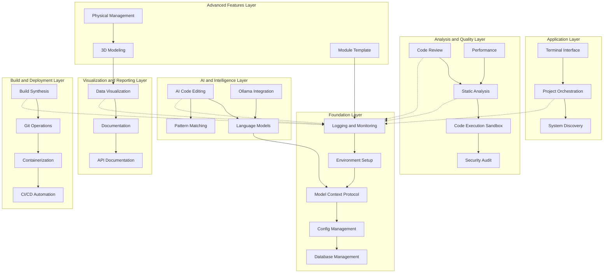
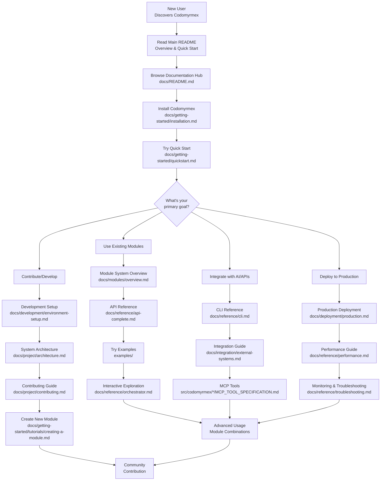

# 🐜 Codomyrmex: The Complete AI-Powered Coding Workspace

<p align="center">
  
  
  
  
</p>

<p align="center">
  <strong>🚀 AI-Powered Development • 🔍 Enterprise Analysis • 📊 Rich Visualizations • 🏗️ Intelligent Orchestration</strong>
</p>

---

> **"Transform your development workflow with AI assistance, automated analysis, and intelligent orchestration"**

Codomyrmex is a **modular AI-powered coding workspace** with **27 specialized modules** you can use individually or combine into powerful workflows. Pick exactly what you need: AI code generation, static analysis, data visualization, build orchestration, security scanning, or all of them together. Each module is self-contained, production-ready, and designed to work seamlessly with the others.

**🎯 Progressive Workflow Examples:**

**1. Single Module** - Use any module independently:
- `from codomyrmex.data_visualization import create_line_plot` → Visualization only
- `from codomyrmex.ai_code_editing import generate_code` → AI generation only
- `from codomyrmex.static_analysis import analyze_code` → Quality analysis only

**2. Two-Module Workflow** - Simple integration:
- [AI Code Editing](src/codomyrmex/ai_code_editing/) → [Static Analysis](src/codomyrmex/static_analysis/)
- [Data Visualization](src/codomyrmex/data_visualization/) → [Documentation](src/codomyrmex/documentation/)
- [Git Operations](src/codomyrmex/git_operations/) → [Build Synthesis](src/codomyrmex/build_synthesis/)

**3. Quality Pipeline** (5 modules):
- [Code Review](src/codomyrmex/code_review/) → [Static Analysis](src/codomyrmex/static_analysis/) → [Security Audit](src/codomyrmex/security_audit/) → [Performance](src/codomyrmex/performance/) → [Data Visualization](src/codomyrmex/data_visualization/)

**4. AI Development Workflow** (7 modules):
- [Language Models](src/codomyrmex/language_models/) → [AI Code Editing](src/codomyrmex/ai_code_editing/) → [Pattern Matching](src/codomyrmex/pattern_matching/) → [Code Review](src/codomyrmex/code_review/) → [Static Analysis](src/codomyrmex/static_analysis/) → [Code Execution Sandbox](src/codomyrmex/code_execution_sandbox/) → [Git Operations](src/codomyrmex/git_operations/)

**5. CI/CD Pipeline** (10 modules):
- [Git Operations](src/codomyrmex/git_operations/) → [Static Analysis](src/codomyrmex/static_analysis/) → [Security Audit](src/codomyrmex/security_audit/) → [Code Execution Sandbox](src/codomyrmex/code_execution_sandbox/) → [Build Synthesis](src/codomyrmex/build_synthesis/) → [Containerization](src/codomyrmex/containerization/) → [CI/CD Automation](src/codomyrmex/ci_cd_automation/) → [Performance](src/codomyrmex/performance/) → [Logging & Monitoring](src/codomyrmex/logging_monitoring/) → [Database Management](src/codomyrmex/database_management/)

**6. Complete Enterprise Platform** - All 27 modules in production workflow:
- **Setup & Discovery**: [System Discovery](src/codomyrmex/system_discovery/) → [Terminal Interface](src/codomyrmex/terminal_interface/) → [Environment Setup](src/codomyrmex/environment_setup/) → [Config Management](src/codomyrmex/config_management/) → [Logging & Monitoring](src/codomyrmex/logging_monitoring/)
- **Source Control**: [Git Operations](src/codomyrmex/git_operations/) → [Module Template](src/codomyrmex/module_template/)
- **AI Integration**: [Language Models](src/codomyrmex/language_models/) → [Ollama Integration](src/codomyrmex/ollama_integration/) → [Model Context Protocol](src/codomyrmex/model_context_protocol/) → [AI Code Editing](src/codomyrmex/ai_code_editing/)
- **Analysis & Quality**: [Pattern Matching](src/codomyrmex/pattern_matching/) → [Static Analysis](src/codomyrmex/static_analysis/) → [Code Review](src/codomyrmex/code_review/) → [Security Audit](src/codomyrmex/security_audit/) → [Code Execution Sandbox](src/codomyrmex/code_execution_sandbox/) → [Performance](src/codomyrmex/performance/)
- **Visualization & Docs**: [Data Visualization](src/codomyrmex/data_visualization/) → [API Documentation](src/codomyrmex/api_documentation/) → [Documentation](src/codomyrmex/documentation/)
- **Infrastructure**: [Database Management](src/codomyrmex/database_management/) → [3D Modeling](src/codomyrmex/modeling_3d/) → [Physical Management](src/codomyrmex/physical_management/)
- **Build & Deploy**: [Build Synthesis](src/codomyrmex/build_synthesis/) → [Containerization](src/codomyrmex/containerization/) → [CI/CD Automation](src/codomyrmex/ci_cd_automation/)
- **Orchestration**: [Project Orchestration](src/codomyrmex/project_orchestration/) coordinates all modules

## ✨ **What Makes Codomyrmex Special?**

### 🎯 **Modular by Design - 27 Specialized Modules**

Each module is a complete, production-ready unit you can use independently:

<div align="center">

| 🤖 **AI & Intelligence** | 🔬 **Analysis & Quality** | 📊 **Visualization** |
|:---:|:---:|:---:|
| [AI Code Editing](src/codomyrmex/ai_code_editing/) | [Static Analysis](src/codomyrmex/static_analysis/) | [Data Visualization](src/codomyrmex/data_visualization/) |
| [Language Models](src/codomyrmex/language_models/) | [Code Review](src/codomyrmex/code_review/) | [API Documentation](src/codomyrmex/api_documentation/) |
| [Ollama Integration](src/codomyrmex/ollama_integration/) | [Security Audit](src/codomyrmex/security_audit/) | [Documentation](src/codomyrmex/documentation/) |
| [Pattern Matching](src/codomyrmex/pattern_matching/) | [Code Execution](src/codomyrmex/code_execution_sandbox/) | |
| | [Performance](src/codomyrmex/performance/) | |

| 🏗️ **Build & Deploy** | 🛠️ **Foundation** | 🎮 **Application** |
|:---:|:---:|:---:|
| [Build Synthesis](src/codomyrmex/build_synthesis/) | [Logging & Monitoring](src/codomyrmex/logging_monitoring/) | [Project Orchestration](src/codomyrmex/project_orchestration/) |
| [Git Operations](src/codomyrmex/git_operations/) | [Environment Setup](src/codomyrmex/environment_setup/) | [Terminal Interface](src/codomyrmex/terminal_interface/) |
| [CI/CD Automation](src/codomyrmex/ci_cd_automation/) | [Model Context Protocol](src/codomyrmex/model_context_protocol/) | [System Discovery](src/codomyrmex/system_discovery/) |
| [Containerization](src/codomyrmex/containerization/) | [Config Management](src/codomyrmex/config_management/) | |
| | [Database Management](src/codomyrmex/database_management/) | |

| 🚀 **Advanced Features** |
|:---:|
| [3D Modeling](src/codomyrmex/modeling_3d/) • [Physical Management](src/codomyrmex/physical_management/) • [Module Template](src/codomyrmex/module_template/) |

**[📦 View Complete Module Architecture](#-complete-module-architecture)** | **[🔗 See Module Relationships](docs/modules/relationships.md)**

</div>

### 💡 **Flexibility in Action**

<div align="center">

| 🎯 **Core Capabilities** | 🚀 **Technical Excellence** | 👥 **Team Benefits** |
|:---:|:---:|:---:|
| 🤖 **AI-First Architecture** | 🔧 **Modular Design** | 🤝 **Standardized Workflows** |
| 🔍 **Enterprise-Grade Analysis** | 🚀 **Production Ready** | 📈 **Better Insights** |
| 📊 **Rich Visualizations** | ⚡ **Optimized Performance** | ⏱️ **10x Faster Development** |
| 🏗️ **Intelligent Orchestration** | 🔒 **Enterprise Security** | 🎓 **Learning & Exploration** |

</div>

### 🎯 **Perfect For**

**🔧 Individual Module Usage:**
- **[AI Code Editing](src/codomyrmex/ai_code_editing/)** - Generate code with OpenAI, Anthropic, or Google LLMs across 23+ languages
- **[Static Analysis](src/codomyrmex/static_analysis/)** - Run Pylint, Flake8, Bandit for quality and security scanning
- **[Data Visualization](src/codomyrmex/data_visualization/)** - Create charts with Matplotlib, Seaborn, Plotly (13+ types)
- **[Build Synthesis](src/codomyrmex/build_synthesis/)** - Orchestrate builds with quality gates and artifact management
- **[Git Operations](src/codomyrmex/git_operations/)** - Automate repository workflows and GitHub integration
- **[Code Review](src/codomyrmex/code_review/)** - Analyze code with Pyscn CFG-based analysis
- **[Security Audit](src/codomyrmex/security_audit/)** - Scan for vulnerabilities and compliance issues

**🔄 Multi-Module Workflows:**
- **AI-Assisted Development**: [AI Editing](src/codomyrmex/ai_code_editing/) → [Static Analysis](src/codomyrmex/static_analysis/) → [Code Review](src/codomyrmex/code_review/) → [Git Operations](src/codomyrmex/git_operations/)
- **Data Pipeline**: Analysis → [Visualization](src/codomyrmex/data_visualization/) → [Documentation](src/codomyrmex/documentation/) → [API Docs](src/codomyrmex/api_documentation/)
- **CI/CD Pipeline**: [Git Ops](src/codomyrmex/git_operations/) → [Build](src/codomyrmex/build_synthesis/) → [Security Scan](src/codomyrmex/security_audit/) → [Container Deploy](src/codomyrmex/containerization/) → [CI/CD](src/codomyrmex/ci_cd_automation/)
- **Quality Gates**: [Code Review](src/codomyrmex/code_review/) → [Security Audit](src/codomyrmex/security_audit/) → [Performance Check](src/codomyrmex/performance/) → Deploy

**🎓 Complete Platform:**
- **Team Collaboration**: Standardized development with [Project Orchestration](src/codomyrmex/project_orchestration/)
- **Learning & Exploration**: Interactive tools via [Terminal Interface](src/codomyrmex/terminal_interface/)
- **Enterprise Solutions**: Full-stack capabilities from AI to deployment with monitoring

---

## 🚀 Quick Start

Get up and running with Codomyrmex in minutes! **[📦 Complete Setup Guide](docs/getting-started/setup.md)**

**[🎮 Try Interactive Examples](scripts/examples/README.md)** • **[📚 Full Documentation](docs/README.md)** • **[🤝 Contribute](docs/project/contributing.md)**

### 🎯 **Current Capabilities (v0.1.0)**

**✅ What's Working Now:**
- **🤖 AI Code Editing** - 23 programming languages, 3 LLM providers, comprehensive code generation, refactoring, and analysis
- **🦙 Ollama Integration** - Local LLM support with self-hosted models and offline capabilities
- **🧠 Language Models** - Unified LLM provider management and model configuration
- **🔍 Static Analysis** - Multi-language support, 8 analysis types, 4 severity levels, security scanning, complexity analysis
- **👁️ Code Review** - Pyscn integration with CFG-based analysis and automated quality checks
- **📊 Data Visualization** - 7 chart styles, 10 color palettes, 13 plot types, advanced plotting, interactive dashboards
- **🏗️ Build Orchestration** - 8 build types, 4 environments, dependency management, artifact synthesis, deployment automation
- **⚙️ CI/CD Automation** - Complete pipeline management with deployment orchestration and rollback capabilities
- **🎯 Project Orchestration** - Comprehensive workflow management system with performance monitoring
- **⚡ Performance Monitoring** - Real-time performance tracking with caching and optimization utilities
- **🔒 Security Audit** - Comprehensive security scanning, vulnerability detection, and compliance checking
- **🐳 Containerization** - Docker management, Kubernetes orchestration, and deployment pipelines
- **🗄️ Database Management** - Multi-database support with migration management and connection pooling
- **⚙️ Config Management** - Environment-specific configuration with secret management
- **🔌 API Documentation** - OpenAPI/Swagger generation and interactive API explorers
- **🎨 3D Modeling** - 3D visualization with AR/VR support and rendering pipelines
- **⚙️ Physical Management** - Physical system simulation with sensor integration
- **🔄 Cross-Module Integration** - Seamless workflows between AI, analysis, visualization, and build modules
- **🧪 Comprehensive Testing** - Unit tests, integration tests, performance tests, stress tests
- **🔧 CLI Interface** - Orchestration capabilities and LLM API configuration
- **📦 Modular Architecture** - 27 specialized modules with extensible design

**🔄 Recent Enhancements:**
- ✅ AI code editing with 23 languages and 3 LLM providers
- ✅ Local LLM support via Ollama integration
- ✅ Unified language model management
- ✅ Code review with Pyscn integration
- ✅ Static analysis with multi-language support
- ✅ Data visualization with advanced plotting
- ✅ Build orchestration with dependency management
- ✅ CI/CD automation with pipeline management
- ✅ Security audit with vulnerability scanning
- ✅ Containerization with Docker and Kubernetes support
- ✅ Database management with migration support
- ✅ Configuration management with secrets handling
- ✅ API documentation generation
- ✅ 3D modeling and visualization capabilities
- ✅ Physical system simulation
- ✅ Cross-module integration and workflow automation
- ✅ Testing suite with performance monitoring
- ✅ CLI with orchestration capabilities
- ✅ Project orchestration with workflow management

### **One-Command Setup (Recommended)**
```bash
# Clone and setup everything automatically
git clone https://github.com/codomyrmex/codomyrmex.git
cd codomyrmex
./install_with_uv.sh
```

### **Verify Installation**
```bash
# Check system health
codomyrmex check

# Try interactive exploration
./start_here.sh
```

### **Start Building**
```python
# Create stunning visualizations
from codomyrmex.data_visualization import create_line_plot
import numpy as np

x = np.linspace(0, 10, 100)
y = np.sin(x)
create_line_plot(x, y, title="Beautiful Sine Wave", output_path="sine_wave.png")
```

---

## 🌟 **Why Choose Codomyrmex?**

### **🎯 True Modularity - Use What You Need**

| Feature | Traditional Tools | Codomyrmex Advantage |
|---------|-------------------|---------------------|
| **🔧 Architecture** | Monolithic or scattered tools | **27 independent modules** - use 1 or all |
| **🤖 AI Integration** | Manual + Separate Tools | **4 AI modules** work standalone or together |
| **🔍 Code Analysis** | Individual Linters | **5 analysis modules** from quality to security |
| **📊 Visualization** | Basic Chart Libraries | **3 visualization modules** for any data need |
| **🏗️ Build System** | Complex Configuration | **4 build/deploy modules** with smart orchestration |
| **🚀 Performance** | Resource Heavy | Each module **optimized independently** |

### **💡 Mix & Match Power**

```python
# Just need visualization? Use only that module:
from codomyrmex.data_visualization import create_plot

# Need AI + Analysis? Combine two modules:
from codomyrmex.ai_code_editing import generate_code
from codomyrmex.static_analysis import analyze_code

# Want the full platform? Use project orchestration:
from codomyrmex.project_orchestration import execute_workflow
```

**Every module works independently** with zero dependencies on others, yet they integrate seamlessly when you need multi-module workflows.

### **Real-World Impact:**
- **⏱️ 10x Faster Development**: Use AI modules for code generation and analysis
- **🔒 Enterprise Security**: [Security Audit](src/codomyrmex/security_audit/) + [Code Review](src/codomyrmex/code_review/) modules
- **📈 Better Insights**: [Data Visualization](src/codomyrmex/data_visualization/) + [Performance](src/codomyrmex/performance/) modules
- **🤝 Team Collaboration**: [Project Orchestration](src/codomyrmex/project_orchestration/) + [Git Operations](src/codomyrmex/git_operations/) modules
- **🎯 Custom Workflows**: Pick your modules, define your pipeline

**[📦 Browse All 27 Modules](#-module-categories--capabilities)** | **[🔗 See Integration Patterns](docs/modules/relationships.md)** | **[🎯 View Workflow Examples](scripts/examples/README.md)**


## 🔥 **See Codomyrmex in Action**

### **🎯 Single Module Examples**

```python
# 📊 Data Visualization - Use just one module
from codomyrmex.data_visualization import create_line_plot, create_heatmap
import numpy as np

x = np.linspace(0, 10, 100)
create_line_plot(x, np.sin(x), title="Sine Wave", output_path="sine.png")
```

```python
# 🤖 AI Code Generation - Another standalone module
from codomyrmex.ai_code_editing import generate_code_snippet

code = generate_code_snippet(
    prompt="Create a REST API endpoint with authentication",
    language="python",
    provider="openai"
)
print(code['generated_code'])
```

```python
# 🔍 Static Analysis - Independent code quality checks
from codomyrmex.static_analysis import analyze_code_quality

quality = analyze_code_quality("my_code.py", "python")
print(f"Quality Score: {quality['score']}/10")
```

### **🔗 Two-Module Integration**

```python
# AI Generation + Static Analysis
from codomyrmex.ai_code_editing import generate_code_snippet
from codomyrmex.static_analysis import analyze_code_quality

# 1. Generate code with AI
result = generate_code_snippet(
    prompt="Create a secure login function",
    language="python"
)

# 2. Analyze the generated code
quality = analyze_code_quality(result['generated_code'], "python")
print(f"Generated code quality: {quality['score']}/10")
```

### **🚀 Multi-Module Workflow**

```python
# Complete AI-Powered Development Pipeline
from codomyrmex.ai_code_editing import generate_code_snippet
from codomyrmex.static_analysis import analyze_code_quality
from codomyrmex.code_review import review_code
from codomyrmex.data_visualization import create_advanced_dashboard

# 1️⃣ Generate code with AI
code = generate_code_snippet(
    prompt="Create a secure REST API endpoint",
    language="python",
    provider="openai"
)

# 2️⃣ Analyze code quality
quality = analyze_code_quality(code['generated_code'], "python")

# 3️⃣ Run comprehensive code review
review = review_code(code['generated_code'], checks=["security", "performance"])

# 4️⃣ Visualize metrics
dashboard = create_advanced_dashboard(
    datasets=[
        {"name": "Quality Metrics", "data": quality['metrics']},
        {"name": "Security Findings", "data": review['security_issues']}
    ],
    title="Code Analysis Dashboard"
)

print(f"✅ Quality: {quality['score']}/10 | Security Issues: {len(review['security_issues'])}")
```

### **🏗️ Full Platform Example**

```python
# Enterprise CI/CD Pipeline with AI and Quality Gates
from codomyrmex.project_orchestration import execute_workflow

# Define complete workflow across 7 modules
workflow_result = execute_workflow("enterprise_pipeline", {
    "git_operations": {
        "branch": "feature/new-api",
        "auto_commit": True
    },
    "ai_code_editing": {
        "prompt": "Generate API documentation",
        "language": "python"
    },
    "static_analysis": {
        "analysis_types": ["quality", "security", "complexity"],
        "fail_threshold": 7.0
    },
    "code_review": {
        "checks": ["security", "performance", "best_practices"]
    },
    "security_audit": {
        "scan_dependencies": True,
        "compliance_check": True
    },
    "build_synthesis": {
        "targets": ["python_package", "docker_image"],
        "quality_gates": ["tests_pass", "coverage_80"]
    },
    "ci_cd_automation": {
        "deploy_on_success": True,
        "environment": "staging"
    }
})

print(f"Pipeline Status: {workflow_result['status']}")
print(f"Modules Executed: {', '.join(workflow_result['modules_used'])}")
```

**[📖 More Examples](scripts/examples/README.md)** | **[🎓 Tutorials](docs/getting-started/tutorials/)** | **[🔗 Module Integration Patterns](docs/modules/relationships.md)**

## Enhanced Capabilities Examples

### AI Code Generation and Analysis
```python
from codomyrmex.ai_code_editing import (
    generate_code_snippet, refactor_code_snippet, analyze_code_quality,
    CodeLanguage, CodeComplexity, CodeStyle
)

# Generate Python code with AI
result = generate_code_snippet(
    prompt="Create a function that calculates fibonacci numbers",
    language="python",
    provider="openai"
)
print(result['generated_code'])

# Refactor existing code
refactored = refactor_code_snippet(
    code="def sum_list(lst): total=0; [total:=total+x for x in lst]; return total",
    refactoring_type="optimize",
    language="python"
)
print(refactored['refactored_code'])

# Analyze code quality
analysis = analyze_code_quality(
    code="def complex_func(x): return x * 2 if x > 0 else 0",
    language="python",
    analysis_type="comprehensive"
)
print(analysis['analysis'])
```

### Comprehensive Static Analysis
```python
from codomyrmex.static_analysis import (
    StaticAnalyzer, analyze_file, analyze_project,
    AnalysisType, SeverityLevel, Language
)

# Analyze a single file
analyzer = StaticAnalyzer()
results = analyzer.analyze_file("my_code.py", [
    AnalysisType.QUALITY,
    AnalysisType.SECURITY,
    AnalysisType.COMPLEXITY
])

# Analyze entire project
summary = analyze_project(
    project_root=".",
    analysis_types=[AnalysisType.QUALITY, AnalysisType.STYLE]
)
print(f"Found {summary.total_issues} issues across {summary.files_analyzed} files")
```

### Advanced Data Visualization
```python
from codomyrmex.data_visualization import (
    AdvancedPlotter, create_advanced_line_plot, create_advanced_dashboard,
    PlotType, ChartStyle, ColorPalette, PlotConfig, DataPoint, Dataset
)

# Create advanced line plot
fig = create_advanced_line_plot(
    x_data=[1, 2, 3, 4, 5],
    y_data=[2, 4, 1, 5, 3],
    title="Advanced Plot",
    config=PlotConfig(style=ChartStyle.MINIMAL, palette=ColorPalette.VIRIDIS)
)

# Create interactive dashboard
datasets = [
    Dataset(
        name="Sales Data",
        data=[DataPoint(x=i, y=i*2) for i in range(10)],
        plot_type=PlotType.LINE
    ),
    Dataset(
        name="Revenue",
        data=[DataPoint(x=i, y=i**2) for i in range(10)],
        plot_type=PlotType.SCATTER
    )
]

dashboard = create_advanced_dashboard(
    datasets=datasets,
    layout=(2, 1),
    title="Business Dashboard"
)
```

### Intelligent Build Orchestration
```python
from codomyrmex.build_synthesis import (
    BuildManager, create_python_build_target, create_docker_build_target,
    BuildType, BuildStatus, BuildEnvironment
)

# Create build manager
build_manager = BuildManager()

# Add Python build target
python_target = create_python_build_target(
    name="my_package",
    source_path="src",
    output_path="dist"
)
build_manager.add_build_target(python_target)

# Add Docker build target
docker_target = create_docker_build_target(
    name="my_app",
    source_path=".",
    dockerfile_path="Dockerfile"
)
build_manager.add_build_target(docker_target)

# Build all targets
results = build_manager.build_all_targets(BuildEnvironment.PRODUCTION)
for result in results:
    print(f"{result.target_name}: {result.status.value}")
```

### Cross-Module Workflow Orchestration
```python
from codomyrmex.project_orchestration import (
    WorkflowManager, WorkflowStep, WorkflowStatus, get_workflow_manager
)

# Create workflow manager
workflow_manager = get_workflow_manager()

# Define workflow steps
steps = [
    WorkflowStep(
        name="generate_code",
        module="ai_code_editing",
        action="generate_code_snippet",
        parameters={"prompt": "Create a data analysis function", "language": "python"}
    ),
    WorkflowStep(
        name="analyze_code",
        module="static_analysis",
        action="analyze_file",
        dependencies=["generate_code"]
    ),
    WorkflowStep(
        name="create_visualization",
        module="data_visualization",
        action="create_advanced_line_plot",
        dependencies=["analyze_code"]
    ),
    WorkflowStep(
        name="build_package",
        module="build_synthesis",
        action="build_target",
        dependencies=["create_visualization"]
    )
]

# Create and execute workflow
workflow_manager.create_workflow("data_analysis_pipeline", steps)
execution = await workflow_manager.execute_workflow("data_analysis_pipeline")
print(f"Workflow status: {execution.status.value}")
```

**🔄 Future Enhancements:**
- 📚 **Documentation Website** (Docusaurus) - Interactive web documentation
- 📊 **Additional Visualization Types** - 3D plots, network graphs, interactive dashboards
- 🔧 **Advanced Git Operations** - Enhanced repository management and automation
- 🤖 **Machine Learning Model Integration** - Custom ML models for code analysis
- 🌐 **REST API Server** - HTTP endpoints for web integration
- 📦 **Package Distribution** - PyPI package for easy installation
- 🔄 **Plugin System** - Extensible architecture for custom modules
- 📈 **Advanced Analytics** - Code metrics and performance insights

## 🏗️ **Core Modules**

Codomyrmex's modular architecture gives you **27 specialized modules** that you can use individually or combine into powerful workflows. Each module is self-contained with comprehensive documentation, tests, and examples.

### **🎯 Complete Module Architecture**



### **🎯 Module Categories & Capabilities**

#### **🤖 AI & Intelligence Layer**
| Module | Description | Key Features | Use Cases |
|--------|-------------|--------------|-----------|
| **🤖 AI Code Editing** | AI-powered code generation, refactoring, and analysis | OpenAI, Anthropic, Google LLMs<br>23+ programming languages<br>Code quality analysis | Generate boilerplate code<br>Refactor legacy code<br>Code review assistance |
| **🔍 Pattern Matching** | Advanced code analysis and pattern recognition | Repository structure analysis<br>Dependency mapping<br>Code similarity detection | Understand legacy codebases<br>Find code duplication<br>Architecture analysis |
| **🧠 Language Models** | LLM integration and model management | Multiple LLM provider support<br>Model configuration<br>Output management | AI-powered features<br>Custom model integration<br>LLM experimentation |
| **🦙 Ollama Integration** | Local LLM integration via Ollama | Self-hosted models<br>Privacy-focused AI<br>Offline capabilities | Private code analysis<br>On-premise AI<br>Development without cloud dependencies |

#### **🔬 Analysis & Quality Layer**
| Module | Description | Key Features | Use Cases |
|--------|-------------|--------------|-----------|
| **🔍 Static Analysis** | Multi-language code quality and security analysis | Pylint, Flake8, Bandit<br>8 analysis types<br>Security vulnerability scanning | Code quality gates<br>Security compliance<br>Performance optimization |
| **🏃 Code Execution Sandbox** | Secure multi-language code execution | Docker-based isolation<br>8+ language support<br>Resource limits and timeouts | Test code snippets safely<br>Run untrusted code<br>Dynamic analysis |
| **🔒 Security Audit** | Security vulnerability scanning and compliance | Comprehensive security analysis<br>Dependency vulnerability detection<br>Compliance checking | Enterprise security<br>Compliance auditing<br>Risk assessment |
| **👁️ Code Review** | Comprehensive code review and analysis | Pyscn integration<br>Multi-language support<br>Performance optimization analysis | Automated code reviews<br>Quality assurance<br>Best practices enforcement |
| **⚡ Performance** | Performance monitoring and optimization | Caching strategies<br>Lazy loading<br>Performance profiling | Application optimization<br>Resource monitoring<br>Bottleneck identification |

#### **📊 Visualization & Reporting Layer**
| Module | Description | Key Features | Use Cases |
|--------|-------------|--------------|-----------|
| **📊 Data Visualization** | Rich plotting and interactive dashboards | Matplotlib, Seaborn, Plotly<br>13+ chart types<br>7 color palettes<br>Interactive dashboards | Data analysis reports<br>Performance monitoring<br>Business intelligence |
| **📚 Documentation** | Automated documentation generation | Docusaurus websites<br>API documentation<br>Versioned documentation | Project documentation<br>API references<br>Team knowledge base |
| **🔌 API Documentation** | Automated API reference generation | OpenAPI/Swagger generation<br>Interactive API explorers<br>Real-time documentation | API documentation<br>Developer portals<br>SDK generation |

#### **🏗️ Build & Deployment Layer**
| Module | Description | Key Features | Use Cases |
|--------|-------------|--------------|-----------|
| **🏗️ Build Synthesis** | Intelligent build orchestration | Multi-target builds<br>Quality gates<br>Artifact synthesis<br>8 build types | CI/CD pipelines<br>Release management<br>Multi-platform builds |
| **📦 Git Operations** | Git workflow automation and repository management | Repository management<br>Branch automation<br>GitHub integration<br>Metadata tracking | Automated releases<br>Code review workflows<br>Team collaboration |
| **🐳 Containerization** | Docker and deployment automation | Multi-stage builds<br>Container orchestration<br>Kubernetes support | Cloud deployment<br>Microservices<br>DevOps automation |
| **⚙️ CI/CD Automation** | Complete pipeline management | GitHub Actions integration<br>Automated testing<br>Deployment automation<br>Rollback management | Continuous integration<br>Continuous deployment<br>Quality gates |

#### **🛠️ Foundation Layer**
| Module | Description | Key Features | Use Cases |
|--------|-------------|--------------|-----------|
| **📋 Logging & Monitoring** | Structured logging and performance monitoring | JSON logging<br>Performance metrics<br>Multi-format output | Application monitoring<br>Debugging<br>Performance analysis |
| **🌱 Environment Setup** | Development environment management | Dependency validation<br>Setup automation<br>Environment checking | Developer onboarding<br>CI/CD setup<br>Environment consistency |
| **🔗 Model Context Protocol** | Standardized AI/LLM communication | MCP tool specifications<br>AI integration framework<br>Cross-provider compatibility | AI tool development<br>LLM integration<br>Agent communication |
| **⚙️ Config Management** | Configuration management and secrets | Environment-specific configs<br>Secret management<br>Configuration validation | Multi-environment deployments<br>Secure configuration<br>Compliance |
| **🗄️ Database Management** | Database integration and management | Multi-database support<br>Migration management<br>Connection pooling | Data persistence<br>Analytics<br>Enterprise applications |

#### **🎮 Application Layer**
| Module | Description | Key Features | Use Cases |
|--------|-------------|--------------|-----------|
| **🎯 Project Orchestration** | Workflow coordination and project management | Multi-module workflows<br>Performance monitoring<br>Dependency management | Complex project workflows<br>Team coordination<br>Process automation |
| **💻 Terminal Interface** | Interactive CLI and exploration tools | Rich terminal UI<br>Interactive shell<br>Command discovery | Developer productivity<br>System exploration<br>Interactive workflows |
| **🔍 System Discovery** | Module and capability introspection | Runtime module discovery<br>Capability mapping<br>System health monitoring | Developer tools<br>System administration<br>Debugging support |

#### **🚀 Advanced Features Layer**
| Module | Description | Key Features | Use Cases |
|--------|-------------|--------------|-----------|
| **🎨 3D Modeling** | 3D visualization and modeling capabilities | 3D engine integration<br>AR/VR support<br>Rendering pipelines | 3D visualizations<br>Immersive experiences<br>Spatial computing |
| **⚙️ Physical Management** | Physical system simulation and management | Sensor integration<br>Simulation engine<br>Object management<br>Analytics | IoT applications<br>Robotics<br>Physical system modeling |
| **📝 Module Template** | Standardized module scaffolding | Complete module structure<br>Documentation templates<br>Test frameworks | New module creation<br>Consistency enforcement<br>Best practices |


## Core Project Structure & Conventions

| Directory                                    | Purpose                                                                                                |
| :------------------------------------------- | :----------------------------------------------------------------------------------------------------- |
| [`src/template/`](./src/template/)           | Contains templates for modules and common file formats (e.g., README, API specs).                      |
| [`src/codomyrmex/git_operations/`](./src/codomyrmex/git_operations/) | Git workflows and repository management module.    |
| [`src/codomyrmex/model_context_protocol/`](./src/codomyrmex/model_context_protocol/) | Defines the schema and protocols for interacting with Large Language Models (LLMs).                |
| [`src/codomyrmex/environment_setup/`](./src/codomyrmex/environment_setup/) | Provides scripts and documentation for setting up local and CI/CD development environments.          |

## 🚀 Quick Start & Examples

### **Hands-On Learning**
- **[🎮 Interactive Examples](scripts/examples/README.md)** - Executable demonstrations of all capabilities
- **[⚡ Quick Start Guide](docs/getting-started/quickstart.md)** - Get running in 5 minutes
- **[📖 Installation Guide](docs/getting-started/installation.md)** - Complete setup instructions

### **Try It Now**
```bash
# Run interactive example selector
./scripts/development/select_example.sh

# Or try a specific demo
./scripts/examples/basic/data-visualization-demo.sh
```

## 🎯 Project Orchestration & Workflow Management

**NEW:** Codomyrmex now includes a comprehensive Project Orchestration system that coordinates workflows across all modules with advanced performance monitoring.

### **🌟 Key Features**

- **🔄 Multi-Module Workflows** - Chain operations across AI editing, static analysis, data visualization, and Git operations
- **📊 Performance Monitoring** - Real-time tracking of execution times, memory usage, and resource utilization
- **⚡ Asynchronous Execution** - Efficient parallel processing of workflow steps
- **🎯 Dependency Management** - Automatic dependency resolution between workflow steps
- **📋 Comprehensive Reporting** - Detailed execution reports with performance metrics

### **🚀 Enhanced CLI Interface**

The Codomyrmex CLI has been significantly enhanced with orchestration capabilities:

```bash
# Check system status with performance monitoring
codomyrmex status --performance

# List available workflows
codomyrmex workflow list

# Execute a comprehensive analysis workflow
codomyrmex workflow run ai-analysis --params='{"code_path": "./src", "output_path": "./analysis"}'

# Run AI-powered code improvements
codomyrmex ai generate "Create unit tests for this function" --language python

# Perform static analysis with visualization
codomyrmex analyze code ./src --output ./reports

# Interactive shell for advanced operations
codomyrmex shell
```

### **📈 Performance Integration**

Performance monitoring is now integrated across all modules:

- **AI Code Editing** - Tracks LLM response times and token usage
- **Static Analysis** - Monitors code parsing and analysis duration
- **Data Visualization** - Records chart generation and rendering times
- **Git Operations** - Tracks repository operations and network requests
- **Orchestration Engine** - Overall workflow coordination metrics

### **🎮 Try the Orchestration Demo**

```bash
# Run the comprehensive workflow demonstration
python scripts/project_orchestration/examples/comprehensive_workflow_demo.py --create-sample-project --verbose

# This will:
# 1. Create a sample project with intentional code issues
# 2. Run comprehensive analysis workflows
# 3. Generate AI-powered improvement suggestions
# 4. Create visualizations and reports
# 5. Show performance metrics across all operations
```

See the **[🎯 Orchestration Examples](scripts/project_orchestration/examples/README.md)** for detailed usage patterns and advanced workflows.

## 📚 Documentation & Resources

### **📖 Complete Documentation Hub: [docs/README.md](docs/README.md)**

The Codomyrmex documentation is organized into clear sections for different user needs:

#### **🚀 Getting Started**
- **[📦 Installation Guide](docs/getting-started/installation.md)** - Complete setup for all platforms
- **[⚡ Quick Start](docs/getting-started/quickstart.md)** - 5-minute hands-on experience
- **[🎓 Tutorials](docs/getting-started/tutorials/creating-a-module.md)** - Step-by-step learning paths

#### **🔧 Development**
- **[🏗️ Environment Setup](docs/development/environment-setup.md)** - Development environment configuration
- **[📝 Documentation Guidelines](docs/development/documentation.md)** - Writing and maintaining docs
- **[🧪 Testing Strategy](docs/development/testing-strategy.md)** - Testing approach and best practices
- **[📦 UV Usage Guide](docs/development/uv-usage-guide.md)** - Modern Python package management

#### **📦 Module System**
- **[🏛️ Module Overview](docs/modules/overview.md)** - Architecture and design principles
- **[🔗 Module Relationships](docs/modules/relationships.md)** - Dependencies and integration patterns
- **[🐙 Ollama Integration](docs/modules/ollama_integration.md)** - Local LLM integration guide

#### **🔗 Integration**
- **[🌐 External Systems](docs/integration/external-systems.md)** - Third-party integrations
- **[🤖 Fabric AI Integration](docs/integration/fabric-ai-integration.md)** - AI workflow integration

#### **🏗️ Project Governance**
- **[🏛️ Architecture](docs/project/architecture.md)** - System design with Mermaid diagrams
- **[🤝 Contributing Guide](docs/project/contributing.md)** - How to contribute effectively
- **[📋 Project TODO](docs/project/todo.md)** - Roadmap and current priorities
- **[📝 Documentation Reorganization](docs/project/documentation-reorganization-summary.md)** - Documentation structure overview

#### **📖 Reference Documentation**
- **[🔌 Complete API Reference](docs/reference/api-complete.md)** - **ACCURATE** API with real signatures
- **[📚 API Index](docs/reference/api.md)** - Quick API overview with source links
- **[💻 CLI Reference](docs/reference/cli.md)** - Complete command-line documentation
- **[🔄 Migration Guide](docs/reference/migration-guide.md)** - Version upgrade instructions
- **[🎮 Orchestrator Guide](docs/reference/orchestrator.md)** - Workflow orchestration
- **[⚡ Performance Guide](docs/reference/performance.md)** - Performance optimization
- **[🔧 Troubleshooting](docs/reference/troubleshooting.md)** - Common issues and solutions
- **[📋 Changelog](docs/reference/changelog.md)** - Version history and changes

#### **🚀 Deployment**
- **[🏭 Production Deployment](docs/deployment/production.md)** - Production environment setup

#### **User Journey Map**



#### **🚀 Getting Started**
- **[Installation Guide](docs/getting-started/installation.md)** - Complete setup instructions
- **[Quick Start](docs/getting-started/quickstart.md)** - Get running in 5 minutes
- **[Module Creation Tutorial](docs/getting-started/tutorials/creating-a-module.md)** - Build your own module

#### **🏗️ System Understanding**
- **[Architecture Overview](docs/project/architecture.md)** - System design and data flow
- **[Module System](docs/modules/overview.md)** - Understanding the modular architecture
- **[Module Relationships](docs/modules/relationships.md)** - How modules work together
- **[Ollama Integration](docs/modules/ollama_integration.md)** - Local LLM integration guide

#### **🔧 Development**
- **[Contributing Guide](docs/project/contributing.md)** - How to contribute effectively
- **[Development Setup](docs/development/environment-setup.md)** - Development environment
- **[Documentation Guidelines](docs/development/documentation.md)** - Writing and maintaining docs

#### **📚 Reference**
- **[Complete API Reference](docs/reference/api-complete.md)** - **ACCURATE** API with real function signatures
- **[API Index](docs/reference/api.md)** - Quick API overview with source links
- **[CLI Reference](docs/reference/cli.md)** - Complete command-line documentation
- **[Troubleshooting Guide](docs/reference/troubleshooting.md)** - Common issues and solutions
- **[Changelog](docs/reference/changelog.md)** - Version history and changes

### **Module-Specific Documentation**
| Module | Documentation | API Reference | Tutorials |
|--------|---------------|---------------|-----------|
| **AI Code Editing** | [📚 Docs](src/codomyrmex/ai_code_editing/README.md) | [🔌 API](src/codomyrmex/ai_code_editing/API_SPECIFICATION.md) | [🎓 Tutorials](src/codomyrmex/ai_code_editing/docs/tutorials/) |
| **API Documentation** | [📚 Docs](src/codomyrmex/api_documentation/README.md) | [🔌 API](src/codomyrmex/api_documentation/) | - |
| **Build Synthesis** | [📚 Docs](src/codomyrmex/build_synthesis/README.md) | [🔌 API](src/codomyrmex/build_synthesis/API_SPECIFICATION.md) | [🎓 Tutorials](src/codomyrmex/build_synthesis/docs/tutorials/) |
| **CI/CD Automation** | [📚 Docs](src/codomyrmex/ci_cd_automation/README.md) | [🔌 API](src/codomyrmex/ci_cd_automation/) | - |
| **Code Execution Sandbox** | [📚 Docs](src/codomyrmex/code_execution_sandbox/README.md) | [🔌 API](src/codomyrmex/code_execution_sandbox/API_SPECIFICATION.md) | [🎓 Tutorials](src/codomyrmex/code_execution_sandbox/docs/tutorials/) |
| **Code Review** | [📚 Docs](src/codomyrmex/code_review/README.md) | [🔌 API](src/codomyrmex/code_review/API_SPECIFICATION.md) | - |
| **Config Management** | [📚 Docs](src/codomyrmex/config_management/README.md) | [🔌 API](src/codomyrmex/config_management/) | - |
| **Containerization** | [📚 Docs](src/codomyrmex/containerization/README.md) | [🔌 API](src/codomyrmex/containerization/) | - |
| **Data Visualization** | [📚 Docs](src/codomyrmex/data_visualization/README.md) | [🔌 API](src/codomyrmex/data_visualization/API_SPECIFICATION.md) | [🎓 Tutorials](src/codomyrmex/data_visualization/docs/tutorials/) |
| **Database Management** | [📚 Docs](src/codomyrmex/database_management/README.md) | [🔌 API](src/codomyrmex/database_management/) | - |
| **Documentation** | [📚 Docs](src/codomyrmex/documentation/README.md) | [🔌 API](src/codomyrmex/documentation/API_SPECIFICATION.md) | [🎓 Tutorials](src/codomyrmex/documentation/docs/tutorials/) |
| **Environment Setup** | [📚 Docs](src/codomyrmex/environment_setup/README.md) | [🔌 API](src/codomyrmex/environment_setup/API_SPECIFICATION.md) | [🎓 Tutorials](src/codomyrmex/environment_setup/docs/tutorials/) |
| **Git Operations** | [📚 Docs](src/codomyrmex/git_operations/README.md) | [🔌 API](src/codomyrmex/git_operations/API_SPECIFICATION.md) | [🎓 Tutorials](src/codomyrmex/git_operations/docs/tutorials/) |
| **Language Models** | [📚 Docs](src/codomyrmex/language_models/README.md) | [🔌 API](src/codomyrmex/language_models/) | - |
| **Logging & Monitoring** | [📚 Docs](src/codomyrmex/logging_monitoring/README.md) | [🔌 API](src/codomyrmex/logging_monitoring/API_SPECIFICATION.md) | [🎓 Tutorials](src/codomyrmex/logging_monitoring/docs/tutorials/) |
| **Model Context Protocol** | [📚 Docs](src/codomyrmex/model_context_protocol/README.md) | [🔌 API](src/codomyrmex/model_context_protocol/API_SPECIFICATION.md) | [🎓 Tutorials](src/codomyrmex/model_context_protocol/docs/tutorials/) |
| **3D Modeling** | [📚 Docs](src/codomyrmex/modeling_3d/README.md) | [🔌 API](src/codomyrmex/modeling_3d/API_SPECIFICATION.md) | [🎓 Tutorials](src/codomyrmex/modeling_3d/docs/tutorials/) |
| **Module Template** | [📚 Docs](src/codomyrmex/module_template/README.md) | [🔌 API](src/codomyrmex/module_template/API_SPECIFICATION.md) | [🎓 Tutorials](src/codomyrmex/module_template/docs/tutorials/) |
| **Ollama Integration** | [📚 Docs](src/codomyrmex/ollama_integration/README.md) | [🔌 API](src/codomyrmex/ollama_integration/) | - |
| **Pattern Matching** | [📚 Docs](src/codomyrmex/pattern_matching/README.md) | [🔌 API](src/codomyrmex/pattern_matching/API_SPECIFICATION.md) | [🎓 Tutorials](src/codomyrmex/pattern_matching/docs/tutorials/) |
| **Performance** | [📚 Docs](src/codomyrmex/performance/README.md) | [🔌 API](src/codomyrmex/performance/API_SPECIFICATION.md) | - |
| **Physical Management** | [📚 Docs](src/codomyrmex/physical_management/README.md) | [🔌 API](src/codomyrmex/physical_management/API_SPECIFICATION.md) | [🎓 Tutorials](src/codomyrmex/physical_management/docs/tutorials/) |
| **Project Orchestration** | [📚 Docs](src/codomyrmex/project_orchestration/README.md) | [🔌 API](src/codomyrmex/project_orchestration/API_SPECIFICATION.md) | - |
| **Security Audit** | [📚 Docs](src/codomyrmex/security_audit/README.md) | [🔌 API](src/codomyrmex/security_audit/) | - |
| **Static Analysis** | [📚 Docs](src/codomyrmex/static_analysis/README.md) | [🔌 API](src/codomyrmex/static_analysis/API_SPECIFICATION.md) | [🎓 Tutorials](src/codomyrmex/static_analysis/docs/tutorials/) |
| **System Discovery** | [📚 Docs](src/codomyrmex/system_discovery/README.md) | [🔌 API](src/codomyrmex/system_discovery/API_SPECIFICATION.md) | - |
| **Terminal Interface** | [📚 Docs](src/codomyrmex/terminal_interface/README.md) | [🔌 API](src/codomyrmex/terminal_interface/API_SPECIFICATION.md) | - |


## 📚 Complete Documentation Hub

Codomyrmex provides **comprehensive documentation** organized for different user types and use cases. **[📚 Browse Full Documentation](docs/README.md)**

### **🚀 Getting Started Path**
- **[📦 Complete Setup Guide](docs/getting-started/setup.md)** - Installation, configuration, and troubleshooting
- **[⚡ Quick Start](docs/getting-started/quickstart.md)** - 5-minute hands-on experience
- **[🎓 Module Creation Tutorial](docs/getting-started/tutorials/creating-a-module.md)** - Learn by building

### **🔧 Development Path**
- **[🏗️ Environment Setup](docs/development/environment-setup.md)** - Development environment configuration
- **[📝 Documentation Guidelines](docs/development/documentation.md)** - Writing and maintaining docs
- **[🧪 Testing Strategy](docs/development/testing-strategy.md)** - Testing approach and best practices
- **[📦 UV Usage Guide](docs/development/uv-usage-guide.md)** - Modern Python package management

### **📦 Module System Understanding**
- **[🏛️ Module Overview](docs/modules/overview.md)** - Architecture and design principles
- **[🔗 Module Relationships](docs/modules/relationships.md)** - Dependencies and integration patterns
- **[🐙 Ollama Integration](docs/modules/ollama_integration.md)** - Local LLM integration guide
- **[📦 Module Template](../src/codomyrmex/module_template/README.md)** - Template for creating modules

### **🔗 Integration & External Systems**
- **[🌐 External Systems](docs/integration/external-systems.md)** - Third-party integrations
- **[🤖 Fabric AI Integration](docs/integration/fabric-ai-integration.md)** - AI workflow integration

### **🏗️ Project Governance & Architecture**
- **[🏛️ System Architecture](docs/project/architecture.md)** - Complete system design with Mermaid diagrams
- **[🤝 Contributing Guide](docs/project/contributing.md)** - How to contribute effectively
- **[📋 Project TODO](docs/project/todo.md)** - Roadmap and current priorities
- **[📝 Documentation Reorganization](docs/project/documentation-reorganization-summary.md)** - Documentation structure overview

### **📖 Technical Reference**
- **[🔌 Complete API Reference](docs/reference/api-complete.md)** - **ACCURATE** API with real signatures
- **[📚 API Index](docs/reference/api.md)** - Quick API overview with source links
- **[💻 CLI Reference](docs/reference/cli.md)** - Complete command-line documentation
- **[🔄 Migration Guide](docs/reference/migration-guide.md)** - Version upgrade instructions
- **[🎮 Orchestrator Guide](docs/reference/orchestrator.md)** - Workflow orchestration
- **[⚡ Performance Guide](docs/reference/performance.md)** - Performance optimization
- **[🔧 Troubleshooting](docs/reference/troubleshooting.md)** - Common issues and solutions
- **[📋 Changelog](docs/reference/changelog.md)** - Version history and changes

### **🚀 Production & Deployment**
- **[🏭 Production Deployment](docs/deployment/production.md)** - Production environment setup

### **🎮 Interactive Examples & Learning**
**[🎮 Try Interactive Examples](scripts/examples/README.md)** - Executable demonstrations of all capabilities

### **🔌 Individual Module Documentation**
**[📚 Module-Specific Docs](../src/codomyrmex/README.md)** - Detailed documentation for each module (see individual module directories for module-specific docs)

## Project Governance & Contribution

This project is governed by the following documents:

- **[LICENSE](./LICENSE)**: Defines the legal terms under which the project is distributed.
- **[Contributing Guide](./docs/project/contributing.md)**: Outlines how to contribute to the project, including setup, PR guidelines, and issue reporting.

We encourage all contributors and users to familiarize themselves with these documents.

This modular framework aims to unify these functions into a cohesive package, leveraging proven GitHub-backed projects to enable extensibility, maintainability, and support for polyglot development workflows.

---

## 🤝 **Community & Support**

### **📧 Get Help & Provide Feedback**
- **📖 Documentation Issues**: [GitHub Issues](https://github.com/codomyrmex/codomyrmex/issues) - Report documentation problems or request improvements
- **💬 General Questions**: [GitHub Discussions](https://github.com/codomyrmex/codomyrmex/discussions) - Ask questions and share ideas
- **🐛 Bug Reports**: Use the issue tracker for bugs and feature requests
- **📚 Documentation Updates**: Pull requests welcome for documentation improvements

### **🏆 Contributing**
We welcome contributions! See our [Contributing Guide](docs/project/contributing.md) for details on:
- Code contributions and module development
- Documentation improvements
- Testing and quality assurance
- Community guidelines

### **📊 Project Information**
- **Current Version**: v0.1.0 (Alpha)
- **License**: MIT License - [View License](LICENSE)
- **Python Support**: 3.10, 3.11, 3.12, 3.13
- **Last Documentation Update**: January 2025
- **Project Status**: Active Development
- **Maintainers**: Codomyrmex Development Team

### **🔗 Related Projects & Resources**
- **🐜 GitHub Repository**: [codomyrmex/codomyrmex](https://github.com/codomyrmex/codomyrmex)
- **📦 PyPI Package**: Coming Soon
- **🐳 Docker Images**: Available on Docker Hub
- **📚 Documentation Site**: In Development

---

**📝 Documentation Status**: ✅ **Verified & Signed** | *Last reviewed: January 2025* | *Maintained by: Codomyrmex Documentation Team* | *Version: v0.1.0*
