# Codomyrmex

**Version**: 0.1.0 | **License**: MIT | **Python**: ≥3.10

A modular, extensible coding workspace designed for AI development workflows. Codomyrmex integrates tools for building, documenting, analyzing, executing, and visualizing code across multiple languages.

## Overview

Codomyrmex provides a suite of development tools organized as independent, composable modules. Each module offers specific functionality while maintaining clear interfaces and minimal coupling, enabling flexible composition and easy extensibility.

**Key Design Principles**:
- **Modularity First**: Self-contained modules with clear boundaries
- **AI Integration**: Built-in support for Large Language Models via Model Context Protocol (MCP)
- **Polyglot Support**: Language-agnostic interfaces with pluggable implementations
- **Professional Quality**: Testing, documentation, and security practices

## System Architecture

```mermaid
graph TB
    subgraph "User Interfaces"
        CLI["CLI<br/>(codomyrmex)"]
        Shell["Interactive<br/>Shell"]
        API["API Endpoints<br/>(FastAPI)"]
    end

    subgraph "Core Services Layer"
        Discovery["System<br/>Discovery"]
        Status["Status<br/>Reporting"]
        Terminal["Interactive<br/>Terminal"]
    end

    subgraph "Module Layer - AI & Intelligence"
        AICode["AI Code<br/>Editing"]
        MCP["Model Context<br/>Protocol"]
        Ollama["Ollama<br/>Integration"]
        LangModels["Language<br/>Models"]
    end

    subgraph "Module Layer - Analysis & Quality"
        StaticAnalysis["Static<br/>Analysis"]
        PatternMatch["Pattern<br/>Matching"]
        CodeExec["Code Execution<br/>Sandbox"]
        CodeReview["Code<br/>Review"]
        SecurityAudit["Security<br/>Audit"]
    end

    subgraph "Module Layer - Build & Deploy"
        Build["Build<br/>Synthesis"]
        Git["Git<br/>Operations"]
        Docs["Documentation<br/>Generation"]
        CICDAuto["CI/CD<br/>Automation"]
        Container["Container<br/>Management"]
    end

    subgraph "Module Layer - Visualization & Data"
        DataViz["Data<br/>Visualization"]
        Modeling3D["3D<br/>Modeling"]
    end

    subgraph "Module Layer - Infrastructure"
        Database["Database<br/>Management"]
        ConfigMgmt["Config<br/>Management"]
        PhysMgmt["Physical<br/>Management"]
    end

    subgraph "Foundation Layer"
        Logging["Logging &<br/>Monitoring"]
        Environment["Environment<br/>Setup"]
        TerminalInterface["Terminal<br/>Interface"]
    end

    %% User Interface connections
    CLI --> Discovery
    Shell --> Terminal
    API --> Status

    %% Service Layer connections
    Discovery --> AICode
    Discovery --> StaticAnalysis
    Discovery --> Build
    Status --> DataViz
    Terminal --> Shell

    %% Module interconnections
    AICode --> CodeExec
    AICode --> MCP
    AICode --> Ollama
    AICode --> LangModels
    StaticAnalysis --> Build
    StaticAnalysis --> PatternMatch
    StaticAnalysis --> CodeReview
    StaticAnalysis --> SecurityAudit
    PatternMatch --> AICode
    PatternMatch --> CodeReview
    Build --> Git
    Build --> Docs
    Build --> CICDAuto
    Build --> Container
    Docs --> StaticAnalysis
    CICDAuto --> Build
    CICDAuto --> SecurityAudit
    Container --> PhysMgmt
    DataViz --> Modeling3D
    Database --> Build
    ConfigMgmt --> Environment

    %% Foundation connections (all modules depend on foundation)
    AICode -.-> Logging
    StaticAnalysis -.-> Logging
    CodeExec -.-> Logging
    CodeReview -.-> Logging
    SecurityAudit -.-> Logging
    Build -.-> Logging
    Git -.-> Logging
    Docs -.-> Logging
    CICDAuto -.-> Logging
    Container -.-> Logging
    DataViz -.-> Logging
    Modeling3D -.-> Logging
    Database -.-> Logging
    ConfigMgmt -.-> Logging
    PhysMgmt -.-> Logging
    Discovery -.-> Logging
    Status -.-> Logging
    Terminal -.-> Logging

    AICode -.-> Environment
    StaticAnalysis -.-> Environment
    CodeExec -.-> Environment
    CodeReview -.-> Environment
    SecurityAudit -.-> Environment
    Build -.-> Environment
    Git -.-> Environment
    Docs -.-> Environment
    CICDAuto -.-> Environment
    Container -.-> Environment
    DataViz -.-> Environment
    Modeling3D -.-> Environment
    Database -.-> Environment
    ConfigMgmt -.-> Environment
    PhysMgmt -.-> Environment
    Discovery -.-> Environment
    Status -.-> Environment
    Terminal -.-> Environment

    AICode -.-> TerminalInterface
    MCP -.-> TerminalInterface
    Ollama -.-> TerminalInterface
    LangModels -.-> TerminalInterface
    Discovery -.-> TerminalInterface
    Status -.-> TerminalInterface
    Terminal -.-> TerminalInterface
```



### Module Dependency Graph

```mermaid
graph TD
    subgraph foundation ["Foundation Layer"]
        Logging["logging_monitoring"]
        Env["environment_setup"]
        MCP["model_context_protocol"]
        Terminal["terminal_interface"]
    end

    subgraph core ["Core Layer"]
        AICode["ai_code_editing"]
        StaticAnalysis["static_analysis"]
        CodeExec["code_execution_sandbox"]
        DataViz["data_visualization"]
        PatternMatch["pattern_matching"]
        GitOps["git_operations"]
        CodeReview["code_review"]
        SecurityAudit["security_audit"]
        Ollama["ollama_integration"]
        LangModels["language_models"]
        Performance["performance"]
    end

    subgraph service ["Service Layer"]
        BuildSynth["build_synthesis"]
        Documentation["documentation"]
        APIDoc["api_documentation"]
        CICD["ci_cd_automation"]
        Container["containerization"]
        ConfigMgmt["config_management"]
        Database["database_management"]
        ProjectOrch["project_orchestration"]
        PhysMgmt["physical_management"]
    end

    subgraph specialized ["Specialized Layer"]
        SysDiscovery["system_discovery"]
        ModuleTemplate["module_template"]
        Modeling3D["modeling_3d"]
    end

    %% Foundation dependencies (minimal)
    Env --> Logging

    %% Core layer dependencies
    Logging --> AICode
    Logging --> StaticAnalysis
    Logging --> CodeExec
    Logging --> DataViz
    Logging --> PatternMatch
    Logging --> GitOps
    Logging --> CodeReview
    Logging --> SecurityAudit
    Logging --> Ollama
    Logging --> LangModels
    Logging --> Performance

    Env --> AICode
    Env --> CodeExec
    Env --> SecurityAudit
    Env --> Performance

    MCP --> AICode
    MCP --> LangModels

    Terminal --> AICode
    Terminal --> CodeReview

    StaticAnalysis --> CodeReview
    PatternMatch --> CodeReview
    SecurityAudit --> CodeReview

    %% Service layer dependencies
    Logging --> BuildSynth
    Logging --> Documentation
    Logging --> APIDoc
    Logging --> CICD
    Logging --> Container
    Logging --> ConfigMgmt
    Logging --> Database
    Logging --> ProjectOrch
    Logging --> PhysMgmt

    Env --> BuildSynth
    Env --> CICD
    Env --> Container
    Env --> ConfigMgmt
    Env --> Database
    Env --> PhysMgmt

    AICode --> BuildSynth
    AICode --> Documentation
    AICode --> ProjectOrch

    StaticAnalysis --> BuildSynth
    StaticAnalysis --> CICD

    CodeExec --> BuildSynth
    CodeExec --> CICD

    DataViz --> Documentation
    DataViz --> APIDoc

    GitOps --> BuildSynth
    GitOps --> CICD
    GitOps --> ProjectOrch

    CodeReview --> CICD

    SecurityAudit --> CICD
    SecurityAudit --> Container

    Performance --> CICD
    Performance --> Container

    BuildSynth --> ProjectOrch
    Documentation --> ProjectOrch
    CICD --> ProjectOrch
    Container --> ProjectOrch
    ConfigMgmt --> ProjectOrch
    Database --> ProjectOrch

    %% Specialized layer dependencies
    Logging --> SysDiscovery
    Logging --> ModuleTemplate
    Logging --> Modeling3D

    Env --> SysDiscovery
    Env --> ModuleTemplate

    SysDiscovery --> ModuleTemplate
    DataViz --> Modeling3D
```



### Workflow Execution Architecture

```mermaid
graph TD
    User[👤 User Request] --> Orchestrator[🎯 Project Orchestrator]

    Orchestrator --> DAGBuilder[DAG Builder]
    DAGBuilder --> WorkflowDAG[Workflow DAG]

    WorkflowDAG --> ParallelExecutor[Parallel Executor]
    ParallelExecutor --> TaskRunner1[Task Runner 1]
    ParallelExecutor --> TaskRunner2[Task Runner 2]
    ParallelExecutor --> TaskRunner3[Task Runner 3]

    TaskRunner1 --> Module1[Codomyrmex Module]
    TaskRunner2 --> Module2[Codomyrmex Module]
    TaskRunner3 --> Module3[Codomyrmex Module]

    Module1 --> Results1{Results}
    Module2 --> Results2{Results}
    Module3 --> Results3{Results}

    Results1 --> Aggregator[Result Aggregator]
    Results2 --> Aggregator
    Results3 --> Aggregator

    Aggregator --> Reporter[📊 Status Reporter]
    Reporter --> User

    %% Feedback loop for iterative workflows
    Reporter --> Orchestrator
```



### Multi-Stage Build Architecture

```mermaid
graph TD
    subgraph "Source Code"
        AppCode[📁 Application Code]
        Dependencies[📦 Dependencies]
        ConfigFiles[⚙️ Configuration]
    end

    subgraph "Build Stages"
        Builder["🏗️ Builder Stage<br/>- Install dependencies<br/>- Compile code<br/>- Run tests<br/>- Create artifacts"]
        Runtime["🚀 Runtime Stage<br/>- Copy artifacts<br/>- Configure runtime<br/>- Set permissions<br/>- Define entrypoint"]
    end

    subgraph "Output"
        OptimizedImage["📦 Optimized Image<br/>- Minimal layers<br/>- Security hardened<br/>- Cached efficiently"]
    end

    AppCode --> Builder
    Dependencies --> Builder
    ConfigFiles --> Builder
    ConfigFiles --> Runtime

    Builder --> Runtime
    Runtime --> OptimizedImage

    Builder -.->|"Remove build tools<br/>Clean cache"| OptimizedImage
    Runtime -.->|"Add runtime deps<br/>Configure app"| OptimizedImage
```



## Quick Start

### Installation

```bash
# Clone the repository
git clone https://github.com/codomyrmex/codomyrmex.git
cd codomyrmex

# Install with uv (recommended)
uv sync
```

### Basic Usage

```bash
# Launch interactive shell
./start_here.sh

# Or use the CLI directly
codomyrmex --help

# Discover available modules
uv run python -c "from codomyrmex.system_discovery import SystemDiscovery; SystemDiscovery().discover_modules()"
```

## Getting Started Workflow

Typical user journey with Codomyrmex:


## Architecture

### Layered Design Principles

Codomyrmex follows a **layered architecture** that ensures clean separation of concerns and prevents circular dependencies. Each layer builds upon the layers below it, creating a stable foundation for complex workflows.

**Key Architectural Decisions**:
- **Upward Dependencies Only**: Higher layers depend on lower layers, never the reverse
- **Foundation Services**: Core infrastructure used by all modules
- **Clear Layer Boundaries**: Each layer has distinct responsibilities
- **Modular Composition**: Modules can be used independently or combined

**Layer Responsibilities**:
- **Foundation Layer**: Provides essential services (logging, environment, terminal, MCP)
- **Core Layer**: Implements primary development capabilities (analysis, execution, AI, visualization)
- **Service Layer**: Orchestrates complex workflows and integrations (build, docs, CI/CD, orchestration)
- **Application Layer**: User interfaces and system coordination (CLI, shell, API, discovery)

See **[detailed architecture documentation](docs/project/architecture.md)** for design principles and module relationships.

## Core Modules

Codomyrmex modules are organized in a layered architecture where higher layers depend on lower layers, preventing circular dependencies:


### Foundation Layer
Essential infrastructure used by all other modules:

| Module | Purpose | Key Features |
|--------|---------|-------------|
| [**logging_monitoring**](src/codomyrmex/logging_monitoring/) | Centralized logging system | Structured logging, multiple formats, aggregation |
| [**environment_setup**](src/codomyrmex/environment_setup/) | Environment validation | Dependency checking, API key management, setup automation |
| [**model_context_protocol**](src/codomyrmex/model_context_protocol/) | AI communication standard | Standardized LLM interfaces, tool specifications |
| [**terminal_interface**](src/codomyrmex/terminal_interface/) | Rich terminal interactions | Colored output, progress bars, interactive prompts |

### Core Functional Modules
Primary capabilities for development workflows:

| Module | Purpose | Key Features |
|--------|---------|-------------|
| [**ai_code_editing**](src/codomyrmex/ai_code_editing/) | AI-powered code assistance | Code generation, refactoring, multi-LLM support |
| [**static_analysis**](src/codomyrmex/static_analysis/) | Code quality analysis | Linting, security scanning, complexity metrics |
| [**code_execution_sandbox**](src/codomyrmex/code_execution_sandbox/) | Safe code execution | Multi-language support, resource limits, isolation |
| [**data_visualization**](src/codomyrmex/data_visualization/) | Charts and plots | Static/interactive plots, multiple formats |
| [**pattern_matching**](src/codomyrmex/pattern_matching/) | Code pattern analysis | Pattern recognition, dependency analysis |
| [**git_operations**](src/codomyrmex/git_operations/) | Version control automation | Git workflows, branch management, commit automation |
| [**code_review**](src/codomyrmex/code_review/) | Automated code review | AI-powered review, quality analysis, suggestions |
| [**ollama_integration**](src/codomyrmex/ollama_integration/) | Local LLM integration | Local model management, execution, benchmarking |
| [**security_audit**](src/codomyrmex/security_audit/) | Security scanning | Vulnerability detection, compliance checking |
| [**language_models**](src/codomyrmex/language_models/) | LLM infrastructure | Model management, API integration, benchmarking |
| [**performance**](src/codomyrmex/performance/) | Performance monitoring | Profiling, optimization, benchmarking |

### Service Modules
Higher-level services that orchestrate core modules:

| Module | Purpose | Key Features |
|--------|---------|-------------|
| [**build_synthesis**](src/codomyrmex/build_synthesis/) | Build automation | Multi-language builds, artifact generation, pipelines |
| [**documentation**](src/codomyrmex/documentation/) | Documentation generation | Website generation, API docs, tutorial creation |
| [**api_documentation**](src/codomyrmex/api_documentation/) | API documentation | OpenAPI/Swagger specs, structured documentation |
| [**ci_cd_automation**](src/codomyrmex/ci_cd_automation/) | CI/CD pipeline management | Pipeline orchestration, deployment automation |
| [**containerization**](src/codomyrmex/containerization/) | Container management | Docker lifecycle, Kubernetes orchestration |
| [**database_management**](src/codomyrmex/database_management/) | Database operations | Schema management, migrations, backups |
| [**config_management**](src/codomyrmex/config_management/) | Configuration management | Environment setup, secret management, validation |
| [**project_orchestration**](src/codomyrmex/project_orchestration/) | Workflow orchestration | Workflow management, task coordination |

### Specialized Modules
Advanced capabilities for specific domains:

| Module | Purpose | Key Features |
|--------|---------|-------------|
| [**modeling_3d**](src/codomyrmex/modeling_3d/) | 3D modeling and visualization | Scene creation, rendering, geometric operations |
| [**physical_management**](src/codomyrmex/physical_management/) | Physical system simulation | Hardware monitoring, resource management |
| [**system_discovery**](src/codomyrmex/system_discovery/) | System exploration | Module discovery, capability detection, health monitoring |

## Module Quick Reference

| Category | Modules |
|----------|---------|
| **Foundation** | [logging_monitoring](src/codomyrmex/logging_monitoring/) • [environment_setup](src/codomyrmex/environment_setup/) • [model_context_protocol](src/codomyrmex/model_context_protocol/) • [terminal_interface](src/codomyrmex/terminal_interface/) |
| **AI & Intelligence** | [ai_code_editing](src/codomyrmex/ai_code_editing/) • [ollama_integration](src/codomyrmex/ollama_integration/) • [language_models](src/codomyrmex/language_models/) |
| **Analysis & Quality** | [static_analysis](src/codomyrmex/static_analysis/) • [code_review](src/codomyrmex/code_review/) • [pattern_matching](src/codomyrmex/pattern_matching/) • [security_audit](src/codomyrmex/security_audit/) |
| **Build & Deploy** | [build_synthesis](src/codomyrmex/build_synthesis/) • [git_operations](src/codomyrmex/git_operations/) • [ci_cd_automation](src/codomyrmex/ci_cd_automation/) • [containerization](src/codomyrmex/containerization/) |
| **Visualization** | [data_visualization](src/codomyrmex/data_visualization/) • [modeling_3d](src/codomyrmex/modeling_3d/) |
| **Infrastructure** | [database_management](src/codomyrmex/database_management/) • [config_management](src/codomyrmex/config_management/) • [physical_management](src/codomyrmex/physical_management/) |
| **Orchestration** | [documentation](src/codomyrmex/documentation/) • [api_documentation](src/codomyrmex/api_documentation/) • [project_orchestration](src/codomyrmex/project_orchestration/) • [system_discovery](src/codomyrmex/system_discovery/) |
| **Execution** | [code_execution_sandbox](src/codomyrmex/code_execution_sandbox/) • [performance](src/codomyrmex/performance/) |

## Common Use Cases

### Development Workflows
- **Code Analysis Pipeline**: [Static analysis](src/codomyrmex/static_analysis/) → [Code review](src/codomyrmex/code_review/) → [Security audit](src/codomyrmex/security_audit/)
- **AI-Assisted Development**: [AI code editing](src/codomyrmex/ai_code_editing/) with [pattern matching](src/codomyrmex/pattern_matching/) for intelligent refactoring
- **Build & Deploy**: [Build synthesis](src/codomyrmex/build_synthesis/) → [CI/CD automation](src/codomyrmex/ci_cd_automation/) → [Container management](src/codomyrmex/containerization/)

### Research & Analysis
- **Data Science Workflow**: [Code execution](src/codomyrmex/code_execution_sandbox/) → [Data visualization](src/codomyrmex/data_visualization/) → [Performance monitoring](src/codomyrmex/performance/)
- **System Exploration**: [System discovery](src/codomyrmex/system_discovery/) → [Pattern analysis](src/codomyrmex/pattern_matching/) → [Documentation generation](src/codomyrmex/documentation/)

### Production Operations
- **Infrastructure Management**: [Database operations](src/codomyrmex/database_management/) → [Configuration management](src/codomyrmex/config_management/) → [Physical monitoring](src/codomyrmex/physical_management/)
- **Quality Assurance**: [Security scanning](src/codomyrmex/security_audit/) → [Performance benchmarking](src/codomyrmex/performance/) → [Automated testing](testing/)

See **[executable examples](scripts/examples/)** for working demonstrations of these workflows.

## Project Structure

```
codomyrmex/
├── src/codomyrmex/          # Core source modules
│   ├── ai_code_editing/     # AI-powered code assistance
│   ├── static_analysis/     # Code quality analysis
│   ├── logging_monitoring/  # Centralized logging
│   └── ...                  # 30+ additional modules
├── scripts/                 # Maintenance and automation utilities
│   ├── documentation/       # Documentation maintenance scripts
│   ├── development/         # Development utilities
│   ├── examples/            # Example scripts and demonstrations
│   └── ...                  # 30+ module orchestrators
├── docs/                    # Project documentation
│   ├── getting-started/     # Installation and quickstart guides
│   ├── modules/             # Module system documentation
│   ├── project/             # Architecture and contributing guides
│   └── reference/           # API reference and troubleshooting
├── testing/                 # Test suites
│   ├── unit/                # Unit tests
│   └── integration/         # Integration tests
├── config/                  # Configuration templates and examples
│   ├── examples/            # Configuration examples
│   └── templates/           # Configuration templates
├── cursorrules/             # Coding standards and automation rules
│   ├── modules/             # Module-specific rules
│   ├── cross-module/        # Cross-module coordination rules
│   └── file-specific/       # File-specific rules
├── projects/                # Project workspace and templates
│   └── test_project/        # Example project structure
├── examples/                # Example scripts and demonstrations
├── src/template/            # Code generation templates
└── @output/                 # Generated output and reports
```

### Repository Organization


## Key Concepts

### Modular Architecture
Each module is self-contained with:
- Own dependencies (`requirements.txt`)
- Tests (`tests/`)
- API documentation (`API_SPECIFICATION.md`)
- Usage examples (`USAGE_EXAMPLES.md`)
- Security considerations (`SECURITY.md`)

See **[module system overview](docs/modules/overview.md)** for detailed module architecture and relationships.

### Model Context Protocol (MCP)
Standardized interface for AI integration:
- Tool specifications for LLM interactions
- Consistent parameter schemas
- Provider-agnostic design
- Full documentation in each module's `MCP_TOOL_SPECIFICATION.md`

See **[MCP documentation](src/codomyrmex/model_context_protocol/)** for technical specifications and implementation details.

### Layered Dependencies
Modules organized to prevent circular dependencies:
- **Foundation Layer**: Base services (logging, environment, terminal)
- **Core Layer**: Functional capabilities (analysis, execution, visualization)
- **Service Layer**: Orchestration and integration
- **Application Layer**: User interfaces (CLI, interactive shell)

## Documentation

- **[Getting Started Guide](docs/getting-started/quickstart.md)** - Quick introduction and setup
- **[Architecture Overview](docs/project/architecture.md)** - System design and principles
- **[Module System](docs/modules/overview.md)** - Module architecture and relationships
- **[Contributing Guide](docs/project/contributing.md)** - Development guidelines
- **[API Reference](docs/reference/api.md)** - API documentation
- **[Troubleshooting](docs/reference/troubleshooting.md)** - Common issues and solutions

## Development

### Running Tests

```bash
# Run all tests
uv run pytest

# Run with coverage
uv run pytest --cov=src/codomyrmex --cov-report=html

# Run specific test suite
uv run pytest testing/unit/
uv run pytest testing/integration/
```

### Code Quality

```bash
# Format code
uv run black src/ testing/

# Lint code
uv run ruff check src/ testing/

# Type checking
uv run mypy src/
```

### Module Development

See **[Creating a Module Tutorial](docs/getting-started/tutorials/creating-a-module.md)** for detailed guidance on developing new modules.

## Contributing

We welcome contributions! Please see our **[Contributing Guide](docs/project/contributing.md)** for:
- Code standards and best practices
- Development workflow
- Pull request process
- Testing requirements
- Documentation guidelines

## Security

Security is a priority. See **[SECURITY.md](SECURITY.md)** for:
- Vulnerability reporting
- Security best practices
- Module-specific security considerations

## License

This project is licensed under the MIT License - see the [LICENSE](LICENSE) file for details.

Copyright (c) 2025 The Codomyrmex Contributors (@docxology)

### Data Flow Architecture


### Module Interaction Workflow

```mermaid
graph TD
    subgraph "Entry Points"
        CLI[📟 CLI Command]
        InteractiveShell[🐚 Interactive Shell]
        APIEndpoint[🔌 REST API]
        ConfigFile[⚙️ Config File]
    end

    subgraph "Orchestration Layer"
        SystemDiscovery[🔍 System Discovery<br/>Module Loading]
        ProjectOrchestrator[🎯 Project Orchestrator<br/>Workflow Planning]
        TaskScheduler[📅 Task Scheduler<br/>Parallel Execution]
    end

    subgraph "Core Processing Modules"
        AICode[🤖 AI Code Editing<br/>Generation, Refactoring]
        StaticAnalysis[🔬 Static Analysis<br/>Quality Metrics]
        CodeExecution[⚙️ Code Execution<br/>Sandbox Testing]
        SecurityAudit[🛡️ Security Audit<br/>Vulnerability Scanning]
    end

    subgraph "Infrastructure Modules"
        GitOps[🔀 Git Operations<br/>Version Control]
        BuildSynth[🏗️ Build Synthesis<br/>Multi-Language Builds]
        ContainerMgmt[🐳 Container Management<br/>Docker, K8s]
        DatabaseMgmt[🗄️ Database Management<br/>Migrations, Queries]
    end

    subgraph "Output & Visualization"
        DataVisualization[📊 Data Visualization<br/>Charts, Plots]
        Documentation[📚 Documentation<br/>API Docs, Guides]
        Reporting[📋 Reporting<br/>Status, Metrics]
    end

    CLI --> SystemDiscovery
    InteractiveShell --> SystemDiscovery
    APIEndpoint --> ProjectOrchestrator
    ConfigFile --> TaskScheduler

    SystemDiscovery --> ProjectOrchestrator
    ProjectOrchestrator --> TaskScheduler

    TaskScheduler --> AICode
    TaskScheduler --> StaticAnalysis
    TaskScheduler --> CodeExecution
    TaskScheduler --> SecurityAudit

    AICode --> GitOps
    StaticAnalysis --> BuildSynth
    CodeExecution --> ContainerMgmt
    SecurityAudit --> DatabaseMgmt

    GitOps --> DataVisualization
    BuildSynth --> Documentation
    ContainerMgmt --> Reporting
    DatabaseMgmt --> DataVisualization

    DataVisualization --> Reporting
    Documentation --> Reporting

    %% Cross-module dependencies
    AICode -.->|"Code Review"| StaticAnalysis
    StaticAnalysis -.->|"Security Scan"| SecurityAudit
    BuildSynth -.->|"Container Build"| ContainerMgmt
    GitOps -.->|"Version Control"| BuildSynth
```



### Development Workflow Architecture

```mermaid
flowchart TD
    subgraph "Planning Phase"
        Requirements[📋 Requirements<br/>Analysis]
        Design[🎨 Design<br/>Architecture]
        Planning[📅 Planning<br/>Task Breakdown]
    end

    subgraph "Development Phase"
        CodeGeneration[🤖 Code Generation<br/>AI-Assisted]
        Implementation[💻 Implementation<br/>Manual Coding]
        Testing[🧪 Testing<br/>Unit & Integration]
        CodeReview[🔍 Code Review<br/>Automated & Manual]
    end

    subgraph "Quality Assurance"
        StaticAnalysis[🔬 Static Analysis<br/>Linting, Metrics]
        SecurityAudit[🛡️ Security Audit<br/>Vulnerability Checks]
        PerformanceTesting[⚡ Performance Testing<br/>Benchmarking]
        Documentation[📚 Documentation<br/>API Docs, Guides]
    end

    subgraph "Integration Phase"
        BuildProcess[🏗️ Build Process<br/>Compilation, Packaging]
        Deployment[🚀 Deployment<br/>Container, Cloud]
        Monitoring[📊 Monitoring<br/>Logs, Metrics]
        FeedbackLoop[🔄 Feedback Loop<br/>Issue Tracking]
    end

    Requirements --> Design
    Design --> Planning
    Planning --> CodeGeneration
    Planning --> Implementation

    CodeGeneration --> Testing
    Implementation --> Testing
    Testing --> CodeReview
    CodeReview --> StaticAnalysis

    StaticAnalysis --> SecurityAudit
    SecurityAudit --> PerformanceTesting
    PerformanceTesting --> Documentation

    Documentation --> BuildProcess
    BuildProcess --> Deployment
    Deployment --> Monitoring
    Monitoring --> FeedbackLoop

    FeedbackLoop --> Requirements

    %% Tool integration
    CodeGeneration -.->|"AI Code Editing"| Testing
    Testing -.->|"Test Runners"| CodeReview
    StaticAnalysis -.->|"Linting Tools"| SecurityAudit
    BuildProcess -.->|"CI/CD"| Deployment
    Monitoring -.->|"Logging"| FeedbackLoop
```



## Dependencies Overview


## Module Maturity Levels


| Maturity Level | Description | Examples |
|----------------|-------------|----------|
| **Production Ready** | Fully tested, documented, stable APIs | logging_monitoring, environment_setup, terminal_interface |
| **Beta** | Core functionality complete, API stabilization | ai_code_editing, static_analysis, code_execution_sandbox |
| **Alpha** | Basic functionality, APIs may change | modeling_3d, physical_management, system_discovery |
| **Planning** | Requirements gathering, initial design | Future specialized modules |

## Key Metrics

- **Lines of Code**: ~50K+ across 30+ modules
- **Test Coverage**: ≥80% target (currently 75%)
- **Module Count**: 32 core modules
- **Language Support**: Python, JavaScript, Go, Rust, Java
- **AI Integration**: 5+ LLM providers supported
- **Documentation**: 200+ pages across all modules

## Links

- **Repository**: [github.com/codomyrmex/codomyrmex](https://github.com/codomyrmex/codomyrmex)
- **Issues**: [github.com/codomyrmex/codomyrmex/issues](https://github.com/codomyrmex/codomyrmex/issues)
- **Documentation**: [codomyrmex.readthedocs.io](https://codomyrmex.readthedocs.io/)
- **PyPI**: [pypi.org/project/codomyrmex/](https://pypi.org/project/codomyrmex/)
- **Docker Hub**: [hub.docker.com/r/codomyrmex/codomyrmex](https://hub.docker.com/r/codomyrmex/codomyrmex)

---

**Built with a focus on modularity, clarity, and professional development practices.**
