# Codomyrmex

**Version**: v0.1.0 | **Status**: Active | **Last Updated**: February 2026
[](https://opensource.org/licenses/MIT)
[](https://www.python.org/downloads/)
[](https://github.com/codomyrmex/codomyrmex)

> **A modular, extensible coding workspace designed for AI development workflows**

Codomyrmex integrates tools for building, documenting, analyzing, executing, and visualizing code across multiple languages. Built with modularity and AI integration at its core, it provides a comprehensive platform for modern software development.

## What is Codomyrmex?

Codomyrmex is a **modular development platform** that brings together 80+ specialized modules for code analysis, AI-assisted development, build automation, documentation, and more. Each module is self-contained, well-tested, and can be used independently or composed together for complex workflows.

### Key Features

- 🤖 **AI-Powered Development** - Built-in support for Large Language Models via Model Context Protocol (MCP)
- 🧩 **Modular Architecture** - 80+ independent, composable modules with clear interfaces
- 🔍 **Code Analysis** - Static analysis, pattern matching, security scanning, and quality metrics
- 🏗️ **Build & Deploy** - Multi-language builds, CI/CD automation, container management
- 📊 **Visualization** - Data visualization, 3D/4D spatial modeling, and interactive plots
- 📚 **Documentation** - Automated documentation generation, API specs, and tutorials
- 🔒 **Security First** - Built-in security scanning, vulnerability detection, and compliance checking
- 🌐 **Polyglot Support** - Language-agnostic interfaces supporting Python, JavaScript, Go, Rust, Java

### Why Codomyrmex?

- **Modularity First**: Self-contained modules with clear boundaries - use what you need, when you need it
- **AI Integration**: Seamless integration with LLMs through standardized Model Context Protocol
- **Professional Quality**: Comprehensive testing (≥80% coverage), documentation, and security practices
- **Easy to Extend**: Well-documented module system makes it simple to add new capabilities
- **Production Ready**: Battle-tested modules with stable APIs and comprehensive error handling

## Quick Start

Get started with Codomyrmex in minutes:

```bash
# Clone the repository
git clone https://github.com/codomyrmex/codomyrmex.git
cd codomyrmex

# Install with uv (recommended)
uv sync

# Launch interactive shell
./start_here.sh
```

**New to Codomyrmex?** Start with the [Quick Start Guide](docs/getting-started/quickstart.md) or explore [executable examples](scripts/documentation/examples/).

## Documentation Hub

Codomyrmex documentation is organized into focused guides for different needs:

### 🚀 Getting Started

| Guide | Description |
|-------|-------------|
| [**Quick Start**](docs/getting-started/quickstart.md) | Get up and running in 5 minutes |
| [**Installation**](docs/getting-started/installation.md) | Detailed installation instructions |
| [**Setup**](docs/getting-started/setup.md) | Environment configuration |
| [**Tutorials**](docs/getting-started/tutorials/) | Step-by-step learning paths |

### 🏗️ Architecture & Design

| Guide | Description |
|-------|-------------|
| [**Architecture**](docs/project/architecture.md) | System design and principles |
| [**Module Overview**](docs/modules/overview.md) | Understanding the 80+ module system |
| [**Contributing**](docs/project/contributing.md) | How to contribute to Codomyrmex |
| [**Project Roadmap**](docs/project/todo.md) | Current priorities and future plans |

### 💻 Development

| Guide | Description |
|-------|-------------|
| [**Environment Setup**](docs/development/environment-setup.md) | Development environment configuration |
| [**Testing Strategy**](docs/development/testing-strategy.md) | Testing approach and best practices |
| [**Documentation Guide**](docs/development/documentation.md) | Writing documentation |
| [**uv Usage Guide**](docs/development/uv-usage-guide.md) | Package management with uv |

### 📚 Reference

| Guide | Description |
|-------|-------------|
| [**API Reference**](docs/reference/api.md) | Complete API documentation |
| [**CLI Reference**](docs/reference/cli.md) | Command-line interface |
| [**Orchestrator**](docs/reference/orchestrator.md) | Workflow orchestration |
| [**Performance**](docs/reference/performance.md) | Performance optimization |
| [**Troubleshooting**](docs/reference/troubleshooting.md) | Common issues and solutions |

### 🚢 Deployment & Operations

| Guide | Description |
|-------|-------------|
| [**Production Deployment**](docs/deployment/production.md) | Production deployment guide |
| [**Security**](docs/reference/security.md) | Security best practices |
| [**Migration Guide**](docs/reference/migration-guide.md) | Upgrading between versions |

### 🔌 Integration

| Guide | Description |
|-------|-------------|
| [**Integration Overview**](docs/integration/) | External service integration |
| [**Examples**](docs/examples/) | Working code examples |
| [**Project Orchestration**](docs/project_orchestration/) | Multi-project workflows |

### 🤖 AI Agents

| Guide | Description |
|-------|-------------|
| [**AGENTS.md**](AGENTS.md) | Agent coordination protocols |
| [**PAI.md**](PAI.md) | Personal AI Infrastructure |
| [**SPEC.md**](SPEC.md) | Functional specification |

---

**Quick Links:**

- 📚 **[Source Code](src/codomyrmex/README.md)** - Browse all 80+ modules
- 📖 **[Full Documentation](docs/)** - Complete documentation
- 🎯 **[Module Documentation](docs/modules/)** - Per-module guides
- 💻 **[Scripts](scripts/)** - Utility and automation scripts

<details>
<summary><strong>📑 Table of Contents</strong></summary>

- [What is Codomyrmex?](#what-is-codomyrmex)
  - [Key Features](#key-features)
  - [Why Codomyrmex?](#why-codomyrmex)
- [Quick Start](#quick-start)
- [Documentation Hub](#documentation-hub)
- [Installation & Setup](#installation--setup)
- [System Architecture](#system-architecture)
  - [Module Dependency Graph](#module-dependency-graph)
  - [Workflow Execution Architecture](#workflow-execution-architecture)
  - [Multi-Stage Build Architecture](#multi-stage-build-architecture)
- [Getting Started Workflow](#getting-started-workflow)
- [Architecture](#architecture)
  - [Layered Design Principles](#layered-design-principles)
- [Core Modules](#core-modules)
  - [Foundation Layer](#foundation-layer)
  - [Core Functional Modules](#core-functional-modules)
  - [Service Modules](#service-modules)
  - [Specialized Modules](#specialized-modules)
- [Explore Modules](#explore-modules)
- [Module Quick Reference](#module-quick-reference)
- [Common Use Cases](#common-use-cases)
- [Project Structure](#project-structure)
- [Key Concepts](#key-concepts)
- [Documentation](#documentation)
- [Development](#development)
- [Contributing](#contributing)
- [Security](#security)
- [License](#license)

</details>

## System Architecture


### Module Dependency Graph


### Workflow Execution Architecture

```mermaid
graph TD
    User[👤 User Request] --> Orchestrator[🎯 Project Orchestrator]

    Orchestrator --> DAGBuilder[DAG Builder]
    DAGBuilder --> WorkflowDAG[Workflow DAG]

    WorkflowDAG --> ParallelExecutor[Parallel Executor]
    ParallelExecutor --> TaskRunner1[Task Runner 1]
    ParallelExecutor --> TaskRunner2[Task Runner 2]
    ParallelExecutor --> TaskRunner3[Task Runner 3]

    TaskRunner1 --> Module1[Codomyrmex Module]
    TaskRunner2 --> Module2[Codomyrmex Module]
    TaskRunner3 --> Module3[Codomyrmex Module]

    Module1 --> Results1{Results}
    Module2 --> Results2{Results}
    Module3 --> Results3{Results}

    Results1 --> Aggregator[Result Aggregator]
    Results2 --> Aggregator
    Results3 --> Aggregator

    Aggregator --> Reporter[📊 Status Reporter]
    Reporter --> User

    %% Feedback loop for iterative workflows
    Reporter --> Orchestrator
```



### Multi-Stage Build Architecture


## Installation & Setup

### Prerequisites

- Python ≥3.10
- [uv](https://github.com/astral-sh/uv) (recommended) or pip

### Installation Options

**Option 1: Using uv (Recommended)**

```bash
git clone https://github.com/codomyrmex/codomyrmex.git
cd codomyrmex
uv sync
```

**Option 2: Using pip**

```bash
git clone https://github.com/codomyrmex/codomyrmex.git
cd codomyrmex
pip install -e .
```

### Verify Installation

```bash
# Launch interactive shell
./start_here.sh

# Or use the CLI directly
codomyrmex --help

# Discover available modules
uv run python -c "from codomyrmex.system_discovery import SystemDiscovery; SystemDiscovery().discover_modules()"
```

For detailed installation instructions, see the [Installation Guide](docs/getting-started/installation.md).

## Getting Started Workflow

Typical user journey with Codomyrmex:


## Architecture

### Layered Design Principles

Codomyrmex follows a **layered architecture** that ensures clean separation of concerns and prevents circular dependencies. Each layer builds upon the layers below it, creating a stable foundation for complex workflows.

**Key Architectural Decisions**:

- **Upward Dependencies Only**: Higher layers depend on lower layers, never the reverse
- **Foundation Services**: Core infrastructure used by all modules
- **Clear Layer Boundaries**: Each layer has distinct responsibilities
- **Modular Composition**: Modules can be used independently or combined

**Layer Responsibilities**:

- **Foundation Layer**: Provides essential services (logging, environment, terminal, MCP)
- **Core Layer**: Implements primary development capabilities (analysis, execution, AI, visualization)
- **Service Layer**: Orchestrates complex workflows and integrations (build, docs, CI/CD, orchestration)
- **Application Layer**: User interfaces and system coordination (CLI, shell, API, discovery)

See **[detailed architecture documentation](docs/project/architecture.md)** for design principles and module relationships.

## Core Modules

Codomyrmex modules are organized in a layered architecture where higher layers depend on lower layers, preventing circular dependencies:


### Foundation Layer

Essential infrastructure used by all other modules:

| Module | Purpose | Key Features |
| :--- | :--- | :--- |
| [**logging_monitoring**](src/codomyrmex/logging_monitoring/) | Centralized logging system | Structured logging, multiple formats, aggregation |
| [**environment_setup**](src/codomyrmex/environment_setup/) | Environment validation | Dependency checking, API key management, setup automation |
| [**model_context_protocol**](src/codomyrmex/model_context_protocol/) | AI communication standard | Standardized LLM interfaces, tool specifications |
| [**terminal_interface**](src/codomyrmex/terminal_interface/) | Rich terminal interactions | Colored output, progress bars, interactive prompts |

### Core Functional Modules

Primary capabilities for development workflows:

| Module | Purpose | Key Features |
| :--- | :--- | :--- |
| [**agents**](src/codomyrmex/agents/) | Agentic framework integrations | AI code editing, task management, various providers |
| [**static_analysis**](src/codomyrmex/static_analysis/) | Code quality analysis | Linting, security scanning, complexity metrics |
| [**coding**](src/codomyrmex/coding/) | Code execution & review | Safe sandbox execution, automated code review |
| [**data_visualization**](src/codomyrmex/data_visualization/) | Charts and plots | Static/interactive plots, multiple formats |
| [**pattern_matching**](src/codomyrmex/pattern_matching/) | Code pattern analysis | Pattern recognition, dependency analysis |
| [**git_operations**](src/codomyrmex/git_operations/) | Version control automation | Git workflows, branch management, commit automation |
| [**security**](src/codomyrmex/security/) | Security scanning | Vulnerability detection, compliance checking, threat assessment |
| [**llm**](src/codomyrmex/llm/) | LLM infrastructure | Model management, local/remote providers (Ollama), benchmarking |
| [**performance**](src/codomyrmex/performance/) | Performance monitoring | Profiling, optimization, benchmarking |

### Service Modules

Higher-level services that orchestrate core modules:

| Module | Purpose | Key Features |
| :--- | :--- | :--- |
| [**build_synthesis**](src/codomyrmex/build_synthesis/) | Build automation | Multi-language builds, artifact generation, pipelines |
| [**documentation**](src/codomyrmex/documentation/) | Documentation generation | Website generation, API docs, tutorial creation |
| [**api**](src/codomyrmex/api/) | API infrastructure | OpenAPI/Swagger specs, standardization, documentation |
| [**ci_cd_automation**](src/codomyrmex/ci_cd_automation/) | CI/CD pipeline management | Pipeline orchestration, deployment automation |
| [**containerization**](src/codomyrmex/containerization/) | Container management | Docker lifecycle, Kubernetes orchestration |
| [**database_management**](src/codomyrmex/database_management/) | Database operations | Schema management, migrations, backups |
| [**config_management**](src/codomyrmex/config_management/) | Configuration management | Environment setup, secret management, validation |
| [**logistics**](src/codomyrmex/logistics/) | Logistics and orchestration | Workflow orchestration, task management, scheduling |

### Specialized Modules

Advanced capabilities for specific domains:

| Module | Purpose | Key Features |
| :--- | :--- | :--- |
| [**spatial**](src/codomyrmex/spatial/) | Spatial modeling (3D/4D) | Scene creation, rendering, geometric operations, world models |
| [**physical_management**](src/codomyrmex/physical_management/) | Physical system simulation | Hardware monitoring, resource management |
| [**system_discovery**](src/codomyrmex/system_discovery/) | System exploration | Module discovery, capability detection, health monitoring |
| [**module_template**](src/codomyrmex/module_template/) | Module creation templates | Scaffold generation, template management |
| [**events**](src/codomyrmex/events/) | Event system | Message passing, pub/sub patterns, event logging |
| [**plugin_system**](src/codomyrmex/plugin_system/) | Plugin architecture | Extension loading, plugin management, interfaces |
| [**tools**](src/codomyrmex/tools/) | Utility tools | Development helpers, analysis utilities |

## Explore Modules

Codomyrmex includes **80+ modules** organized in a layered architecture. Each module is self-contained with comprehensive documentation, API specifications, usage examples, and security considerations.

Browse all available modules organized by layer and category:

### Foundation Layer

Essential infrastructure used by all other modules:

- **[logging_monitoring](src/codomyrmex/logging_monitoring/)** - Centralized logging system with structured logging, multiple formats, and aggregation
- **[environment_setup](src/codomyrmex/environment_setup/)** - Environment validation, dependency checking, API key management, and setup automation
- **[model_context_protocol](src/codomyrmex/model_context_protocol/)** - AI communication standard with standardized LLM interfaces and tool specifications
- **[terminal_interface](src/codomyrmex/terminal_interface/)** - Rich terminal interactions with colored output, progress bars, and interactive prompts

### Core Layer

Primary capabilities for development workflows:

- **[agents](src/codomyrmex/agents/)** - Agentic framework integrations with AI code editing, task management, and various providers
- **[static_analysis](src/codomyrmex/static_analysis/)** - Code quality analysis with linting, security scanning, and complexity metrics
- **[coding](src/codomyrmex/coding/)** - Code execution and review with safe sandbox execution and automated code review
- **[data_visualization](src/codomyrmex/data_visualization/)** - Charts and plots with static/interactive plots and multiple formats
- **[pattern_matching](src/codomyrmex/pattern_matching/)** - Code pattern analysis with pattern recognition and dependency analysis
- **[git_operations](src/codomyrmex/git_operations/)** - Version control automation with Git workflows, branch management, and commit automation
- **[security](src/codomyrmex/security/)** - Security scanning with vulnerability detection, compliance checking, and threat assessment
- **[llm](src/codomyrmex/llm/)** - LLM infrastructure with model management, local/remote providers (Ollama), and benchmarking
- **[performance](src/codomyrmex/performance/)** - Performance monitoring with profiling, optimization, and benchmarking

### Service Layer

Higher-level services that orchestrate core modules:

- **[build_synthesis](src/codomyrmex/build_synthesis/)** - Build automation with multi-language builds, artifact generation, and pipelines
- **[documentation](src/codomyrmex/documentation/)** - Documentation generation with website generation, API docs, and tutorial creation
- **[api](src/codomyrmex/api/)** - API infrastructure with OpenAPI/Swagger specs, standardization, and documentation
- **[ci_cd_automation](src/codomyrmex/ci_cd_automation/)** - CI/CD pipeline management with pipeline orchestration and deployment automation
- **[containerization](src/codomyrmex/containerization/)** - Container management with Docker lifecycle and Kubernetes orchestration
- **[database_management](src/codomyrmex/database_management/)** - Database operations with schema management, migrations, and backups
- **[config_management](src/codomyrmex/config_management/)** - Configuration management with environment setup, secret management, and validation
- **[logistics](src/codomyrmex/logistics/)** - Logistics module with orchestration, task management, and scheduling

### Specialized Layer

Advanced capabilities for specific domains:

- **[spatial](src/codomyrmex/spatial/)** - Spatial modeling (3D/4D) with scene creation, rendering, geometric operations, and world models
- **[physical_management](src/codomyrmex/physical_management/)** - Physical system simulation with hardware monitoring and resource management
- **[system_discovery](src/codomyrmex/system_discovery/)** - System exploration with module discovery, capability detection, and health monitoring
- **[module_template](src/codomyrmex/module_template/)** - Module creation templates with scaffold generation and template management
- **[events](src/codomyrmex/events/)** - Event system with message passing, pub/sub patterns, and event logging
- **[plugin_system](src/codomyrmex/plugin_system/)** - Plugin architecture with extension loading, plugin management, and interfaces
- **[tools](src/codomyrmex/tools/)** - Utility tools with development helpers and analysis utilities
- **[cerebrum](src/codomyrmex/cerebrum/)** - Advanced reasoning and inference engine
- **[fpf](src/codomyrmex/fpf/)** - Functional Programming Framework
- **[ide](src/codomyrmex/ide/)** - IDE integration and protocol support
- **[cloud](src/codomyrmex/cloud/)** - Cloud provider integrations (AWS, GCP)
- **[networking](src/codomyrmex/networking/)** - Networking utilities
- **[scrape](src/codomyrmex/scrape/)** - Web scraping capabilities
- **[encryption](src/codomyrmex/encryption/)** - Data encryption utilities
- **[compression](src/codomyrmex/compression/)** - Data compression utilities

**See [Source Code Index](src/README.md) for complete module listing and [Module System Overview](docs/modules/overview.md) for detailed architecture.**

## Module Quick Reference

| Category | Modules |
| :--- | :--- |
| **Foundation** | [logging_monitoring](src/codomyrmex/logging_monitoring/) • [environment_setup](src/codomyrmex/environment_setup/) • [model_context_protocol](src/codomyrmex/model_context_protocol/) • [terminal_interface](src/codomyrmex/terminal_interface/) |
| **AI & Intelligence** | [agents](src/codomyrmex/agents/) • [llm](src/codomyrmex/llm/) |
| **Analysis & Quality** | [static_analysis](src/codomyrmex/static_analysis/) • [coding](src/codomyrmex/coding/) • [pattern_matching](src/codomyrmex/pattern_matching/) • [security](src/codomyrmex/security/) |
| **Build & Deploy** | [build_synthesis](src/codomyrmex/build_synthesis/) • [git_operations](src/codomyrmex/git_operations/) • [ci_cd_automation](src/codomyrmex/ci_cd_automation/) • [containerization](src/codomyrmex/containerization/) |
| **Visualization** | [data_visualization](src/codomyrmex/data_visualization/) • [spatial](src/codomyrmex/spatial/) |
| **Infrastructure** | [database_management](src/codomyrmex/database_management/) • [config_management](src/codomyrmex/config_management/) • [physical_management](src/codomyrmex/physical_management/) |
| **Orchestration** | [documentation](src/codomyrmex/documentation/) • [api](src/codomyrmex/api/) • [logistics](src/codomyrmex/logistics/) • [system_discovery](src/codomyrmex/system_discovery/) |
| **Execution** | [coding](src/codomyrmex/coding/) • [performance](src/codomyrmex/performance/) |
| **Extensions** | [events](src/codomyrmex/events/) • [plugin_system](src/codomyrmex/plugin_system/) • [module_template](src/codomyrmex/module_template/) • [tools](src/codomyrmex/tools/) |

## Common Use Cases

### Development Workflows

- **Code Analysis Pipeline**: [Static analysis](src/codomyrmex/static_analysis/) → [Code review](src/codomyrmex/coding/) → [Security scan](src/codomyrmex/security/)
- **AI-Assisted Development**: [AI code editing](src/codomyrmex/agents/ai_code_editing/) with [pattern matching](src/codomyrmex/pattern_matching/) for code refactoring
- **Build & Deploy**: [Build synthesis](src/codomyrmex/build_synthesis/) → [CI/CD automation](src/codomyrmex/ci_cd_automation/) → [Container management](src/codomyrmex/containerization/)

### Research & Analysis

- **Data Science Workflow**: [Coding](src/codomyrmex/coding/sandbox/) → [Data visualization](src/codomyrmex/data_visualization/) → [Performance monitoring](src/codomyrmex/performance/)
- **System Exploration**: [System discovery](src/codomyrmex/system_discovery/) → [Pattern analysis](src/codomyrmex/pattern_matching/) → [Documentation generation](src/codomyrmex/documentation/)

### Production Operations

- **Infrastructure Management**: [Database operations](src/codomyrmex/database_management/) → [Configuration management](src/codomyrmex/config_management/) → [Physical monitoring](src/codomyrmex/physical_management/)
- **Quality Assurance**: [Security scanning](src/codomyrmex/security/) → [Performance benchmarking](src/codomyrmex/performance/) → [Automated testing](src/codomyrmex/tests/)

See **[executable examples](src/codomyrmex/examples/)** for working demonstrations of these workflows.

## Project Structure

```text
codomyrmex/
├── /src/codomyrmex/          # Core source modules
│   ├── /src/codomyrmex/coding/              # Code interaction and sandboxing
│   ├── /src/codomyrmex/static_analysis/     # Code quality analysis
│   ├── /src/codomyrmex/logging_monitoring/  # Centralized logging
│   └── ...                  # 80+ additional modules
├── /scripts/                 # Maintenance and automation utilities
│   ├── /scripts/documentation/       # Documentation maintenance scripts
│   ├── /scripts/development/         # Development utilities
│   ├── /scripts/examples/            # Example scripts and demonstrations
│   └── ...                  # 30+ module orchestrators
├── /docs/                    # Project documentation
│   ├── /docs/getting-started/     # Installation and quickstart guides
│   ├── /docs/modules/             # Module system documentation
│   ├── /docs/project/             # Architecture and contributing guides
│   └── /docs/reference/           # API reference and troubleshooting
├── /src/codomyrmex/tests/    # Test suites
│   ├── /src/codomyrmex/tests/unit/                # Unit tests
│   └── /src/codomyrmex/tests/integration/         # Integration tests
├── /config/                  # Configuration templates and examples
│   ├── /config/examples/            # Configuration examples
│   └── /config/templates/           # Configuration templates
├── /cursorrules/             # Coding standards and automation rules
│   ├── /cursorrules/modules/             # Module-specific rules
│   ├── /cursorrules/cross-module/        # Cross-module coordination rules
│   └── /cursorrules/file-specific/       # File-specific rules
├── /projects/                # Project workspace and templates
│   └── /projects/test_project/        # Example project structure
└── /output/                 # Generated output and reports
```

### Repository Organization


## Key Concepts

### Modular Architecture

Each module is self-contained with:

- Own dependencies (managed in `pyproject.toml`)
- Tests (`tests/`)
- API documentation (`API_SPECIFICATION.md`)
- Usage examples (`USAGE_EXAMPLES.md`)
- Security considerations (`SECURITY.md`)

See **[module system overview](docs/modules/overview.md)** for detailed module architecture and relationships.

### Model Context Protocol (MCP)

Standardized interface for AI integration:

- Tool specifications for LLM interactions
- Consistent parameter schemas
- Provider-agnostic design
- Full documentation in each module's `MCP_TOOL_SPECIFICATION.md`

See **[MCP documentation](src/codomyrmex/model_context_protocol/)** for technical specifications and implementation details.

### Layered Dependencies

Modules organized to prevent circular dependencies:

- **Foundation Layer**: Base services (logging, environment, terminal)
- **Core Layer**: Functional capabilities (analysis, execution, visualization)
- **Service Layer**: Orchestration and integration
- **Application Layer**: User interfaces (CLI, interactive shell)

---

## Signposting

**Navigation Links:**

- **Self**: [Codomyrmex Root](README.md)
- **Key Artifacts**:
  - [Agent Guide](AGENTS.md) - Technical documentation for AI agents
  - [Personal AI Infrastructure](PAI.md) - PAI documentation and capabilities
  - [Functional Spec](SPEC.md) - Functional specification
  - [Security](SECURITY.md) - Security policies
- **Children**:
  - [Source Code](src/README.md) - All modules and implementations
  - [Documentation](docs/README.md) - User and developer guides
  - [Scripts](scripts/README.md) - Automation and orchestration utilities
  - [Configuration](config/README.md) - Configuration templates

## Documentation

Comprehensive documentation for users, developers, and contributors. All documentation is organized in the [docs/](docs/README.md) directory.

### Getting Started

- **[Quick Start Guide](docs/getting-started/quickstart.md)** - Get up and running in 5 minutes
- **[Installation Guide](docs/getting-started/installation.md)** - Detailed installation instructions
- **[Setup Guide](docs/getting-started/setup.md)** - Environment configuration and setup
- **[Tutorials](docs/getting-started/tutorials/)** - Step-by-step tutorials including [Creating a Module](docs/getting-started/tutorials/creating-a-module.md)

### Architecture & Design

- **[Architecture Overview](docs/project/architecture.md)** - System design and principles
- **[Module System](docs/modules/overview.md)** - Module architecture and relationships
- **[Module Dependencies](docs/modules/dependency-graph.md)** - Dependency graph and relationships
- **[Module Relationships](docs/modules/relationships.md)** - How modules interact

### Development Resources

- **[Contributing Guide](docs/project/contributing.md)** - Development guidelines and workflow
- **[Development Environment](docs/development/environment-setup.md)** - Setting up your development environment
- **[Testing Strategy](docs/development/testing-strategy.md)** - Testing approaches and best practices
- **[Documentation Guide](docs/development/documentation.md)** - How to write and maintain documentation
- **[UV Usage Guide](docs/development/uv-usage-guide.md)** - Using uv for package management

### Integration

- **[Integration Guide](docs/integration/)** - Integrating Codomyrmex with other systems
- **[External Systems](docs/integration/external-systems.md)** - Integration with external services
- **[Fabric AI Integration](docs/integration/fabric-ai-integration.md)** - AI integration patterns

### Reference

- **[API Reference](docs/reference/api.md)** - Complete API documentation
- **[CLI Reference](docs/reference/cli.md)** - Command-line interface documentation
- **[Troubleshooting](docs/reference/troubleshooting.md)** - Common issues and solutions
- **[Migration Guide](docs/reference/migration-guide.md)** - Upgrading and migrating
- **[Performance Guide](docs/reference/performance.md)** - Performance optimization
- **[Security Guide](docs/reference/security.md)** - Security best practices

### Deployment

- **[Deployment Guide](docs/deployment/)** - Production deployment instructions
- **[Production Setup](docs/deployment/production.md)** - Production environment configuration

### Workflow Orchestration

- **[Project Lifecycle](docs/project_orchestration/project-lifecycle-guide.md)** - Managing project workflows
- **[Workflow Configuration](docs/project_orchestration/workflow-configuration-schema.md)** - Workflow schemas
- **[Task Orchestration](docs/project_orchestration/task-orchestration-guide.md)** - Task management
- **[Logistics Module](src/codomyrmex/logistics/)** - Orchestration, task management, and scheduling

### Examples

- **[Example Scripts](docs/examples/)** - Working examples and demonstrations
- **[Basic Examples](docs/examples/basic-examples.md)** - Simple usage examples
- **[Integration Examples](docs/examples/integration-examples.md)** - Integration patterns
- **[Orchestration Examples](docs/examples/orchestration-examples.md)** - Workflow examples

**See [Documentation Hub](docs/README.md) for complete documentation index.**

## Development

### Running Tests

```bash
# Run all tests
uv run pytest

# Run with coverage
uv run pytest --cov=src/codomyrmex --cov-report=html

# Run specific test suite
uv run pytest src/codomyrmex/tests/unit/
uv run pytest src/codomyrmex/tests/integration/
```

### Code Quality

```bash
# Format code
uv run black src/

# Lint code
uv run ruff check src/

# Type checking
uv run mypy src/
```

### Module Development

See **[Creating a Module Tutorial](docs/getting-started/tutorials/creating-a-module.md)** for detailed guidance on developing new modules.

## Contributing

We welcome contributions! Please see our **[Contributing Guide](docs/project/contributing.md)** for:

- Code standards and best practices
- Development workflow
- Pull request process
- Testing requirements
- Documentation guidelines

## Security

Security is a priority. See **[SECURITY.md](SECURITY.md)** for:

- Vulnerability reporting
- Security best practices
- Module-specific security considerations

## License

This project is licensed under the MIT License - see the [LICENSE](LICENSE) file for details.

Copyright (c) 2025 The Codomyrmex Contributors (@docxology)

### Data Flow Architecture


### Module Interaction Workflow


### Development Workflow Architecture


## Dependencies Overview

```mermaid
graph TD
    subgraph coreDeps ["Core Dependencies"]
        CorePy["Python ≥3.10 Runtime Environment"]
        CoreUV["uv Package Manager"]
        CorePyTest["pytest Testing Framework"]
    end

    subgraph aiMLDeps ["AI/ML Dependencies"]
        AIDocker["Docker Container Runtime"]
        AIModels["Ollama Local Models"]
        AIAPI["OpenAI/Anthropic API Keys"]
    end

    subgraph devDeps ["Development Dependencies"]
        DevBlack["Black Code Formatter"]
        DevRuff["Ruff Linter"]
        DevMyPy["MyPy Type Checker"]
        DevPreCommit["Pre-commit Hooks"]
    end

    subgraph optDeps ["Optional Dependencies"]
        OptKubernetes["Kubernetes Orchestration"]
        OptDatabases["PostgreSQL/MySQL Database Servers"]
        OptCloud["AWS/GCP/Azure Cloud Providers"]
    end

    CorePy --> CoreUV
    CoreUV --> CorePyTest
    CorePy --> DevBlack
    CorePy --> DevRuff
    CorePy --> DevMyPy
    CorePy --> DevPreCommit

    CorePy --> AIDocker
    AIDocker --> AIModels
    CorePy --> AIAPI

    CorePy --> OptKubernetes
    CorePy --> OptDatabases
    CorePy --> OptCloud
```



## Module Maturity Levels


| Level | Description | Example Modules |
| :--- | :--- | :--- |
| **Production Ready** | Fully tested, documented, stable APIs | logging_monitoring, environment_setup, terminal_interface |
| **Beta** | Core functionality complete, API stabilization | agents, static_analysis, code |
| **Alpha** | Basic functionality, APIs may change | spatial, physical_management, system_discovery |
| **Planning** | Requirements gathering, initial design | Future specialized modules |

## Key Metrics

- **Lines of Code**: ~50K+ across 80+ modules
- **Test Coverage**: ≥80% target (currently 75%)
- **Module Count**: 80+ core modules
- **Language Support**: Python, JavaScript, Go, Rust, Java
- **AI Integration**: 5+ LLM providers supported
- **Documentation**: 200+ pages across all modules

## Links

- **Repository**: [github.com/codomyrmex/codomyrmex](https://github.com/codomyrmex/codomyrmex)
- **Issues**: [github.com/codomyrmex/codomyrmex/issues](https://github.com/codomyrmex/codomyrmex/issues)
- **Documentation**: [codomyrmex.readthedocs.io](https://codomyrmex.readthedocs.io/)
- **PyPI**: [pypi.org/project/codomyrmex/](https://pypi.org/project/codomyrmex/)
- **Docker Hub**: [hub.docker.com/r/codomyrmex/codomyrmex](https://hub.docker.com/r/codomyrmex/codomyrmex)

---

**Built with a focus on modularity, clarity, and professional development practices.**

## Navigation Links

- **Documentation**: [Reference Guides](docs/README.md)
- **All Agents**: [AGENTS.md](AGENTS.md)
- **Functional Spec**: [SPEC.md](SPEC.md)
- **Source Index**: [src/README.md](src/README.md)

## Example Usage

```python
from codomyrmex import core

def main():
    # Standard usage pattern
    app = core.Application()
    app.run()
```
