# Codomyrmex

[](https://opensource.org/licenses/MIT)
[](https://www.python.org/downloads/)
[](https://github.com/codomyrmex/codomyrmex)

**Version**: 0.1.0 | **License**: MIT | **Python**: ≥3.10

A modular, extensible coding workspace designed for AI development workflows. Codomyrmex integrates tools for building, documenting, analyzing, executing, and visualizing code across multiple languages.

## Overview

Codomyrmex provides a suite of development tools organized as independent, composable modules. Each module offers specific functionality while maintaining clear interfaces and minimal coupling, enabling flexible composition and easy extensibility.

**Key Design Principles**:
- **Modularity First**: Self-contained modules with clear boundaries
- **AI Integration**: Built-in support for Large Language Models via Model Context Protocol (MCP)
- **Polyglot Support**: Language-agnostic interfaces with pluggable implementations
- **Professional Quality**: Testing, documentation, and security practices

<details>
<summary><strong>Table of Contents</strong></summary>

- [Quick Navigation](#quick-navigation)
- [System Architecture](#system-architecture)
  - [Module Dependency Graph](#module-dependency-graph)
  - [Workflow Execution Architecture](#workflow-execution-architecture)
  - [Multi-Stage Build Architecture](#multi-stage-build-architecture)
- [Quick Start](#quick-start)
  - [Installation](#installation)
  - [Basic Usage](#basic-usage)
  - [Getting Started Workflow](#getting-started-workflow)
- [Architecture](#architecture)
  - [Layered Design Principles](#layered-design-principles)
- [Core Modules](#core-modules)
  - [Foundation Layer](#foundation-layer)
  - [Core Functional Modules](#core-functional-modules)
  - [Service Modules](#service-modules)
  - [Specialized Modules](#specialized-modules)
- [Explore Modules](#explore-modules)
- [Module Quick Reference](#module-quick-reference)
- [Common Use Cases](#common-use-cases)
- [Project Structure](#project-structure)
- [Key Concepts](#key-concepts)
- [Documentation](#documentation)
- [Development](#development)
- [Contributing](#contributing)
- [Security](#security)
- [License](#license)
- [Data Flow Architecture](#data-flow-architecture)
- [Module Interaction Workflow](#module-interaction-workflow)
- [Development Workflow Architecture](#development-workflow-architecture)
- [Dependencies Overview](#dependencies-overview)
- [Module Maturity Levels](#module-maturity-levels)
- [Key Metrics](#key-metrics)
- [Links](#links)

</details>

## Quick Navigation

**Get Started Quickly:**
- 📚 **[Source Code](src/README.md)** - Browse all modules and implementations
- 📖 **[Documentation Hub](docs/README.md)** - User guides and developer documentation
- 🚀 **[Quick Start Guide](docs/getting-started/quickstart.md)** - Get up and running in 5 minutes
- 🏗️ **[Module Overview](docs/modules/overview.md)** - Understand the module system
- 🎯 **[Architecture Guide](docs/project/architecture.md)** - System design and principles

## System Architecture


### Module Dependency Graph


### Workflow Execution Architecture

```mermaid
graph TD
    User[👤 User Request] --> Orchestrator[🎯 Project Orchestrator]

    Orchestrator --> DAGBuilder[DAG Builder]
    DAGBuilder --> WorkflowDAG[Workflow DAG]

    WorkflowDAG --> ParallelExecutor[Parallel Executor]
    ParallelExecutor --> TaskRunner1[Task Runner 1]
    ParallelExecutor --> TaskRunner2[Task Runner 2]
    ParallelExecutor --> TaskRunner3[Task Runner 3]

    TaskRunner1 --> Module1[Codomyrmex Module]
    TaskRunner2 --> Module2[Codomyrmex Module]
    TaskRunner3 --> Module3[Codomyrmex Module]

    Module1 --> Results1{Results}
    Module2 --> Results2{Results}
    Module3 --> Results3{Results}

    Results1 --> Aggregator[Result Aggregator]
    Results2 --> Aggregator
    Results3 --> Aggregator

    Aggregator --> Reporter[📊 Status Reporter]
    Reporter --> User

    %% Feedback loop for iterative workflows
    Reporter --> Orchestrator
```



### Multi-Stage Build Architecture

```mermaid
graph TD
    subgraph "Source Code"
        AppCode[📁 Application Code]
        Dependencies[📦 Dependencies]
        ConfigFiles[⚙️ Configuration]
    end

    subgraph "Build Stages"
        Builder["🏗️ Builder Stage<br/>- Install dependencies<br/>- Compile code<br/>- Run tests<br/>- Create artifacts"]
        Runtime["🚀 Runtime Stage<br/>- Copy artifacts<br/>- Configure runtime<br/>- Set permissions<br/>- Define entrypoint"]
    end

    subgraph "Output"
        OptimizedImage["📦 Optimized Image<br/>- Minimal layers<br/>- Security hardened<br/>- Cached efficiently"]
    end

    AppCode --> Builder
    Dependencies --> Builder
    ConfigFiles --> Builder
    ConfigFiles --> Runtime

    Builder --> Runtime
    Runtime --> OptimizedImage

    Builder -.->|"Remove build tools<br/>Clean cache"| OptimizedImage
    Runtime -.->|"Add runtime deps<br/>Configure app"| OptimizedImage
```



## Quick Start

### Installation

```bash
# Clone the repository
git clone https://github.com/codomyrmex/codomyrmex.git
cd codomyrmex

# Install with uv (recommended)
uv sync
```

### Basic Usage

```bash
# Launch interactive shell
./start_here.sh

# Or use the CLI directly
codomyrmex --help

# Discover available modules
uv run python -c "from codomyrmex.system_discovery import SystemDiscovery; SystemDiscovery().discover_modules()"
```

## Getting Started Workflow

Typical user journey with Codomyrmex:


## Architecture

### Layered Design Principles

Codomyrmex follows a **layered architecture** that ensures clean separation of concerns and prevents circular dependencies. Each layer builds upon the layers below it, creating a stable foundation for complex workflows.

**Key Architectural Decisions**:
- **Upward Dependencies Only**: Higher layers depend on lower layers, never the reverse
- **Foundation Services**: Core infrastructure used by all modules
- **Clear Layer Boundaries**: Each layer has distinct responsibilities
- **Modular Composition**: Modules can be used independently or combined

**Layer Responsibilities**:
- **Foundation Layer**: Provides essential services (logging, environment, terminal, MCP)
- **Core Layer**: Implements primary development capabilities (analysis, execution, AI, visualization)
- **Service Layer**: Orchestrates complex workflows and integrations (build, docs, CI/CD, orchestration)
- **Application Layer**: User interfaces and system coordination (CLI, shell, API, discovery)

See **[detailed architecture documentation](docs/project/architecture.md)** for design principles and module relationships.

## Core Modules

Codomyrmex modules are organized in a layered architecture where higher layers depend on lower layers, preventing circular dependencies:


### Foundation Layer
Essential infrastructure used by all other modules:

| Module | Purpose | Key Features |
|--------|---------|-------------|
| [**logging_monitoring**](src/codomyrmex/logging_monitoring/) | Centralized logging system | Structured logging, multiple formats, aggregation |
| [**environment_setup**](src/codomyrmex/environment_setup/) | Environment validation | Dependency checking, API key management, setup automation |
| [**model_context_protocol**](src/codomyrmex/model_context_protocol/) | AI communication standard | Standardized LLM interfaces, tool specifications |
| [**terminal_interface**](src/codomyrmex/terminal_interface/) | Rich terminal interactions | Colored output, progress bars, interactive prompts |

### Core Functional Modules
Primary capabilities for development workflows:

| Module | Purpose | Key Features |
|--------|---------|-------------|
| [**agents**](src/codomyrmex/agents/) | Agentic framework integrations | AI code editing, task management, various providers |
| [**static_analysis**](src/codomyrmex/static_analysis/) | Code quality analysis | Linting, security scanning, complexity metrics |
| [**coding**](src/codomyrmex/coding/) | Code execution & review | Safe sandbox execution, automated code review |
| [**data_visualization**](src/codomyrmex/data_visualization/) | Charts and plots | Static/interactive plots, multiple formats |
| [**pattern_matching**](src/codomyrmex/pattern_matching/) | Code pattern analysis | Pattern recognition, dependency analysis |
| [**git_operations**](src/codomyrmex/git_operations/) | Version control automation | Git workflows, branch management, commit automation |
| [**security**](src/codomyrmex/security/) | Security scanning | Vulnerability detection, compliance checking, threat assessment |
| [**llm**](src/codomyrmex/llm/) | LLM infrastructure | Model management, local/remote providers (Ollama), benchmarking |
| [**performance**](src/codomyrmex/performance/) | Performance monitoring | Profiling, optimization, benchmarking |

### Service Modules
Higher-level services that orchestrate core modules:

| Module | Purpose | Key Features |
|--------|---------|-------------|
| [**build_synthesis**](src/codomyrmex/build_synthesis/) | Build automation | Multi-language builds, artifact generation, pipelines |
| [**documentation**](src/codomyrmex/documentation/) | Documentation generation | Website generation, API docs, tutorial creation |
| [**api**](src/codomyrmex/api/) | API infrastructure | OpenAPI/Swagger specs, standardization, documentation |
| [**ci_cd_automation**](src/codomyrmex/ci_cd_automation/) | CI/CD pipeline management | Pipeline orchestration, deployment automation |
| [**containerization**](src/codomyrmex/containerization/) | Container management | Docker lifecycle, Kubernetes orchestration |
| [**database_management**](src/codomyrmex/database_management/) | Database operations | Schema management, migrations, backups |
| [**config_management**](src/codomyrmex/config_management/) | Configuration management | Environment setup, secret management, validation |
| [**project_orchestration**](src/codomyrmex/project_orchestration/) | Workflow orchestration | Workflow management, task coordination |

### Specialized Modules
Advanced capabilities for specific domains:

| Module | Purpose | Key Features |
|--------|---------|-------------|
| [**spatial**](src/codomyrmex/spatial/) | Spatial modeling (3D/4D) | Scene creation, rendering, geometric operations, world models |
| [**physical_management**](src/codomyrmex/physical_management/) | Physical system simulation | Hardware monitoring, resource management |
| [**system_discovery**](src/codomyrmex/system_discovery/) | System exploration | Module discovery, capability detection, health monitoring |
| [**module_template**](src/codomyrmex/module_template/) | Module creation templates | Scaffold generation, template management |
| [**events**](src/codomyrmex/events/) | Event system | Message passing, pub/sub patterns, event logging |
| [**plugin_system**](src/codomyrmex/plugin_system/) | Plugin architecture | Extension loading, plugin management, interfaces |
| [**tools**](src/codomyrmex/tools/) | Utility tools | Development helpers, analysis utilities |

## Module Quick Reference

| Category | Modules |
|----------|---------|
| **Foundation** | [logging_monitoring](src/codomyrmex/logging_monitoring/) • [environment_setup](src/codomyrmex/environment_setup/) • [model_context_protocol](src/codomyrmex/model_context_protocol/) • [terminal_interface](src/codomyrmex/terminal_interface/) |
| **AI & Intelligence** | [agents](src/codomyrmex/agents/) • [llm](src/codomyrmex/llm/) |
| **Analysis & Quality** | [static_analysis](src/codomyrmex/static_analysis/) • [code](src/codomyrmex/coding/) • [pattern_matching](src/codomyrmex/pattern_matching/) • [security](src/codomyrmex/security/) |
| **Build & Deploy** | [build_synthesis](src/codomyrmex/build_synthesis/) • [git_operations](src/codomyrmex/git_operations/) • [ci_cd_automation](src/codomyrmex/ci_cd_automation/) • [containerization](src/codomyrmex/containerization/) |
| **Visualization** | [data_visualization](src/codomyrmex/data_visualization/) • [spatial](src/codomyrmex/spatial/) |
| **Infrastructure** | [database_management](src/codomyrmex/database_management/) • [config_management](src/codomyrmex/config_management/) • [physical_management](src/codomyrmex/physical_management/) |
| **Orchestration** | [documentation](src/codomyrmex/documentation/) • [api](src/codomyrmex/api/) • [project_orchestration](src/codomyrmex/project_orchestration/) • [system_discovery](src/codomyrmex/system_discovery/) |
| **Execution** | [coding](src/codomyrmex/coding/) • [performance](src/codomyrmex/performance/) |
| **Extensions** | [events](src/codomyrmex/events/) • [plugin_system](src/codomyrmex/plugin_system/) • [module_template](src/codomyrmex/module_template/) • [tools](src/codomyrmex/tools/) |

## Common Use Cases

### Development Workflows
- **Code Analysis Pipeline**: [Static analysis](src/codomyrmex/static_analysis/) → [Code review](src/codomyrmex/coding/review/) → [Security scan](src/codomyrmex/security/)
- **AI-Assisted Development**: [AI code editing](src/codomyrmex/agents/ai_code_editing/) with [pattern matching](src/codomyrmex/pattern_matching/) for code refactoring
- **Build & Deploy**: [Build synthesis](src/codomyrmex/build_synthesis/) → [CI/CD automation](src/codomyrmex/ci_cd_automation/) → [Container management](src/codomyrmex/containerization/)

### Research & Analysis
- **Data Science Workflow**: [Coding](src/codomyrmex/coding/sandbox/) → [Data visualization](src/codomyrmex/data_visualization/) → [Performance monitoring](src/codomyrmex/performance/)
- **System Exploration**: [System discovery](src/codomyrmex/system_discovery/) → [Pattern analysis](src/codomyrmex/pattern_matching/) → [Documentation generation](src/codomyrmex/documentation/)

### Production Operations
- **Infrastructure Management**: [Database operations](src/codomyrmex/database_management/) → [Configuration management](src/codomyrmex/config_management/) → [Physical monitoring](src/codomyrmex/physical_management/)
- **Quality Assurance**: [Security scanning](src/codomyrmex/security/) → [Performance benchmarking](src/codomyrmex/performance/) → [Automated testing](src/codomyrmex/tests/)

See **[executable examples](scripts/examples/)** for working demonstrations of these workflows.

## Project Structure

```
codomyrmex/
├── /src/codomyrmex/          # Core source modules
│   ├── /src/codomyrmex/coding/              # Code interaction and sandboxing
│   ├── /src/codomyrmex/static_analysis/     # Code quality analysis
│   ├── /src/codomyrmex/logging_monitoring/  # Centralized logging
│   └── ...                  # 40+ additional modules
├── /scripts/                 # Maintenance and automation utilities
│   ├── /scripts/documentation/       # Documentation maintenance scripts
│   ├── /scripts/development/         # Development utilities
│   ├── /scripts/examples/            # Example scripts and demonstrations
│   └── ...                  # 30+ module orchestrators
├── /docs/                    # Project documentation
│   ├── /docs/getting-started/     # Installation and quickstart guides
│   ├── /docs/modules/             # Module system documentation
│   ├── /docs/project/             # Architecture and contributing guides
│   └── /docs/reference/           # API reference and troubleshooting
├── /src/codomyrmex/tests/    # Test suites
│   ├── /src/codomyrmex/tests/unit/                # Unit tests
│   └── /src/codomyrmex/tests/integration/         # Integration tests
├── /config/                  # Configuration templates and examples
│   ├── /config/examples/            # Configuration examples
│   └── /config/templates/           # Configuration templates
├── /cursorrules/             # Coding standards and automation rules
│   ├── /cursorrules/modules/             # Module-specific rules
│   ├── /cursorrules/cross-module/        # Cross-module coordination rules
│   └── /cursorrules/file-specific/       # File-specific rules
├── /projects/                # Project workspace and templates
│   └── /projects/test_project/        # Example project structure
├── /src/template/            # Code generation templates
└── /output/                 # Generated output and reports
```

### Repository Organization


## Key Concepts

### Modular Architecture
Each module is self-contained with:
- Own dependencies (`requirements.txt`)
- Tests (`tests/`)
- API documentation (`API_SPECIFICATION.md`)
- Usage examples (`USAGE_EXAMPLES.md`)
- Security considerations (`SECURITY.md`)

See **[module system overview](docs/modules/overview.md)** for detailed module architecture and relationships.

### Model Context Protocol (MCP)
Standardized interface for AI integration:
- Tool specifications for LLM interactions
- Consistent parameter schemas
- Provider-agnostic design
- Full documentation in each module's `MCP_TOOL_SPECIFICATION.md`

See **[MCP documentation](src/codomyrmex/model_context_protocol/)** for technical specifications and implementation details.

### Layered Dependencies
Modules organized to prevent circular dependencies:
- **Foundation Layer**: Base services (logging, environment, terminal)
- **Core Layer**: Functional capabilities (analysis, execution, visualization)
- **Service Layer**: Orchestration and integration
- **Application Layer**: User interfaces (CLI, interactive shell)

## Signposting
- **Self**: [Codomyrmex Root](README.md)
- **Key Artifacts**:
    - [Agent Guide](AGENTS.md)
    - [Functional Spec](SPEC.md)
- **Children**:
    - [Source Code](src/README.md)
    - [Documentation](docs/README.md)
    - [Scripts](scripts/README.md)

## Documentation

- **[Getting Started Guide](docs/getting-started/quickstart.md)** - Quick introduction and setup
- **[Architecture Overview](docs/project/architecture.md)** - System design and principles
- **[Module System](docs/modules/overview.md)** - Module architecture and relationships
- **[Contributing Guide](docs/project/contributing.md)** - Development guidelines
- **[API Reference](docs/reference/api.md)** - API documentation
- **[Troubleshooting](docs/reference/troubleshooting.md)** - Common issues and solutions

## Development

### Running Tests

```bash
# Run all tests
uv run pytest

# Run with coverage
uv run pytest --cov=src/codomyrmex --cov-report=html

# Run specific test suite
uv run pytest src/codomyrmex/tests/unit/
uv run pytest src/codomyrmex/tests/integration/
```

### Code Quality

```bash
# Format code
uv run black src/

# Lint code
uv run ruff check src/

# Type checking
uv run mypy src/
```

### Module Development

See **[Creating a Module Tutorial](docs/getting-started/tutorials/creating-a-module.md)** for detailed guidance on developing new modules.

## Contributing

We welcome contributions! Please see our **[Contributing Guide](docs/project/contributing.md)** for:
- Code standards and best practices
- Development workflow
- Pull request process
- Testing requirements
- Documentation guidelines

## Security

Security is a priority. See **[SECURITY.md](SECURITY.md)** for:
- Vulnerability reporting
- Security best practices
- Module-specific security considerations

## License

This project is licensed under the MIT License - see the [LICENSE](LICENSE) file for details.

Copyright (c) 2025 The Codomyrmex Contributors (@docxology)

### Data Flow Architecture

```mermaid
graph TD
    subgraph "Data Sources"
        UserInput[👤 User Input<br/>Commands, Code, Config]
        FileSystem[💾 File System<br/>Source Code, Data Files]
        APIs[🔗 External APIs<br/>GitHub, Docker Hub, PyPI]
        Databases[🗄️ Databases<br/>Local/Remote DBs]
    end

    subgraph "Processing Pipeline"
        InputParser[📥 Input Parser<br/>CLI Args, Config Files]
        ModuleOrchestrator[🎯 Module Orchestrator<br/>Workflow Coordination]
        DataTransformers[🔄 Data Transformers<br/>Analysis, Processing]
        OutputGenerators[📤 Output Generators<br/>Reports, Visualizations]
    end

    subgraph "Storage & Persistence"
        LocalStorage[💿 Local Storage<br/>JSON, CSV, Images]
        RemoteStorage[☁️ Remote Storage<br/>Cloud Services, Git]
        CacheLayer[⚡ Cache Layer<br/>In-Memory, Redis]
    end

    subgraph "Consumption"
        TerminalOutput[🖥️ Terminal Display<br/>Rich Text, Tables]
        FileOutputs[📄 File Outputs<br/>Reports, Exports]
        WebInterfaces[🌐 Web Interfaces<br/>Dashboards, APIs]
    end

    UserInput --> InputParser
    FileSystem --> InputParser
    APIs --> DataTransformers
    Databases --> DataTransformers

    InputParser --> ModuleOrchestrator
    ModuleOrchestrator --> DataTransformers
    DataTransformers --> OutputGenerators

    OutputGenerators --> LocalStorage
    OutputGenerators --> RemoteStorage
    OutputGenerators --> CacheLayer

    LocalStorage --> TerminalOutput
    RemoteStorage --> FileOutputs
    CacheLayer --> WebInterfaces

    %% Bidirectional data flow
    CacheLayer -.->|"Read/Write"| DataTransformers
    LocalStorage -.->|"Read/Write"| ModuleOrchestrator
```



### Module Interaction Workflow

```mermaid
graph TD
    subgraph "Entry Points"
        CLI[📟 CLI Command]
        InteractiveShell[🐚 Interactive Shell]
        APIEndpoint[🔌 REST API]
        ConfigFile[⚙️ Config File]
    end

    subgraph "Orchestration Layer"
        SystemDiscovery[🔍 System Discovery<br/>Module Loading]
        ProjectOrchestrator[🎯 Project Orchestrator<br/>Workflow Planning]
        TaskScheduler[📅 Task Scheduler<br/>Parallel Execution]
    end

    subgraph "Core Processing Modules"
        AICode[🤖 AI Code Editing<br/>Generation, Refactoring]
        StaticAnalysis[🔬 Static Analysis<br/>Quality Metrics]
        Code[⚙️ Code Execution<br/>& Review]
        Security[🛡️ Security<br/>Vulnerability Scanning]
    end

    subgraph "Infrastructure Modules"
        GitOps[🔀 Git Operations<br/>Version Control]
        BuildSynth[🏗️ Build Synthesis<br/>Multi-Language Builds]
        ContainerMgmt[🐳 Container Management<br/>Docker, K8s]
        DatabaseMgmt[🗄️ Database Management<br/>Migrations, Queries]
    end

    subgraph "Output & Visualization"
        DataVisualization[📊 Data Visualization<br/>Charts, Plots]
        Documentation[📚 Documentation<br/>API Docs, Guides]
        Reporting[📋 Reporting<br/>Status, Metrics]
    end

    CLI --> SystemDiscovery
    InteractiveShell --> SystemDiscovery
    APIEndpoint --> ProjectOrchestrator
    ConfigFile --> TaskScheduler

    SystemDiscovery --> ProjectOrchestrator
    ProjectOrchestrator --> TaskScheduler

    TaskScheduler --> AICode
    TaskScheduler --> StaticAnalysis
    TaskScheduler --> Code
    TaskScheduler --> Security

    AICode --> GitOps
    StaticAnalysis --> BuildSynth
    Code --> ContainerMgmt
    Security --> DatabaseMgmt

    GitOps --> DataVisualization
    BuildSynth --> Documentation
    ContainerMgmt --> Reporting
    DatabaseMgmt --> DataVisualization

    DataVisualization --> Reporting
    Documentation --> Reporting

    %% Cross-module dependencies
    AICode -.->|"Code Review"| StaticAnalysis
    StaticAnalysis -.->|"Security Scan"| Security
    BuildSynth -.->|"Container Build"| ContainerMgmt
    GitOps -.->|"Version Control"| BuildSynth
```



### Development Workflow Architecture


## Dependencies Overview


## Module Maturity Levels


| **Production Ready** | Fully tested, documented, stable APIs | logging_monitoring, environment_setup, terminal_interface |
| **Beta** | Core functionality complete, API stabilization | agents, static_analysis, code |
| **Alpha** | Basic functionality, APIs may change | spatial, physical_management, system_discovery |
| **Planning** | Requirements gathering, initial design | Future specialized modules |

## Key Metrics

- **Lines of Code**: ~50K+ across 33 modules
- **Test Coverage**: ≥80% target (currently 75%)
- **Module Count**: 33 core modules
- **Language Support**: Python, JavaScript, Go, Rust, Java
- **AI Integration**: 5+ LLM providers supported
- **Documentation**: 200+ pages across all modules

## Links

- **Repository**: [github.com/codomyrmex/codomyrmex](https://github.com/codomyrmex/codomyrmex)
- **Issues**: [github.com/codomyrmex/codomyrmex/issues](https://github.com/codomyrmex/codomyrmex/issues)
- **Documentation**: [codomyrmex.readthedocs.io](https://codomyrmex.readthedocs.io/)
- **PyPI**: [pypi.org/project/codomyrmex/](https://pypi.org/project/codomyrmex/)
- **Docker Hub**: [hub.docker.com/r/codomyrmex/codomyrmex](https://hub.docker.com/r/codomyrmex/codomyrmex)

---

**Built with a focus on modularity, clarity, and professional development practices.**

## Navigation Links

- **Documentation**: [Reference Guides](docs/README.md)
- **All Agents**: [AGENTS.md](AGENTS.md)
- **Functional Spec**: [SPEC.md](SPEC.md)
- **Source Index**: [src/README.md](src/README.md)

## Example Usage

```python
from codomyrmex import core

def main():
    # Standard usage pattern
    app = core.Application()
    app.run()
```
