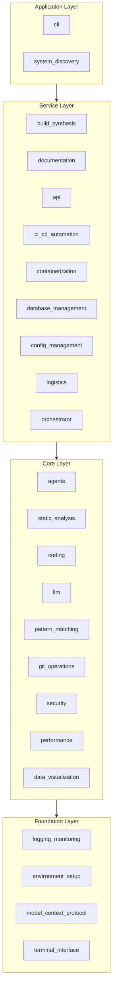

# Codomyrmex Functional Specification

**Version**: v0.1.0 | **Status**: Active | **Last Updated**: February 2026

## System Concept

Codomyrmex is an idealized modular workspace designed to facilitate interaction between (pairwise) and among (multiple) humans, people, agents, synthetic systems, embodiments, tools, and things most broadly.

It functions as a cohesive "colony" of specialized modules where each component has a single responsibility, clear boundaries, and standardized interfaces. The system abstracts complexity through layering, ensuring that high-level workflows can be orchestrated without tight coupling to low-level implementations.

## Functional Requirements

- **Modularity**: The system must allow individual modules to be added, removed, or upgraded without breaking the larger system.
- **Agent-Readability**: All components must be self-documenting in a way that is parseable and understandable by AI agents (via `AGENTS.md` and `SPEC.md`).
- **Deep Signposting**: Every directory must provide clear navigation to its parent, children, and related modules to enable distinct context retrieval.
- **Polyglot Support**: The architecture must support tools and code in multiple languages, unified by standard protocols (like MCP and shared config).
- **Safe Execution**: Code execution must be sandboxed and observable.
- **Discoverability**: All modules must be discoverable via the `system_discovery` mechanism and registered in the module index.
- **Instrumentation**: Every module must integrate with `logging_monitoring` for structured telemetry and observability.

## Design Principles

### Modularity
- Each module is a self-contained unit under `src/codomyrmex/` with its own implementation, tests, and documentation triad (`README.md`, `AGENTS.md`, `SPEC.md`).
- Modules expose only public APIs; internal implementation details remain encapsulated.
- Adding, removing, or upgrading a module must not require changes to unrelated modules.

### Internal Coherence
- Consistent directory structure and naming conventions across all 80+ modules.
- Unified documentation patterns: every module carries the same set of specification files.
- Shared configuration idioms via standardized `Config` objects and `pyproject.toml` extras.

### Parsimony
- Include only essential elements; avoid speculative abstractions.
- Minimize the public API surface area of each module to reduce coupling.
- Lazy module loading ensures startup cost scales with usage, not with total module count.

### Functionality
- Prioritize working solutions over theoretical completeness.
- Forward-looking design that accommodates future modules without requiring rewrites.
- Each module must deliver demonstrable value through its defined interfaces.

### Testing
- Comprehensive test coverage enforced through `pytest` with structured markers (`unit`, `integration`, `slow`, `network`, `external`).
- Test-driven development practices encouraged; tests live alongside source in `src/codomyrmex/tests/unit/<module>/`.
- Real data analysis preferred over mocked approximations where feasible.

### Documentation
- Self-documenting code with clear docstrings and type annotations.
- Complete API specifications (`API_SPECIFICATION.md`) and MCP tool definitions (`MCP_TOOL_SPECIFICATION.md`) for applicable modules with AI-callable tools.
- Living documentation that stays synchronized with implementation through scaffolding tools.

## Architecture

The system is organized into four hierarchical layers. Dependencies flow strictly upward: higher layers may depend on lower layers, but never the reverse.

- **Foundation Layer**: Core infrastructure consumed by every other layer. Provides logging, environment validation, MCP interfaces, and terminal formatting.
- **Core Layer**: Primary capabilities including agent frameworks, code analysis, LLM integration, pattern recognition, version control, security scanning, performance profiling, and data visualization.
- **Service Layer**: Higher-level orchestration that composes core capabilities into build automation, documentation generation, API management, CI/CD pipelines, container management, database operations, configuration, logistics workflows, and workflow orchestration.
- **Application Layer**: User-facing entry points. The CLI provides the primary human interface; `system_discovery` provides module health monitoring and dynamic registration.

## Quality Standards

- **Coupling**: Aim for loose coupling between modules and high cohesion within each module.
- **Modularity Gate**: New modules must pass structure validation (documentation triad, `__init__.py`, test stubs) before being committed.
- **Documentation Coverage**: 100% of module directories must contain a non-skeletal `README.md` with accurate content.
- **Interface Stability**: Public API changes require a semantic version bump and updated specification documents.
- **Test Coverage**: All modules must maintain unit test coverage; integration tests are required for cross-module interactions.

## Interface Contracts

- **Entry Points**: `__init__.py` serves as the primary entry point for every module, exporting the public API.
- **Configuration**: Modules receive configuration through standardized `Config` objects and environment variables validated by `environment_setup`.
- **Output Standards**: Consistent return types (e.g., `Result` objects for operations, structured dicts for data) across all module APIs.
- **MCP Protocol**: Modules that expose AI-callable tools must define them in `MCP_TOOL_SPECIFICATION.md` following the Model Context Protocol schema.
- **Error Handling**: Modules must raise domain-specific exceptions and log errors through `logging_monitoring` rather than silently failing.

## Modularity & Interfaces

- **Inputs**:
    - User commands (CLI, Shell).
    - AI Agent requests (MCP, Function Calls).
    - Event triggers (File changes, Webhooks).
- **Outputs**:
    - Synthesized code and artifacts.
    - Structured logs and telemetry.
    - Visualizations and reports.
    - Executable processes.
- **Boundaries**:
    - Modules interact primarily through public APIs defined in `src/codomyrmex/`.
    - Cross-module dependencies are strictly hierarchical (Foundation -> Core -> Service -> Application).

## Implementation Guidelines

- **Scaffolding**: Use `doc_scaffolder.py` to initialize new modules with the correct directory structure and documentation templates.
- **Signposting**: Maintain current parent/child navigation links in all markdown files to support agent traversal.
- **Dependency Management**: All dependencies are declared in `pyproject.toml`; module-specific `requirements.txt` files are deprecated.
- **Refactoring**: Regularly audit modules for TODO cleanup, placeholder replacement, and adherence to current conventions.
- **Versioning**: All modules follow semantic versioning starting at `v0.1.0`; version bumps are coordinated at the repository level.

## Coherence

This root directory serves as the nexus of the colony. It does not contain business logic itself but defines the structure (skeleton) and rules (membrane) that hold the organism together. The `src/` directory contains the organs, `docs/` the memory, and `scripts/` the reflexive behaviors.

## Navigation Links

- **Documentation**: [Reference Guides](docs/README.md)
- **All Agents**: [AGENTS.md](AGENTS.md)
- **Functional Spec**: [SPEC.md](SPEC.md)
- **Source Index**: [src/README.md](src/README.md)
- **Module Docs**: [docs/modules/](docs/modules/README.md)
- **Repository Root**: [README.md](README.md)
