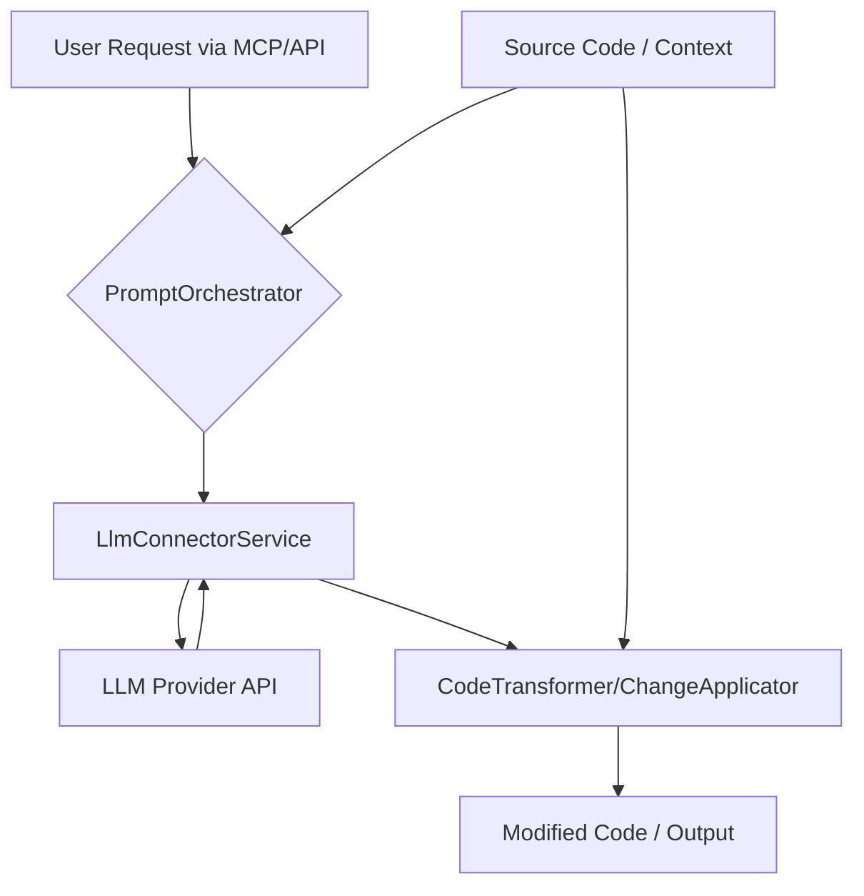

# Ai Code Editing - Technical Overview

This document provides a detailed technical overview of the Ai Code Editing module.

## 1. Introduction and Purpose

<!-- TODO: [Reviewed - Needs Content] Reiterate the module's core purpose from the main README.md, but with more technical depth. 
What specific problems does this module solve within Codomyrmex? 
What are its key responsibilities and contributions to the overall ecosystem? 
How does it leverage AI for code editing tasks? -->

## 2. Architecture

<!-- TODO: Describe the internal architecture of the module. 
Consider including a Mermaid diagram if it helps clarify relationships between components. 
Detail how LLM connectors, prompt engineering, code parsing, context retrieval, and code transformation engines interact. -->

- **Key Components/Sub-modules**: 
  <!-- TODO: Detail the main internal parts and their roles. Examples:
  - `LlmConnectorService`: Handles communication with different LLM provider APIs (OpenAI, Anthropic, etc.). Manages API key access and request/response formatting.
  - `PromptOrchestrator`: Constructs specific prompts for various tasks (generation, refactoring, summarization) using templates and context.
  - `CodeParserUtil`: (If applicable) Wraps libraries like tree-sitter or cased-kit to parse code, extract ASTs, or identify code elements.
  - `ContextAggregator`: Gathers relevant code context (e.g., definitions, imports, surrounding code) to feed into prompts.
  - `ChangeApplicator`: Takes LLM-suggested code changes and applies them to the source files, possibly including formatting.
  - `McpToolImplementations`: Concrete logic for `generate_code_snippet` and `refactor_code_snippet` tools, utilizing the above components.
  -->
- **Data Flow**: <!-- TODO: Explain how data (e.g., user request, source code, prompt, LLM response, modified code) moves through the module for a typical operation. -->
- **Core Algorithms/Logic**: <!-- TODO: Explain any complex algorithms or business logic central to the module, e.g., specific context selection strategies, merging LLM suggestions. -->
- **External Dependencies**: <!-- TODO: List specific key libraries (e.g., `openai`, `anthropic` SDKs, `tree-sitter`) or services it relies on and precisely why. -->

<!-- TODO: Adapt the Mermaid diagram above to accurately reflect the module's architecture. -->

## 3. Design Decisions and Rationale

<!-- TODO: Explain key design choices made during the development of this module and the reasons behind them. Examples:
- Choice of specific LLM models as defaults and why.
- Strategy for managing LLM API keys and potential costs.
- Approach to prompt engineering for robustness and quality.
- Error handling strategy for LLM API failures or unexpected outputs.
- Decision for state management if any (e.g., caching, session data).
-->

- **Choice of [Technology/Pattern X]**: <!-- TODO: Why was it selected over alternatives? -->
- **Handling [Specific Challenge Y]**: <!-- TODO: How does the current design address it? -->

## 4. Data Models

<!-- TODO: If the module works with significant internal data structures (beyond API/MCP schemas), describe them here. 
This could include internal representations of prompts, LLM responses before formatting, or context objects. -->

- **Model `InternalPromptStructure`**:
  - `field1` (type): <!-- TODO: Internal purpose and constraints. -->
  - `field2` (type): <!-- TODO: ... -->

## 5. Configuration

<!-- TODO: Detail any advanced or internal configuration options not typically exposed in the main README.md or USAGE_EXAMPLES.md. 
How do these configurations affect the module's behavior? 
Examples: Default LLM model names, timeout settings for LLM calls, feature flags for experimental capabilities. -->

- `DEFAULT_LLM_PROVIDER`: (Default: e.g., "openai", Description: The default LLM provider if not specified in a request.)
- `GENERATION_MODEL_NAME`: (Default: e.g., "gpt-3.5-turbo", Description: Default model for code generation tasks.)
- `REFACTOR_MODEL_NAME`: (Default: e.g., "gpt-4", Description: Default model for refactoring tasks.)

## 6. Scalability and Performance

<!-- TODO: Discuss how the module is designed to scale and perform under load. 
Consider factors like concurrent LLM API calls, processing large codebases for context, and response times. 
Any known limitations or bottlenecks? Strategies for optimization? -->

## 7. Security Aspects

<!-- TODO: Elaborate on security considerations specific to this module's design and implementation, beyond what's in the MCP tool spec or SECURITY.md. 
Examples: Sanitization of LLM inputs/outputs if directly rendered, secure storage/handling of API keys if managed internally beyond .env, risks of malicious prompts leading to excessive resource use. -->

## 8. Future Development / Roadmap

<!-- TODO: Outline potential future enhancements or areas of development for this module. 
Examples: Support for new LLM providers, more sophisticated context retrieval, interactive editing features, integration with static analysis for suggestion validation. --> 