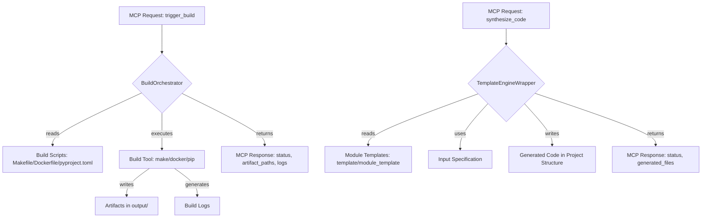

# Build Synthesis - Technical Overview

This document provides a detailed technical overview of the Build Synthesis module.

## 1. Introduction and Purpose

<!-- TODO: [Reviewed - Needs Content] Reiterate the module's core purpose from the main README.md, but with more technical depth. 
What specific problems does this module solve (e.g., automating complex builds, ensuring reproducible builds, generating boilerplate code from templates)? 
What are its key responsibilities within Codomyrmex (e.g., managing Docker builds, Python packaging, module scaffolding)? -->

## 2. Architecture

<!-- TODO: Describe the internal architecture of the module. 
Consider including a Mermaid diagram if it helps clarify relationships between build task runners, template engines, and artifact managers. 
Detail how it interacts with build definition files (Makefiles, pyproject.toml, Dockerfiles). -->

- **Key Components/Sub-modules**: 
  <!-- TODO: Detail the main internal parts and their roles. Examples:
  - `BuildOrchestrator`: Core component that parses build requests (e.g., from `trigger_build` MCP tool), identifies build scripts/tools (make, Docker, pip build), and executes them.
  - `TemplateEngineWrapper`: (If code synthesis is a major part) Interface for a templating engine like Jinja2, used by `synthesize_code_component`.
  - `ArtifactManager`: Handles storage and retrieval of build artifacts, potentially managing paths in the `output/` directory.
  - `DependencyChecker`: (Optional) Logic to verify build dependencies before starting a build.
  - `McpToolImplementations`: Concrete logic for `trigger_build` and `synthesize_code_component`.
  -->
- **Data Flow**: <!-- TODO: Explain how data (e.g., build target, configuration, source files, build logs, generated artifacts) moves through the module. -->
- **Core Algorithms/Logic**: <!-- TODO: Explain any complex logic, e.g., build dependency resolution if handled here, template rendering logic, strategies for parallel builds. -->
- **External Dependencies**: <!-- TODO: List specific key libraries (e.g., `subprocess` for running commands, `Jinja2` for templating, `Docker SDK` if interacting with Docker directly) or tools (make, Docker CLI) it relies on. -->

<!-- TODO: Adapt the Mermaid diagram above to accurately reflect the module's architecture for both build and synthesis. -->

## 3. Design Decisions and Rationale

<!-- TODO: Explain key design choices made during the development of this module. Examples:
- Choice of primary build orchestration method (e.g., Python scripts vs. Makefiles vs. a dedicated library).
- Approach to managing different build environments (local, CI).
- Strategy for making builds reproducible.
- How build configurations are managed and customized.
- Design of the `synthesize_code_component` for extensibility to new component types.
-->

- **Choice of [Technology/Pattern X]**: <!-- TODO: Why was it selected over alternatives? -->
- **Handling [Specific Challenge Y]**: <!-- TODO: How does the current design address it? -->

## 4. Data Models

<!-- TODO: If the module works with significant internal data structures (e.g., internal representation of a build job, a synthesis task), describe them here. -->

- **Model `InternalBuildTask`**:
  - `target` (str): <!-- TODO: The build target identifier. -->
  - `steps` (list): <!-- TODO: Sequence of commands or actions. -->
  - `status` (str): <!-- TODO: Current status of the task. -->

## 5. Configuration

<!-- TODO: Detail any advanced or internal configuration options. 
Examples: Default paths for build tools, configurable Docker repository, verbosity levels for build logs, default template paths. -->

- `MAKE_COMMAND_PATH`: (Default: "make", Description: Path to the make executable.)
- `DOCKER_COMMAND_PATH`: (Default: "docker", Description: Path to the Docker executable.)
- `DEFAULT_MODULE_TEMPLATE_DIR`: (Default: "template/module_template/", Description: Path to default new module template.)

## 6. Scalability and Performance

<!-- TODO: Discuss how the module handles potentially long-running builds or large numbers of build targets. 
Consider parallel execution, caching strategies for build steps. -->

## 7. Security Aspects

<!-- TODO: Elaborate on security considerations specific to this module's design, beyond MCP tool specs. 
Examples: Ensuring build scripts from untrusted sources are not executed without sandboxing (if applicable), secure handling of secrets passed to build processes, validation of template inputs for code synthesis to prevent injection. -->

## 8. Future Development / Roadmap

<!-- TODO: Outline potential future enhancements. 
Examples: Support for more build systems, advanced caching for build artifacts, integration with CI/CD platforms for automated build triggering and reporting, richer code synthesis capabilities. --> 