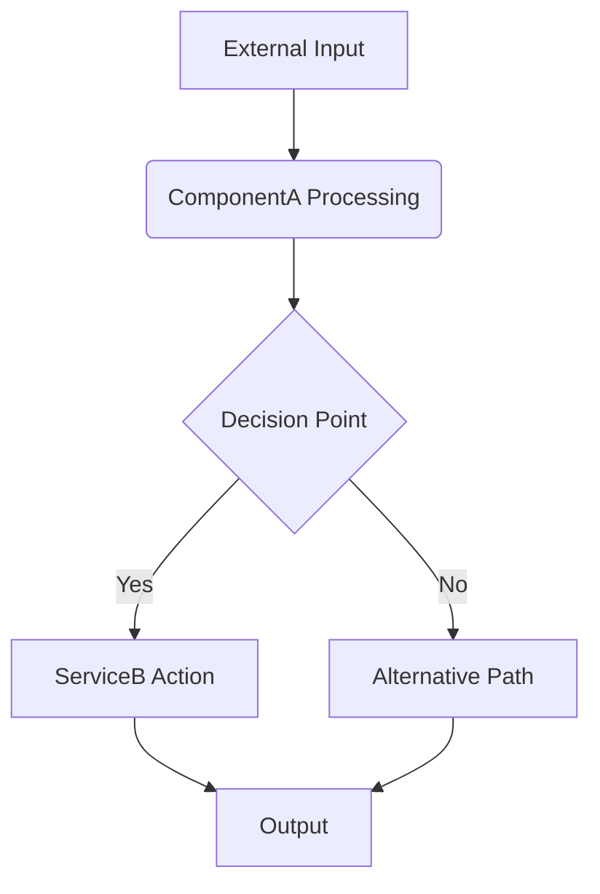

# Build Synthesis - Technical Overview

This document provides a detailed technical overview of the Build Synthesis module.

## 1. Introduction and Purpose

(Reiterate the module's core purpose from the main README, but with more technical depth. What problems does it solve? What are its key responsibilities within the Codomyrmex ecosystem?)

## 2. Architecture

(Describe the internal architecture of the module. Include diagrams if helpful.)

- **Key Components/Sub-modules**: (Detail the main internal parts and their roles.)
  - `ComponentA`: Description...
  - `ServiceB`: Description...
  - `DataStoreInterface`: Description...
- **Data Flow**: (How does data move through the module?)
- **Core Algorithms/Logic**: (Explain any complex algorithms or business logic central to the module.)
- **External Dependencies**: (List specific libraries or services it relies on and why.)

(Example Mermaid diagram - adapt as needed)

## 3. Design Decisions and Rationale

(Explain key design choices made during the development of this module and the reasons behind them.)

- **Choice of [Technology/Pattern X]**: Why was it selected over alternatives?
- **Handling [Specific Challenge Y]**: How does the current design address it?

## 4. Data Models

(If the module works with significant data structures, describe them here. This might overlap with API specifications but can be more detailed from an internal perspective.)

- **Model `InternalDataStructure`**:
  - `field1` (type): Internal purpose and constraints.
  - `field2` (type): ...

## 5. Configuration

(Detail any advanced or internal configuration options not typically exposed in the main README or usage examples. How do these configurations affect the module's behavior?)

- `CONFIG_PARAM_1`: (Default value, description, impact)
- `CONFIG_PARAM_2`: (Default value, description, impact)

## 6. Scalability and Performance

(Discuss how the module is designed to scale and perform under load. Any known limitations or bottlenecks?)

## 7. Security Aspects

(Elaborate on security considerations specific to this module's design and implementation, beyond what's in the MCP tool spec if applicable.)

## 8. Future Development / Roadmap

(Outline potential future enhancements or areas of development for this module.) 