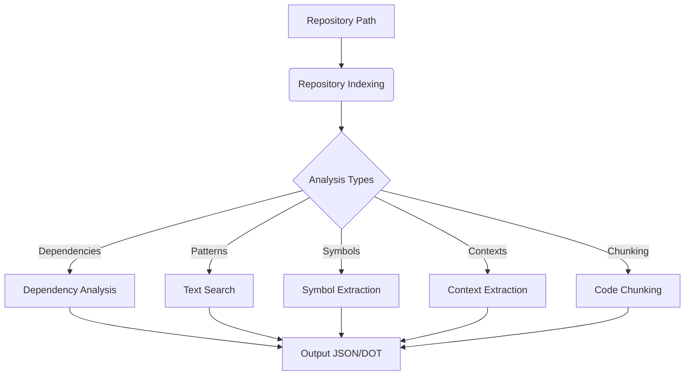

# Pattern Matching - Technical Overview

## 1. Introduction and Purpose

The Pattern Matching module provides capabilities for analyzing, understanding, and manipulating code through pattern recognition. It serves as a core utility for code comprehension, dependency tracking, and semantic understanding within the Codomyrmex ecosystem.

This module specifically addresses the challenges of:
- Understanding complex codebases through automatic analysis
- Tracking dependencies and relationships between code components
- Finding and extracting meaningful patterns in source code
- Providing context-aware code understanding for both humans and AI models

## 2. Architecture

The Pattern Matching module is structured around a central analysis script (`run_codomyrmex_analysis.py`) which orchestrates multiple analysis components.

### Key Components

- **Repository Analysis**: Provides indexing and structural understanding of codebases
- **Dependency Analyzer**: Identifies import/usage relationships between code components
- **Text Pattern Search**: Locates specific text patterns (TODOs, FIXMEs, etc.) in source files
- **Symbol Extraction & Analysis**: Identifies and tracks usage of code symbols
- **Context Extraction**: Extracts meaningful contexts around pattern matches
- **Code Chunking**: Demonstrates different strategies for breaking code into processable segments

### Data Flow



### External Dependencies

- `cased/kit`: Core library for code analysis (Repository, DocstringIndexer classes)
- `dotenv`: For environment variable management
- `logging_monitoring`: Codomyrmex module for structured logging
- `environment_setup`: Codomyrmex module for environment checks

## 3. Design Decisions and Rationale

### Analysis Orchestration

The module employs a orchestrator pattern where the main script coordinates separate analysis functions. This design allows for:

- **Modularity**: Each analysis type can be enabled/disabled independently
- **Extensibility**: New analysis types can be added without modifying existing ones
- **Configurability**: Fine-grained control over analysis parameters

### Output Structure

Analysis results are output as structured JSON, DOT files, and Markdown, stored in the `output/codomyrmex_analysis/` directory. This structure:

- Maintains separation between different analysis types
- Provides clear organization by module/repository
- Enables consumption by other tools in the ecosystem

### Integration with Other Modules

The Pattern Matching module integrates with other Codomyrmex modules through:

- **Environment Setup**: Ensures all required dependencies and configurations are present
- **Logging & Monitoring**: Uses structured logging for consistent observability
- **Data Visualization**: Output formats chosen to be compatible with visualization tools

## 4. Data Models

The primary data structures processed and generated by the Pattern Matching module include:

### Repository Index
```json
{
  "files": [
    {
      "path": "relative/path/to/file.py",
      "size": 1024,
      "is_binary": false,
      "last_modified": "timestamp"
    }
  ],
  "metadata": {
    "total_files": 150,
    "total_size": 1048576
  }
}
```

### Symbol Usage Data
```json
{
  "symbol_name": {
    "defined_in": "path/to/definition.py:line_number",
    "references": [
      {"file": "path/to/reference.py", "line": 42},
      {"file": "another/reference.py", "line": 17}
    ]
  }
}
```

### Text Search Results
```json
{
  "pattern": [
    {
      "file": "path/to/match.py",
      "line": 120,
      "content": "Line content with pattern"
    }
  ]
}
```

## 5. Configuration

The module's behavior is controlled through the `ANALYSIS_CONFIG` dictionary, which provides fine-grained control over:

- **Search Patterns**: Which text patterns to search for
- **Analysis Scope**: Which analysis types to run
- **Output Control**: Limits on context extraction, file summarization, etc.

This configuration can be adjusted by:
1. Modifying the script directly
2. Using the script as a library and providing custom config

## 6. Error Handling and Logging

The module employs a robust error handling strategy:

- Each analysis function returns any errors encountered
- Errors are logged but don't terminate the entire analysis
- The main orchestration collects all errors across analysis types

Logging is structured through the Codomyrmex `logging_monitoring` module, ensuring:
- Consistent log format and severity levels
- Integration with project-wide monitoring
- Clear information about analysis progress and issues

## 7. Future Directions

Potential enhancements to the Pattern Matching module include:

- Adding semantic pattern matching using more advanced language models
- Implementing pattern transformation (automated code changes)
- Developing interactive visualization of pattern relationships
- Expanding language support beyond Python 