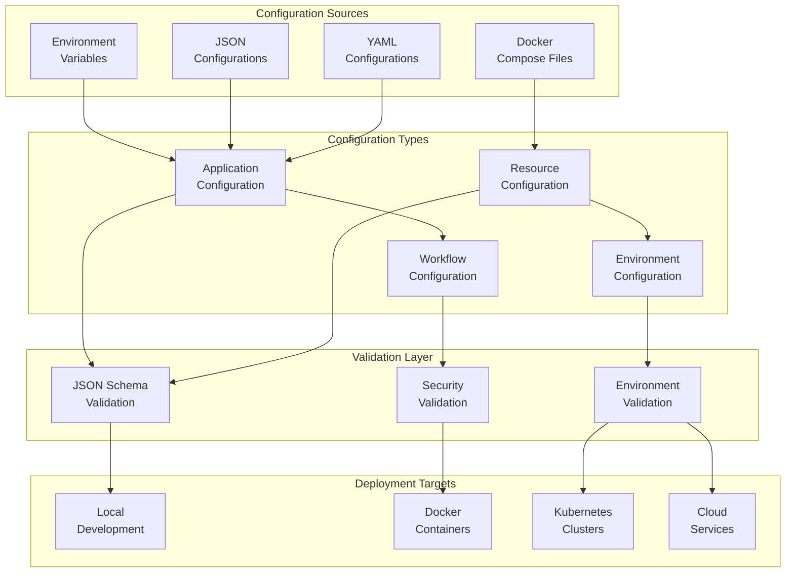
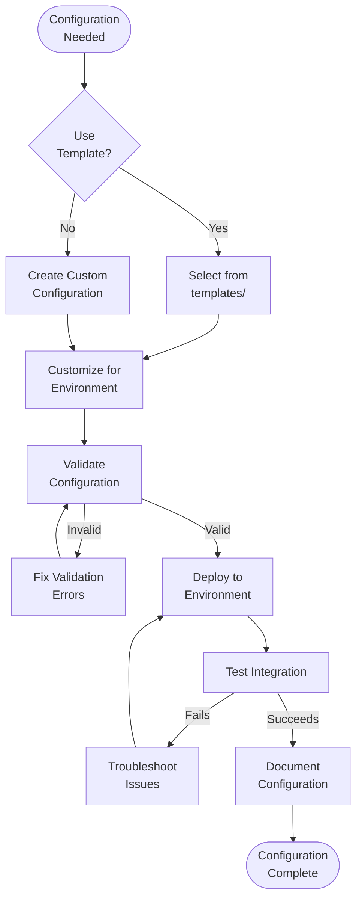

# config

## Signposting
- **Parent**: [Repository Root](../README.md)
- **Children**:
    - [examples](../scripts/examples/README.md)
    - [templates](templates/README.md)
- **Key Artifacts**:
    - [Agent Guide](AGENTS.md)
    - [Functional Spec](SPEC.md)

**Version**: v0.1.0 | **Status**: Active | **Last Updated**: December 2025

## Overview

This is the configuration coordination document for all configuration templates, examples, and environment setups in the Codomyrmex repository. It defines the standardized configuration management system that ensures consistent deployment and operation across all environments.

The config directory provides templates and examples for environment-specific configurations, resource allocations, and workflow definitions.

## Configuration Architecture



## Directory Contents
- `examples/` – Configuration examples and demonstrations
- `templates/` – Reusable configuration templates and scaffolding

## Configuration Workflow



## Navigation
- **Technical Documentation**: [AGENTS.md](AGENTS.md)
- **Functional Specification**: [SPEC.md](SPEC.md)
- **Project Root**: [README](../README.md)
- **Configuration Scripts**: [scripts/config_management/](../scripts/config_management/) - Configuration management utilities

## Configuration File Types

### Environment Configuration

Environment-specific settings stored in `.env` files:

```bash
# Development environment
DATABASE_URL=postgresql://localhost:5432/dev_db
API_KEY=dev_key_12345
LOG_LEVEL=DEBUG

# Production environment  
DATABASE_URL=postgresql://prod-server:5432/prod_db
API_KEY=${SECRET_API_KEY}
LOG_LEVEL=INFO
```

### Project Configuration

Project templates define structure and dependencies:

```json
{
  "name": "my_project",
  "version": "1.0.0",
  "modules": ["logging_monitoring", "static_analysis"],
  "resources": {
    "cpu": "2",
    "memory": "4Gi"
  }
}
```

### Workflow Configuration

Workflow definitions specify execution steps:

```json
{
  "workflow_id": "analysis_pipeline",
  "steps": [
    {"module": "static_analysis", "action": "analyze"},
    {"module": "security", "action": "scan"},
    {"module": "data_visualization", "action": "generate_report"}
  ]
}
```

## Getting Started

### Using Configuration Templates

1. **Select a template** from `templates/` directory
2. **Copy to your project** location
3. **Customize** for your environment
4. **Validate** using configuration management tools

```bash
# Copy template
cp config/templates/development.env .env

# Customize values
nano .env

# Validate configuration
python scripts/config_management/validate_config.py .env
```

### Creating Custom Configurations

1. **Start from example** in `examples/` directory
2. **Modify** for your specific needs
3. **Validate** against schema
4. **Document** any custom settings

## Related Documentation

- **[Configuration Management Module](../src/codomyrmex/config_management/)** - Configuration handling utilities
- **[Environment Setup](../docs/development/environment-setup.md)** - Development environment configuration
- **[Project Orchestration](../docs/project_orchestration/)** - Configuration-driven workflows

<!-- Navigation Links keyword for score -->
