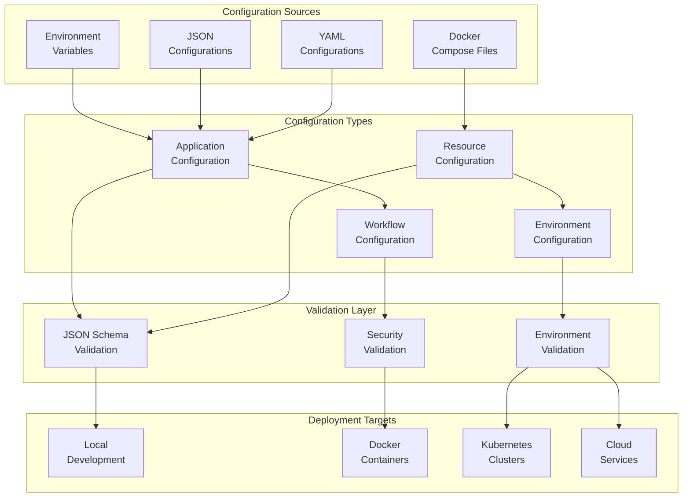

# config

## Signposting
- **Parent**: [Parent](../README.md)
- **Children**:
    - [examples](examples/README.md)
    - [templates](templates/README.md)
- **Key Artifacts**:
    - [Agent Guide](AGENTS.md)
    - [Functional Spec](SPEC.md)

**Version**: v0.1.0 | **Status**: Active | **Last Updated**: December 2025

## Overview

This is the configuration coordination document for all configuration templates, examples, and environment setups in the Codomyrmex repository. It defines the standardized configuration management system that ensures consistent deployment and operation across all environments.

The config directory provides templates and examples for environment-specific configurations, resource allocations, and workflow definitions.

## Configuration Architecture

## Directory Contents
- `examples/` – Configuration examples and demonstrations
- `templates/` – Reusable configuration templates and scaffolding

## Configuration Workflow

## Navigation
- **Technical Documentation**: [AGENTS.md](AGENTS.md)
- **Functional Specification**: [SPEC.md](SPEC.md)
- **Project Root**: [README](../README.md)
- **Configuration Scripts**: [scripts/config_management/](../scripts/config_management/) - Configuration management utilities