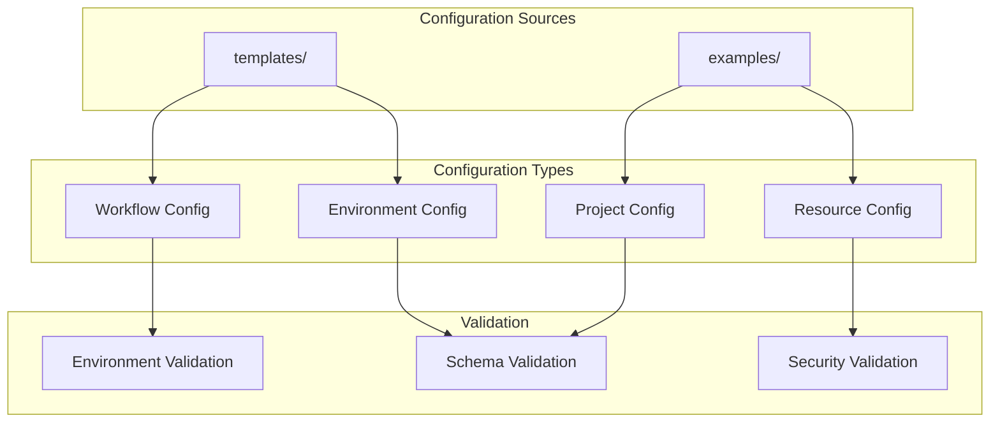

# config - Functional Specification

**Version**: v0.1.0 | **Status**: Active | **Last Updated**: December 2025

## Purpose

Configuration directory providing templates and examples for environment-specific configurations, resource allocations, and workflow definitions. Ensures consistent deployment and operation across all environments.

## Design Principles

### Modularity
- Configuration templates organized by purpose
- Self-contained configuration files
- Composable configuration patterns
- Clear configuration boundaries

### Internal Coherence
- Consistent configuration structure
- Unified schema validation
- Standardized naming conventions
- Logical organization

### Parsimony
- Essential configuration only
- Minimal required fields
- Clear defaults
- Direct configuration patterns

### Functionality
- Working configurations
- Validated schemas
- Practical examples
- Current best practices

### Testing
- Configuration validation tests
- Schema verification
- Example validation
- Integration testing

### Documentation
- Clear configuration documentation
- Usage examples
- Schema specifications
- Validation rules

## Architecture

## Functional Requirements

### Configuration Types
1. **Environment Configuration**: Development, staging, production
2. **Resource Configuration**: Resource allocation and limits
3. **Workflow Configuration**: Workflow definitions and dependencies
4. **Project Configuration**: Project-specific settings

### Configuration Standards
- JSON Schema validation
- Security validation
- Environment-specific validation
- Clear documentation

## Quality Standards

### Configuration Quality
- Valid schema compliance
- Security best practices
- Clear documentation
- Working examples

### Validation Standards
- Schema validation
- Security checks
- Environment validation
- Error reporting

## Interface Contracts

### Configuration Interface
- Standardized file formats (JSON, YAML)
- Consistent structure
- Clear schema definitions
- Validation rules

### Template Interface
- Reusable templates
- Parameterization support
- Clear documentation
- Example usage

## Implementation Guidelines

### Configuration Creation
1. Define configuration purpose
2. Create schema definition
3. Provide examples
4. Document usage
5. Validate configuration

### Template Development
- Create reusable templates
- Document parameters
- Provide examples
- Validate templates

## Navigation

- **Human Documentation**: [README.md](README.md)
- **Technical Documentation**: [AGENTS.md](AGENTS.md)
- **Repository Root**: [../README.md](../README.md)
- **Repository SPEC**: [../SPEC.md](../SPEC.md)

<!-- Navigation Links keyword for score -->
