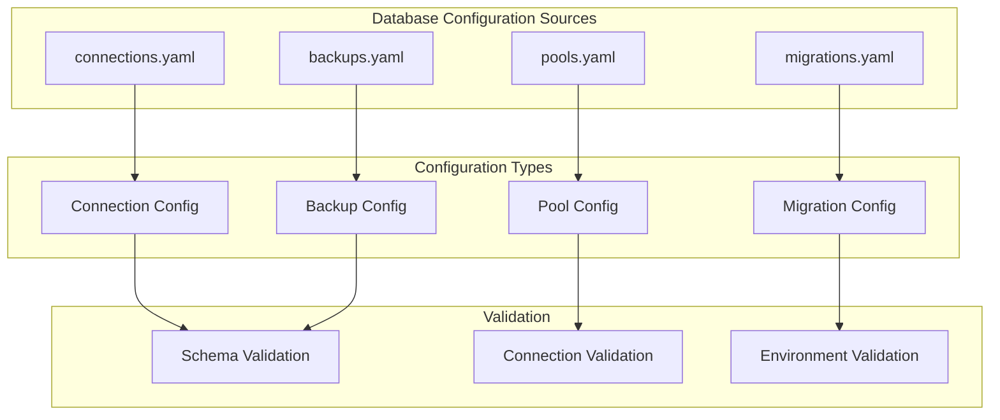

# config/database - Functional Specification

**Version**: v0.1.0 | **Status**: Active | **Last Updated**: January 2026

## Purpose

Database configuration directory providing templates and examples for database connections, connection pools, migration settings, and backup configurations. Ensures consistent database configuration across all modules and environments.

## Design Principles

### Modularity
- Database configurations organized by purpose
- Self-contained configuration files
- Composable database patterns
- Clear database boundaries

### Internal Coherence
- Consistent database structure
- Unified connection schemas
- Standardized naming conventions
- Logical organization

### Parsimony
- Essential database configuration only
- Minimal required fields
- Clear defaults
- Direct database patterns

### Functionality
- Working database configurations
- Validated schemas
- Practical examples
- Current best practices

### Testing
- Configuration validation tests
- Schema verification
- Example validation
- Integration testing

### Documentation
- Clear database documentation
- Usage examples
- Schema specifications
- Validation rules

## Architecture

## Functional Requirements

### Configuration Types
1. **Connections**: Database connection templates for SQLite, PostgreSQL, MySQL, MongoDB, Redis
2. **Pools**: Connection pool configurations with size, timeout, and retry settings
3. **Migrations**: Migration settings including directory, naming patterns, and auto-rollback
4. **Backups**: Backup configurations with compression, retention, and encryption

### Configuration Standards
- YAML format for readability
- Environment variable references for credentials
- JSON Schema validation
- Connection validation
- Clear documentation

## Quality Standards

### Configuration Quality
- Valid schema compliance
- Database best practices
- Clear documentation
- Working examples

### Validation Standards
- Schema validation
- Connection validation
- Environment validation
- Error reporting

## Interface Contracts

### Configuration Interface
- Standardized YAML format
- Consistent structure
- Clear schema definitions
- Validation rules

### Template Interface
- Reusable templates
- Parameterization support
- Clear documentation
- Example usage

## Implementation Guidelines

### Configuration Creation
1. Define database configuration purpose
2. Create schema definition
3. Provide examples
4. Document usage
5. Validate configuration

### Template Development
- Create reusable templates
- Document parameters
- Provide examples
- Validate templates

## Navigation

- **Human Documentation**: [README.md](README.md)
- **Technical Documentation**: [AGENTS.md](AGENTS.md)
- **Repository Root**: [../../README.md](../../README.md)
- **Repository SPEC**: [../../SPEC.md](../../SPEC.md)

<!-- Navigation Links keyword for score -->
