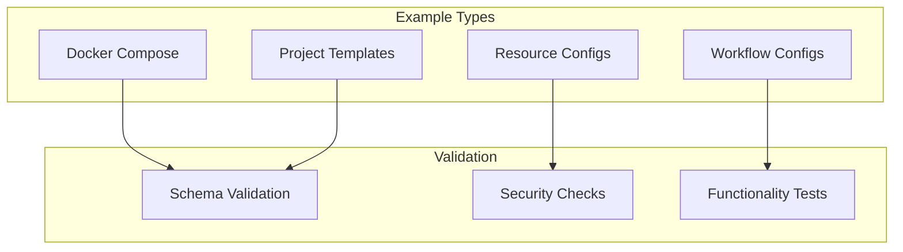

# config/examples - Functional Specification

**Version**: v0.1.0 | **Status**: Active | **Last Updated**: February 2026

## Purpose

Configuration examples directory providing working demonstrations of configuration patterns for Codomyrmex. Examples serve as reference implementations for common configuration scenarios including Docker orchestration, project templates, resource allocation, and workflow definitions.

## Design Principles

### Modularity
- Self-contained components
- Clear boundaries
- Minimal dependencies

### Internal Coherence
- Logical organization
- Consistent patterns
- Unified design

### Parsimony
- Essential elements only
- No unnecessary complexity
- Minimal surface area

### Functionality
- Focus on working solutions
- Forward-looking design
- Current needs focus

### Testing
- Comprehensive coverage
- TDD practices
- Real data analysis

### Documentation
- Self-documenting code
- Clear APIs
- Complete specifications

## Architecture

## Functional Requirements

### Example Categories
1. **Docker Orchestration**: Multi-service container configurations
2. **Project Templates**: Custom project scaffolding patterns
3. **Resource Allocation**: CPU, memory, storage configurations
4. **Workflow Definitions**: Sequential and parallel workflow patterns

### Example Standards
- All examples must be functional and tested
- Examples include clear comments explaining options
- No hardcoded secrets or sensitive data
- Examples follow security best practices

## Quality Standards

### Example Quality
- Working and tested configurations
- Clear documentation and comments
- Security best practices
- Current with latest Codomyrmex features

### Validation Standards
- Schema validation for JSON/YAML configs
- Security review for sensitive data
- Functionality testing
- Regular updates to match codebase

## Interface Contracts

### Configuration Format
- JSON for structured configurations
- YAML for Docker and workflow configs
- Environment variables for sensitive settings
- Consistent structure across examples

### Example Interface
- Clear file naming conventions
- Documented configuration options
- Usage instructions included
- Validation rules specified

## Implementation Guidelines

### Creating Examples
1. Identify common configuration pattern
2. Create working example configuration
3. Add clear documentation comments
4. Test example functionality
5. Document usage and requirements

### Maintaining Examples
- Update examples when features change
- Test examples regularly
- Review for security issues
- Keep documentation current

## Navigation

- **Human Documentation**: [README.md](README.md)
- **Technical Documentation**: [AGENTS.md](AGENTS.md)
- **Parent Directory**: [config](../README.md)
- **Parent SPEC**: [../SPEC.md](../SPEC.md)
- **Repository Root**: [../../README.md](../../README.md)
- **Repository SPEC**: [../../SPEC.md](../../SPEC.md)

<!-- Navigation Links keyword for score -->
