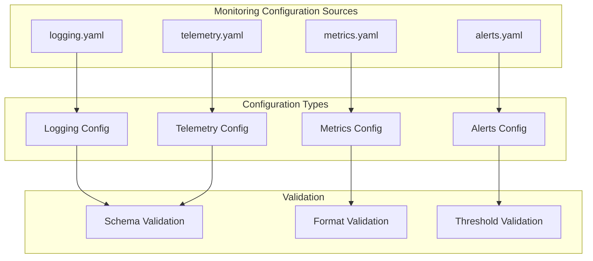

# config/monitoring - Functional Specification

**Version**: v0.1.7 | **Status**: Active | **Last Updated**: February 2026

## Purpose

Monitoring and telemetry configuration directory providing templates and examples for logging, metrics, alerting, and observability settings. Ensures consistent monitoring configuration across all modules and environments.

## Design Principles

### Modularity
- Monitoring configurations organized by purpose
- Self-contained configuration files
- Composable monitoring patterns
- Clear observability boundaries

### Internal Coherence
- Consistent monitoring structure
- Unified metric schemas
- Standardized naming conventions
- Logical organization

### Parsimony
- Essential monitoring configuration only
- Minimal required fields
- Clear defaults
- Direct monitoring patterns

### Functionality
- Working monitoring configurations
- Validated schemas
- Practical examples
- Current best practices

### Testing
- Configuration validation tests
- Schema verification
- Example validation
- Integration testing

### Documentation
- Clear monitoring documentation
- Usage examples
- Schema specifications
- Validation rules

## Architecture

## Functional Requirements

### Configuration Types
1. **Logging**: Log levels, formats, output destinations, rotation policies
2. **Metrics**: Metric types, collection intervals, storage configurations
3. **Alerts**: Alerting rules, thresholds, notification channels
4. **Telemetry**: Distributed tracing, performance monitoring, observability

### Configuration Standards
- YAML format for readability
- Environment variable references where appropriate
- JSON Schema validation
- Format validation
- Clear documentation

## Quality Standards

### Configuration Quality
- Valid schema compliance
- Monitoring best practices
- Clear documentation
- Working examples

### Validation Standards
- Schema validation
- Format validation
- Threshold validation
- Error reporting

## Interface Contracts

### Configuration Interface
- Standardized YAML format
- Consistent structure
- Clear schema definitions
- Validation rules

### Template Interface
- Reusable templates
- Parameterization support
- Clear documentation
- Example usage

## Implementation Guidelines

### Configuration Creation
1. Define monitoring configuration purpose
2. Create schema definition
3. Provide examples
4. Document usage
5. Validate configuration

### Template Development
- Create reusable templates
- Document parameters
- Provide examples
- Validate templates

## Navigation

- **Human Documentation**: [README.md](README.md)
- **Technical Documentation**: [AGENTS.md](AGENTS.md)
- **Repository Root**: [../../README.md](../../README.md)
- **Repository SPEC**: [../../SPEC.md](../../SPEC.md)

<!-- Navigation Links keyword for score -->
