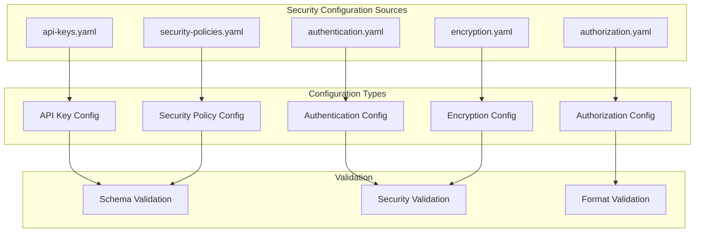

# config/security - Functional Specification

**Version**: v0.1.0 | **Status**: Active | **Last Updated**: February 2026

## Purpose

Security and authentication configuration directory providing templates and examples for API keys, authentication providers, authorization policies, encryption settings, and security policies. Ensures consistent security configuration across all modules and environments.

## Design Principles

### Modularity
- Security configurations organized by purpose
- Self-contained configuration files
- Composable security patterns
- Clear security boundaries

### Internal Coherence
- Consistent security structure
- Unified validation schemas
- Standardized naming conventions
- Logical organization

### Parsimony
- Essential security configuration only
- Minimal required fields
- Clear defaults
- Direct security patterns

### Functionality
- Working security configurations
- Validated schemas
- Practical examples
- Current security best practices

### Testing
- Configuration validation tests
- Schema verification
- Example validation
- Security testing

### Documentation
- Clear security documentation
- Usage examples
- Schema specifications
- Validation rules

## Architecture

## Functional Requirements

### Configuration Types
1. **API Keys**: API key templates, validation rules, rotation policies
2. **Authentication**: Authentication provider configurations (OAuth, API keys, tokens)
3. **Authorization**: Permission and role definitions, access control policies
4. **Encryption**: Encryption algorithms, key management, key rotation
5. **Security Policies**: Input validation, output sanitization, audit logging, compliance

### Configuration Standards
- YAML format for readability
- Environment variable references for secrets
- JSON Schema validation
- Security validation
- Clear documentation

## Quality Standards

### Configuration Quality
- Valid schema compliance
- Security best practices
- Clear documentation
- Working examples

### Validation Standards
- Schema validation
- Security checks
- Format validation
- Error reporting

## Interface Contracts

### Configuration Interface
- Standardized YAML format
- Consistent structure
- Clear schema definitions
- Validation rules

### Template Interface
- Reusable templates
- Parameterization support
- Clear documentation
- Example usage

## Implementation Guidelines

### Configuration Creation
1. Define security configuration purpose
2. Create schema definition
3. Provide examples
4. Document usage
5. Validate configuration

### Template Development
- Create reusable templates
- Document parameters
- Provide examples
- Validate templates

## Navigation

- **Human Documentation**: [README.md](README.md)
- **Technical Documentation**: [AGENTS.md](AGENTS.md)
- **Repository Root**: [../../README.md](../../README.md)
- **Repository SPEC**: [../../SPEC.md](../../SPEC.md)

<!-- Navigation Links keyword for score -->
