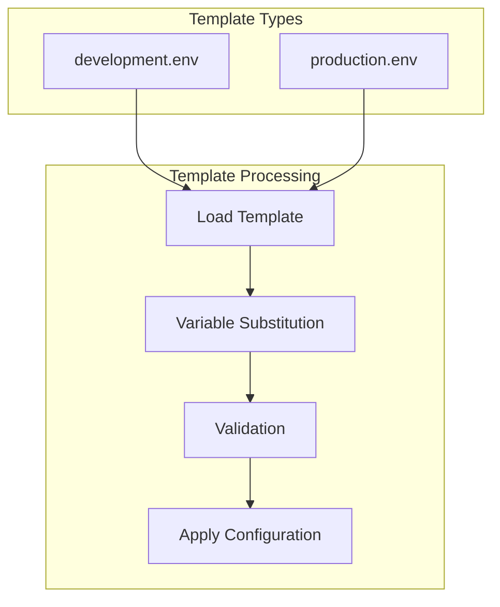

# config/templates - Functional Specification

**Version**: v0.1.0 | **Status**: Active | **Last Updated**: January 2026

## Purpose

Reusable configuration templates and environment scaffolding for Codomyrmex. Templates provide standardized starting points for different deployment scenarios with variable substitution and environment-specific customization.

## Design Principles

### Modularity
- Self-contained components
- Clear boundaries
- Minimal dependencies

### Internal Coherence
- Logical organization
- Consistent patterns
- Unified design

### Parsimony
- Essential elements only
- No unnecessary complexity
- Minimal surface area

### Functionality
- Focus on working solutions
- Forward-looking design
- Current needs focus

### Testing
- Comprehensive coverage
- TDD practices
- Real data analysis

### Documentation
- Self-documenting code
- Clear APIs
- Complete specifications

## Architecture

## Functional Requirements

### Template Types
1. **Development Template**: Local development environment with debug settings
2. **Production Template**: Production deployment with security and performance optimizations

### Template Standards
- Variable substitution support
- Clear documentation comments
- Security best practices
- Environment-specific defaults
- Validation rules

## Quality Standards

### Template Quality
- Working and tested templates
- Clear variable documentation
- Security best practices
- Current with latest features

### Validation Standards
- Required variable validation
- Security configuration checks
- Environment compatibility verification
- Regular template updates

## Interface Contracts

### Template Format
- Environment variable format (.env files)
- Variable substitution syntax
- Comment documentation
- Section organization

### Template Interface
- `load_development_config() -> dict`
- `load_production_config() -> dict`
- `render_template(template_path, variables) -> str`
- `validate_template_config(config) -> bool`

## Implementation Guidelines

### Creating Templates
1. Identify configuration pattern
2. Create template with variables
3. Add documentation comments
4. Define validation rules
5. Test template rendering

### Maintaining Templates
- Update when features change
- Review security settings
- Test in target environments
- Keep documentation current

## Navigation

- **Human Documentation**: [README.md](README.md)
- **Technical Documentation**: [AGENTS.md](AGENTS.md)
- **Parent Directory**: [config](../README.md)
- **Parent SPEC**: [../SPEC.md](../SPEC.md)
- **Repository Root**: [../../README.md](../../README.md)
- **Repository SPEC**: [../../SPEC.md](../../SPEC.md)
