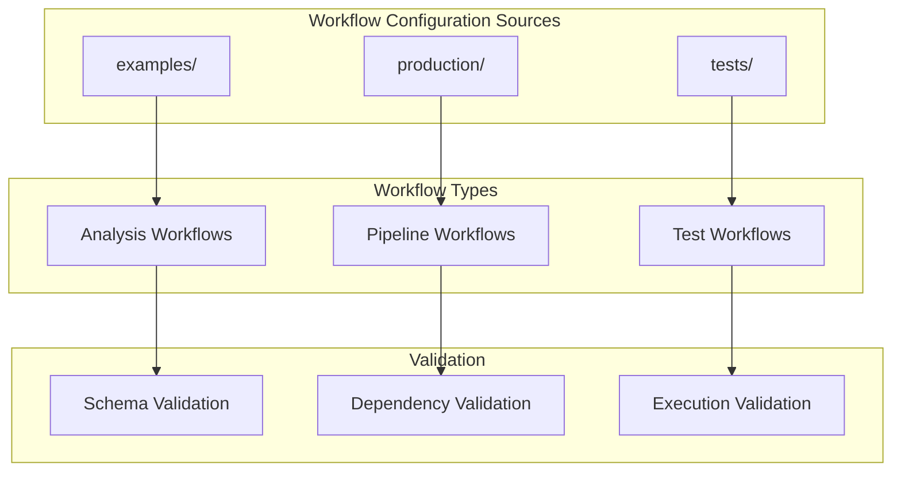

# config/workflows - Functional Specification

**Version**: v0.1.0 | **Status**: Active | **Last Updated**: February 2026

## Purpose

Workflow configuration directory providing templates and examples for workflow definitions, pipeline orchestration, and task scheduling. Ensures consistent workflow configuration across all modules and environments.

## Design Principles

### Modularity

- Workflow configurations organized by purpose
- Self-contained configuration files
- Composable workflow patterns
- Clear orchestration boundaries

### Internal Coherence

- Consistent workflow structure
- Unified task schemas
- Standardized naming conventions
- Logical organization

### Parsimony

- Essential workflow configuration only
- Minimal required fields
- Clear defaults
- Direct orchestration patterns

### Functionality

- Working workflow configurations
- Validated schemas
- Practical examples
- Current best practices

### Testing

- Configuration validation tests
- Schema verification
- Example validation
- Integration testing

### Documentation

- Clear workflow documentation
- Usage examples
- Schema specifications
- Validation rules

## Architecture

## Functional Requirements

### Workflow Types

1. **Analysis Workflows**: Code analysis, metrics, and reporting pipelines
2. **Pipeline Workflows**: Multi-stage processing with dependencies
3. **Test Workflows**: Automated testing and validation workflows

### Workflow Standards

- JSON format for workflow definitions
- Clear step dependencies
- Parameterized task execution
- Error handling and retry policies

## Quality Standards

### Workflow Quality

- Valid schema compliance
- Workflow best practices
- Clear documentation
- Working examples

### Validation Standards

- Schema validation
- Dependency validation
- Execution validation
- Error reporting

## Interface Contracts

### Workflow Format

- Standardized JSON format
- Consistent structure
- Clear schema definitions
- Validation rules

### Template Interface

- Reusable templates
- Parameterization support
- Clear documentation
- Example usage

## Implementation Guidelines

### Workflow Creation

1. Define workflow purpose
2. Create schema definition
3. Provide examples
4. Document usage
5. Validate workflow

### Template Development

- Create reusable templates
- Document parameters
- Provide examples
- Validate templates

## Navigation

- **Human Documentation**: [README.md](README.md)
- **Technical Documentation**: [AGENTS.md](AGENTS.md)
- **Parent Directory**: [config](../README.md)
- **Parent SPEC**: [../SPEC.md](../SPEC.md)
- **Repository Root**: [../../README.md](../../README.md)
- **Repository SPEC**: [../../SPEC.md](../../SPEC.md)

<!-- Navigation Links keyword for score -->
