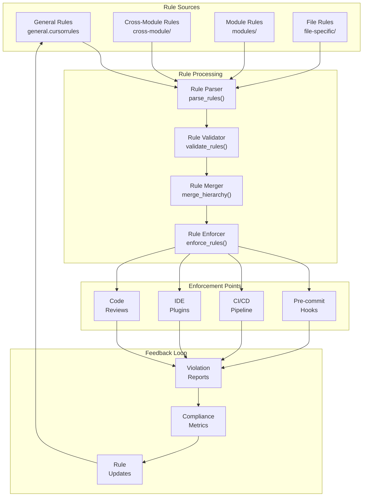
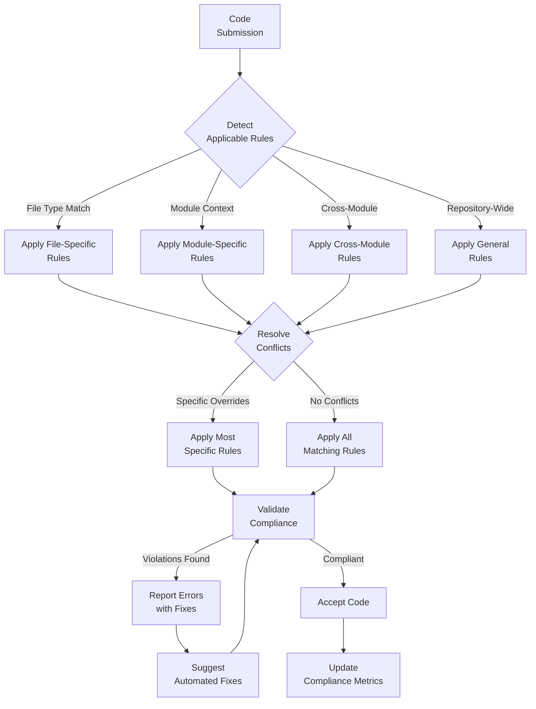
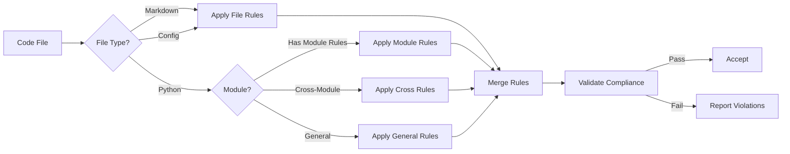

# cursorrules

## Signposting
- **Parent**: [Repository Root](../README.md)
- **Children**:
    - [cross-module](cross-module/README.md)
    - [file-specific](file-specific/README.md)
    - [modules](modules/README.md)
- **Key Artifacts**:
    - [Agent Guide](AGENTS.md)
    - [Functional Spec](SPEC.md)

**Version**: v0.1.0 | **Status**: Active | **Last Updated**: December 2025

## Overview

This is the coding standards coordination document for all Cursor rules, coding conventions, and automation guidelines in the Codomyrmex repository. It defines the rule system that guides consistent code quality, style, and development practices across the entire platform.

The cursorrules directory contains hierarchical coding standards that guide both human developers and AI agents in maintaining consistent code.

## Rule Hierarchy Architecture

## Rule Application Workflow

## Directory Contents
- `cross-module/` – Cross-module coordination rules and standards
- `file-specific/` – File-type specific coding conventions
- `general.cursorrules` – Repository-wide coding standards
- `modules/` – Module-specific coding standards (27 files)

## Navigation
- **Technical Documentation**: [AGENTS.md](AGENTS.md)
- **Functional Specification**: [SPEC.md](SPEC.md)
- **Repository Root**: [../README.md](../README.md)
- **Rule Enforcement**: [scripts/static_analysis/](../scripts/static_analysis/) - Rule validation utilities

## Rule Categories

### General Rules (`general.cursorrules`)

Repository-wide standards covering:
- Python style and conventions (PEP 8)
- Import organization
- Error handling patterns
- Documentation requirements
- Testing standards

### Cross-Module Rules (`cross-module/`)

Standards for modules working together:
- API consistency
- Data structure standards
- Communication protocols
- Shared utility patterns

### Module-Specific Rules (`modules/`)

Tailored standards for individual modules:
- Module-specific naming
- Architecture patterns
- Testing requirements
- Documentation standards

### File-Specific Rules (`file-specific/`)

File-type specific conventions:
- Python file structure
- Markdown formatting
- Configuration standards
- Script conventions

## Rule Application

## Getting Started

### Understanding Rule Hierarchy

Rules are applied in order of specificity:
1. **File-specific** (most specific) - Applies to specific file types
2. **Module-specific** - Applies to specific modules
3. **Cross-module** - Applies across multiple modules
4. **General** (least specific) - Applies repository-wide

### Using Rules in Development

1. **Read general rules** - Start with `general.cursorrules`
2. **Check module rules** - Review `modules/{module_name}.cursorrules`
3. **Review cross-module** - Check `cross-module/` for coordination
4. **Follow file rules** - Apply `file-specific/` standards

### Rule Enforcement

Rules are automatically enforced through:
- **Pre-commit hooks** - Validation before commits
- **CI/CD pipelines** - Automated checks
- **IDE integration** - Real-time validation
- **Code reviews** - Manual validation

## Contributing

When adding or modifying rules:

1. **Document rationale** - Explain why the rule exists
2. **Provide examples** - Show correct and incorrect usage
3. **Update enforcement** - Add automated validation where possible
4. **Review impact** - Assess effects on existing code
5. **Update documentation** - Keep README and AGENTS.md current

See **[Contributing Guide](../docs/project/contributing.md)** for detailed guidelines.

<!-- Navigation Links keyword for score -->
