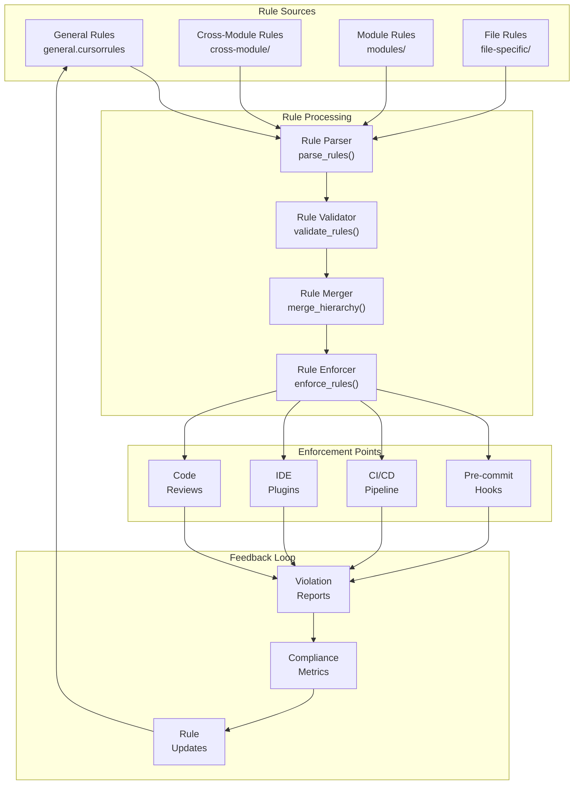
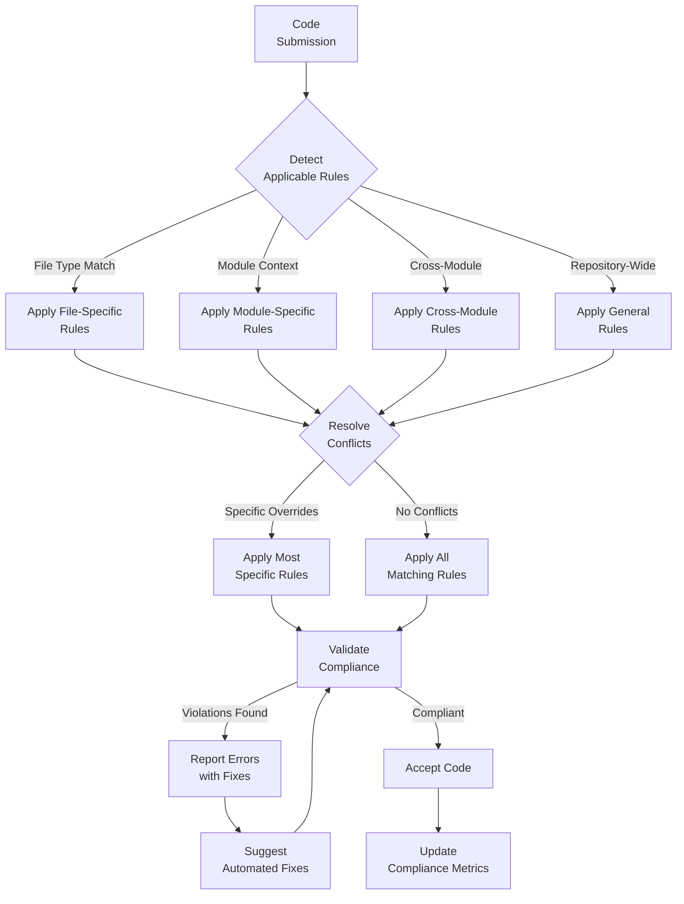

# cursorrules

## Signposting
- **Parent**: [Parent](../README.md)
- **Children**:
    - [cross-module](cross-module/README.md)
    - [file-specific](file-specific/README.md)
    - [modules](modules/README.md)
- **Key Artifacts**:
    - [Agent Guide](AGENTS.md)
    - [Functional Spec](SPEC.md)

**Version**: v0.1.0 | **Status**: Active | **Last Updated**: December 2025

## Overview

This is the coding standards coordination document for all Cursor rules, coding conventions, and automation guidelines in the Codomyrmex repository. It defines the rule system that guides consistent code quality, style, and development practices across the entire platform.

The cursorrules directory contains hierarchical coding standards that guide both human developers and AI agents in maintaining consistent code.

## Rule Hierarchy Architecture

## Rule Application Workflow

## Directory Contents
- `cross-module/` – Cross-module coordination rules and standards
- `file-specific/` – File-type specific coding conventions
- `general.cursorrules` – Repository-wide coding standards
- `modules/` – Module-specific coding standards (27 files)

## Navigation
- **Technical Documentation**: [AGENTS.md](AGENTS.md)
- **Functional Specification**: [SPEC.md](SPEC.md)
- **Repository Root**: [../README.md](../README.md)
- **Rule Enforcement**: [scripts/static_analysis/](../scripts/static_analysis/) - Rule validation utilities