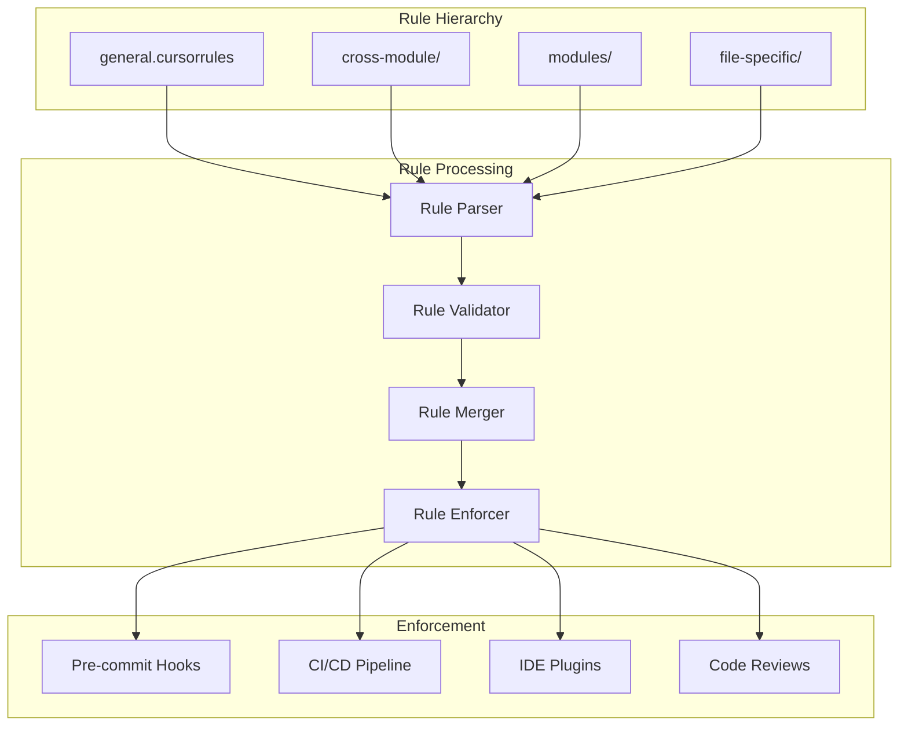

# cursorrules - Functional Specification

**Version**: v0.1.0 | **Status**: Active | **Last Updated**: December 2025

## Purpose

Coding standards directory providing hierarchical rules, conventions, and automation guidelines for consistent code quality, style, and development practices across the Codomyrmex platform.

## Design Principles

### Modularity
- Rules organized by scope and purpose
- Hierarchical rule structure
- Composable rule sets
- Clear rule boundaries

### Internal Coherence
- Consistent rule patterns
- Unified rule syntax
- Logical rule organization
- Standardized rule structure

### Parsimony
- Essential rules only
- Clear, concise rule definitions
- Minimal rule complexity
- Focused rule scope

### Functionality
- Enforceable rules
- Practical guidelines
- Working rule implementations
- Current best practices

### Testing
- Rule validation tests
- Rule enforcement verification
- Compliance checking
- Rule effectiveness measurement

### Documentation
- Clear rule documentation
- Usage examples
- Rule rationale
- Enforcement guidelines

## Architecture

## Functional Requirements

### Rule Categories
1. **General Rules**: Platform-wide coding standards
2. **Cross-Module Rules**: Inter-module coordination rules
3. **Module Rules**: Module-specific conventions
4. **File-Specific Rules**: File-type specific standards

### Rule Standards
- Clear rule definitions
- Enforceable guidelines
- Practical examples
- Current best practices

## Quality Standards

### Rule Quality
- Clear and actionable rules
- Enforceable guidelines
- Practical examples
- Current best practices

### Enforcement Quality
- Automated enforcement where possible
- Clear violation reporting
- Consistent application
- Effective compliance

## Interface Contracts

### Rule Interface
- Standardized rule syntax
- Consistent rule structure
- Clear rule scope
- Defined enforcement mechanism

### Rule Hierarchy
- General rules as base
- Specific rules override general
- Clear precedence rules
- Consistent merging

## Implementation Guidelines

### Rule Development
1. Define rule purpose and scope
2. Create clear rule definition
3. Provide examples and rationale
4. Define enforcement mechanism
5. Document rule usage

### Rule Organization
- Organize by scope and purpose
- Maintain hierarchy
- Keep rules current
- Remove obsolete rules

## Navigation

- **Human Documentation**: [README.md](README.md)
- **Technical Documentation**: [AGENTS.md](AGENTS.md)
- **Repository Root**: [../README.md](../README.md)
- **Repository SPEC**: [../SPEC.md](../SPEC.md)

<!-- Navigation Links keyword for score -->
