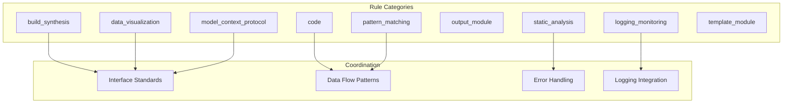

# cursorrules/cross-module - Functional Specification

**Version**: v0.1.0 | **Status**: Active | **Last Updated**: February 2026

## Purpose

Cross-module coding rules and coordination standards defining how Codomyrmex modules interact, coordinate operations, and maintain consistency across module boundaries. Ensures coherent inter-module communication and shared patterns.

## Design Principles

### Modularity
- Self-contained components
- Clear boundaries
- Minimal dependencies

### Internal Coherence
- Logical organization
- Consistent patterns
- Unified design

### Parsimony
- Essential elements only
- No unnecessary complexity
- Minimal surface area

### Functionality
- Focus on working solutions
- Forward-looking design
- Current needs focus

### Testing
- Comprehensive coverage
- TDD practices
- Real data analysis

### Documentation
- Self-documenting code
- Clear APIs
- Complete specifications

## Architecture

## Functional Requirements

### Rule Categories
1. **Module-Specific Rules**: Coordination standards for specific modules
2. **Interface Standards**: Inter-module communication patterns
3. **Data Flow Rules**: Data sharing and transformation standards
4. **Error Handling**: Cross-module error propagation patterns

### Rule Standards
- Clear coordination guidelines
- Consistent interface patterns
- Standardized error handling
- Unified logging integration

## Quality Standards

### Rule Quality
- Clear and actionable rules
- Consistent with module boundaries
- Practical coordination patterns
- Current best practices

### Coordination Standards
- Interface consistency
- Data flow clarity
- Error handling coherence
- Logging integration

## Interface Contracts

### Inter-Module Interface
- Standardized communication patterns
- Consistent data structures
- Unified error handling
- Shared logging integration

### Rule Interface
- Module-specific rule files
- Clear rule scope
- Consistent rule syntax
- Defined enforcement

## Implementation Guidelines

### Creating Cross-Module Rules
1. Identify coordination pattern
2. Define interface standards
3. Specify data flow rules
4. Document error handling
5. Test coordination

### Maintaining Rules
- Update when modules change
- Review coordination patterns
- Test inter-module interactions
- Keep rules current

## Navigation

- **Human Documentation**: [README.md](README.md)
- **Technical Documentation**: [AGENTS.md](AGENTS.md)
- **Parent Directory**: [cursorrules](../README.md)
- **Repository Root**: [../../README.md](../../README.md)
- **Repository SPEC**: [../../SPEC.md](../../SPEC.md)

<!-- Navigation Links keyword for score -->
