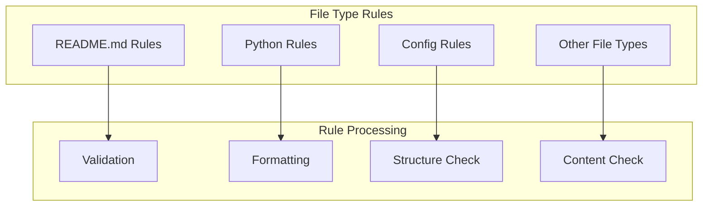

# cursorrules/file-specific - Functional Specification

**Version**: v0.1.0 | **Status**: Active | **Last Updated**: December 2025

## Purpose

File-type specific coding conventions and standards defining formatting, structure, and content requirements for specific file types. Ensures consistency across the Codomyrmex codebase through standardized file-type rules.

## Design Principles

### Modularity
- Self-contained components
- Clear boundaries
- Minimal dependencies

### Internal Coherence
- Logical organization
- Consistent patterns
- Unified design

### Parsimony
- Essential elements only
- No unnecessary complexity
- Minimal surface area

### Functionality
- Focus on working solutions
- Forward-looking design
- Current needs focus

### Testing
- Comprehensive coverage
- TDD practices
- Real data analysis

### Documentation
- Self-documenting code
- Clear APIs
- Complete specifications

## Architecture

## Functional Requirements

### File Type Coverage
1. **README.md**: Documentation structure and formatting standards
2. **Python Files**: Code style and structure requirements
3. **Configuration Files**: Config file format standards
4. **Other Types**: Additional file-type specific rules

### Rule Standards
- Clear file-type specific guidelines
- Consistent formatting requirements
- Structure validation rules
- Content quality standards

## Quality Standards

### Rule Quality
- Clear and actionable file-type rules
- Consistent with general coding standards
- Practical formatting guidelines
- Current best practices

### Validation Standards
- File structure validation
- Format compliance checking
- Content quality verification
- Regular rule updates

## Interface Contracts

### Rule Interface
- File-type specific rule files
- Clear rule scope per file type
- Consistent rule syntax
- Defined validation functions

### Validation Interface
- `validate_readme_structure(content) -> ValidationResult`
- `check_readme_links(content) -> LinkValidation`
- `standardize_readme_sections(content) -> StandardizedContent`

## Implementation Guidelines

### Creating File-Type Rules
1. Identify file type pattern
2. Define formatting standards
3. Specify structure requirements
4. Document validation rules
5. Test rule enforcement

### Maintaining Rules
- Update when file types change
- Review formatting standards
- Test validation functions
- Keep rules current

## Navigation

- **Human Documentation**: [README.md](README.md)
- **Technical Documentation**: [AGENTS.md](AGENTS.md)
- **Parent Directory**: [cursorrules](../README.md)
- **Repository Root**: [../../README.md](../../README.md)
- **Repository SPEC**: [../../SPEC.md](../../SPEC.md)
