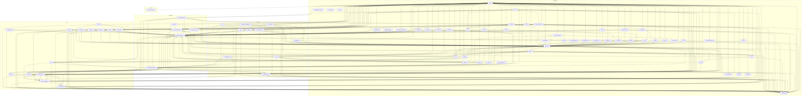

# Codomyrmex System Architecture

This diagram is auto-generated from static import analysis.

```mermaid
graph TD
  subgraph Foundation
    config_management
    environment_setup
    logging_monitoring
    model_context_protocol
    telemetry
    terminal_interface
  end
  subgraph Core
    cache
    coding
    compression
    data_visualization
    documents
    encryption
    git_operations
    llm
    networking
    performance
    scrape
    search
    security
    serialization
  end
  subgraph Service
    api
    auth
    ci_cd_automation
    cloud
    containerization
    database_management
    deployment
    documentation
    logistics
    orchestrator
  end
  subgraph Specialized
    agentic_memory
    agents
    audio
    bio_simulation
    cerebrum
    cli
    collaboration
    concurrency
    crypto
    dark
    defense
    dependency_injection
    edge_computing
    embodiment
    events
    evolutionary_ai
    examples
    exceptions
    feature_flags
    finance
    formal_verification
    fpf
    graph_rag
    ide
    identity
    maintenance
    market
    meme
    model_ops
    module_template
    networks
    physical_management
    plugin_system
    privacy
    prompt_engineering
    quantum
    relations
    simulation
    skills
    spatial
    system_discovery
    templating
    testing
    tests
    tool_use
    utils
    validation
    vector_store
    video
    wallet
    website
  end
  subgraph Other
    pattern_matching
  end

  agentic_memory --> model_context_protocol
  agentic_memory --> validation
  agentic_memory --> vector_store
  agents --> cloud
  agents --> config_management
  agents --> data_visualization
  agents --> documentation
  agents --> events
  agents --> exceptions
  agents --> git_operations
  agents --> ide
  agents --> llm
  agents --> logging_monitoring
  agents --> model_context_protocol
  agents --> performance
  agents --> utils
  agents --> validation
  agents --> website
  api --> config_management
  api --> exceptions
  api --> logging_monitoring
  api --> validation
  audio --> exceptions
  audio --> validation
  auth --> exceptions
  auth --> logging_monitoring
  auth --> validation
  bio_simulation --> data_visualization
  cache --> config_management
  cache --> exceptions
  cache --> logging_monitoring
  cache --> validation
  cerebrum --> exceptions
  cerebrum --> fpf
  cerebrum --> logging_monitoring
  cerebrum --> model_context_protocol
  cerebrum --> validation
  ci_cd_automation --> exceptions
  ci_cd_automation --> logging_monitoring
  ci_cd_automation --> validation
  cli --> agents
  cli --> ci_cd_automation
  cli --> coding
  cli --> data_visualization
  cli --> fpf
  cli --> git_operations
  cli --> logging_monitoring
  cli --> logistics
  cli --> orchestrator
  cli --> performance
  cli --> skills
  cli --> system_discovery
  cli --> terminal_interface
  cloud --> defense
  cloud --> identity
  cloud --> logging_monitoring
  cloud --> model_context_protocol
  cloud --> privacy
  cloud --> validation
  coding --> exceptions
  coding --> logging_monitoring
  coding --> model_context_protocol
  coding --> performance
  coding --> validation
  collaboration --> validation
  compression --> exceptions
  compression --> logging_monitoring
  compression --> validation
  concurrency --> logging_monitoring
  concurrency --> validation
  config_management --> exceptions
  config_management --> logging_monitoring
  config_management --> validation
  containerization --> exceptions
  containerization --> logging_monitoring
  containerization --> model_context_protocol
  containerization --> validation
  crypto --> exceptions
  crypto --> logging_monitoring
  dark --> validation
  data_visualization --> exceptions
  data_visualization --> git_operations
  data_visualization --> logging_monitoring
  data_visualization --> model_context_protocol
  data_visualization --> performance
  database_management --> config_management
  database_management --> exceptions
  database_management --> logging_monitoring
  database_management --> validation
  defense --> logging_monitoring
  deployment --> validation
  documentation --> data_visualization
  documentation --> logging_monitoring
  documentation --> model_context_protocol
  documents --> exceptions
  documents --> logging_monitoring
  documents --> validation
  edge_computing --> validation
  encryption --> exceptions
  encryption --> logging_monitoring
  encryption --> validation
  environment_setup --> logging_monitoring
  environment_setup --> validation
  events --> exceptions
  events --> logging_monitoring
  events --> validation
  evolutionary_ai --> validation
  examples --> agents
  examples --> logging_monitoring
  feature_flags --> validation
  finance --> data_visualization
  formal_verification --> model_context_protocol
  fpf --> cerebrum
  fpf --> logging_monitoring
  fpf --> validation
  git_operations --> data_visualization
  git_operations --> exceptions
  git_operations --> logging_monitoring
  git_operations --> model_context_protocol
  git_operations --> performance
  git_operations --> validation
  graph_rag --> validation
  ide --> agents
  ide --> exceptions
  ide --> logging_monitoring
  ide --> skills
  ide --> validation
  identity --> logging_monitoring
  identity --> validation
  llm --> config_management
  llm --> data_visualization
  llm --> exceptions
  llm --> logging_monitoring
  llm --> model_context_protocol
  llm --> validation
  logging_monitoring --> events
  logging_monitoring --> validation
  logistics --> exceptions
  logistics --> logging_monitoring
  logistics --> model_context_protocol
  logistics --> performance
  logistics --> validation
  maintenance --> logging_monitoring
  market --> logging_monitoring
  market --> validation
  model_context_protocol --> coding
  model_context_protocol --> containerization
  model_context_protocol --> exceptions
  model_context_protocol --> git_operations
  model_context_protocol --> logging_monitoring
  model_context_protocol --> search
  model_context_protocol --> validation
  model_ops --> validation
  module_template --> logging_monitoring
  networking --> exceptions
  networking --> logging_monitoring
  networking --> validation
  networks --> logging_monitoring
  networks --> model_context_protocol
  orchestrator --> ci_cd_automation
  orchestrator --> events
  orchestrator --> exceptions
  orchestrator --> logging_monitoring
  orchestrator --> logistics
  orchestrator --> model_context_protocol
  orchestrator --> utils
  orchestrator --> validation
  performance --> exceptions
  performance --> logging_monitoring
  performance --> validation
  physical_management --> logging_monitoring
  plugin_system --> exceptions
  plugin_system --> logging_monitoring
  plugin_system --> validation
  privacy --> logging_monitoring
  privacy --> validation
  prompt_engineering --> exceptions
  prompt_engineering --> validation
  quantum --> validation
  relations --> data_visualization
  scrape --> exceptions
  scrape --> logging_monitoring
  scrape --> validation
  search --> model_context_protocol
  search --> validation
  security --> data_visualization
  security --> defense
  security --> exceptions
  security --> logging_monitoring
  security --> model_context_protocol
  serialization --> exceptions
  serialization --> logging_monitoring
  serialization --> validation
  simulation --> logging_monitoring
  simulation --> model_context_protocol
  skills --> git_operations
  skills --> logging_monitoring
  skills --> validation
  spatial --> logging_monitoring
  spatial --> validation
  system_discovery --> coding
  system_discovery --> data_visualization
  system_discovery --> environment_setup
  system_discovery --> git_operations
  system_discovery --> logging_monitoring
  system_discovery --> logistics
  system_discovery --> performance
  system_discovery --> security
  system_discovery --> terminal_interface
  system_discovery --> validation
  telemetry --> config_management
  telemetry --> exceptions
  telemetry --> validation
  templating --> exceptions
  templating --> logging_monitoring
  templating --> validation
  terminal_interface --> coding
  terminal_interface --> data_visualization
  terminal_interface --> logging_monitoring
  terminal_interface --> model_context_protocol
  terminal_interface --> system_discovery
  terminal_interface --> validation
  testing --> validation
  tests --> agentic_memory
  tests --> agents
  tests --> api
  tests --> audio
  tests --> auth
  tests --> bio_simulation
  tests --> cache
  tests --> cerebrum
  tests --> ci_cd_automation
  tests --> cli
  tests --> cloud
  tests --> coding
  tests --> collaboration
  tests --> compression
  tests --> concurrency
  tests --> config_management
  tests --> containerization
  tests --> crypto
  tests --> dark
  tests --> data_visualization
  tests --> database_management
  tests --> defense
  tests --> dependency_injection
  tests --> deployment
  tests --> documentation
  tests --> documents
  tests --> edge_computing
  tests --> embodiment
  tests --> encryption
  tests --> environment_setup
  tests --> events
  tests --> evolutionary_ai
  tests --> examples
  tests --> exceptions
  tests --> feature_flags
  tests --> finance
  tests --> formal_verification
  tests --> fpf
  tests --> git_operations
  tests --> graph_rag
  tests --> ide
  tests --> identity
  tests --> llm
  tests --> logging_monitoring
  tests --> logistics
  tests --> maintenance
  tests --> market
  tests --> meme
  tests --> model_context_protocol
  tests --> model_ops
  tests --> networking
  tests --> networks
  tests --> orchestrator
  tests --> pattern_matching
  tests --> performance
  tests --> physical_management
  tests --> plugin_system
  tests --> privacy
  tests --> prompt_engineering
  tests --> quantum
  tests --> relations
  tests --> scrape
  tests --> search
  tests --> security
  tests --> serialization
  tests --> simulation
  tests --> skills
  tests --> spatial
  tests --> system_discovery
  tests --> telemetry
  tests --> templating
  tests --> terminal_interface
  tests --> testing
  tests --> tool_use
  tests --> utils
  tests --> validation
  tests --> vector_store
  tests --> video
  tests --> wallet
  tests --> website
  tool_use --> validation
  utils --> logging_monitoring
  utils --> validation
  validation --> agents
  validation --> exceptions
  validation --> logging_monitoring
  validation --> utils
  vector_store --> validation
  video --> exceptions
  video --> validation
  wallet --> encryption
  wallet --> exceptions
  wallet --> logging_monitoring
  wallet --> validation
  website --> agents
  website --> config_management
  website --> llm
  website --> logging_monitoring
  website --> validation
```
