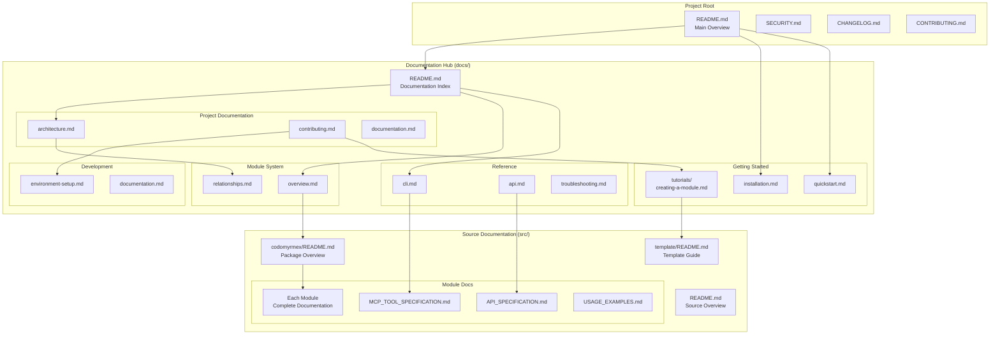

# Codomyrmex Documentation

Welcome to the **Codomyrmex** project documentation! This directory contains all documentation about the Codomyrmex project itself.

## 🎯 Important Distinction

This `docs/` folder contains documentation **about** Codomyrmex as a project:
- How to use Codomyrmex
- How to contribute to Codomyrmex  
- Architecture and design decisions
- Project governance and policies

**Not to be confused with** `src/codomyrmex/documentation/` which is a **module** that provides documentation generation capabilities for other projects.

## 📁 Structure

```
docs/
├── README.md                 # This file - overview of documentation
├── project/                  # Project-level documentation
│   ├── architecture.md       # System architecture and design
│   ├── contributing.md       # How to contribute to Codomyrmex
│   ├── governance.md         # Project governance and policies
│   └── roadmap.md            # Future plans and development roadmap
├── getting-started/          # User onboarding documentation
│   ├── installation.md       # Installation and setup guides
│   ├── quickstart.md         # Quick start tutorial
│   └── tutorials/            # Step-by-step tutorials
├── modules/                  # Documentation about individual modules
│   ├── overview.md           # Module system overview
│   └── relationships.md      # Inter-module dependencies and data flow
├── development/              # Developer documentation
│   ├── environment-setup.md  # Development environment setup
│   ├── testing.md           # Testing strategies and guidelines  
│   ├── documentation.md     # Documentation guidelines
│   └── release-process.md   # Release and deployment processes
└── reference/               # Reference materials
    ├── troubleshooting.md   # Comprehensive troubleshooting guide
    ├── cli.md               # CLI command reference
    └── api.md               # Complete API reference index
```

## 📊 Documentation Structure



## 🚀 Quick Navigation

### For Users
- **[🏁 Getting Started](getting-started/installation.md)** - Install and set up Codomyrmex
- **[⚡ Quick Start](getting-started/quickstart.md)** - Try Codomyrmex in 5 minutes  
- **[📖 Tutorials](getting-started/tutorials/)** - Step-by-step guides
- **[🔍 Troubleshooting](reference/troubleshooting.md)** - Common issues and solutions

### For Contributors  
- **[🤝 Contributing Guide](project/contributing.md)** - How to contribute to the project
- **[🏗️ Architecture](project/architecture.md)** - Understanding the system design
- **[🔧 Development Setup](development/environment-setup.md)** - Set up your dev environment
- **[📚 Documentation Guidelines](development/documentation.md)** - Writing and maintaining docs

### For Module Developers
- **[📦 Module System](modules/overview.md)** - How modules work together
- **[🔗 Module Relationships](modules/relationships.md)** - Dependencies and data flow
- **[🎓 Module Creation Tutorial](getting-started/tutorials/creating-a-module.md)** - Build your own module

### For API Users
- **[🔌 Complete API Reference](reference/api-complete.md)** - **ACCURATE** API with real function signatures and examples
- **[📖 API Index](reference/api.md)** - Quick API overview with links to complete documentation
- **[⌨️ CLI Reference](reference/cli.md)** - Complete command-line documentation
- **[📋 Source Navigation](../src/README.md)** - Source code organization

## 💡 About This Documentation

This documentation follows these principles:

1. **Separation of Concerns**: Documentation **about** Codomyrmex is here. Documentation **generated by** Codomyrmex is elsewhere.

2. **User-Centric**: Organized by what users want to accomplish, not by internal code structure.

3. **Comprehensive but Navigable**: Complete information that's easy to find and consume.

4. **Living Documentation**: Kept up-to-date with the codebase and project evolution.

## 🛠️ Maintaining This Documentation

- Documentation lives in Markdown files for easy editing and version control
- Follow the [Documentation Guidelines](development/documentation.md) when contributing
- Use relative links when referencing other documentation files
- Keep the structure flat and intuitive - avoid deep nesting

---

**Need help?** Check out our [Contributing Guide](project/contributing.md) or [open an issue](https://github.com/codomyrmex/codomyrmex/issues).

