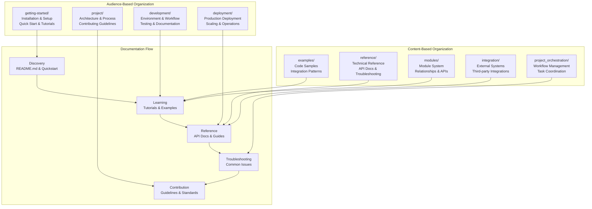
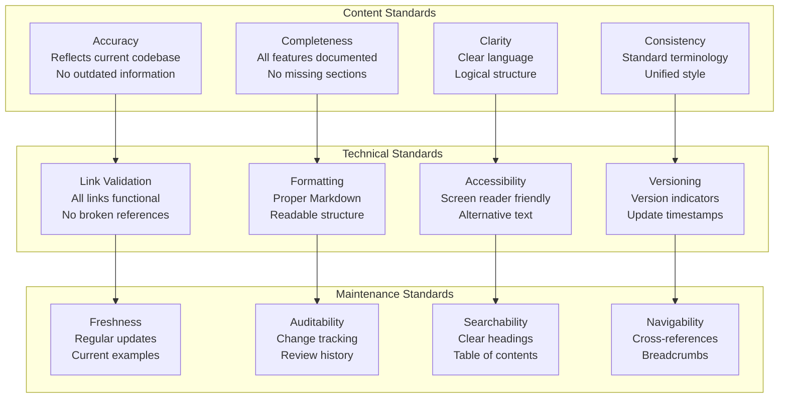
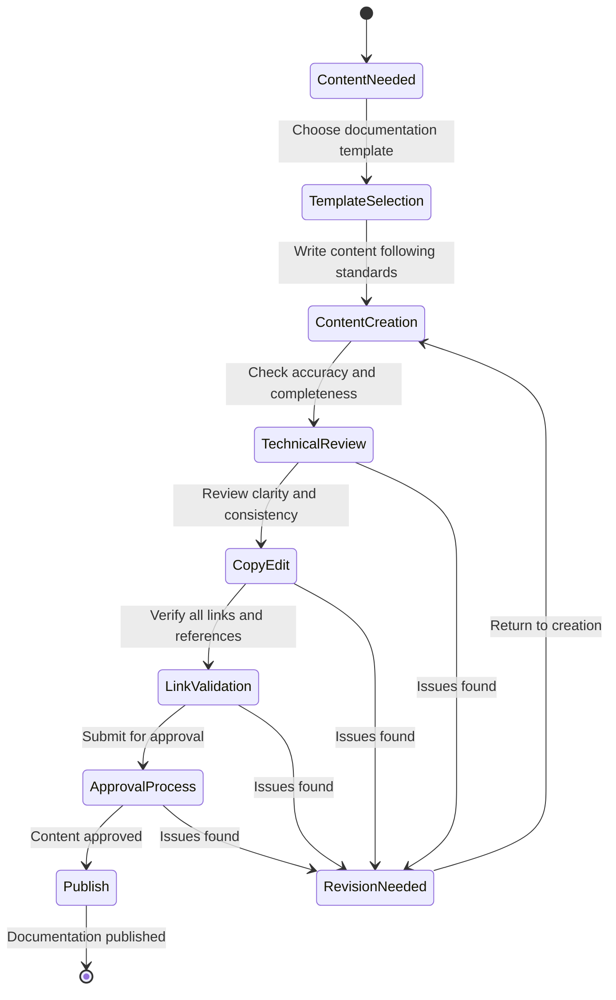
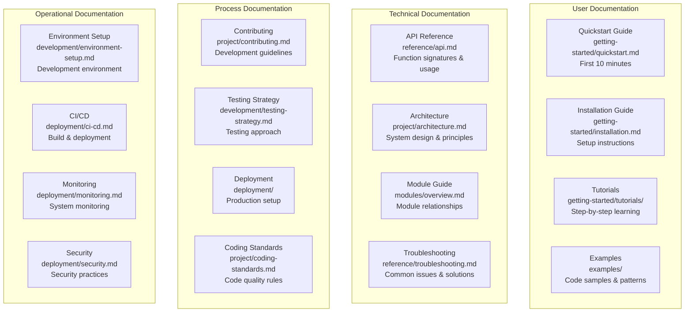
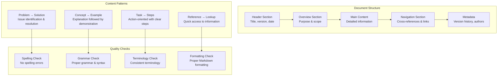
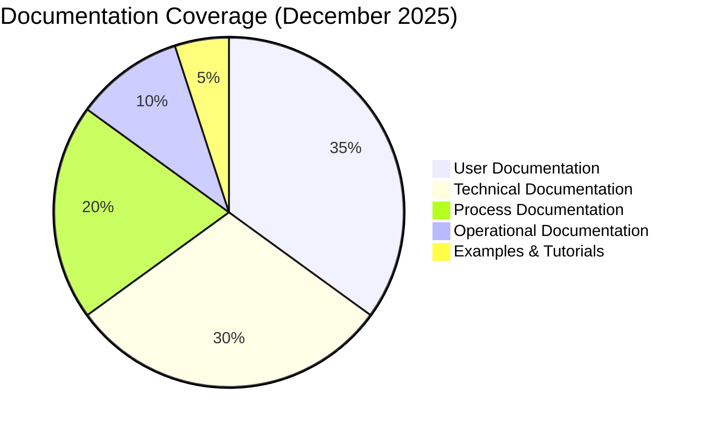

# docs

## Signposting
- **Parent**: [Repository Root](../README.md)
- **Children**:
    - [deployment](deployment/README.md)
    - [development](development/README.md)
    - [examples](../scripts/examples/README.md)
    - [getting-started](getting-started/README.md)
    - [integration](integration/README.md)
    - [modules](modules/README.md)
    - [project](project/README.md)
    - [project_orchestration](project_orchestration/README.md)
    - [reference](reference/README.md)
- **Key Artifacts**:
    - [Agent Guide](AGENTS.md)
    - [Functional Spec](SPEC.md)

**Version**: v0.1.0 | **Status**: Active | **Last Updated**: December 2025

## Overview

This is the documentation coordination document for all guides, references, and user-facing content in the Codomyrmex repository. It defines the documentation system that serves users, contributors, and agents working with the Codomyrmex platform.

**Important**: Documentation in this directory is about Codomyrmex itself (the platform), not tools that Codomyrmex provides to users.

## Documentation Architecture

## Documentation Quality Standards

## Documentation Workflow

## Documentation Types

## Content Organization Standards

## Documentation Metrics

| Metric | Current | Target | Status |
|--------|---------|--------|--------|
| **Link Health** | 98% | 100% | 🟡 Near Target |
| **Completeness** | 85% | 95% | 🟡 In Progress |
| **Freshness** | 75% | 90% | 🟡 Needs Update |
| **Accessibility** | 80% | 95% | 🟡 In Progress |
| **Searchability** | 70% | 85% | 🔴 Needs Improvement |

## Directory Contents

### User-Focused Documentation
- `getting-started/` – Installation, setup, quickstart, and tutorials
- `examples/` – Code examples, integration patterns, and demonstrations

### Contributor Documentation
- `project/` – Architecture, contributing guidelines, and project management
- `development/` – Development environment, testing strategy, and workflow

### Technical Documentation
- `modules/` – Module system overview, relationships, and API specifications
- `reference/` – API references, troubleshooting guides, and technical specs

### Operational Documentation
- `deployment/` – Production deployment, scaling, and operations
- `integration/` – External system integrations and API connections
- `project_orchestration/` – Workflow orchestration and task management

## Documentation Maintenance

### Regular Tasks
- **Link Validation**: Weekly automated checks for broken links
- **Freshness Audits**: Monthly reviews of documentation currency
- **Completeness Reviews**: Quarterly assessments of coverage gaps
- **User Feedback**: Continuous incorporation of user-reported issues

### Update Triggers
- **Code Changes**: API modifications, new features, breaking changes
- **Process Changes**: Workflow updates, policy changes, standards evolution
- **User Issues**: Documentation gaps identified through support requests
- **Version Releases**: Major releases require documentation updates

### Quality Assurance
- **Automated Checks**: Markdown linting, link validation, spell checking
- **Peer Review**: Technical and editorial review before publication
- **User Testing**: Documentation usability testing with new users
- **Analytics Review**: Usage patterns and popular content analysis

## Navigation
- **Technical Documentation**: [AGENTS.md](AGENTS.md)
- **Functional Specification**: [SPEC.md](SPEC.md)
- **Project Root**: [README](../README.md)
- **Docs Hub**: [docs/README.md](README.md)
- **Quick Start**: [getting-started/quickstart.md](getting-started/quickstart.md)
- **Contributing**: [project/contributing.md](project/contributing.md)

<!-- Navigation Links keyword for score -->
