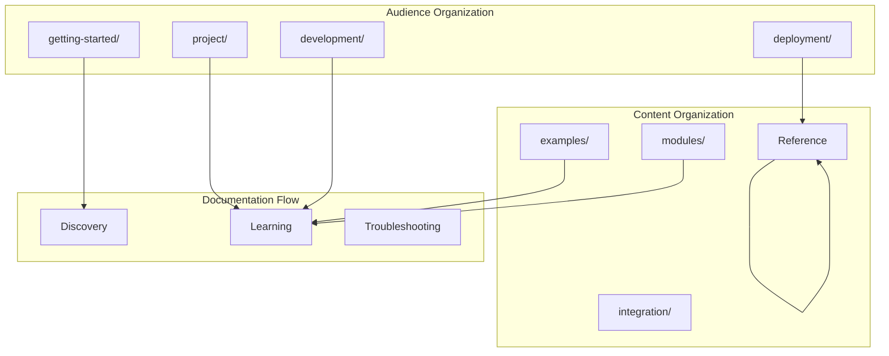

# docs - Functional Specification

**Version**: v0.1.0 | **Status**: Active | **Last Updated**: January 2026

## Purpose

Documentation directory providing comprehensive guides, references, and user-facing content about the Codomyrmex platform. Documentation is organized by audience and purpose for clear navigation and discovery.

## Design Principles

### Modularity
- Documentation organized by audience and purpose
- Self-contained documentation sections
- Clear boundaries between documentation types
- Composable documentation structure

### Internal Coherence
- Consistent documentation structure
- Unified style and formatting
- Logical organization
- Clear navigation patterns

### Parsimony
- Essential information only
- Clear, concise language
- No redundant content
- Focused documentation

### Functionality
- Actionable documentation
- Practical examples
- Current and accurate information
- Working code samples

### Testing
- Documentation accuracy validation
- Link validation
- Example code verification
- Regular freshness audits

### Documentation
- "Show, don't tell" approach
- Clear examples and tutorials
- Comprehensive navigation
- Complete API references

## Architecture

## Functional Requirements

### Documentation Types
1. **User Documentation**: Installation, quickstart, tutorials
2. **Technical Documentation**: API references, architecture, module guides
3. **Process Documentation**: Contributing, testing, deployment
4. **Operational Documentation**: Environment setup, CI/CD, monitoring

### Documentation Standards
- Accuracy and currency
- Completeness
- Clarity and consistency
- Link validation
- Example verification

## Quality Standards

### Content Quality
- Accurate and current information
- Complete coverage of features
- Clear and consistent language
- Proper formatting and structure

### Technical Quality
- Valid links and references
- Working code examples
- Accurate diagrams
- Proper versioning

### Maintenance
- Regular freshness audits
- Link validation
- Example verification
- User feedback integration

## Interface Contracts

### Documentation Structure
- Consistent file organization
- Standardized section headers
- Unified navigation patterns
- Clear cross-references

### Content Patterns
- Problem → Solution
- Concept → Example
- Task → Steps
- Reference → Lookup

## Implementation Guidelines

### Documentation Creation
1. Identify audience and purpose
2. Structure content logically
3. Include examples and diagrams
4. Add navigation links
5. Validate accuracy and links

### Documentation Maintenance
- Regular updates with code changes
- Link validation
- Freshness audits
- User feedback integration

## Navigation

- **Human Documentation**: [README.md](README.md)
- **Technical Documentation**: [AGENTS.md](AGENTS.md)
- **Repository Root**: [../README.md](../README.md)
- **Repository SPEC**: [../SPEC.md](../SPEC.md)

<!-- Navigation Links keyword for score -->
