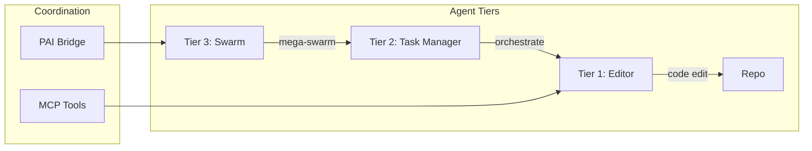

# Agent Documentation

**Version**: v1.1.9 | **Status**: Active | **Last Updated**: March 2026

## Overview

Agent rules, coordination directives, and governance for autonomous agents operating within the Codomyrmex ecosystem. This directory defines how AI agents should interact with, modify, and reason about the codebase.

## Agent Framework

Codomyrmex supports **13 agent providers** through a unified LLM client factory:

| Provider | Description |
|----------|-------------|
| OpenAI | GPT-4, GPT-4o via API |
| Anthropic | Claude 3.5/4 via API |
| Google | Gemini Pro/Flash/2.5 |
| OpenRouter | 200+ models, free tier included |
| Ollama | Local inference (Llama, Mistral, etc.) |
| Azure OpenAI | Enterprise Azure deployments |
| AWS Bedrock | Amazon-managed LLM APIs |
| Cohere | Command R+ and Embeddings |
| Groq | Ultra-fast inference |
| Cerebras | Hardware-accelerated LLMs |
| Custom | User-defined client implementations |

## Contents

| File | Description |
|------|-------------|
| [rules/](rules/) | General agent operating rules |
| [rules/general.md](rules/general.md) | Core behavioral guidelines |
| [AGENTS.md](AGENTS.md) | Agent coordination for this directory |
| [SPEC.md](SPEC.md) | Functional specification |
| [PAI.md](PAI.md) | PAI integration for agents |

## Core Principles

1. **Zero-Mock Policy**: All tests use real functional verification — never mocks or stubs
2. **RASP Compliance**: Every directory maintains README.md, AGENTS.md, SPEC.md, PAI.md
3. **Functional Integrity**: All agent-generated code must be production-ready
4. **Documentation Sync**: Docs must stay synchronized with actual code
5. **InMemory Pattern**: Test doubles use concrete `InMemory*` implementations, not mocks

## Agent Operating Modes

## Related Documentation

- [Main AGENTS.md](../AGENTS.md) — Top-level agent coordination
- [Root AGENTS.md](../../AGENTS.md) — Repository-level agent rules
- [Agent Module](../../src/codomyrmex/agents/) — Agent implementations
- [Skills](../skills/) — Skill system docs
- [PAI](../pai/) — Personal AI infrastructure

## Navigation

- **Parent**: [docs/](../README.md)
- **Root**: [Project Root](../../README.md)
