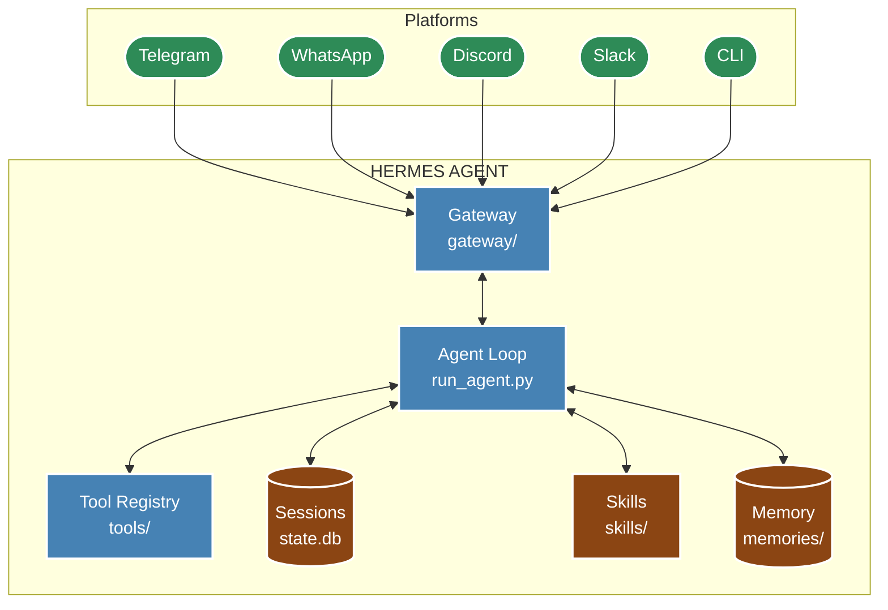

# Hermes Architecture

**Version**: v0.2.0 | **Last Updated**: March 2026

## Overview

Hermes employs a modular architecture centered on a core agent loop that integrates large language models with tools, memory, and multi-platform gateways. The system is designed around self-improvement: extracting skills from interactions, recalling context across sessions, and adapting to user patterns.

## Component Diagram



## Core Agent Loop

The agent loop in `run_agent.py` (`AIAgent._run_agent_loop()`) orchestrates the conversation cycle:

1. **Prompt Building** — `prompt_builder.py` assembles the system prompt from personality, skills, memory context, and session history
2. **LLM Inference** — Sends the assembled prompt to the configured model via OpenRouter or direct provider
3. **Tool Dispatch** — Parses tool calls from the model response and executes them via `registry.py`
4. **Result Integration** — Tool results are added back to the message history
5. **Compression Check** — If approaching context limits, `context_compressor.py` summarizes the conversation
6. **Persistence** — State saved to `state.db` and session JSON files

### Structured Reasoning

Hermes uses XML-tagged structured outputs for transparent reasoning:

- `<SCRATCHPAD>` — Working memory for multi-step reasoning
- `<INNER_MONOLOGUE>` — Internal reflection (not shown to user)
- `<PLAN>` — Step-labeled action plans
- `<tool_call>` / `<tool_response>` — Tool calling protocol

## Key Implementation Files

| File                          | Purpose                                 |
| :---------------------------- | :-------------------------------------- |
| `hermes_cli/config.py`        | HERMES_HOME resolution, config loading  |
| `hermes_cli/main.py`          | CLI entrypoint                          |
| `gateway/run.py`              | `GatewayRunner` — multi-platform daemon |
| `gateway/session.py`          | Session routing and context management  |
| `agent/run_agent.py`          | Core `AIAgent` conversation loop        |
| `agent/prompt_builder.py`     | System prompt assembly                  |
| `agent/context_compressor.py` | LLM-based context summarization         |
| `tools/registry.py`           | Central tool schema/handler registry    |
| `hermes_state.py`             | SQLite + FTS5 state persistence         |

## HERMES_HOME Resolution

The critical path for config resolution is in `hermes_cli/config.py` line 37:

```python
return Path(os.getenv("HERMES_HOME", Path.home() / ".hermes"))
```

This single line determines where **all** data is read from: `.env`, `config.yaml`, `state.db`, `sessions/`, `skills/`, `memories/`, `logs/`, and `gateway.pid`.

## Deployment Backends

Hermes supports 6 execution backends for tool commands:

| Backend         | Use Case                            |
| :-------------- | :---------------------------------- |
| **local**       | Direct terminal execution (default) |
| **Docker**      | Isolated container execution        |
| **SSH**         | Remote server execution             |
| **Daytona**     | Serverless with hibernation         |
| **Singularity** | HPC/research environments           |
| **Modal**       | Cloud-native serverless             |

## Related Documents

- [Gateway System](gateway.md) — Platform-specific routing
- [Sessions](sessions.md) — State persistence and compression
- [Tools](tools.md) — Tool registry and categories
- [Configuration](configuration.md) — `config.yaml` reference
