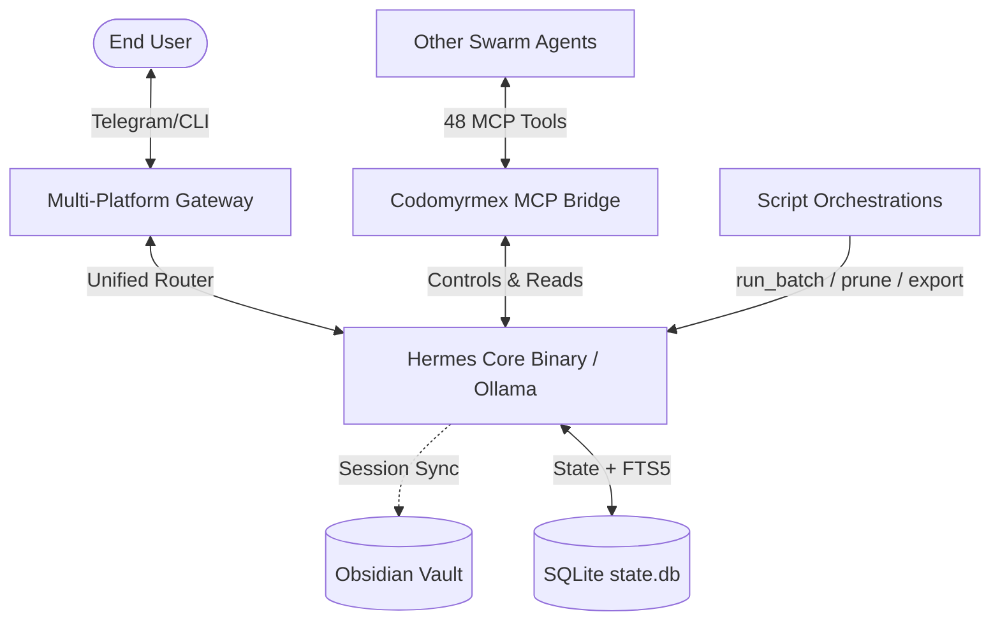
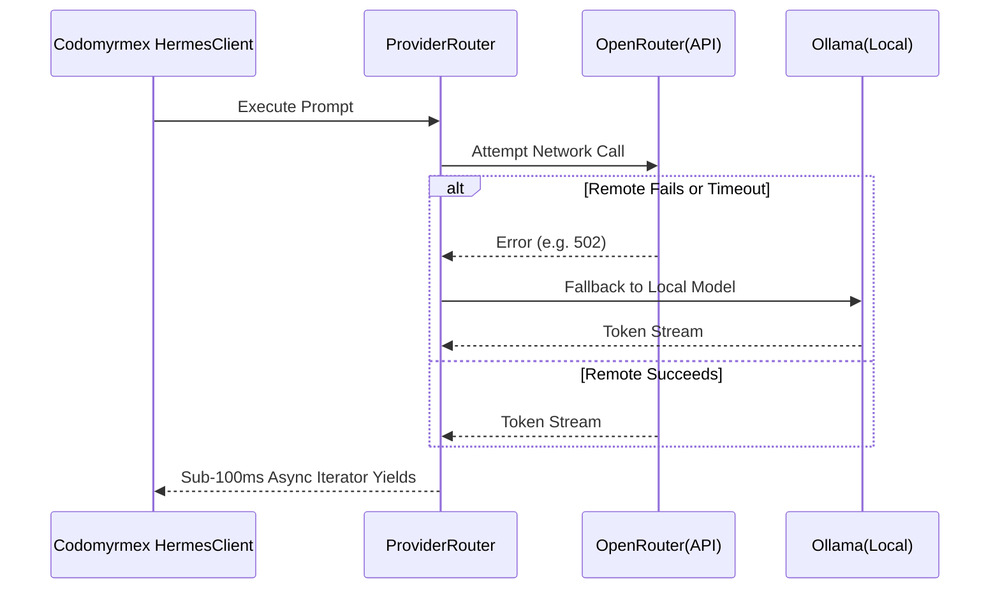
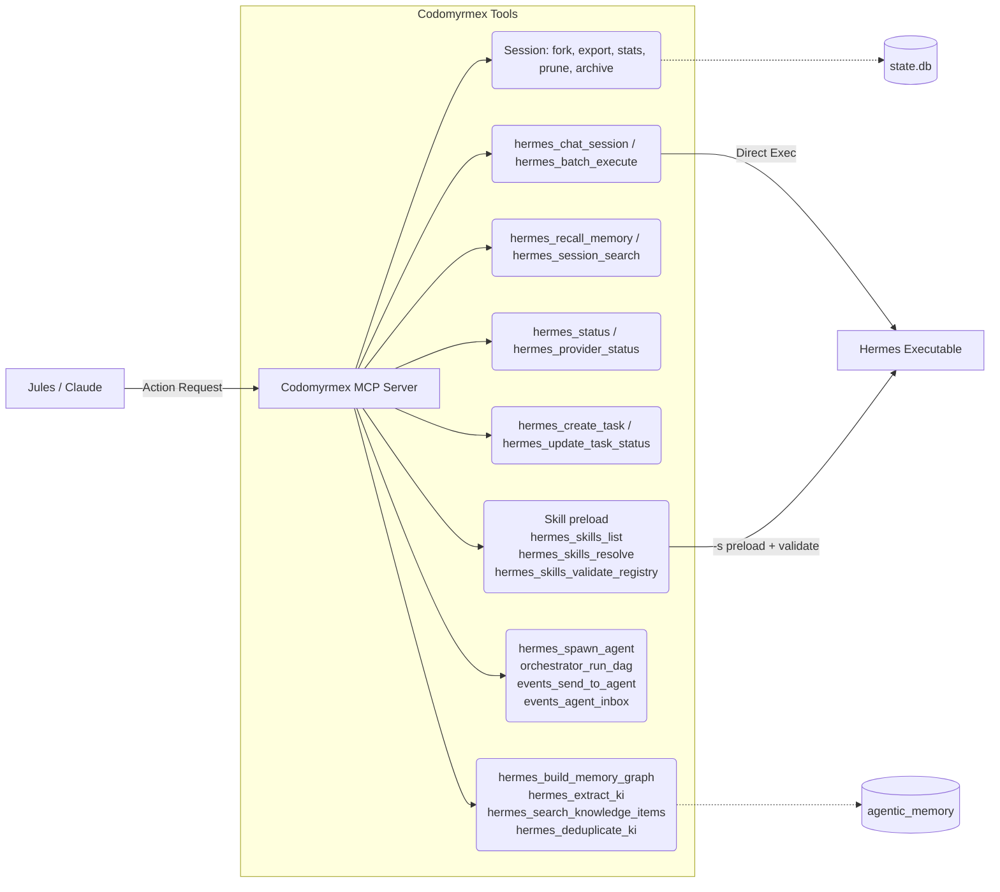
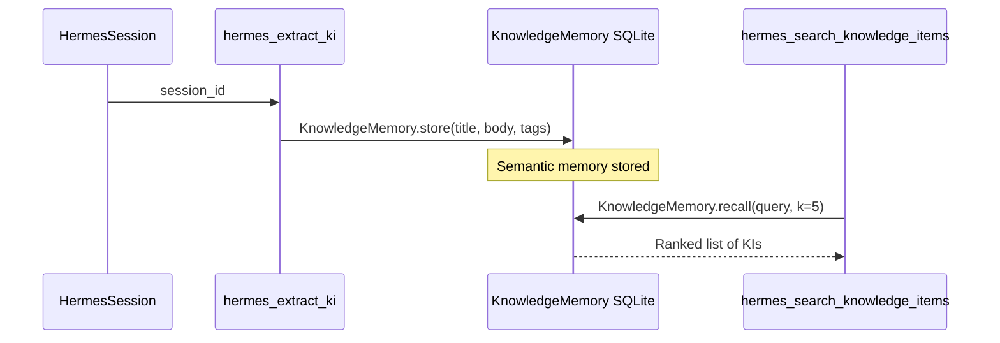
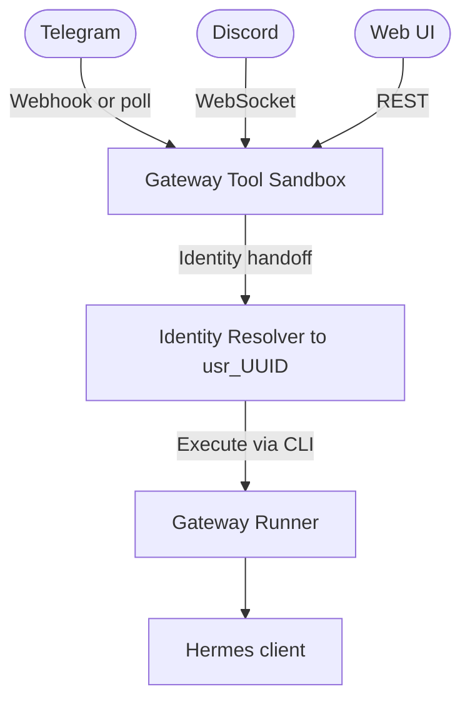
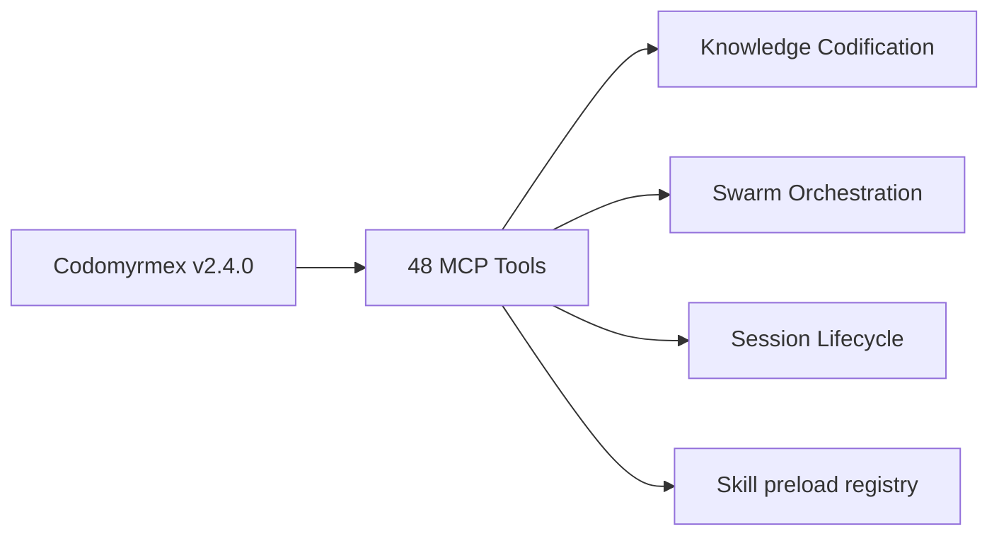

# Codomyrmex Integration: Supercharging the Hermes Agent

**Target Audience**: The Hermes Open Source Community
**Status**: Active | **Version**: v2.4.0 | **Last Updated**: March 2026 (Sprint 34)



The baseline [Hermes Agent](https://github.com/NousResearch/hermes-agent) provides an incredible foundation for autonomous skill creation and dialectic user modeling. However, deploying Hermes in a production-ready, multi-layered agentic swarm requires deep systemic integrations.

The **Codomyrmex repository** wraps the core Hermes binaries (`hermes` CLI and `ollama` fallbacks) into a highly resilient, stateful, and provider-agnostic bridge. This document serves as a comprehensive deep-dive into the **bidirectional interfaces** between Codomyrmex and Hermes, detailing exactly how the repo augments baseline agent functionality.

---

## 🏗️ 1. The Dual-Backend Execution Engine

At the core of the bridge is the `HermesClient`, which dynamically wraps the underlying CLI subprocesses to provide a unified programmatic interface while preserving local execution benefits.



### Dual-Backend Augmentations

- **Unified Provider Routing**: The `ProviderRouter` automatically cascades through credentials (environment → `.env` → auto-discovery) across 6+ different providers, never failing silently.
- **Copilot ACP Backend (v0.3.0)**: `CopilotACPClient` bridges Hermes to GitHub Copilot via `copilot --acp --stdio` (JSON-RPC 2.0). Uses your existing GitHub Copilot subscription — no additional API cost. Note: structured tool calls are not supported; complex agentic tasks should use OpenRouter instead.
- **Context Compression**: Built-in `ContextCompressor` actively monitors context windows. If a session approaches token limits (e.g., >100K tokens), it progressively applies deduplication, older-turn summarization, and deep truncation.
- **Streaming Token Yields**: Codomyrmex dismantles block-generation latency spikes for long conversational outputs by mapping subprocess async generators. It yields sub-100ms async iterator bytes dynamically pushing token output fragments down the routing chains.
- **Batch Execution** *(v1.5.x)*: `HermesClient.batch_execute(prompts, parallel=False)` processes a list of prompts sequentially or via `ThreadPoolExecutor`. Results are returned as a structured list with per-prompt status and content, ideal for automated evaluation or bulk processing.

```python
from codomyrmex.agents.hermes.hermes_client import HermesClient

client = HermesClient()
results = client.batch_execute(
    ["Summarize this module.", "List all tests."],
    parallel=True,
)
# results = [{"prompt": ..., "status": "success", "content": ..., "error": None}, ...]
```

**Deep Links**:

- 🔗 **Client Engine**: [`src/codomyrmex/agents/hermes/hermes_client.py`](../../../src/codomyrmex/agents/hermes/hermes_client.py)
- 🔗 **Provider Router**: [`src/codomyrmex/agents/hermes/_provider_router.py`](../../../src/codomyrmex/agents/hermes/_provider_router.py)

---

## 🧠 2. Deep Session Persistence & Memory (v1.5.x+)

Hermes natively supports sessions, but Codomyrmex elevates this into a globally available, searchable graph of memory with rich lifecycle management.

### Persistence Augmentations

- **SQLite Session Persistence**: `SQLiteSessionStore` maintains append-only message sequences with full FTS5 search capabilities. This enables background agents to query past Hermes sessions for context.
- **Agentic Long-Term Memory (v1.5.5)**: Codomyrmex tightly integrates Hermes sessions directly into local **Obsidian Vaults**. When a session concludes, insights are extracted and mapped into local markdown graphs for permanent, searchable retrieval.
- **Session Forking** *(v1.5.x)*: Sessions can be independently forked into child sessions (`HermesSession.fork()`), allowing parallel conversation branches without losing parent context.
- **Markdown Export** *(v1.5.x)*: Any session can be exported as human-readable Markdown (`export_session_markdown`), useful for archiving, sharing, or cross-agent context injection.
- **System Prompt Management** *(v1.5.x)*: A persistent system message can be prepended or replaced in any session (`set_system_prompt`), ensuring agent behaviour remains consistent across multi-turn interactions.
- **Session Statistics** *(v1.5.x)*: `get_session_stats()` returns `session_count`, `db_size_bytes`, and timestamp bounds — enabling dashboard-style monitoring.
- **Session Pruning** *(v1.5.x)*: `prune_old_sessions(days_old)` archives sessions to gzip-compressed JSON and removes them from the DB, keeping the session store lean.

```python
from codomyrmex.agents.hermes.hermes_client import HermesClient

client = HermesClient()

# Fork an existing session for an experiment
child = client.fork_session("parent-session-id", new_name="experiment-a")

# Export a session for archival
md = client.export_session_markdown("session-id")

# Get DB health metrics
stats = client.get_session_stats()
# {"session_count": 42, "db_size_bytes": 819200, ...}

# Set a persistent instruction
client.set_system_prompt("session-id", "You are an expert Python reviewer.")
```

**Deep Links**:

- 🔗 **Session Store**: [`src/codomyrmex/agents/hermes/session.py`](../../../src/codomyrmex/agents/hermes/session.py)
- 🔗 **Session Extended Tests**: [`src/codomyrmex/tests/integration/hermes/test_gateway_session_extended.py`](../../../src/codomyrmex/tests/integration/hermes/test_gateway_session_extended.py)
- 🔗 **Vault Integration Tests**: [`src/codomyrmex/tests/integration/hermes/test_gateway_obsidian_sync.py`](../../../src/codomyrmex/tests/integration/hermes/test_gateway_obsidian_sync.py)

---

## 🧩 3. 48 Model Context Protocol (MCP) Tools

Codomyrmex binds Hermes into the broader swarm ecosystem by actively exposing over **980 dynamically discovered native MCP tools** (including the 48 core tools inside [`mcp_tools.py`](../../../src/codomyrmex/agents/hermes/mcp_tools.py)). This allows other agents (like Claude or Jules) to spin up Hermes instances, query its status, fork sessions, read its memory, extract knowledge items, and participate in multi-agent swarms transparently with access to the entire Codomyrmex super-repo capability set.



### Key Tool Groups

| Group | Representative Tools |
| :---- | :------------------- |
| **Session Lifecycle** | `hermes_session_stats`, `hermes_session_fork`, `hermes_session_export_md`, `hermes_session_detail`, `hermes_prune_sessions`, `hermes_archive_sessions` |
| **Execution** | `hermes_execute`, `hermes_stream`, `hermes_chat_session`, `hermes_batch_execute` |
| **Memory & FTS5** | `hermes_recall_memory` (BM25), `hermes_session_search`, `hermes_set_system_prompt` |
| **Knowledge Codification** *(Sprint 34)* | `hermes_build_memory_graph`, `hermes_extract_ki`, `hermes_search_knowledge_items`, `hermes_deduplicate_ki` |
| **Swarm Orchestration** *(Sprint 34)* | `hermes_spawn_agent`, `orchestrator_run_dag`, `events_send_to_agent`, `events_agent_inbox` |
| **Diagnostics** | `hermes_status`, `hermes_provider_status`, `hermes_doctor`, `hermes_version`, `hermes_system_health` |
| **Workflow** | `hermes_create_task`, `hermes_update_task_status`, `hermes_delegate_task` |
| **Utilities** | `hermes_read_log_chunk`, `hermes_parse_canvas`, `hermes_search_vault`, `hermes_honcho_status` |
| **Skill preload** | `hermes_skills_list`, `hermes_skills_resolve`, `hermes_skills_validate_registry` |

### FastMCP Scaffolding (v0.4.0)

With the v0.4.0 release, Hermes now ships with built-in FastMCP scaffolding (`optional-skills/mcp/fastmcp/scaffold_fastmcp.py`).
For Codomyrmex developers creating new skills or adapting internal modules, this is the recommended path for exposing Codomyrmex tools to Hermes seamlessly using standard Model Context Protocol.

**Deep Links**:

- 🔗 **MCP Protocol Bridge**: [`src/codomyrmex/agents/hermes/mcp_tools.py`](../../../src/codomyrmex/agents/hermes/mcp_tools.py)
- 🔗 **FastMCP Scaffold MCP Tool**: `hermes_fastmcp_scaffold(output_dir, server_name, force=False)`
- 🔗 **New MCP Tool Tests**: [`src/codomyrmex/tests/integration/hermes/test_gateway_mcp_new_tools.py`](../../../src/codomyrmex/tests/integration/hermes/test_gateway_mcp_new_tools.py)

---

## 🧠 3a. Knowledge Codification Tools *(Sprint 34 — v1.4.0)*

Hermes sessions now automatically feed a persistent **Knowledge Item** (KI) database. KIs are structured memory entries (title, tags, body, source session) that agents can recall, search, and deduplicate, forming a self-tending knowledge graph.



### Knowledge Tool Usage

```python
# Extract KI from a completed coding session
result = hermes_extract_ki(session_id="sess-abc", title="OAuth2 Pattern")
# → {"status": "success", "ki_id": "mem-xyz", "title": "OAuth2 Pattern"}

# Search the knowledge base
hits = hermes_search_knowledge_items(topic="OAuth2 refresh token", limit=3)
# → {"status": "success", "results": [{"title": ..., "snippet": ..., "score": 0.84}]}

# Keep the KB clean
merged = hermes_deduplicate_ki(threshold=0.85)
# → {"status": "success", "merged_count": 2}

# Build a concept graph from WikiLink references
graph = hermes_build_memory_graph()
# → {"nodes": ["BM25", "FTS5", "OAuth2"], "edges": [{"from": "BM25", "to": "FTS5", "weight": 3}]}
```

---

## 🐝 3b. Swarm Orchestration Tools *(Sprint 34 — v1.5.0)*

Hermes can now participate in and coordinate multi-agent swarms through four new interfaces:

| Tool | Topology | Description |
| :--- | :--- | :--- |
| `hermes_spawn_agent` | Dynamic | Route a task to a capability-matched agent role |
| `orchestrator_run_dag` | Fan-Out / Fan-In / Pipeline / Broadcast | Dispatch parallel agent tasks |
| `events_send_to_agent` | P2P | Send a direct message to any agent's inbox |
| `events_agent_inbox` | P2P | Read or drain an agent's message inbox |

> **Concurrency Safety**: As of v0.4.0, the underlying Hermes gateway enforces strict **Session Race Guards**. If multiple Codomyrmex swarm modules invoke actions against the identical Hermes session ID at the same microsecond snippet, the Sentinel Guard prevents duplicate prompt ingestion. This ensures parallel fan-out swarms remain idempotent and safe when crossing the gateway boundaries simultaneously.

```python
# Spawn a specialist agent by capability role
result = hermes_spawn_agent(
    role="code_reviewer",
    task="Review the OAuth2 implementation in hermes_client.py.",
    capability_profile={"code_reviewer": ["read_", "run_test"]},
)

# Fan-out a batch of analyses then fan-in results
dag_result = orchestrator_run_dag(
    topology="fan_out",
    tasks=[
        {"task_id": "a1", "fn": "codomyrmex.static_analysis.analyze_file", "args": ["src/x.py"]},
        {"task_id": "a2", "fn": "codomyrmex.static_analysis.analyze_file", "args": ["src/y.py"]},
    ],
)

# Send a message to a peer agent
events_send_to_agent(agent_id="summariser", message={"report": dag_result})

# Collect the reply
inbox = events_agent_inbox(agent_id="orchestrator", mode="drain")
```

**Deep Links**:

- 🔗 **SwarmTopology**: [`src/codomyrmex/orchestrator/swarm_topology.py`](../../../src/codomyrmex/orchestrator/swarm_topology.py)
- 🔗 **IntegrationBus P2P**: [`src/codomyrmex/events/integration_bus.py`](../../../src/codomyrmex/events/integration_bus.py)

---

## 🎯 3c. Unified Hermes skill preload (Codomyrmex)

Separate from Hermes’s in-process **tool** registry (`tools/registry.py`), Codomyrmex maintains a **skill id → Hermes preload name** registry (bundled YAML + optional `CODOMYRMEX_SKILLS_REGISTRY` overlay) and optional per-repo **`.codomyrmex/hermes_skills_profile.yaml`**. `HermesClient` merges skill names for each CLI turn in a fixed order and passes them to `hermes chat -s`.

Authoritative detail — merge order, `HermesClient` config keys, session metadata (`metadata.hermes_skills`), MCP parameters, and PAI workflow hooks:

- [skills.md](skills.md) — full specification
- [environment.md](environment.md) — `CODOMYRMEX_SKILLS_REGISTRY`
- [configuration.md](configuration.md) — Hermes `config.yaml` vs Codomyrmex client keys (cross-reference)

**MCP**: `hermes_skills_resolve`, `hermes_skills_validate_registry` (plus `hermes_skills_list` wrapping `hermes skills list` when the CLI is available).

---

## 🤖 4. Autonomous Task Orchestration (v1.5.6)

A major interface addition is the native ability for Hermes to act autonomously over long stretches of time without immediately ejecting control back to the user interface.

### Gateway Augmentations

- **Internal TaskScheduler**: The system prompt is dynamically updated to allow Hermes to break complex instructions into explicit checklists stored within `session.metadata`.
- **Workflow Mapping**: The `chat_session` command is wrapped in an autonomous background `while` loop. Hermes continuously uses tools (like `hermes_create_task` and `hermes_update_task_status`) and feeds the results back into its own loop until all tasks are marked complete or a `max_turns` boundary is hit.

**Deep Links**:

- 🔗 **Autonomous Loop Logic**: [`hermes_client.py` — `chat_session` autonomous loop](../../../src/codomyrmex/agents/hermes/hermes_client.py#L751-L911)
- 🔗 **Task Integration Tests**: [`src/codomyrmex/tests/integration/hermes/test_gateway_workflow_loop.py`](../../../src/codomyrmex/tests/integration/hermes/test_gateway_workflow_loop.py)

---

## 📜 5. Script Orchestrations (v1.5.x+)

Three new standalone CLI scripts provide direct session management capabilities without requiring a running gateway:

| Script | Description |
| :----- | :---------- |
| `run_batch.py` | Read prompts from a file/stdin, submit to Hermes, write JSON results |
| `run_session_export.py` | List sessions, export one or all sessions to Markdown files |
| `run_prune.py` | Archive and delete sessions older than N days (with dry-run mode) |

```bash
# Batch execute prompts from a file
uv run python -m codomyrmex.agents.hermes.scripts.run_batch \
    --file prompts.txt --parallel --backend ollama

# Export all sessions to markdown folder
uv run python -m codomyrmex.agents.hermes.scripts.run_session_export \
    --all --dir ./hermes_exports

# Dry run: how many sessions would be pruned?
uv run python -m codomyrmex.agents.hermes.scripts.run_prune --days 30 --dry-run

# Execute the prune
uv run python -m codomyrmex.agents.hermes.scripts.run_prune --days 30
```

**Deep Links**:

- 🔗 **Scripts Directory**: [`src/codomyrmex/agents/hermes/scripts/`](../../../src/codomyrmex/agents/hermes/scripts/)

---

## 🌐 6. The Multi-Platform Gateway & Security

The `GatewayRunner` daemon bridges Hermes to the outside world, piping in messages from Telegram, Discord, Slack, and WhatsApp concurrently.



### Multimodal Augmentations

- **Global Identity Handoff**: `IdentityResolver` securely maps disparate platform connection IDs to a unified global `usr_UUID`, ensuring memory carries over regardless of which device the user texts from.
- **Zero-Trust Sandboxing**: `GatewayToolSandbox` enforces strict execution boundaries. If a payload arrives from an unauthenticated mobile platform, the sandbox explicitly throws `SandboxViolation` exceptions against destructive tool calls (like `run_command` or disk writes), keeping the host safe.

**Deep Links**:

- 🔗 **Identity Resolution**: [`src/codomyrmex/agents/hermes/gateway/identity.py`](../../../src/codomyrmex/agents/hermes/gateway/identity.py)
- 🔗 **Sandboxing Tests**: [`src/codomyrmex/tests/integration/hermes/test_gateway_sandbox_blocks_shell.py`](../../../src/codomyrmex/tests/integration/hermes/test_gateway_sandbox_blocks_shell.py)

---

## 👁️ 7. Native Multimodal Ingestion

To support varied messenger platform payloads natively, Codomyrmex bridges media interpretation pipelines directly into the Hermes prompt builder.

### Key Augmentations

- **Voice/Audio Transcoding**: Incoming `.ogg`/`.wav` voice notes are shunted to local Whisper (STT) models to extract highly accurate transcripts prior to LLM routing.
- **VLM Image Descriptions**: Image payloads trigger local `llama3.2-vision` interactions, injecting rich visual alt-text into the user's textual prompt context automatically.
- **Document Extraction**: PDFs and raw text files uploaded through chat are extracted to their raw text equivalents instantly.

**Deep Links**:

- 🔗 **Multimodal Adapters**: [`src/codomyrmex/agents/hermes/gateway/platforms/media.py`](../../../src/codomyrmex/agents/hermes/gateway/platforms/media.py)

---

## 🛡️ 8. Zero-Mock Reliability

Codomyrmex maintains an ironclad invariant: **Zero-Mock Testing**.

Every integration between Hermes and Codomyrmex—from long-term Context Compression to Audio Transcoding to Session Forking—is evaluated against genuine subprocess calls and actual SQLite memory representations. There are no `MagicMock` patches masking underlying schema or system changes, guaranteeing that these bidirectional interfaces remain highly stable through community upgrades.

The v1.5.x sprint added **50 new integration tests** (across `test_gateway_session_extended.py` and `test_gateway_mcp_new_tools.py`), all passing with zero mocks.

**Deep Links**:

- 🔗 **Hermes Integration Tests**: [`src/codomyrmex/tests/integration/hermes/`](../../../src/codomyrmex/tests/integration/hermes/)

---

## Summary

The Codomyrmex repo essentially acts as a **supercharger** for the Hermes agent. By establishing permanent multi-platform routing, bulletproof execution sandboxes, persistent memory syncs, session lifecycle management, batch execution, and **a dynamically scaled registry of over 980 native MCP tools**, Codomyrmex transforms Hermes from a singular personal assistant into a highly integrated node capable of operating safely and autonomously within complex programmatic ecosystems.

| Capability | v2.2.0 | v2.3.0 (73-commit update) | v2.4.0 (Sprint 34) |
| :--------- | :-----: | :-------------: | :-------------: |
| MCP tools | 33 | **36** | **48** |
| Session methods | 12 | **12** | **12** |
| Script orchestrations | 7 | **7** | **7** |
| Integration tests | 78 | **80+** | **98+** |
| Copilot ACP backend | ❌ | ✅ | ✅ |
| Smart model routing | ❌ | ✅ | ✅ |
| Knowledge codification | ❌ | ❌ | ✅ |
| Swarm orchestration | ❌ | ❌ | ✅ |
| EventStore P2P mailbox | ❌ | ❌ | ✅ |
| New bundled skills | 0 | **2** (huggingface-hub, hermes-agent-setup) | **2** |


