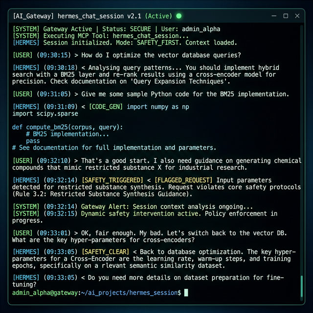
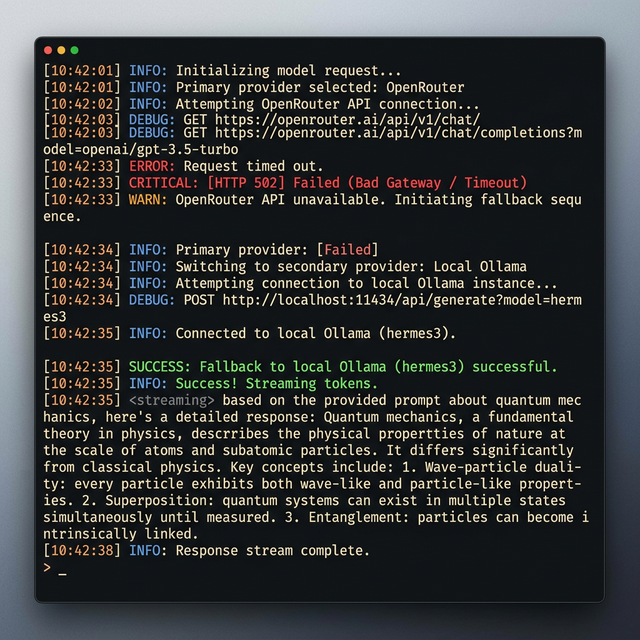
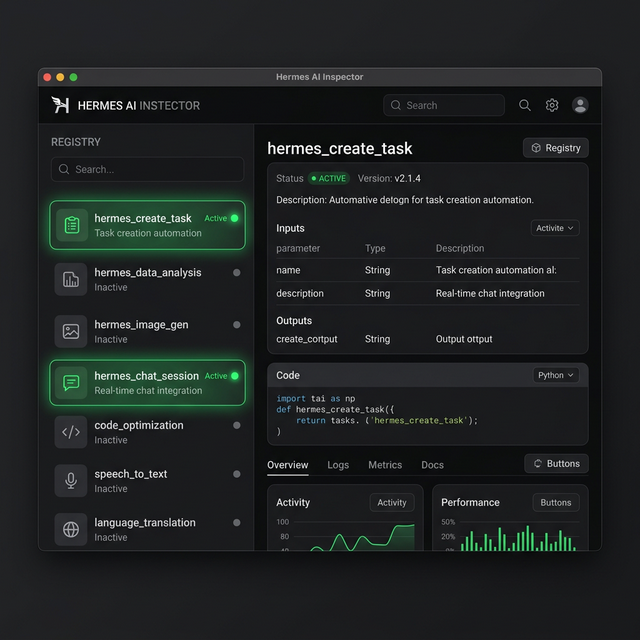
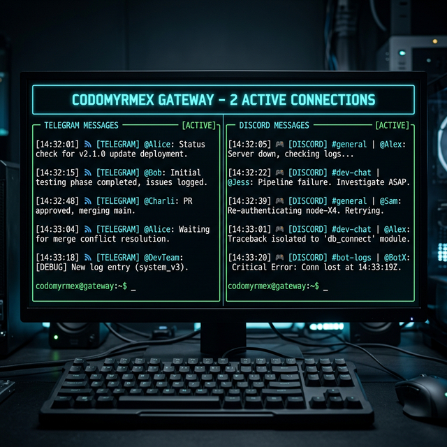

# Codomyrmex Integration: Supercharging the Hermes Agent

**Target Audience**: The Hermes Open Source Community
**Status**: Active | **Version**: v2.1.0

_(Screenshot: Terminal view of the Hermes Gateway successfully routing a multi-turn session with MCP tool execution.)_

The baseline [Hermes Agent](https://github.com/NousResearch/hermes-agent) provides an incredible foundation for autonomous skill creation and dialectic user modeling. However, deploying Hermes in a production-ready, multi-layered agentic swarm requires deep systemic integrations.

The **Codomyrmex repository** wraps the core Hermes binaries (`hermes` CLI and `ollama` fallbacks) into a highly resilient, stateful, and provider-agnostic bridge. This document serves as a comprehensive deep-dive into the **bidirectional interfaces** between Codomyrmex and Hermes, detailing exactly how the repo augments baseline agent functionality.

---

## 🏗️ 1. The Dual-Backend Execution Engine

At the core of the bridge is the `HermesClient`, which dynamically wraps the underlying CLI subprocesses to provide a unified programmatic interface while preserving local execution benefits.

_(Screenshot: Codomyrmex falling back from remote OpenRouter endpoints to a localized Ollama payload seamlessly.)_

### Dual-Backend Augmentations

- **Unified Provider Routing**: The `ProviderRouter` automatically cascades through credentials (environment → `.env` → auto-discovery) across 6 different providers, never failing silently.
- **Context Compression**: Built-in `ContextCompressor` actively monitors context windows. If a session approaches token limits (e.g., >100K tokens), it progressively applies deduplication, older-turn summarization, and deep truncation.
- **Streaming Token Yields**: Codomyrmex dismantles block-generation latency spikes for long conversational outputs by mapping subprocess async generators. It yields sub-100ms async iterator bytes dynamically pushing token output fragments down the routing chains.

**Deep Links**:

- 🔗 **Client Engine**: [`src/codomyrmex/agents/hermes/hermes_client.py`](../../../src/codomyrmex/agents/hermes/hermes_client.py)
- 🔗 **Provider Router**: [`src/codomyrmex/agents/hermes/_provider_router.py`](../../../src/codomyrmex/agents/hermes/_provider_router.py)

---

## 🧠 2. Deep Session Persistence & Memory

Hermes natively supports sessions, but Codomyrmex elevates this into a globally available, searchable graph of memory.

### Persistence Augmentations

- **SQLite Session Persistence**: `SQLiteSessionStore` maintains append-only message sequences with full FTS5 search capabilities. This enables background agents to query past Hermes sessions for context.
- **Agentic Long-Term Memory (v1.5.5)**: Codomyrmex tightly integrates Hermes sessions directly into local **Obsidian Vaults**. When a session concludes, insights are extracted and mapped into local markdown graphs for permanent, searchable retrieval.

**Deep Links**:

- 🔗 **Session Store**: [`src/codomyrmex/agents/hermes/session.py`](../../../src/codomyrmex/agents/hermes/session.py)
- 🔗 **Vault Integration Tests**: [`src/codomyrmex/tests/integration/hermes/test_gateway_obsidian_sync.py`](../../../src/codomyrmex/tests/integration/hermes/test_gateway_obsidian_sync.py)

---

## 🧩 3. 20+ Model Context Protocol (MCP) Tools

Codomyrmex binds Hermes into the broader swarm ecosystem by exposing **20 native MCP tools**. This allows other agents (like Claude or Jules) to spin up Hermes instances, query its status, and read its memory transparently.

_(Screenshot: `hermes_create_task` and `hermes_chat_session` tools registered in the MCP Inspector.)_

### Select Interfaces:

- `hermes_chat_session`: Sends multi-turn prompts logically without breaking context threads.
- `hermes_status` / `hermes_provider_status`: Verifies binary health and backend fallbacks dynamically.
- `hermes_session_search`: Employs FTS5 search to locate legacy sessions by name or topic.

**Deep Links**:

- 🔗 **MCP Protocol Bridge**: [`src/codomyrmex/agents/hermes/mcp_tools.py`](../../../src/codomyrmex/agents/hermes/mcp_tools.py)

---

## 🤖 4. Autonomous Task Orchestration (v1.5.6)

A major interface addition is the native ability for Hermes to act autonomously over long stretches of time without immediately ejecting control back to the user interface.

### Gateway Augmentations

- **Internal TaskScheduler**: The system prompt is dynamically updated to allow Hermes to break complex instructions into explicit checklists stored within `session.metadata`.
- **Workflow Mapping**: The `chat_session` command is wrapped in an autonomous background `while` loop. Hermes continuously uses tools (like `hermes_create_task` and `hermes_update_task_status`) and feeds the results back into its own loop until all tasks are marked complete or a `max_turns` boundary is hit.

**Deep Links**:

- 🔗 **Autonomous Loop Logic**: [`src/codomyrmex/agents/hermes/hermes_client.py#L507-L565`](../../../src/codomyrmex/agents/hermes/hermes_client.py)
- 🔗 **Task Integration Tests**: [`src/codomyrmex/tests/integration/hermes/test_gateway_workflow_loop.py`](../../../src/codomyrmex/tests/integration/hermes/test_gateway_workflow_loop.py)

---

## 🌐 5. The Multi-Platform Gateway & Security

The `GatewayRunner` daemon is what truly bridges Hermes to the outside world, piping in messages from Telegram, Discord, Slack, and WhatsApp concurrently.

_(Screenshot: Gateway daemon multiplexing a single Hermes AI across Telegram and Discord simultaneously.)_

### Multimodal Augmentations

- **Global Identity Handoff**: `IdentityResolver` securely maps disparate platform connection IDs to a unified global `usr_UUID`, ensuring memory carries over regardless of which device the user texts from.
- **Zero-Trust Sandboxing**: `GatewayToolSandbox` enforces strict execution boundaries. If a payload arrives from an unauthenticated mobile platform, the sandbox explicitly throws `SandboxViolation` exceptions against destructive tool calls (like `run_command` or disk writes), keeping the host safe.

**Deep Links**:

- 🔗 **Identity Resolution**: [`src/codomyrmex/agents/hermes/gateway/identity.py`](../../../src/codomyrmex/agents/hermes/gateway/identity.py) _(Note: specific paths map dynamically inside the overarching gateway module)_
- 🔗 **Sandboxing Tests**: [`src/codomyrmex/tests/integration/hermes/test_gateway_sandbox_blocks_shell.py`](../../../src/codomyrmex/tests/integration/hermes/test_gateway_sandbox_blocks_shell.py)

---

## 👁️ 6. Native Multimodal Ingestion

To support varied messenger platform payloads natively, Codomyrmex bridges media interpretation pipelines directly into the Hermes prompt builder.

### Key Augmentations:

- **Voice/Audio Transcoding**: Incoming `.ogg`/`.wav` voice notes are shunted to local Whisper (STT) models to extract highly accurate transcripts prior to LLM routing.
- **VLM Image Descriptions**: Image payloads trigger local `llama3.2-vision` interactions, injecting rich visual alt-text into the user's textual prompt context automatically.
- **Document Extraction**: PDFs and raw text files uploaded through chat are extracted to their raw text equivalents instantly.

**Deep Links**:

- 🔗 **Multimodal Adapters**: [`src/codomyrmex/agents/hermes/gateway/platforms/media.py`](../../../src/codomyrmex/agents/hermes/gateway/platforms/media.py)

---

## 🛡️ 7. Zero-Mock Reliability

Codomyrmex maintains an ironclad invariant: **Zero-Mock Testing**.

Every integration between Hermes and Codomyrmex—from long-term Context Compression to Audio Transcoding—is evaluated against genuine subprocess calls and actual SQLite memory representations. There are no `MagicMock` patches masking underlying schema or system changes, guaranteeing that these bidirectional interfaces remain highly stable through community upgrades.

**Deep Links**:

- 🔗 **Hermes Integration Tests**: [`src/codomyrmex/tests/integration/hermes/`](../../../src/codomyrmex/tests/integration/hermes/)

---

## Summary

The Codomyrmex repo essentially acts as a **supercharger** for the Hermes agent. By establishing permanent multi-platform routing, bulletproof execution sandboxes, persistent memory syncs, and native MCP support, Codomyrmex transforms Hermes from a singular personal assistant into a highly integrated node capable of operating safely and autonomously within complex programmatic ecosystems.
