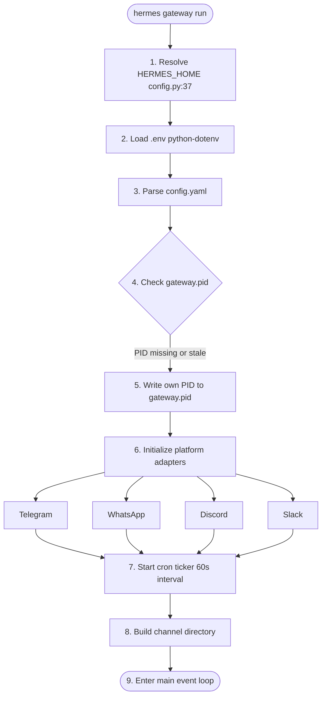

# Hermes Gateway System

**Version**: v0.2.0 | **Last Updated**: March 2026

## Overview

The Hermes gateway (`hermes gateway run`) is a unified daemon that routes messages between messaging platforms and the core AI agent. It manages platform lifecycles, message routing, session coordination, and scheduled jobs from a single process.

## How the Gateway Works

### Startup Sequence



### Message Flow


## Gateway Commands

```bash
# Start the gateway
hermes gateway run

# Start with auto-replace (clears stale PIDs)
hermes gateway run --replace

# Stop the gateway
hermes gateway stop

# Restart (stop + start)
hermes gateway restart

# Check status
hermes status
```

## Platform Adapters

Each platform has a dedicated adapter in `gateway/platforms/`:

| Platform | Adapter       | Connection Method        |
| :------- | :------------ | :----------------------- |
| Telegram | `telegram.py` | Long polling via Bot API |
| WhatsApp | `whatsapp.py` | Node.js Baileys bridge   |
| Discord  | `discord.py`  | WebSocket gateway        |
| Slack    | `slack.py`    | Socket Mode              |
| CLI      | Built-in      | Direct stdin/stdout      |

## Session Routing

The gateway routes messages to sessions using a composite key:

```text
session_id = f"{platform}_{user_id}"
```

Sessions are managed by `gateway/session.py`, which maintains:

- Per-session context prompts
- Reset policies
- Cross-platform continuity (shared `state.db`)

## Channel Directory

The gateway maintains a `channel_directory.json` file mapping known users/channels:

```json
{
    "updated_at": "2026-03-12T16:38:52",
    "platforms": {
        "telegram": [{ "id": "544419050", "name": "docxology", "type": "dm" }],
        "whatsapp": [],
        "signal": [],
        "email": []
    }
}
```

## PID Management

The gateway writes its PID to `$HERMES_HOME/gateway.pid` on startup. On subsequent starts, it reads this file and:

1. If the PID is alive → refuses to start (prints "already running")
2. If the PID is dead (stale) → still refuses unless `--replace` is used
3. With `--replace` → kills the old process and takes over

**Always use `--replace` in service definitions** to handle crash recovery gracefully.

## Logs

| Log File                              | Content                                              |
| :------------------------------------ | :--------------------------------------------------- |
| `$HERMES_HOME/logs/gateway.log`       | Gateway startup, platform connections, HTTP requests |
| `$HERMES_HOME/logs/errors.log`        | Error tracebacks and exceptions                      |
| `$HERMES_HOME/logs/gateway.error.log` | stderr (if using launchd)                            |

## Related Documents

- [Telegram](telegram.md) — Telegram-specific setup
- [Multi-Instance](multi_instance.md) — Running multiple gateways
- [launchd](launchd.md) — macOS service management
- [Cron](cron.md) — Scheduled jobs
