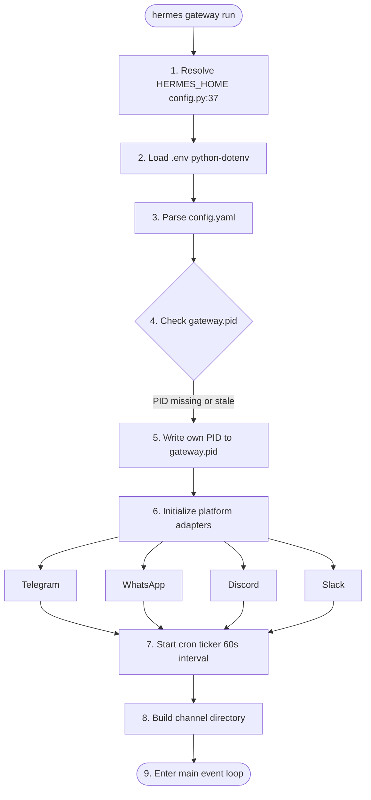
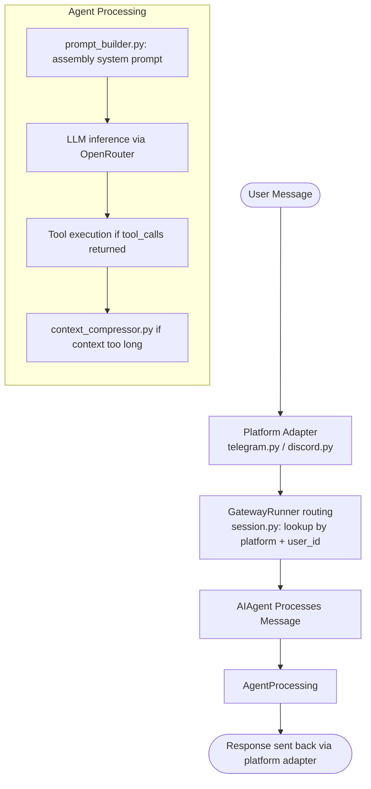

# Hermes Gateway System

**Version**: v0.3.0 | **Last Updated**: March 2026 (73-commit update)

## Overview

The Hermes gateway (`hermes gateway run`) is a unified daemon that routes messages between messaging platforms and the core AI agent. It manages platform lifecycles, message routing, session coordination, and scheduled jobs from a single process.

## How the Gateway Works

### Startup Sequence



### Message Flow



## Gateway Commands

```bash
# Start the gateway
hermes gateway run

# Start with auto-replace (clears stale PIDs)
hermes gateway run --replace

# Stop the gateway
hermes gateway stop

# Restart (stop + start)
hermes gateway restart

# Check status
hermes status
```

## Platform Adapters

Each platform has a dedicated adapter in `gateway/platforms/`:

| Platform | Adapter       | Connection Method        |
| :------- | :------------ | :----------------------- |
| Telegram | `telegram.py` | Long polling via Bot API |
| WhatsApp | `whatsapp.py` | Node.js Baileys bridge   |
| Discord  | `discord.py`  | WebSocket gateway        |
| Slack    | `slack.py`    | Socket Mode              |
| CLI      | Built-in      | Direct stdin/stdout      |

## Session Routing

The gateway routes messages to sessions using a composite key:

```text
session_id = f"{platform}_{user_id}"
```

Sessions are managed by `gateway/session.py`, which maintains:

- Per-session context prompts
- Reset policies
- Cross-platform continuity (shared `state.db`)

## Channel Directory

The gateway maintains a `channel_directory.json` file mapping known users/channels:

```json
{
    "updated_at": "2026-03-12T16:38:52",
    "platforms": {
        "telegram": [{ "id": "544419050", "name": "docxology", "type": "dm" }],
        "whatsapp": [],
        "signal": [],
        "email": []
    }
}
```

## PID Management

The gateway writes its PID to `$HERMES_HOME/gateway.pid` on startup. On subsequent starts, it reads this file and:

1. If the PID is alive → refuses to start (prints "already running")
2. If the PID is dead (stale) → still refuses unless `--replace` is used
3. With `--replace` → kills the old process and takes over

**Always use `--replace` in service definitions** to handle crash recovery gracefully.

## Logs

| Log File                              | Content                                              |
| :------------------------------------ | :--------------------------------------------------- |
| `$HERMES_HOME/logs/gateway.log`       | Gateway startup, platform connections, HTTP requests |
| `$HERMES_HOME/logs/errors.log`        | Error tracebacks and exceptions                      |
| `$HERMES_HOME/logs/gateway.error.log` | stderr (if using launchd)                            |

## Discord Voice Channels (v60cce9c+)

The upstream `60cce9c` update (March 2026) added full Discord **voice channel** support via `VoiceReceiver`:

| Feature | Detail |
| :------ | :----- |
| **RTP capture** | Decrypts NaCl-encrypted RTP packets per-user via Discord's DAVE E2EE protocol |
| **Opus → PCM** | Decodes Opus audio to PCM; buffers per-user with silence detection |
| **Voice mode** | `/voice [on\|off\|tts\|channel\|leave\|status]` per-chat toggle command |
| **Voice persistence** | State saved to `$HERMES_HOME/gateway_voice_mode.json` across restarts |
| **Voice timeout** | Bot auto-disconnects after 5 minutes of channel inactivity |
| **Diagnostic script** | `discord-voice-doctor.py` — checks packages, permissions, Opus codec |

### Voice Mode Commands

```bash
/voice on      # Enable voice replies (TTS) in this chat
/voice off     # Disable voice replies
/voice tts     # Send all replies as voice-only audio
/voice channel # Join the user's current voice channel (listen + TTS)
/voice status  # Show current voice mode
```

### Required Dependencies

```bash
# Install discord.py with voice support
pip install discord.py[voice]  # includes PyNaCl + Opus bindings

# Or inside the Hermes virtualenv
cd ~/.hermes/hermes-agent && .venv/bin/pip install discord.py[voice]

# Run the diagnostic tool
python scripts/discord-voice-doctor.py
```

### .env Configuration

```bash
DISCORD_BOT_TOKEN=your_bot_token_here
DISCORD_ALLOWED_USER_IDS=123456789,987654321  # optional allow-list
```

## Sprint 34 — Swarm Orchestration and Knowledge Codification

The gateway participates as a first-class node in the Codomyrmex multi-agent swarm ecology via the nine new Sprint 34 MCP tools.

### Session Lifecycle → Knowledge Items

When a gateway-routed conversation closes (e.g., the user leaves a channel or the gateway session times out), the `HermesSession.close()` lifecycle hook fires any registered `on_close` callback. This enables **automatic KI extraction**:

```python
from codomyrmex.agents.hermes.session import HermesSession
from codomyrmex.agents.hermes.mcp_tools import hermes_extract_ki

def _auto_ki(sess: HermesSession) -> None:
    if sess.message_count >= 3:
        hermes_extract_ki(
            session_id=sess.session_id,
            title=f"Gateway session: {sess.name or sess.session_id[:8]}",
        )

session = HermesSession(on_close=_auto_ki)
```

The extracted KIs are indexed by `KnowledgeMemory` and can be recalled across all gateway platforms via `hermes_search_knowledge_items`.

### Gateway Swarm Participation

The gateway daemon can act as a swarm peer by connecting its platform sessions to the `IntegrationBus`:

```python
from codomyrmex.events.integration_bus import IntegrationBus
from codomyrmex.events.event_store import EventStore

# Create a crash-durable bus for the gateway process
bus = IntegrationBus(event_store=EventStore())

# Receive tasks dispatched to "gateway" agent role
tasks = bus.drain_inbox("gateway")
for task in tasks:
    # ... handle task, route to platform adapter
    pass
```

External agents can dispatch tasks to the gateway via:

```python
# From any MCP context
events_send_to_agent(agent_id="gateway", message={"action": "send_dm", "user": "docxology", "text": "Done."})
```

### Size-based Memory GC

Use `hermes_archive_sessions` periodically to keep the gateway session DB lean:

```bash
# Archive sessions older than 14 days once the DB exceeds 100 MB
hermes_archive_sessions --max-size-mb 100 --days-old 14
```

When the DB is under the threshold, the tool returns immediately without deleting anything. Add `--dry-run` to preview what would be pruned.

## Related Documents

- [Telegram](telegram.md) — Telegram-specific setup
- [Multi-Instance](multi_instance.md) — Running multiple gateways
- [launchd](launchd.md) — macOS service management
- [Cron](cron.md) — Scheduled jobs
- [skills.md](skills.md) — Codomyrmex skill preload when invoking Hermes via MCP/client
