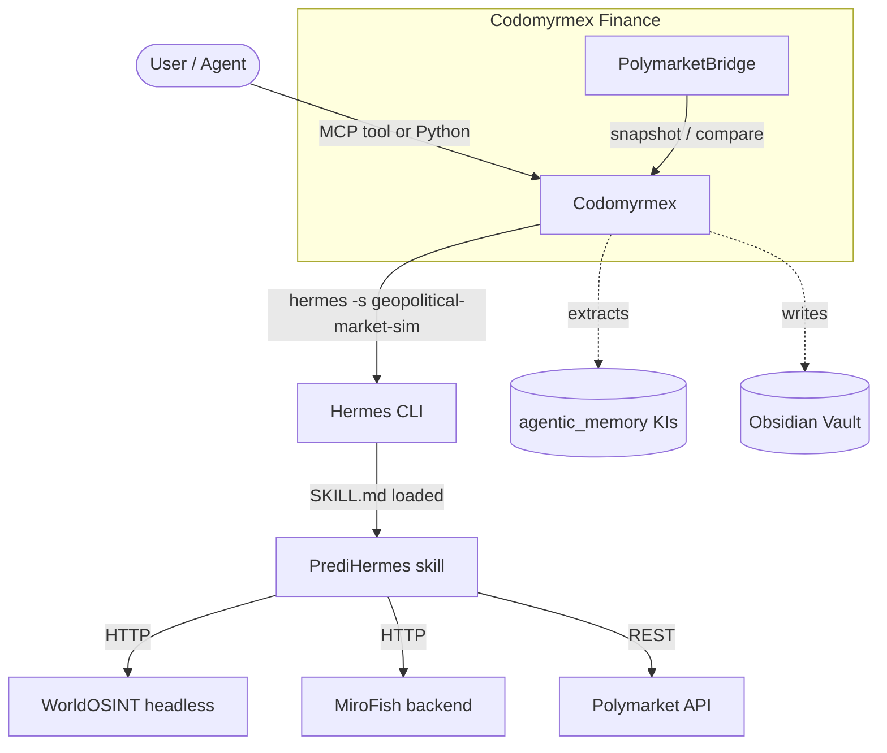

# PrediHermes × Codomyrmex — Integration Guide

**Version**: v1.0.0 | **Last Updated**: March 2026
**Upstream skill**: [`nativ3ai/hermes-geopolitical-market-sim`](https://github.com/nativ3ai/hermes-geopolitical-market-sim)

---

## Overview

**PrediHermes** is a Hermes skill for end-to-end geopolitical market forecasting. It combines:

- **WorldOSINT headless** — OSINT signal aggregation API
- **Polymarket CLOB/Gamma** — open prediction market discovery and pricing
- **MiroFish** — multi-agent simulation and counterfactual branch generation
- **Hermes chat + cron** — operator workflows and scheduling

Codomyrmex integrates PrediHermes at three levels:

| Level | Component | Requires |
|:------|:----------|:---------|
| **MCP tools** | `hermes_execute`, `hermes_chat_session` + `hermes_skill=` | Hermes CLI |
| **Bridge** | `HermesSkillBridge` | Hermes CLI + skill installed |
| **Typed facade** | `GeopoliticalMarketPipeline` | Hermes CLI + skill installed |
| **Finance** | `PolymarketBridge` | Hermes CLI + skill + companions |

---

## Architecture



---

## Prerequisites

| Requirement | Check |
|:------------|:------|
| Hermes Agent CLI | `hermes --help` → OK |
| API key configured | `hermes config` shows `OpenRouter` or equivalent key |
| PrediHermes skill | `hermes skills list \| grep geopolitical-market-sim` |
| WorldOSINT (optional) | `~/predihermes/bin/predihermes-worldosint --help` |
| MiroFish (optional) | `~/predihermes/bin/predihermes-mirofish-backend --help` |

---

## Installation

```bash
# Level 1 — Skill only (no companion services)
./scripts/install_hermes_skill.sh

# Level 2 — Full stack (WorldOSINT + MiroFish)
./scripts/install_hermes_skill.sh --bootstrap-stack

# Level 3 — Full stack + video transcriber skill
./scripts/install_hermes_skill.sh --bootstrap-stack --with-video-transcriber

# Doctor check (prerequisites only)
./scripts/install_hermes_skill.sh --doctor
```

After install, verify:

```bash
hermes skills list            # geopolitical-market-sim should appear
~/predihermes/bin/predihermes health   # companion health (if --bootstrap-stack)
```

---

## Usage Patterns

### Pattern 1 — MCP tools (recommended for agents)

Works from any Codomyrmex MCP-connected agent (Claude, Jules, etc.):

```python
# Single-turn execution
hermes_execute(
    prompt="Use PrediHermes list-worldosint-modules and suggest 6 for maritime risk.",
    hermes_skill="geopolitical-market-sim",
)

# Stateful multi-turn session (skill persisted automatically across turns)
hermes_chat_session(
    prompt="Use PrediHermes dashboard iran-conflict and summarize top drift signals.",
    hermes_skill="geopolitical-market-sim",
    session_name="predihermes-iran",
)

# Parallel fan-out via swarm orchestration
orchestrator_run_dag(
    topology="fan_out",
    tasks=[
        {"task_id": "t1", "fn": "hermes_execute",
         "args": {"prompt": "PrediHermes dashboard iran-conflict",
                  "hermes_skill": "geopolitical-market-sim"}},
        {"task_id": "t2", "fn": "hermes_execute",
         "args": {"prompt": "PrediHermes dashboard taiwan-strait",
                  "hermes_skill": "geopolitical-market-sim"}},
    ],
)
```

### Pattern 2 — Python bridge (programmatic)

```python
from codomyrmex.skills.hermes_skill_bridge import HermesSkillBridge

bridge = HermesSkillBridge()

# List all installed Hermes skills
print(bridge.list_hermes_skills().keys())

# Use PrediHermes directly
entry = bridge.get_skill("geopolitical-market-sim")
resp = entry.run("Use PrediHermes health")
print(resp.content)
```

### Pattern 3 — Typed pipeline facade (preferred for Python code)

```python
from codomyrmex.skills.skills.custom.geopolitical_market_sim import (
    GeopoliticalMarketPipeline,
    TopicConfig,
    health,
)

# Verify companion stack
print(health())

# Object-oriented pipeline
pipeline = GeopoliticalMarketPipeline()

# Track a new topic
pipeline.track_topic(
    topic_id="iran-conflict",
    topic="Iran conflict and nuclear diplomacy",
    market_query="Iran nuclear deal",
    keywords=["iran", "nuclear", "iaea", "enrichment"],
    regions=["IR", "IL", "SA", "US"],
)

# Run with full simulation
result = pipeline.run_tracked(
    "iran-conflict",
    simulate=True,
    simulation_mode="auto",
    target_agents=48,
)

# View dashboard
dash = pipeline.dashboard("iran-conflict")
print(dash.content)

# Using TopicConfig dataclass
config = TopicConfig(
    topic_id="taiwan-strait",
    topic="Taiwan strait military tension",
    market_query="Taiwan conflict 2025",
    keywords=["taiwan", "pla", "tsmc", "7th fleet"],
    regions=["TW", "CN", "US", "JP"],
    target_agents=60,
)
pipeline.track_from_config(config)
pipeline.run_tracked("taiwan-strait", simulate=True)
```

### Pattern 4 — Polymarket finance integration

```python
from codomyrmex.finance.polymarket_bridge import PolymarketBridge

bridge = PolymarketBridge()

# Get structured market prices for a query
snapshot = bridge.get_market_snapshot("Iran nuclear deal 2025")
for market in snapshot.markets:
    print(f"{market.question}: YES={market.yes_price:.2%}")

# Compare implied (market) vs simulated (MiroFish) probability
delta = bridge.compare_implied_vs_forecast("iran-conflict")
print(f"Implied: {delta.implied_yes:.2%}, Simulated: {delta.simulated_yes:.2%}")
print(delta.interpretation)
```

---

## Knowledge Codification

After a PrediHermes session, extract insights into permanent memory:

```python
# Extract a Knowledge Item from a session
hermes_extract_ki(
    session_id="predihermes-iran-abc123",
    title="Iran Conflict Market Analysis — March 2026",
)

# Search prior analyses
hermes_search_knowledge_items(
    topic="Iran nuclear Polymarket forecast",
    limit=5,
)
```

---

## Scheduling

Use Hermes cron or Codomyrmex automation to run topics on a schedule.

```bash
# Via Hermes cron (set in config.yaml)
hermes cron add "0 8 * * *" "hermes -s geopolitical-market-sim --message 'Use PrediHermes run-tracked iran-conflict'"

# Via launchd (macOS — installed by --with-launchd flag)
./install.sh --bootstrap-stack --with-launchd \
    --worldosint-root ~/predihermes/companions/worldosint-headless \
    --mirofish-root ~/predihermes/companions/MiroFish
```

---

## Companion Services Quick-Start

```bash
# Start WorldOSINT headless
~/predihermes/bin/predihermes-worldosint &

# Start MiroFish backend
~/predihermes/bin/predihermes-mirofish-backend &

# Start MiroFish UI (optional)
~/predihermes/bin/predihermes-mirofish-ui &

# Check stack health
~/predihermes/bin/predihermes-stack-health
```

Required MiroFish secrets (`~/predihermes/companions/MiroFish/.env`):

```env
LLM_API_KEY=your_llm_api_key
LLM_BASE_URL=https://api.openai.com/v1
LLM_MODEL_NAME=gpt-4o
ZEP_API_KEY=your_zep_api_key
```

---

## Troubleshooting

| Problem | Fix |
|:--------|:----|
| `geopolitical-market-sim` not in `hermes skills list` | Run `./scripts/install_hermes_skill.sh` |
| `HermesSkillBridge.get_skill(...)` returns `None` | Check `HERMES_HOME` env var; default is `~/.hermes` |
| `Unknown provider 'openai'` | Set `model.provider` to `openai-codex` (not `openai`) |
| WorldOSINT / MiroFish health fails | Verify both services are running; check `.env` secrets |
| Ollama fallback used instead of CLI | Skills require CLI; set `OPENROUTER_API_KEY` or run `hermes setup` |
| `predihermes: command not found` | Add `~/predihermes/bin` to `PATH` |

---

## Related Documents

- [Skills System](skills.md) — Hermes skill discovery and loading
- [Codomyrmex Integration](codomyrmex_integration.md) — Full MCP integration guide
- [Architecture](architecture.md) — Hermes agent architecture
- [Configuration](configuration.md) — `config.yaml` reference
- [`HermesSkillBridge` source](../../../src/codomyrmex/skills/hermes_skill_bridge.py)
- [Typed facade source](../../../src/codomyrmex/skills/skills/custom/geopolitical_market_sim/geopolitical_market_pipeline.py)
- [PolymarketBridge source](../../../src/codomyrmex/finance/polymarket_bridge.py)
- [Install script](../../../scripts/install_hermes_skill.sh)
