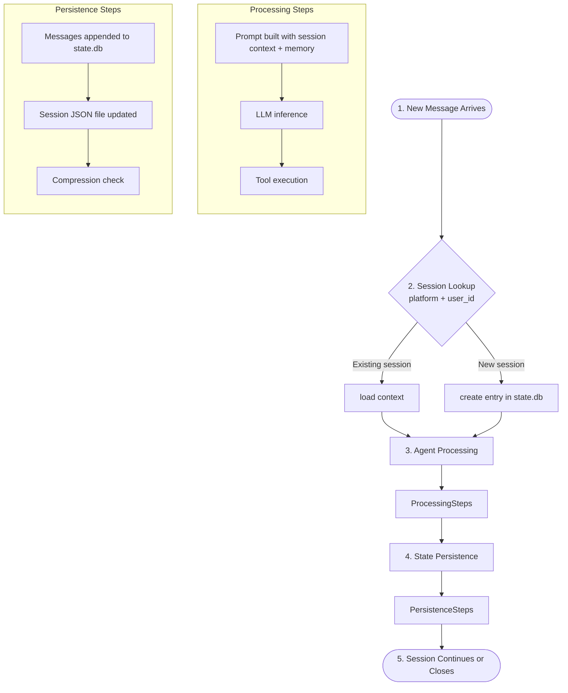

# Hermes Session Management

**Version**: v0.2.0 | **Last Updated**: March 2026

## Overview

Hermes maintains persistent conversation state across sessions using a combination of SQLite (with FTS5 full-text search), JSON backup files, and LLM-based context compression. This enables cross-session memory recall, user modeling, and intelligent context management.

## Session Lifecycle



## Storage Components

### `state.db` (SQLite + FTS5)

The primary state database, stored at `$HERMES_HOME/state.db`. Uses SQLite's FTS5 extension for fast full-text search across conversation history.

**Key capabilities**:

- Cross-session recall via FTS5 search
- LLM reranking of search results for relevance
- User modeling (Honcho dialectic) across conversations
- Periodic compaction to manage database size

### Session JSON Files

Per-session JSON files in `$HERMES_HOME/sessions/`:

```text
sessions/
├── session_20260312_135547_8afa58.json    (84KB)
├── session_20260312_135604_6038e5.json    (85KB)
├── session_20260312_162828_b0910e.json    (60KB)
└── sessions.json                          (index file)
```

These serve as human-readable backups and are useful for debugging.

### WAL (Write-Ahead Logging)

SQLite uses WAL mode for concurrent read/write:

```text
state.db          # main database
state.db-shm      # shared memory file
state.db-wal       # write-ahead log
```

> Do not delete `-shm` or `-wal` files while the gateway is running.

## Context Compression

When a conversation approaches the model's context window limit, Hermes automatically compresses the history.

### Configuration

```yaml
compression:
    enabled: true
    threshold: 0.85 # compress at 85% of model context
    summary_model: google/gemini-3-flash-preview
    summary_provider: auto
```

### How It Works

1. Token count is checked against the model's context window (from `model_metadata.py`)
2. When `threshold` is exceeded, `context_compressor.py` is invoked
3. The summary model generates a condensed version of older messages
4. The compressed history replaces the full history, preserving recent messages

```mermaid
flowchart LR
    subgraph Before Compression
        O1[(Old Msg 1)] -.- O2[(Old Msg 2)] -.- ON[(Old Msg N)] -.- RM1[(Recent Msgs)]
    end
    
    Compressor[[context_compressor.summarize]]
    
    Before Compression --> Compressor
    
    subgraph After Compression
        OSumm[(Compressed Summary)] -.- RM2[(Recent Msgs)]
    end
    
    Compressor --> After Compression
```

### Choosing a Summary Model

Use a fast, inexpensive model for compression:

- `google/gemini-3-flash-preview` — fast and effective
- `anthropic/claude-3-haiku` — good summarization
- Any model available via OpenRouter

## Session Commands

```bash
# List recent sessions
hermes sessions

# Resume a specific session
hermes --resume SESSION_ID chat

# Continue the most recent session
hermes --continue chat
```

## Related Documents

- [Architecture](architecture.md) — Core agent loop
- [Configuration](configuration.md) — Compression settings
- [Models](models.md) — Summary model selection
