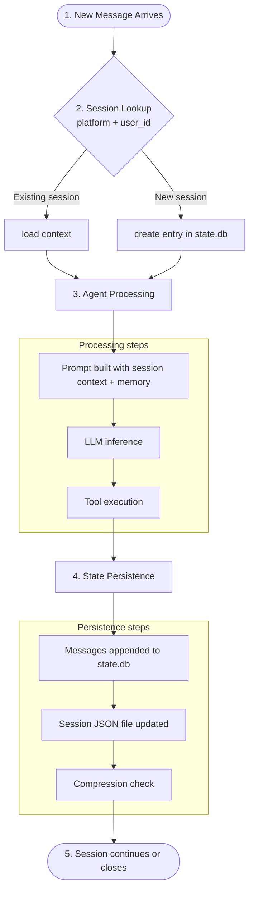
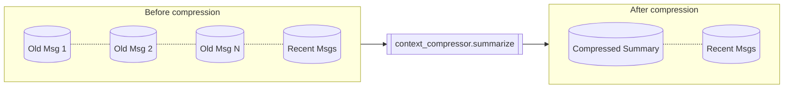

# Hermes Session Management

**Version**: v0.3.0 | **Last Updated**: March 2026 (73-commit update)

## Overview

Hermes maintains persistent conversation state across sessions using a combination of SQLite (with FTS5 full-text search), JSON backup files, and LLM-based context compression. This enables cross-session memory recall, user modeling, and intelligent context management.

## Session Lifecycle



## Storage Components

### `state.db` (SQLite + FTS5)

The primary state database, stored at `$HERMES_HOME/state.db`. Uses SQLite's FTS5 extension for fast full-text search across conversation history.

**Key capabilities**:

- Cross-session recall via FTS5 search
- LLM reranking of search results for relevance
- User modeling (Honcho dialectic) across conversations
- Periodic compaction to manage database size

### Session JSON Files

Per-session JSON files in `$HERMES_HOME/sessions/`:

```text
sessions/
├── session_20260312_135547_8afa58.json    (84KB)
├── session_20260312_135604_6038e5.json    (85KB)
├── session_20260312_162828_b0910e.json    (60KB)
└── sessions.json                          (index file)
```

These serve as human-readable backups and are useful for debugging.

### WAL (Write-Ahead Logging)

SQLite uses WAL mode for concurrent read/write:

```text
state.db          # main database
state.db-shm      # shared memory file
state.db-wal       # write-ahead log
```

> Do not delete `-shm` or `-wal` files while the gateway is running.

## Context Compression

When a conversation approaches the model's context window limit, Hermes automatically compresses the history.

### Configuration

```yaml
compression:
    enabled: true
    threshold: 0.85 # compress at 85% of model context
    summary_model: google/gemini-2.0-flash
    summary_provider: auto
```

### How It Works

1. Token count is checked against the model's context window (from `model_metadata.py`)
2. When `threshold` is exceeded, `context_compressor.py` is invoked
3. The summary model generates a condensed version of older messages
4. The compressed history replaces the full history, preserving recent messages



### Choosing a Summary Model

Use a fast, inexpensive model for compression:

- `google/gemini-2.0-flash-001` — fast and effective (confirmed working, March 2026)
- `anthropic/claude-3-haiku` — good summarization
- Any model available via OpenRouter

## Session Commands

```bash
# List recent sessions
hermes sessions

# Resume a specific session
hermes --resume SESSION_ID chat

# Continue the most recent session
hermes --continue chat
```

## Python API Reference (v1.5.x+)

The `HermesClient` exposes rich session management methods available directly from Python:

| Method | Description |
| :----- | :---------- |
| `get_session_stats()` | Returns `session_count`, `db_size_bytes`, `oldest_session_at` |
| `fork_session(session_id, new_name)` | Forks a session into independent child; child inherits full history |
| `export_session_markdown(session_id)` | Exports conversation as formatted Markdown string |
| `set_system_prompt(session_id, text)` | Prepends or replaces the persistent system message |
| `get_session_detail(session_id)` | Returns rich detail dict with `message_count`, `has_system_prompt` |
| `batch_execute(prompts, parallel=False)` | Executes a list of prompts sequentially or via ThreadPoolExecutor |

### Session Forking

Sessions can be independently forked to create parallel conversation threads:

```python
from codomyrmex.agents.hermes.hermes_client import HermesClient

client = HermesClient()
child = client.fork_session("parent_session_id", new_name="experiment-branch")
# child.parent_session_id == "parent_session_id"
```

### Markdown Export

```python
md = client.export_session_markdown("session_id")
# Returns full conversation as "# Session: name\n\n## User\n\nhello\n..."
```

### Session Statistics

```python
stats = client.get_session_stats()
# {"session_count": 42, "db_size_bytes": 819200, "oldest_session_at": 1710000000.0, ...}
```

### Pruning Old Sessions

Use the CLI script or Python API to archive sessions older than N days:

```bash
# Dry run
uv run python -m codomyrmex.agents.hermes.scripts.run_prune --days 30 --dry-run

# Execute
uv run python -m codomyrmex.agents.hermes.scripts.run_prune --days 30
```

```python
from codomyrmex.agents.hermes.session import SQLiteSessionStore

with SQLiteSessionStore("/path/to/hermes_sessions.db") as store:
    n = store.prune_old_sessions(days_old=30)
    print(f"Archived {n} sessions")
```

Archived sessions are stored as gzip-compressed JSON in `sessions_archive/` next to the database.

## Codomyrmex `hermes_chat_session` and skill metadata

Multi-turn sessions created through **Codomyrmex** may store Hermes skill names on the session object (`metadata.hermes_skills`). Those names participate in the same merge order as project profile and MCP parameters for each subsequent turn. Details: [skills.md](skills.md).

## Related Documents

- [Architecture](architecture.md) — Core agent loop
- [Configuration](configuration.md) — Compression settings
- [Models](models.md) — Summary model selection
- [skills.md](skills.md) — Session skill metadata and merge order
