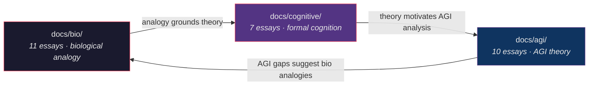

# AGI Perspectives — Agent Coordination

**Version**: v1.1.6 | **Status**: Active | **Last Updated**: March 2026

## Purpose

Agent coordination document for the AGI Perspectives documentation section within `docs/agi/`. This section explores how the Codomyrmex platform relates to Artificial General Intelligence theory, alignment research, and distributed cognitive architecture.

## Scope

This directory contains 10 technical essays and 4 RASP files (135KB total) mapping AGI theoretical requirements to codomyrmex module implementations. Agents working with this documentation should treat it as **analytical commentary** on the codebase — not as implementation specifications.

## Agent Guidelines

### Epistemic Status Classification

Every claim in the AGI essays falls into one of three epistemic categories. Agents must distinguish these when citing the material:

| Status | Marker | Meaning | Example |
|:-------|:-------|:--------|:--------|
| **Implementation** | ✅ | Module *implements* the described pattern | `system_discovery` implements autopoietic self-scanning |
| **Analogy** | ≈ | Module exhibits *structural similarity* to the pattern | EventBus ≈ Global Workspace broadcasting |
| **Aspiration** | ○ | Pattern is *absent* but architecturally desirable | Causal reasoning via do-calculus |

### When Referencing AGI Docs

1. **Theory vs. Implementation**: These documents describe theoretical relationships. The modules themselves remain the ground truth for capabilities. Never claim the system "has AGI" — claim specific modules satisfy specific preconditions.
2. **Cross-Reference Protocol**: Each essay maps AGI concerns to named modules. Use those mappings as navigation aids when exploring the codebase.
3. **Mathematical Notation**: Essays use LaTeX-style notation (Legg-Hutter measure, variational free energy, Löb's theorem). When citing formulas, verify they match the module's actual computation.
4. **Gap Analysis**: Every essay contains a gap analysis table. These are the most actionable sections for agents planning future development.

### Content Priority for Agents

| Priority | Documents | Use Case | Epistemic Weight |
|:---------|:----------|:---------|:----------------|
| **Critical** | `scaffolding.md`, `alignment_and_safety.md` | Architecture decisions, safety reviews | High — directly maps to code |
| **High** | `tool_use_and_agency.md`, `world_models.md`, `orchestration_as_cognition.md` | Agent design, tool composition, planning | Medium — mix of implementation and analogy |
| **Medium** | `recursive_self_improvement.md`, `memory_and_continuity.md`, `formal_specification.md` | Self-modification policy, memory design, verification strategy | Medium — formal analysis |
| **Context** | `emergence_and_scale.md`, `the_colony_thesis.md` | Theoretical context, long-term architectural vision | Lower — primarily analytical |

### Cross-Series Navigation

The AGI series is the third of three analytical perspectives. Agents should cross-reference:

### Module-to-Essay Lookup

When working on a specific module, consult the relevant essay:

| Module Domain | Primary Essay | Secondary Essay |
|:-------------|:-------------|:---------------|
| `agents/`, `orchestrator/` | `orchestration_as_cognition.md` | `the_colony_thesis.md` |
| `cerebrum/`, `llm/` | `world_models.md` | `scaffolding.md` |
| `vector_store/`, `graph_rag/` | `world_models.md` | `memory_and_continuity.md` |
| `agentic_memory/`, `cache/` | `memory_and_continuity.md` | `emergence_and_scale.md` |
| `defense/`, `security/`, `identity/` | `alignment_and_safety.md` | `formal_specification.md` |
| `coding/`, `evolutionary_ai/` | `recursive_self_improvement.md` | `tool_use_and_agency.md` |
| `tool_use/`, `model_context_protocol/` | `tool_use_and_agency.md` | `scaffolding.md` |
| `formal_verification/`, `validation/` | `formal_specification.md` | `alignment_and_safety.md` |
| `events/`, `telemetry/`, `logging_monitoring/` | `emergence_and_scale.md` | `orchestration_as_cognition.md` |
| `system_discovery/`, `plugin_system/` | `scaffolding.md` | `the_colony_thesis.md` |
| `bio_simulation/`, `spatial/` | `the_colony_thesis.md` | `world_models.md` |

## Related AGENTS.md Files

- [docs/AGENTS.md](../AGENTS.md) — Documentation hub coordination
- [docs/bio/AGENTS.md](../bio/AGENTS.md) — Biological perspectives coordination
- [docs/cognitive/AGENTS.md](../cognitive/AGENTS.md) — Cognitive perspectives coordination
- [Root AGENTS.md](../../AGENTS.md) — Repository-wide agent coordination

## Navigation

- **Parent**: [docs/README.md](../README.md) — Documentation hub
- **Siblings**: [bio/](../bio/) · [cognitive/](../cognitive/) · [security/](../security/) · [pai/](../pai/)
- **Project Root**: [../../README.md](../../README.md)
