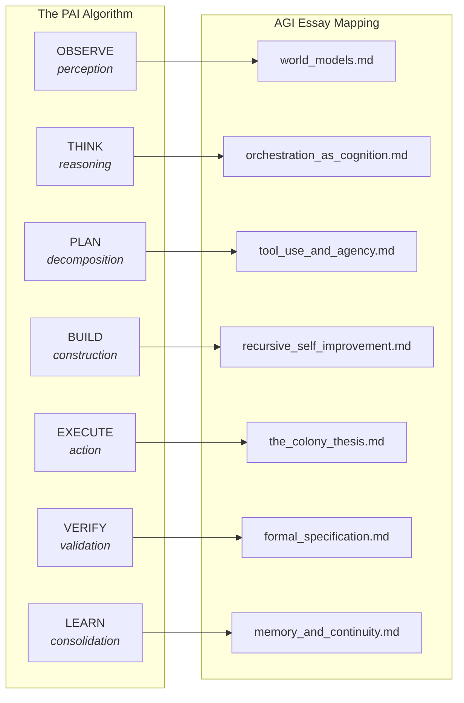

# AGI Perspectives — PAI Integration

**Version**: v1.2.3 | **Status**: Active | **Last Updated**: March 2026

## Overview

The AGI Perspectives documentation series analyses how the Codomyrmex module ecosystem maps to the theoretical requirements for Artificial General Intelligence. Within the PAI (Personal AI Infrastructure) framework, this analysis is relevant at every phase of The Algorithm — from perception to action to learning.

## PAI Algorithm Phase Mapping

### Detailed Phase Analysis

| Algorithm Phase | AGI Relevance | Key Essays | Formal Framework |
|:---------------|:-------------|:-----------|:----------------|
| **OBSERVE** | World model acquisition — building internal representations from environmental data. Friston's active inference requires *generative models* of the environment. | [world_models.md](./world_models.md), [memory_and_continuity.md](./memory_and_continuity.md) | Variational free energy: F = D_KL[q(θ) ∥ p(θ\|o)] |
| **THINK** | Reasoning and planning — the cognitive executive function. Orchestration as higher-order cognition, DAG construction as STRIPS planning. | [orchestration_as_cognition.md](./orchestration_as_cognition.md), [scaffolding.md](./scaffolding.md) | IIT: Φ = I(whole) - Σ I(parts) |
| **PLAN** | Goal decomposition and workflow assembly. Tool selection as contextual bandits. Agency boundary = tool access boundary. | [orchestration_as_cognition.md](./orchestration_as_cognition.md), [tool_use_and_agency.md](./tool_use_and_agency.md) | STRIPS planning: PSPACE-complete |
| **BUILD** | Autonomous code generation and modification. Bounded Gödel Machine loop with fitness landscapes and developmental constraints. | [recursive_self_improvement.md](./recursive_self_improvement.md), [tool_use_and_agency.md](./tool_use_and_agency.md) | F(C,T,M) = α·P + β·Q + γ·Perf |
| **EXECUTE** | Multi-agent task execution with safety constraints. Colony model: specialized castes with stigmergic coordination. | [alignment_and_safety.md](./alignment_and_safety.md), [the_colony_thesis.md](./the_colony_thesis.md) | Response threshold: P = sⁿ/(sⁿ+θⁿ) |
| **VERIFY** | Formal and empirical verification. Arithmetical hierarchy constrains what can be proved. Human oracle breaks Löbian obstacle. | [formal_specification.md](./formal_specification.md), [alignment_and_safety.md](./alignment_and_safety.md) | Löb's theorem: □(□P→P) → □P |
| **LEARN** | Knowledge persistence and adaptive improvement. Four-tier memory with consolidation gap. Bayesian posterior updating across sessions. | [memory_and_continuity.md](./memory_and_continuity.md), [recursive_self_improvement.md](./recursive_self_improvement.md) | I_eff ≤ I_session + I_memory |

## Strategic Context

### The PAI-AGI Convergence

The AGI Perspectives series sits at the intersection of PAI's vision for Personal AI and the broader AGI research landscape. Three strategic observations:

**1. Modular AGI as Personal Intelligence**

The PAI algorithm's phase structure naturally decomposes AGI capabilities into composable stages — each served by dedicated codomyrmex modules. This is Drexler's (2019) CAIS thesis applied at the personal scale: AGI-level capability through composition of narrow services, without creating a monolithic superintelligent agent.

The critical insight: *personal* AI may be a more tractable path to functional generality than *universal* AI. A system deeply familiar with one user's context, workflows, and preferences achieves effective generality through personalization — not through universal knowledge.

**2. Safety by Architecture**

The trust model (`UNTRUSTED → VERIFIED → TRUSTED`) provides an inherent alignment mechanism that formal AGI safety work recognizes as a **corrigibility primitive** (Soares et al., 2015). The Bayesian trust progression:

$$P(\text{safe} \mid \text{observations}) = \frac{P(\text{observations} \mid \text{safe}) \cdot P(\text{safe})}{P(\text{observations})}$$

ensures that trust is earned through demonstrated safe behavior, not assumed.

**3. The Colony Model of Personal AI**

The Colony Thesis ([the_colony_thesis.md](./the_colony_thesis.md)) argues that the PAI system is best understood not as a single AI assistant but as a *colony* of specialized agents — foragers (search, scrape), builders (coding, templating), soldiers (defense, security), nurses (memory, validation), and scouts (llm, cerebrum). The user interacts with the colony-level behavior, not with individual agents.

### AGI Readiness Assessment

| PAI Capability | AGI Readiness | Limiting Factor |
|:--------------|:-------------|:---------------|
| Perception (OBSERVE) | ⚠️ 70% | No causal reasoning (Pearl's do-calculus) |
| Reasoning (THINK) | ⚠️ 60% | No dynamic DAG synthesis (PSPACE-hard) |
| Planning (PLAN) | ✅ 80% | Static workflows; no automated decomposition |
| Construction (BUILD) | ✅ 85% | Human-gated deployment |
| Execution (EXECUTE) | ✅ 90% | 604 tools, 128 modules, L3-L4 autonomy |
| Verification (VERIFY) | ⚠️ 65% | Undecidable properties at Σ₂⁰ |
| Learning (LEARN) | ⚠️ 55% | No automatic consolidation; no forgetting |

## AGI-Relevant PAI Components

### Trust Gateway as Alignment Infrastructure

The Trust Gateway maps to the alignment essays with formal precision:

| Trust Component | AGI Alignment Concept | Essay Reference |
|:---------------|:---------------------|:---------------|
| `UNTRUSTED` state | Corrigibility default | [alignment_and_safety.md](./alignment_and_safety.md) |
| Trust progression | Cooperative IRL (Hadfield-Menell) | [alignment_and_safety.md](./alignment_and_safety.md) |
| Trust revocation | Human override capability | [formal_specification.md](./formal_specification.md) |
| Per-tool trust levels | Agency lattice position 2ᵀ | [tool_use_and_agency.md](./tool_use_and_agency.md) |

### MCP Bridge as Cognitive Morphism

The MCP bridge (`agents/pai/mcp_bridge.py`) is the **universal morphism** of the category **Mod** — it provides the interface through which all module invocations are mediated. In the category-theoretic framework of [scaffolding.md](./scaffolding.md), the MCP bridge is the **terminal object**: every module has exactly one morphism to the bridge (its `@mcp_tool` registration).

### PAI Dashboard as Metacognitive Interface

The PAI Dashboard (`http://localhost:8888`) provides the *metacognitive monitoring* discussed in [orchestration_as_cognition.md](./orchestration_as_cognition.md): mission tracking, workflow visualization, and real-time system state. This is the human's window into the colony's executive function.

## Navigation

- **Self**: [PAI.md](PAI.md) — This document
- **Parent**: [README.md](README.md) — AGI perspectives overview
- **Root PAI**: [../../PAI.md](../../PAI.md) — Main PAI documentation
- **Dashboard**: [../PAI_DASHBOARD.md](../PAI_DASHBOARD.md) — Dashboard functionality
- **docs PAI**: [../PAI.md](../PAI.md) — Documentation-level PAI reference
