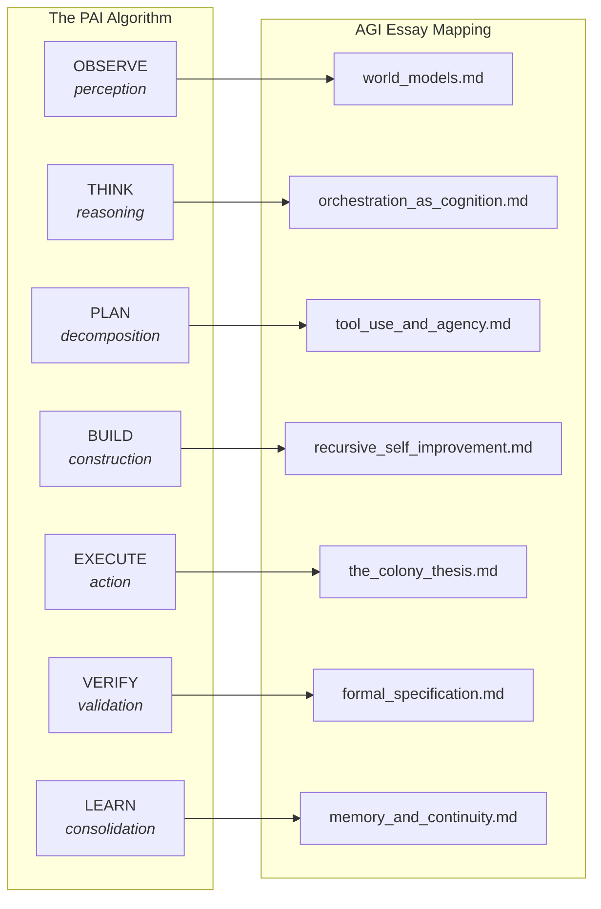

# PAI Integration: Interface Mappings, Evidence, and Formal Boundaries

**Version**: v1.3.0 | **Status**: Active | **Last Updated**: March 2026

## Overview

The AGI Perspectives documentation series analyses how the Codomyrmex module ecosystem
can be compared with theoretical requirements for Artificial General Intelligence. Within
the PAI (Personal AI Infrastructure) framework, the comparison is useful at every phase
of The Algorithm—from perception to action to learning—but a phase mapping is not
evidence that the corresponding cognitive or AGI capability is implemented.

## PAI Algorithm Phase Mapping

### Detailed Phase Analysis

| Algorithm Phase | AGI Relevance | Key Essays | Formal Framework |
|:---------------|:-------------|:-----------|:----------------|
| **OBSERVE** | World model acquisition — building internal representations from environmental data. Friston's active inference requires *generative models* of the environment. | [world_models.md](./world_models.md), [memory_and_continuity.md](./memory_and_continuity.md) | Variational free energy: F = D_KL[q(θ) ∥ p(θ\|o)] |
| **THINK** | Reasoning and planning — the cognitive executive function. Orchestration as higher-order cognition, DAG construction as STRIPS planning. | [orchestration_as_cognition.md](./orchestration_as_cognition.md), [scaffolding.md](./scaffolding.md) | IIT: Φ = I(whole) - Σ I(parts) |
| **PLAN** | Goal decomposition and workflow assembly. Tool selection as contextual bandits. Agency boundary = tool access boundary. | [orchestration_as_cognition.md](./orchestration_as_cognition.md), [tool_use_and_agency.md](./tool_use_and_agency.md) | STRIPS planning: PSPACE-complete |
| **BUILD** | Code generation and modification through a bounded change-evaluation workflow; review and release gates remain external. | [recursive_self_improvement.md](./recursive_self_improvement.md), [tool_use_and_agency.md](./tool_use_and_agency.md) | Candidate fitness model; not a deployed objective |
| **EXECUTE** | Multi-agent task execution with safety constraints. Colony model: specialized castes with stigmergic coordination. | [alignment_and_safety.md](./alignment_and_safety.md), [the_colony_thesis.md](./the_colony_thesis.md) | Response threshold: P = sⁿ/(sⁿ+θⁿ) |
| **VERIFY** | Selected formal obligations, tests, and external review. Logical limits constrain what automated checks establish. | [formal_specification.md](./formal_specification.md), [alignment_and_safety.md](./alignment_and_safety.md) | Löb's theorem as a boundary, not a solved obstacle |
| **LEARN** | Knowledge persistence and adaptive improvement. Four-tier memory with consolidation gap. Bayesian posterior updating across sessions. | [memory_and_continuity.md](./memory_and_continuity.md), [recursive_self_improvement.md](./recursive_self_improvement.md) | I_eff ≤ I_session + I_memory |

## Strategic Context

### The PAI-AGI Convergence

The AGI Perspectives series sits at the intersection of PAI's vision for Personal AI and the broader AGI research landscape. Three strategic observations:

**1. Modular AGI as Personal Intelligence**

The PAI algorithm's phase structure suggests a decomposition of AGI-relevant research
questions into composable stages, each served by candidate Codomyrmex modules. This is
compatible with Drexler's (2019) CAIS thesis, but composition of narrow services does not
by itself establish AGI-level capability or safe generality.

The critical insight: *personal* AI may be a more tractable path to functional generality than *universal* AI. A system deeply familiar with one user's context, workflows, and preferences achieves effective generality through personalization — not through universal knowledge.

**2. Safety by Architecture**

The trust model (`UNTRUSTED → VERIFIED → TRUSTED`) is a candidate control boundary that
can be compared with corrigibility-oriented designs (Soares et al., 2015). The following
Bayesian expression is a possible analysis model, not the current trust implementation:

$$P(\text{safe} \mid \text{observations}) = \frac{P(\text{observations} \mid \text{safe}) \cdot P(\text{safe})}{P(\text{observations})}$$

The current implementation updates a deterministic trust score from caller-reported
outcomes; without attestation and calibration, that score is not a posterior probability
of safety and does not ensure safe behavior.

**3. The Colony Model of Personal AI**

The Colony Thesis ([the_colony_thesis.md](./the_colony_thesis.md)) argues that the PAI system is best understood not as a single AI assistant but as a *colony* of specialized agents — foragers (search, scrape), builders (coding, templating), soldiers (defense, security), nurses (memory, validation), and scouts (llm, cerebrum). The user interacts with the colony-level behavior, not with individual agents.

### AGI Readiness Assessment

| PAI Capability | AGI Readiness | Limiting Factor |
|:--------------|:-------------|:---------------|
| Perception (OBSERVE) | Interface exists; outcome unmeasured | No causal-reasoning evaluation |
| Reasoning (THINK) | Components exist; outcome unmeasured | No validated dynamic decomposition benchmark |
| Planning (PLAN) | Workflow surface | Static workflows and explicit planning boundaries |
| Construction (BUILD) | Gated change surface | Human review and release evidence required |
| Execution (EXECUTE) | Profile-dependent | Inventory and tool counts are generated, not capability scores |
| Verification (VERIFY) | Partial | Generic obligations do not settle undecidable properties |
| Learning (LEARN) | Partial persistence | Consolidation and forgetting require experiments |

## AGI-Relevant PAI Components

### Trust Gateway as Alignment Infrastructure

The Trust Gateway can be compared with alignment concepts, but the mapping is
structural rather than an identity theorem:

| Trust Component | AGI Alignment Concept | Essay Reference |
|:---------------|:---------------------|:---------------|
| `UNTRUSTED` state | Corrigibility default | [alignment_and_safety.md](./alignment_and_safety.md) |
| Trust progression | Cooperative IRL (Hadfield-Menell) | [alignment_and_safety.md](./alignment_and_safety.md) |
| Trust revocation | Human override capability | [formal_specification.md](./formal_specification.md) |
| Per-tool trust levels | Agency lattice position 2ᵀ | [tool_use_and_agency.md](./tool_use_and_agency.md) |

### MCP Bridge as an Interface Adapter

The MCP bridge (`agents/pai/mcp_bridge.py`) is an interface adapter for selected
module-tool registrations. It should not be called a universal morphism or terminal
object: the repository has not defined a category **Mod**, shown unique morphisms, or
proved the universal property. The manuscript's
[formalism-to-code crosswalk](../manuscript/10_formalism_code_crosswalk.md) records this
as a code/interface correspondence with an explicit formal gap.

### PAI Dashboard as Metacognitive Interface

The PAI Dashboard (`http://localhost:8888`) provides the *metacognitive monitoring* discussed in [orchestration_as_cognition.md](./orchestration_as_cognition.md): mission tracking, workflow visualization, and real-time system state. This is the human's window into the colony's executive function.

## Navigation

- **Self**: [PAI.md](PAI.md) — This document
- **Parent**: [README.md](README.md) — AGI perspectives overview
- **Root PAI**: [../../PAI.md](../../PAI.md) — Main PAI documentation
- **Dashboard**: [../PAI_DASHBOARD.md](../PAI_DASHBOARD.md) — Dashboard functionality
- **docs PAI**: [../PAI.md](../PAI.md) — Documentation-level PAI reference
