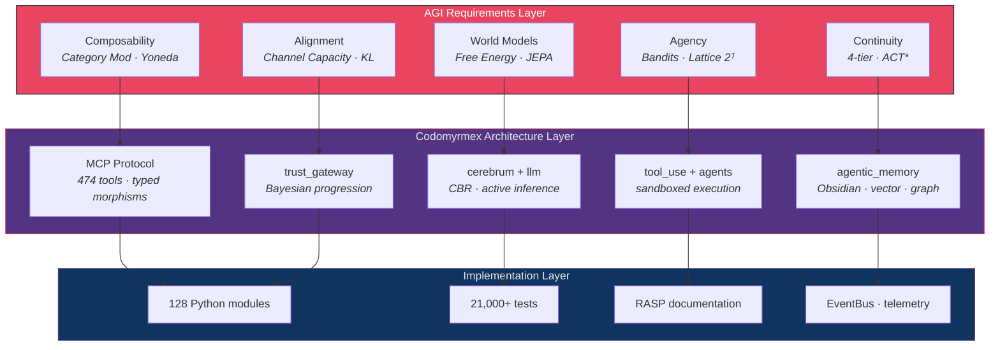
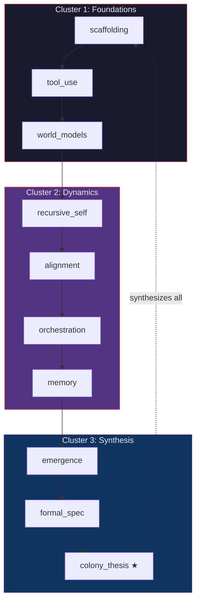

# AGI Perspectives on Codomyrmex

**Series**: Documentation Perspectives | **Version**: v1.1.4 | **Last Updated**: March 2026

## Thesis

Codomyrmex's 128-module architecture — with 474 `@mcp_tool`-decorated functions, a four-tier memory system, event-driven stigmergic coordination, and human-gated self-improvement — constitutes a *scaffold* for artificial general intelligence. Not AGI itself, but the architectural substrate upon which AGI-level capabilities could emerge from modular composition.

This series of 10 technical essays examines this claim through the lenses of category theory, information theory, computational complexity, cognitive architecture, alignment research, and evolutionary biology.

## Conceptual Architecture

## Document Index

### RASP Files (Hub Infrastructure)

| Document | Size | Purpose |
|:---------|:----:|:--------|
| [README.md](./README.md) | — | This document — series overview, maps, reading order |
| [AGENTS.md](./AGENTS.md) | 5.5K | Agent coordination: epistemic status, module-to-essay lookup |
| [SPEC.md](./SPEC.md) | 7.0K | Analytical methodology, notation conventions, quality standards |
| [PAI.md](./PAI.md) | 8.0K | PAI Algorithm phase mapping, AGI readiness assessment |

### Technical Essays

| # | Document | Core AGI Concept | Key Formalisms | Key Modules |
|:-:|:---------|:----------------|:---------------|:------------|
| 1 | [scaffolding.md](./scaffolding.md) | Architectural preconditions for AGI | Category **Mod**, Yoneda lemma, Legg-Hutter Υ(π), autopoietic closure | system_discovery, plugin_system, agentic_memory |
| 2 | [tool_use_and_agency.md](./tool_use_and_agency.md) | Autonomous tool use as proto-AGI | Contextual bandits, Thompson sampling, agency lattice 2ᵀ, extended cognition | tool_use, agents, orchestrator, skills |
| 3 | [world_models.md](./world_models.md) | Internal world representations | Variational free energy F, Riemannian manifolds, JEPA, Pearl's 3-level causal hierarchy | vector_store, graph_rag, cerebrum, spatial |
| 4 | [recursive_self_improvement.md](./recursive_self_improvement.md) | Self-modifying codebases under safety | NK fitness landscapes, Boltzmann selection, Red Queen dynamics, Solomonoff induction | coding, evolutionary_ai, ci_cd_automation |
| 5 | [alignment_and_safety.md](./alignment_and_safety.md) | Value alignment via architecture | Channel capacity I(V_H;A_S), KL anomaly detection, CIRL, Jensen-Shannon divergence | defense, trust, validation, identity |
| 6 | [orchestration_as_cognition.md](./orchestration_as_cognition.md) | Executive function as DAG planning | IIT Φ, STRIPS (PSPACE-complete), transformer attention, Norman-Shallice SAS | orchestrator, events, skills, cerebrum |
| 7 | [memory_and_continuity.md](./memory_and_continuity.md) | Persistent knowledge foundations | ACT* proceduralisation, McClelland CLS, Ebbinghaus spacing, rational analysis | agentic_memory, vector_store, graph_rag, cache |
| 8 | [emergence_and_scale.md](./emergence_and_scale.md) | Emergent capability from module composition | Percolation p_c = 1/⟨k⟩, renormalization group, transfer entropy, allostasis | events, telemetry, defense, logging_monitoring |
| 9 | [formal_specification.md](./formal_specification.md) | Provable safety for self-modifying AI | Arithmetical hierarchy Σ₀⁰→Σ₂⁰, Löb's theorem, sheaf cohomology H¹(G,F), Hoare triples | formal_verification, static_analysis, validation |
| 10 | [the_colony_thesis.md](./the_colony_thesis.md) | Distributed AGI as ant colony (capstone) | Response thresholds, Minsky K-lines, Hofstadter strange loops, hard problem analogue | All 128 modules composed via EventBus |

## Suggested Reading Order

**Three-track alternatives:**

| Track | Focus | Essays | Time |
|:------|:------|:-------|:-----|
| **Architecture** | How does it work? | 1 → 2 → 6 → 7 → 10 | ~25 minutes |
| **Safety** | Is it safe? | 5 → 4 → 9 → 10 | ~20 minutes |
| **Theory** | What does it mean? | 3 → 8 → 9 → 10 | ~20 minutes |

## Theoretical Lineage

The 10 essays draw from 60+ primary literature sources across seven intellectual traditions:

| Tradition | Key Theorists | Essays Citing | Core Idea |
|:----------|:-------------|:-------------|:----------|
| **AGI Architecture** | Goertzel, Newell, Laird, Lake | 1, 6 | Unified cognitive architectures |
| **Category Theory** | Mac Lane, Yoneda | 1, 9 | Composability via morphisms |
| **Information Theory** | Shannon, Kolmogorov, Friston | 3, 5, 8 | Free energy, channel capacity |
| **Computability** | Turing, Rice, Gödel, Löb | 4, 9 | Decidability limits on verification |
| **Alignment Research** | Russell, Amodei, Christiano, Drexler | 5, 10 | Value loading, corrigibility, CAIS |
| **Cognitive Neuroscience** | Baars, Baddeley, Tulving, Dehaene | 6, 7 | GWT, working memory, episodic memory |
| **Complex Systems** | Anderson, Kauffman, Minsky, Hölldobler | 8, 10 | Emergence, NK models, superorganisms |
| **Evolutionary Biology** | Wright, van Valen, Bonabeau | 4, 10 | Fitness landscapes, Red Queen, thresholds |

## Information Architecture of the Series

The 10 essays form a connected graph where each essay cites and is cited by multiple others. The citation pattern reveals three structural clusters:

## Series-Level Gap Summary

Across all 10 essays, the gap analyses identify these recurring systemic gaps:

| Gap | Identified In | Formal Barrier | Impact |
|:----|:-------------|:--------------|:-------|
| No causal reasoning (do-calculus) | world_models, emergence | Requires SCM + interventional queries | Cannot reason about consequences of actions |
| No dynamic DAG synthesis | orchestration | PSPACE-complete in general | Cannot plan novel workflows |
| No automatic memory consolidation | memory | Need hippocampal replay analogue | Knowledge doesn't accumulate across sessions automatically |
| No multimodal binding (Φ function) | world_models, memory | Need cross-representation alignment | Fragmented instead of unified understanding |
| No adaptive forgetting | memory | Need rational decay function | Memory fills without prioritization |
| No tool creation | tool_use | Need code-synthesis-register loop | Cannot extend its own capability space |
| Undecidable self-modification safety | formal_spec | Gödelian limits at Σ₂⁰ | Human oracle required permanently |

## Cross-Series Links

| Topic | Bio Perspective | Cognitive Perspective | AGI Perspective |
|:------|:---------------|:---------------------|:---------------|
| Coordination | [stigmergy.md](../bio/stigmergy.md) | [stigmergy.md](../cognitive/stigmergy.md) | [the_colony_thesis.md](./the_colony_thesis.md) |
| Memory | [memory_and_forgetting.md](../bio/memory_and_forgetting.md) | [cognitive_modeling.md](../cognitive/cognitive_modeling.md) | [memory_and_continuity.md](./memory_and_continuity.md) |
| Organization | [superorganism.md](../bio/superorganism.md) | [industrialization.md](../cognitive/industrialization.md) | [scaffolding.md](./scaffolding.md) |
| Security | [immune_system.md](../bio/immune_system.md) | [cognitive_security.md](../cognitive/cognitive_security.md) | [alignment_and_safety.md](./alignment_and_safety.md) |
| Adaptation | [evolution.md](../bio/evolution.md) | [active_inference.md](../cognitive/active_inference.md) | [recursive_self_improvement.md](./recursive_self_improvement.md) |

## Navigation

- **Parent**: [docs/README.md](../README.md) — Documentation hub
- **Sister Series**: [docs/bio/README.md](../bio/README.md) · [docs/cognitive/README.md](../cognitive/README.md)
- **Project Root**: [../../README.md](../../README.md)
- **PAI Integration**: [PAI.md](./PAI.md)
