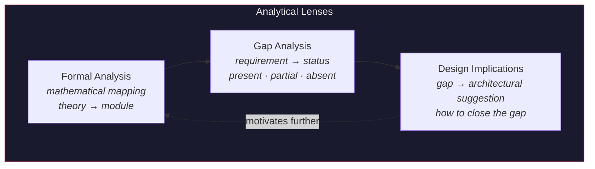
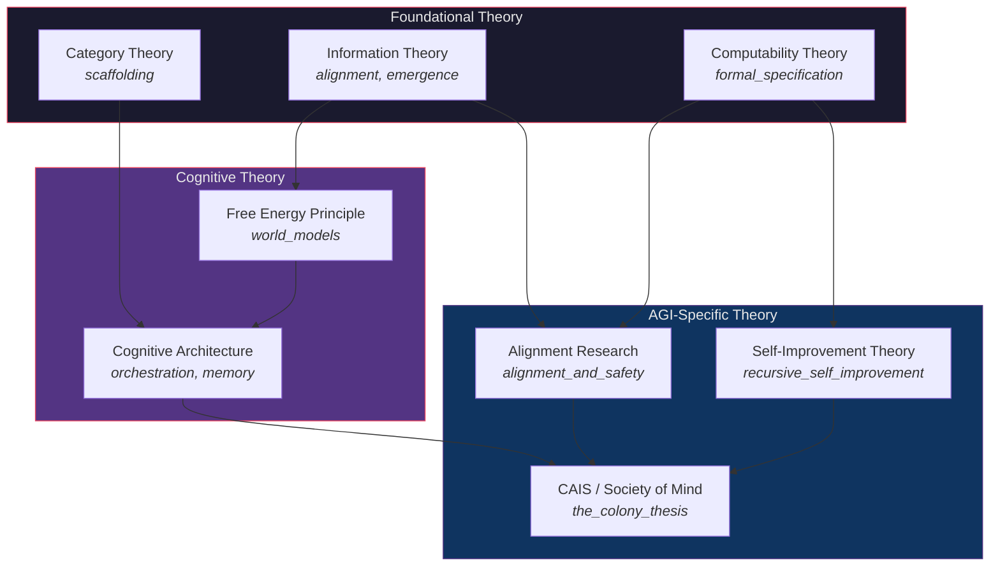

# AGI Perspectives — Functional Specification

**Version**: v1.1.6 | **Status**: Active | **Last Updated**: March 2026

## Purpose

Technical specification for the AGI Perspectives documentation series. Defines scope, structural requirements, quality standards, and the analytical methodology used across all ten essays.

## Scope & Boundaries

### In Scope

- Mapping AGI theoretical requirements to codomyrmex module implementations
- Gap analysis: what codomyrmex provides vs. what AGI theory requires
- Design pattern identification in existing modules relevant to AGI goals
- Safety and alignment analysis of the current architecture
- Cross-references to biological and cognitive perspective series
- Mathematical formalisms from information theory, category theory, computational complexity, and cognitive neuroscience

### Out of Scope

- Claiming codomyrmex is an AGI system (it is scaffolding, not AGI)
- Proposing new modules or features (those belong in `TODO.md`)
- Implementation specifications (those belong in module `SPEC.md` files)
- Benchmark comparisons with other systems
- Speculative timelines for AGI development

## Analytical Methodology

### The Three-Lens Framework

Each essay applies three analytical lenses:

### Essay Structure Template

Every essay follows this canonical structure:

1. **Theoretical Foundation** (~500 words) — Introduce the AGI concept with citations to primary literature. State the core thesis formally.
2. **Architecture Diagram** — Mermaid diagram showing module relationships for the specific concept. Use consistent dark styling.
3. **Codomyrmex Mapping** (~1,000 words) — Identify which modules implement, approximate, or relate to the concept. Use code-level references (`ClassName`, `function_name()`, `module/submodule/`).
4. **Mathematical Formalism** (~300 words) — Express the mapping in mathematical notation where applicable (LaTeX inline: `$...$`, display: `$$...$$`).
5. **Gap Analysis Table** — Status (✅ ⚠️ ❌) + description for each capability.
6. **Design Implications** (~200 words) — How existing modules could evolve to address gaps.
7. **Cross-References** — Links to corresponding bio/ and cognitive/ essays + prev/next navigation.
8. **References** — ≥5 primary literature citations per essay.

### Mathematical Notation Conventions

| Domain | Notation | Example |
|:-------|:---------|:--------|
| Category theory | Bold serif | **Mod**, **Typ**, Hom(**Mod**) |
| Probability | Italic | P(safe \| observations), q(θ) |
| Information theory | Calligraphic operators | H(X), I(X;Y), D_KL(p∥q) |
| Logic | Box/diamond | □P (provably P), ◇P (possibly P) |
| Complexity | Big-O | O(V+E), PSPACE |
| Sets | Blackboard bold | ℝ^d, ℕ, 2^T |
| Functions | Sans-serif | F(C,T,M), G(s), L(θ) |

## Quality Standards

### Citation Requirements

| Standard | Threshold | Example |
|:---------|:---------|:--------|
| Primary literature per essay | ≥ 5 | Journals, conferences, technical reports |
| Named theorists per essay | ≥ 3 | Theory attributed to specific researchers |
| Cross-references to bio/cognitive | ≥ 2 | Explicit links to parallel essays |
| Module references per essay | ≥ 5 | Specific `src/codomyrmex/<module>/` paths |

### Module Mapping Standards

- Must reference actual module paths (`src/codomyrmex/<module>/`)
- Must identify specific classes or functions where possible (e.g., `ActiveInferenceAgent`, `scan_all_modules()`)
- Must distinguish between:
  - **Identity mapping**: module *implements* the formal concept (e.g., `shannon_entropy()` *is* Shannon's H)
  - **Structural analogy**: module exhibits pattern similarity (e.g., EventBus *resembles* GWT broadcasting)
  - **Aspirational**: concept is absent but module could be extended (e.g., causal reasoning)

### Diagram Standards

- Every essay: ≥ 1 Mermaid diagram, preferably 2–3
- Use consistent dark theme: `fill:#1a1a2e`, `stroke:#e94560`, `color:#e8e8e8`
- Accent color for highlights: `fill:#e94560,stroke:#1a1a2e,color:#fff`
- Label edges with module names or formal relations
- Group related modules in named subgraphs

## Document Inventory

| # | File | Bytes | Key AGI Concept | Key Formalisms |
|:-:|:-----|:-----:|:------|:------|
| 1 | `scaffolding.md` | 11,783 | Architectural preconditions | Category **Mod**, Yoneda lemma, Legg-Hutter Υ(π) |
| 2 | `tool_use_and_agency.md` | 10,271 | Autonomous tool use | Contextual bandits, agency lattice 2ᵀ, Thompson sampling |
| 3 | `world_models.md` | 11,391 | Internal representations | Variational free energy F, JEPA, Pearl's causal hierarchy |
| 4 | `recursive_self_improvement.md` | 10,212 | Self-modifying systems | NK fitness landscapes, Boltzmann selection, Red Queen |
| 5 | `alignment_and_safety.md` | 10,041 | Value alignment | Channel capacity I(V_H;A_S), KL anomaly detection |
| 6 | `orchestration_as_cognition.md` | 10,831 | Executive function | IIT Φ, STRIPS (PSPACE), transformer attention |
| 7 | `memory_and_continuity.md` | 13,774 | Persistent knowledge | ACT* proceduralisation, CLS, rational analysis |
| 8 | `emergence_and_scale.md` | 11,494 | Emergent capabilities | Percolation p_c, renormalization, transfer entropy |
| 9 | `formal_specification.md` | 11,076 | Provable safety | Arithmetical hierarchy, Löb's theorem, sheaf cohomology |
| 10 | `the_colony_thesis.md` | 14,961 | Distributed AGI | Response thresholds, K-lines, hard problem analogue |

## Theoretical Dependencies

## Navigation

- **Human Documentation**: [README.md](README.md) — Series overview and reading order
- **Agent Documentation**: [AGENTS.md](AGENTS.md) — Agent coordination
- **PAI Context**: [PAI.md](PAI.md) — PAI integration
- **Parent**: [docs/README.md](../README.md) — Documentation hub
- **Repository Root**: [../../README.md](../../README.md)
