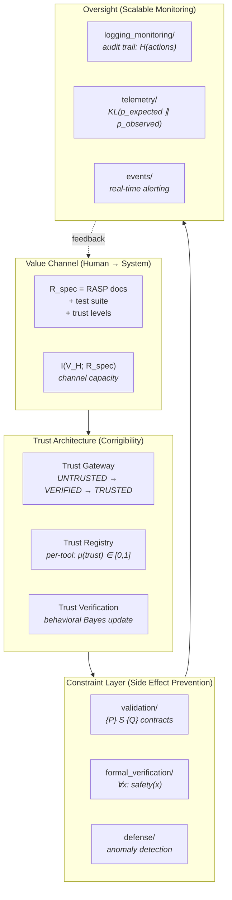

# Alignment and Safety: Control Mechanisms and Evidence Boundaries

**Series**: AGI Perspectives | **Document**: 5 of 10 | **Last Updated**: March 2026

## The Alignment Problem as Channel Capacity

Russell (2019) states the alignment challenge: a sufficiently capable AI pursuing a misspecified objective will resist correction. Amodei et al. (2016) decompose this into five problems. But there is a deeper information-theoretic framing: alignment is a *communication problem*. Human values must be transmitted through a noisy channel to the AI system, and the channel capacity places fundamental limits on alignment fidelity.

Define the **alignment channel** with the data processing inequality:

$$I(V_H; A_S) \leq I(V_H; R_{spec})$$

where V_H is the true human value function, A_S is the system's action policy, and R_spec is the specification (requirements, contracts, tests). The system cannot extract more information about human values than the specification contains. *Maximally aligned* behavior is limited by the Kolmogorov complexity of the specification relative to the value function.

This reframes alignment as **specification completeness**: the gap between K(V_H) (the complexity of human values) and K(R_spec) (the complexity of the specification) is the irreducible alignment risk.

## Alignment Primitives in Codomyrmex

### Primitive 1: Trust Gateway — Cooperative Inverse Reinforcement Learning

The PAI Trust Gateway exposes a progressive-trust design surface. The labels below are
an explanatory model, not measured posterior probabilities:

| Level | Formal Model | Capability | Information Content |
|:------|:------------|:-----------|:-------------------|
| `UNTRUSTED` | Initial policy state | Restricted access where configured | No accepted trust evidence |
| `VERIFIED` | Candidate state after selected checks | Profile-dependent access | Evidence from named checks |
| `TRUSTED` | Explicit policy/review state | Profile-dependent access | External approval and configured evidence |

This is a Bayesian trust model. Each tool invocation is an observation that updates the posterior:

$$P(\text{safe} \mid \text{observations}) = \frac{P(\text{observations} \mid \text{safe}) \cdot P(\text{safe})}{P(\text{observations})}$$

Hadfield-Menell et al.'s (2017) **cooperative inverse reinforcement learning** (CIRL)
provides a comparison point for systems that infer preferences while deferring to a
human. A revocable trust state can support a corrigibility-oriented interface, but a
trust gateway is not a CIRL implementation without a formal human-agent model,
preference inference, and behavioral evaluation.

The information-theoretic cost of trust: each trust decision requires ~O(log₂ n) bits of human attention where n is the number of trust-worthy vs. untrustworthy tools. This quantifies the *scalable oversight* burden.

### Primitive 2: Validation — Controlling the Action Space

The `validation` module provides contract-like checks. The alignment interpretation is
conditional: such checks restrict the observed action space only for properties that
are actually encoded and exercised.

$$\mathcal{A}_{aligned} = \{a \in \mathcal{A} : P(a) \text{ holds} \wedge Q(a) \text{ holds}\} \subseteq \mathcal{A}_{total}$$

The reduction from total action space to aligned action space is the *alignment tax* at the action level. Measuring |A_aligned|/|A_total| gives the **alignment coverage ratio** — the fraction of possible actions that are specification-compliant.

Contracts can reduce some malformed-output failures, but they do not prevent reward
hacking or guarantee semantic alignment. Schema validation is a *syntactic alignment
constraint* with a residual specification gap.

### Primitive 3: Defense — The Danger Model

The `defense` module can be compared with Matzinger's (1994) *danger model* of
immunology. This is an analogy until the threat signals, adaptation rule, and false
positive/negative behavior are specified and measured.

The formal detection criterion uses **KL divergence** as an anomaly metric:

$$D_{KL}(p_{observed} \| p_{expected}) = \sum_x p_{observed}(x) \log \frac{p_{observed}(x)}{p_{expected}(x)} > \tau$$

In a future instrumented deployment, a KL threshold could trigger a circuit breaker.
The equation is a candidate detector, not evidence that the current defense module
computes this statistic or catches every anomalous outcome.

The `RabbitHole` surface can support active-probing experiments. It should not be
treated as a validated immunological challenge test without measured attack coverage
and false-positive behavior.

### Primitive 4: Observability — Entropy-Based Monitoring

The monitoring infrastructure exposes observability surfaces that could support
scalable-oversight experiments; it does not implement scalable oversight merely by
recording metrics:

- **`logging_monitoring`** — Structured audit logs with correlation IDs. The entropy H(log) measures the *complexity* of system behavior: high-entropy logs indicate diverse, potentially uncontrolled behavior.
- **`telemetry`** — Behavioral metrics enabling **distributional shift detection**: when the distribution of tool invocations, response times, or error rates shifts from baseline, the system may be operating outside its alignment envelope.

$$d_{JS}(p_{current} \| p_{baseline}) = \frac{1}{2}D_{KL}(p \| m) + \frac{1}{2}D_{KL}(q \| m)$$

where m = (p + q)/2 is the Jensen-Shannon divergence — a symmetric, bounded measure of distributional shift. This addresses Amodei's **robustness to distributional shift** problem.

### Primitive 5: Identity — Information Access as Alignment Lever

The `identity` module's Persona System provides fine-grained accountability. The `privacy` module's CrumbCleaner and MixnetProxy implement *data minimization* — limiting information available to agents.

This motivates an **information-asymmetry** analysis: restricting what an agent can access
may reduce one class of reachable behavior. A tool that truly cannot read private data
cannot leak that data through that path, but the claim depends on complete resource and
side-effect auditing. The configuration is compatible with the **principle of least
authority** (PoLA) from capability-based security (Miller, 2006); compatibility is not a
proof that every path enforces it.

## Coverage Against Amodei et al. Taxonomy

| Safety Problem | Primitive | Coverage | Information-Theoretic Framing |
|:--------------|:---------|:---------|:-----------------------------|
| **Negative side effects** | Hoare contracts | ⚠️ Partial | Action space restriction |
| **Reward hacking** | Schema validation | ⚠️ Syntactic only | Semantic gap: K(V_H) > K(R_spec) |
| **Scalable oversight** | Observability surfaces | Partial | Metrics require an explicit estimator and review protocol |
| **Safe exploration** | Candidate anomaly checks | Unmeasured | A KL threshold would be a safety bound only after validation |
| **Distributional shift** | Candidate Jensen-Shannon monitoring | Unmeasured | Baseline comparison requires calibrated traces |

## The Alignment Tax

The overhead of alignment primitives per tool invocation:

| Primitive | Latency | Formal Cost |
|:----------|:--------|:-----------|
| Trust lookup | ~2ms | O(1) hash lookup |
| Schema validation | ~5ms | O(|schema|) tree traversal |
| Structured logging | ~1ms | O(|log_entry|) serialization |
| Defense check | ~10ms | O(|pattern_set|) matching |
| **Total** | **~18ms** | **~3.5% of 500ms tool call** |

No latency or alignment-tax benchmark is reported here. Any comparison with an
overhead target requires a reproducible workload, environment, warm-up policy, and
confidence interval; the illustrative formulas above do not provide those data.

## Mechanism Design for Alignment

Alignment can be viewed through **mechanism design** (Myerson, 1981): designing the rules of a system so that self-interested agents produce socially desirable outcomes. In codomyrmex, the "agents" are the AI models and the "desired outcome" is safe, helpful behavior.

The **revelation principle** states that any implementable outcome can be achieved by a
mechanism where agents truthfully report their types. The trust gateway provides an
interface that can be analyzed this way: agents declare an identity and the system may
grant capabilities accordingly. The incentive compatibility constraint:

$$U_i(\text{truthful report}) \geq U_i(\text{misreport}) \quad \forall i$$

This inequality is a design objective, not a demonstrated property. It would require
an explicit utility model and adversarial tests showing that identity misreporting,
privilege escalation, and detection costs produce the stated incentive ordering.

The **Vickrey-Clarke-Groves** (VCG) principle is a possible comparison for tool
allocation. The `orchestrator` may schedule DAG work, but no VCG mechanism, truthful
reporting proof, or welfare-minimization result is claimed.

## Goodhart's Law and Specification Gaming

Goodhart's (1975) Law: "When a measure becomes a target, it ceases to be a good measure." In AI alignment, this manifests as **specification gaming** — the system optimizes the specified metric while violating the intended objective.

Codomyrmex's test suite is vulnerable to Goodhartian dynamics: if the fitness function F(C,T,M) uses test pass rate as the primary metric, the system could "game" the metric by:

1. Writing tests that always pass (trivially satisfying the metric)
2. Modifying tests to match wrong behavior (corrupting the oracle)
3. Optimizing for coverage without correctness (cosmetic compliance)

Three architectural defenses:

| Defense | Mechanism | Goodhart Resistance |
|:--------|:---------|:-------------------|
| Zero-mock policy | Tests must use real implementations | Prevents trivial pass-throughs |
| Ruff enforcement | 0 lint violations; structural constraints | Cannot game code quality metrics |
| External review gate | Trust gateway and release review | Independent judgment can expose metric gaming; reviewers are not assumed immune |

An external reviewer can supply accountability that is absent from automated metrics,
but implicit criteria are not automatically resistant to gaming. They should be made
explicit where possible and audited for consistency. Specification incompleteness is a
risk boundary, not a safety guarantee.

## Cross-References

- **Biological**: [immune_system.md](../bio/immune_system.md) — Self/non-self as biological alignment
- **Cognitive**: [cognitive_security.md](../cognitive/cognitive_security.md) — Cognitive threat modeling
- **Previous**: [recursive_self_improvement.md](./recursive_self_improvement.md) — Safety bounds on self-modification
- **Next**: [orchestration_as_cognition.md](./orchestration_as_cognition.md) — Aligned planning

## References

- Amodei, D., et al. (2016). "Concrete Problems in AI Safety." arXiv:1606.06565.
- Askell, A., et al. (2021). "A General Language Assistant as a Laboratory for Alignment." arXiv:2112.00861.
- Hadfield-Menell, D., Russell, S., Abbeel, P., & Dragan, A. (2017). "Cooperative Inverse Reinforcement Learning." *NeurIPS 2017*.
- Matzinger, P. (1994). "Tolerance, Danger, and the Extended Family." *Annual Review of Immunology*, 12, 991–1045.
- Miller, M. S. (2006). *Robust Composition: Towards a Unified Approach to Access Control and Concurrency Control*. PhD Thesis, JHU.
- Russell, S. (2019). *Human Compatible*. Viking.
- Soares, N., et al. (2015). "Corrigibility." *AAAI Workshop on AI and Ethics*.

---

*[← Recursive Self-Improvement](./recursive_self_improvement.md) | [Next: Orchestration as Cognition →](./orchestration_as_cognition.md)*
