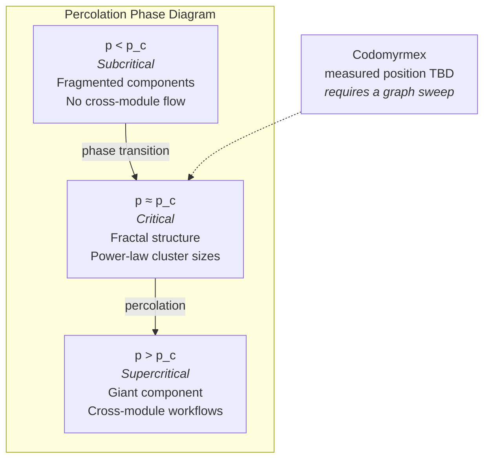

# Composition and Scale: Testable Hypotheses, Not Measured Emergence

**Series**: AGI Perspectives | **Document**: 8 of 10 | **Last Updated**: March 2026

## The Emergence Thesis

Anderson's (1972) foundational essay "More Is Different" argues that complex systems exhibit properties at scale that cannot be predicted from their individual components — a claim that the reductive program of physics fails at each level of organizational complexity. In AGI research, Wei et al. (2022) documented "emergent abilities" of large language models — capabilities that appear as sharp phase transitions above certain scale thresholds, absent below them. Kauffman (1993) showed that random Boolean networks produce self-organized criticality at sufficient connectivity — order at the edge of chaos.

But emergence is not a label that follows from architectural size. It requires a
defined order parameter, a scale manipulation, baselines, ablations, and a preregistered
criterion that separates interaction effects from component performance. This essay
therefore treats four possible interaction effects as hypotheses and identifies the
measurements needed to test them.

## The Percolation Model

The repository's dependency graph is a directed network whose current node and edge
counts are generated by the inventory tooling. It can be used as input to a
**percolation** analysis (Stauffer & Aharony, 1994), but the graph is not a random graph
and therefore a textbook threshold is not automatically applicable.

Define the occupation probability *p* as the fraction of modules that are functional (i.e., pass health checks). Below a critical threshold *p_c*, the graph fragments into disconnected components — cross-module workflows are impossible. Above *p_c*, a **giant connected component** emerges spanning the system.

For a specified random-graph null model with mean degree ⟨k⟩, a simplified criterion is:

$$p_c \approx \frac{1}{\langle k \rangle}$$

This expression is a null-model heuristic, not a measured Codomyrmex threshold.
Functional reachability depends on direction, interface compatibility, health-test
coverage, permissions, and workflow semantics. `system_discovery` health is also not a
substitute for reachable, useful compositions. A defensible experiment would sweep
module subsets, preserve dependency constraints, and report giant-component size and
task-level yield with confidence intervals.

## Four Emergent Capabilities

### 1. Cross-Domain Transfer via Shared Representations

No single module is documented as performing the proposed "cross-domain reasoning"
outcome. A possible experiment is to test representation sharing across a
`vector_store → graph_rag → cerebrum` route. MCP provides an invocation interface; it
does not by itself establish cognitive penetrability or semantic alignment.

The candidate mechanism is **representation alignment**: overlapping embeddings might
support transfer if the representations preserve task-relevant structure. Cosine
similarity alone does not establish analogy or transfer, so the experiment must compare
paired tasks against lexical, retrieval-only, and reasoning baselines.

Information-theoretically, cross-domain transfer is possible when the **transfer entropy** between domain representations exceeds noise:

$$T_{X \to Y} = \sum p(y_{t+1}, y_t, x_t) \log \frac{p(y_{t+1} | y_t, x_t)}{p(y_{t+1} | y_t)} > \epsilon$$

### 2. Self-Healing via Stigmergic Feedback

The combination of `defense`, `ci_cd_automation`, `telemetry`, and `maintenance` is a
candidate control-loop architecture. It should not be called autonomic computing or
self-healing until detection, diagnosis, repair, and recovery are exercised together
under fault injection.

If those components are connected into a feedback loop, a control-theoretic analysis
could use a transfer function such as:

$$H(s) = \frac{G(s)}{1 + G(s) \cdot F(s)}$$

where G(s) is the forward path and F(s) is the feedback path. Stability would require
an explicit model and measured parameters; rate-limiting alone does not show that the
Nyquist condition holds.

The biological parallel is **allostasis** (Sterling, 2012): maintaining stability through change, rather than homeostasis which maintains a fixed setpoint. The system adjusts its defensive posture in response to observed threats, modifying trust levels and capability access dynamically.

### 3. Adaptive Security as Immune Self-Organization

The `defense → identity → trust → privacy → events` feedback chain exhibits properties analogous to the vertebrate *adaptive immune system* (Forrest et al., 1994):

| Immune Function | Module Implementation | Mechanism |
|:---------------|:---------------------|:----------|
| Innate immunity (pattern recognition) | `defense/` exploit detectors | Static rule matching |
| Adaptive immunity (clonal selection) | EventBus → trust level adjustment | Dynamic trust modification |
| Immunological memory | `agentic_memory` threat records | Recall of past attack patterns |
| Self/non-self discrimination | `identity/` persona verification | Credential-based authentication |
| Tolerance (avoiding autoimmunity) | `privacy/` data minimization | Preventing over-aggressive defense |

This can be compared with Matzinger's (1994) *danger model* as a design analogy. The
repository should not be described as instantiating that biological model unless its
signals, classifiers, adaptation rule, and false-positive behavior are specified and
measured.

### 4. Knowledge Amplification via Stigmergic Accumulation

When agents deposit tool outputs into `agentic_memory` and `vector_store`, later agents
may consume those traces. A superlinear knowledge-growth law is a hypothesis, not an
observation:

$$K(n, t) \sim n \cdot t \cdot \log(n \cdot t)$$

The log factor would need to be estimated from longitudinal, deduplicated traces and
task outcomes. It cannot be inferred from the existence of storage or cross-references.

The formal connection to the **PageRank algorithm** is instructive: knowledge traces form a directed graph where edges represent citations/references. The eigenvector centrality of this graph — computed by `graph_rag/` — identifies the most *structurally important* knowledge, amplifying high-value information disproportionately.

## Phase Transition Evidence: An Unrun Protocol

Wei et al.'s (2022) work motivates testing whether measured capability curves are
smooth, discontinuous, or explained by evaluation artifacts. No phase transitions or
thresholds are claimed for Codomyrmex. The inventory is a snapshot, not a scale sweep,
and module count is not an order parameter for competence.

| Hypothesis | Candidate order parameter | Required intervention | Required evidence |
|:-----------|:--------------------------|:----------------------|:------------------|
| Composition improves with compatible interfaces | Valid workflow yield | Remove or add modules while preserving task prompts | Paired task success, failure propagation, and confidence intervals |
| Discovery supports planning | Planning validity after inventory changes | Hide or expose capability metadata | Plan quality, selection accuracy, and update latency |
| Representations support transfer | Held-out cross-domain task score | Compare aligned versus mismatched stores | Baselines, ablations, and preregistered transfer metric |
| Feedback supports recovery | Recovery time and residual damage | Inject controlled faults | Recovery rate, false positives, and rollback outcomes |

The existing dependency cycle is a candidate path to instrument, not evidence that a
self-healing loop is present or stable.

## Renormalization and Scale Invariance

A deeper theoretical connection: Wilson's (1971) renormalization group shows that systems near criticality exhibit **scale invariance** — the same patterns repeat at different scales. Does codomyrmex exhibit scale invariance?

Partial evidence: the RASP documentation pattern repeats at every scale:

- Module level: `src/codomyrmex/<module>/README.md`
- Directory level: `src/README.md`, `docs/README.md`
- Project level: `README.md`

The repeated documentation pattern is an engineering convention. It may support
maintainability, but recurrence of a file layout does not establish fractal
self-similarity, autopoietic closure, scale invariance, or a necessary condition for
emergence.

## "More Is Different": Qualitative Phase Transitions

Anderson's deeper point is that at each level of complexity, **qualitatively new phenomena emerge** that cannot be predicted from the laws governing the level below. The relationship between levels is not ontological reduction but *broken symmetry*.

Applied to repository growth, the phase analogy is a possible visualization for a
historical inventory series. The current repository does not supply a validated causal
mapping from module count to qualitative capability phases:

| Module Count | Phase | Emergent Capability | Symmetry Broken |
|:-------------|:------|:-------------------|:---------------|
| Inventory band | Analogy | Candidate observable | Status |
|:---------------|:--------|:--------------------|:-------|
| Small | Gas | Independent operation | Historical metaphor only |
| Intermediate | Liquid/crystal | Compatible workflow yield | Requires a scale sweep |
| Larger | Adaptive coupling | Recovery and planning metrics | Unmeasured |

The symmetry-breaking language is interpretive. No module-count threshold, including a
future count, is asserted; dynamic planning must be measured directly rather than
predicted from inventory size.

## Scaling Laws and Critical Thresholds

Kaplan et al. (2020) identified **scaling laws** for neural networks: loss follows a power law in compute, data, and parameters. Analogous scaling laws may govern modular AI systems:

$$C_{emergent}(n) = C_0 \cdot n^{-\alpha} + C_{interaction} \cdot n^{\beta}$$

where n is module count, C₀ is per-module capability (decreasing — each module becomes more specialized), C_interaction is interaction capability (increasing — more paths through the dependency graph), α governs specialization rate, and β governs interaction scaling.

The crossover point cannot be calculated without estimates of the parameters and a
validated capability metric. The equation is therefore a model specification for a
future fit, not evidence of a superlinear regime. Inventory, memory, and cross-reference
counts should be injected into generated reports when measured, not copied into this
essay as predictions.

## Gap Analysis

| Property | Status | Formal Gap |
|:---------|:-------|:-----------|
| Emergent composition | Hypothesis | Define valid composition and compare against component baselines |
| Percolation threshold | Unmeasured | Run graph interventions under an explicit null model |
| Scale invariance | Convention observed | Test structural recurrence and its effect on maintenance |
| Transfer entropy | Not implemented | Add trace schema, estimator, bias controls, and task linkage |
| Combinatorial search | Partial tooling surface | Enumerate compatible workflows with effects, budgets, and rollback |

## Cross-References

- **Biological**: [superorganism.md](../bio/superorganism.md) — Emergence in biological colonies
- **Biological**: [immune_system.md](../bio/immune_system.md) — Adaptive immunity as emergent defense
- **Cognitive**: [signal_information_theory.md](../cognitive/signal_information_theory.md) — Information-theoretic conditions for emergence
- **Previous**: [memory_and_continuity.md](./memory_and_continuity.md) — Memory enables cross-task emergence
- **Next**: [formal_specification.md](./formal_specification.md) — Can we formally specify emergent properties?

## References

- Anderson, P. W. (1972). "More Is Different." *Science*, 177(4047), 393–396.
- Fodor, J. A. (1983). *The Modularity of Mind*. MIT Press.
- Forrest, S., Perelson, A. S., Allen, L., & Cherukuri, R. (1994). "Self-Nonself Discrimination in a Computer." *IEEE Symposium on Security and Privacy*.
- Gentner, D. (1983). "Structure-Mapping: A Theoretical Framework for Analogy." *Cognitive Science*, 7(2), 155–170.
- Heylighen, F. (2008). "Accelerating Socio-Technological Evolution." In *Bentley & Kumar* (eds.), *Growth, Complexity, and Macro-Intelligence*.
- Kauffman, S. A. (1993). *The Origins of Order*. Oxford University Press.
- Kephart, J. O., & Chess, D. M. (2003). "The Vision of Autonomic Computing." *IEEE Computer*, 36(1), 41–50.
- Matzinger, P. (1994). "Tolerance, Danger, and the Extended Family." *Annual Review of Immunology*, 12, 991–1045.
- Stauffer, D., & Aharony, A. (1994). *Introduction to Percolation Theory*. Taylor & Francis.
- Sterling, P. (2012). "Allostasis: A Model of Predictive Regulation." *Physiology & Behavior*, 106(1), 5–15.
- Wei, J., et al. (2022). "Emergent Abilities of Large Language Models." *TMLR*.
- Wilson, K. G. (1971). "Renormalization Group and Critical Phenomena." *Physical Review B*, 4(9), 3174–3183.

---

*[← Memory & Continuity](./memory_and_continuity.md) | [Next: Formal Specification →](./formal_specification.md)*
