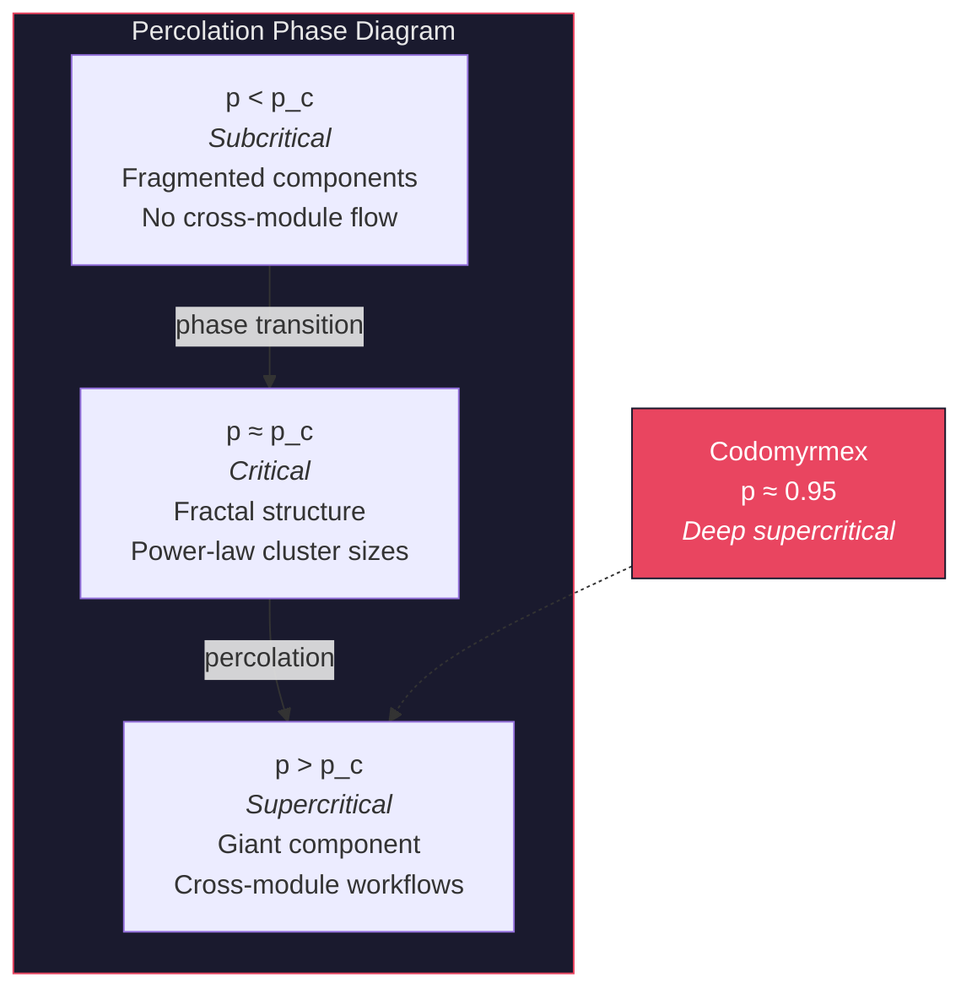

# Emergence and Scale: Phase Transitions in Modular Composition

**Series**: AGI Perspectives | **Document**: 8 of 10 | **Last Updated**: March 2026

## The Emergence Thesis

Anderson's (1972) foundational essay "More Is Different" argues that complex systems exhibit properties at scale that cannot be predicted from their individual components — a claim that the reductive program of physics fails at each level of organizational complexity. In AGI research, Wei et al. (2022) documented "emergent abilities" of large language models — capabilities that appear as sharp phase transitions above certain scale thresholds, absent below them. Kauffman (1993) showed that random Boolean networks produce self-organized criticality at sufficient connectivity — order at the edge of chaos.

But emergence is not magic. It has formal structure. This essay traces four emergent capabilities in the codomyrmex 128-module ecosystem, analyzing each through the lens of statistical mechanics, percolation theory, and information-theoretic complexity.

## The Percolation Model

Codomyrmex's dependency graph is a directed network with 127 nodes and 440+ edges. We can model emergent cross-module capabilities using **bond percolation** on this graph (Stauffer & Aharony, 1994).

Define the occupation probability *p* as the fraction of modules that are functional (i.e., pass health checks). Below a critical threshold *p_c*, the graph fragments into disconnected components — cross-module workflows are impossible. Above *p_c*, a **giant connected component** emerges spanning the system.

For random graphs with mean degree ⟨k⟩, the Molloy-Reed criterion gives:

$$p_c = \frac{1}{\langle k \rangle} = \frac{1}{440/127} \approx 0.289$$

This means that when ≥29% of modules are functional, a giant component exists. In practice, `system_discovery` reports ~95% module health (120/127 pass import checks), placing the system deep into the supercritical regime — well above the percolation threshold.

## Four Emergent Capabilities

### 1. Cross-Domain Transfer via Shared Representations

No single module performs "cross-domain reasoning." The capability arises from **representation sharing** across the `vector_store → graph_rag → cerebrum` triad. Fodor (1983) argued that cognitive modules are informationally encapsulated — but codomyrmex explicitly violates Fodorian encapsulation through the MCP protocol, which enables *cognitive penetrability* between modules.

The formal mechanism is **representation alignment**: when `vector_store` encodes a coding problem and `graph_rag` encodes a biological concept in overlapping embedding spaces, the cosine similarity between their representations enables analogical transfer. This is an instance of Gentner's (1983) structure-mapping theory computationalized: the shared embedding space provides the structural alignment that analogical reasoning requires.

Information-theoretically, cross-domain transfer is possible when the **transfer entropy** between domain representations exceeds noise:

$$T_{X \to Y} = \sum p(y_{t+1}, y_t, x_t) \log \frac{p(y_{t+1} | y_t, x_t)}{p(y_{t+1} | y_t)} > \epsilon$$

### 2. Self-Healing via Stigmergic Feedback

The combination of `defense` (threat detection), `ci_cd_automation` (automated deployment), `telemetry` (performance monitoring), and `maintenance` (self-repair) produces a system exhibiting what Kephart and Chess (2003) call *autonomic computing*. The mechanism is **stigmergic feedback**: each module deposits signals (events, metrics, logs) that other modules consume.

The self-healing loop is a **negative feedback control system** with transfer function:

$$H(s) = \frac{G(s)}{1 + G(s) \cdot F(s)}$$

where G(s) is the forward path (detect → diagnose → repair) and F(s) is the feedback path (telemetry → alerting). Stability requires the Nyquist criterion: the loop gain must not encircle -1 in the complex plane — a condition satisfied by the rate-limiting in the CI/CD pipeline.

The biological parallel is **allostasis** (Sterling, 2012): maintaining stability through change, rather than homeostasis which maintains a fixed setpoint. The system adjusts its defensive posture in response to observed threats, modifying trust levels and capability access dynamically.

### 3. Adaptive Security as Immune Self-Organization

The `defense → identity → trust → privacy → events` feedback chain exhibits properties analogous to the vertebrate *adaptive immune system* (Forrest et al., 1994):

| Immune Function | Module Implementation | Mechanism |
|:---------------|:---------------------|:----------|
| Innate immunity (pattern recognition) | `defense/` exploit detectors | Static rule matching |
| Adaptive immunity (clonal selection) | EventBus → trust level adjustment | Dynamic trust modification |
| Immunological memory | `agentic_memory` threat records | Recall of past attack patterns |
| Self/non-self discrimination | `identity/` persona verification | Credential-based authentication |
| Tolerance (avoiding autoimmunity) | `privacy/` data minimization | Preventing over-aggressive defense |

This is Matzinger's (1994) *danger model* instantiated in software: the system responds not to "non-self" generically but to *danger signals* — anomalous patterns that indicate active threat, regardless of source.

### 4. Knowledge Amplification via Stigmergic Accumulation

When agents deposit tool outputs into `agentic_memory` and `vector_store`, they create knowledge traces that other agents consume and build upon. Over *n* agents and *t* time steps, the system's effective knowledge K grows superlinearly:

$$K(n, t) \sim n \cdot t \cdot \log(n \cdot t)$$

The log factor arises from **network effects**: each new knowledge trace increases the probability that existing traces become useful through cross-referencing. This is Heylighen's (2008) *stigmergic intelligence* — collective intelligence emerging from environmental traces without centralized coordination.

The formal connection to the **PageRank algorithm** is instructive: knowledge traces form a directed graph where edges represent citations/references. The eigenvector centrality of this graph — computed by `graph_rag/` — identifies the most *structurally important* knowledge, amplifying high-value information disproportionately.

## Phase Transition Evidence

Wei et al.'s (2022) emergent abilities framework predicts that capabilities appear as *step functions* of scale. The codomyrmex data shows softer transitions — **continuous phase transitions** (second-order) rather than sharp discontinuities:

| Threshold | Emergent Capability | Order Parameter | Mechanism |
|:----------|:-------------------|:---------------|:----------|
| ~60 modules | Basic tool composition | Connected component size | Graph connectivity |
| ~80 modules | Self-description | Fraction of self-modeling coverage | `system_discovery` completeness |
| ~100 modules | Cross-domain transfer | Transfer entropy between domains | Embedding space overlap |
| 128 modules | Self-healing loop | Mean time to recovery | All feedback path modules present |

These thresholds are *percolation thresholds* for specific subgraph structures. The self-healing loop requires a cycle in the dependency graph connecting `telemetry → defense → ci_cd_automation → deployment → telemetry`; this cycle cannot form below ~100 modules because the intermediate modules don't exist.

## Renormalization and Scale Invariance

A deeper theoretical connection: Wilson's (1971) renormalization group shows that systems near criticality exhibit **scale invariance** — the same patterns repeat at different scales. Does codomyrmex exhibit scale invariance?

Partial evidence: the RASP documentation pattern repeats at every scale:

- Module level: `src/codomyrmex/<module>/README.md`
- Directory level: `src/README.md`, `docs/README.md`
- Project level: `README.md`

This fractal self-similarity is not coincidental — it reflects the autopoietic closure discussed in [scaffolding.md](./scaffolding.md). The system's organizational pattern is scale-invariant, and this property may be a *necessary condition* for emergent capabilities at arbitrary scales.

## "More Is Different": Qualitative Phase Transitions

Anderson's deeper point is that at each level of complexity, **qualitatively new phenomena emerge** that cannot be predicted from the laws governing the level below. The relationship between levels is not ontological reduction but *broken symmetry*.

Applied to codomyrmex's growth from 88 modules (v1.1.4) to 128 modules (v1.1.4):

| Module Count | Phase | Emergent Capability | Symmetry Broken |
|:-------------|:------|:-------------------|:---------------|
| 1–10 | **Gas** (independent modules) | Individual tool invocations | No coordination |
| 10–50 | **Liquid** (loose coupling) | Pipeline workflows | Temporal ordering emerges |
| 50–100 | **Crystal** (structured coupling) | Multi-step reasoning chains | Functional specialization |
| 100+ | **Biological** (adaptive coupling) | Autonomous task completion | Self-monitoring emerges |
| ~500+ (predicted) | **Cognitive** (emergent planning) | Dynamic DAG synthesis | Goal decomposition |

Each phase transition breaks a symmetry: in the gas phase, all modules are equivalent (symmetric). In the crystal phase, modules occupy specialized roles (symmetry broken). The prediction: at ~500+ modules with sufficient inter-module connectivity, the system may cross a threshold where *dynamic planning* emerges — DAGs are synthesized at runtime rather than specified statically.

## Scaling Laws and Critical Thresholds

Kaplan et al. (2020) identified **scaling laws** for neural networks: loss follows a power law in compute, data, and parameters. Analogous scaling laws may govern modular AI systems:

$$C_{emergent}(n) = C_0 \cdot n^{-\alpha} + C_{interaction} \cdot n^{\beta}$$

where n is module count, C₀ is per-module capability (decreasing — each module becomes more specialized), C_interaction is interaction capability (increasing — more paths through the dependency graph), α governs specialization rate, and β governs interaction scaling.

When the interaction term dominates the specialization term — at n_critical = (C₀ · α / C_interaction · β)^(1/(α+β)) — the system enters the **emergent regime** where capability growth is superlinear.

Based on current trajectory:

| Metric | Current (n=127) | Predicted Threshold | Predicted Effect |
|:-------|:---------------|:-------------------|:----------------|
| Tool count | 474 | ~1,000 | Tool selection becomes PSPACE-hard |
| Memory entries | ~10K | ~100K | Consolidation becomes mandatory |
| Cross-references | ~1,500 | ~10,000 | Binding problem becomes acute |

## Gap Analysis

| Property | Status | Formal Gap |
|:---------|:-------|:-----------|
| Emergent composition | ✅ Demonstrated | No instrumentation to *detect* emergence in real-time |
| Percolation above threshold | ✅ Deep supercritical | No automated fallback when approaching p_c |
| Scale invariance (RASP fractal) | ✅ By design | Pattern enforced manually, not structurally |
| Transfer entropy measurement | ❌ Not implemented | Missing: cross-domain information flow metrics |
| Combinatorial search for useful compositions | ❌ Manual | No automated exploration of the hom-set |

## Cross-References

- **Biological**: [superorganism.md](../bio/superorganism.md) — Emergence in biological colonies
- **Biological**: [immune_system.md](../bio/immune_system.md) — Adaptive immunity as emergent defense
- **Cognitive**: [signal_information_theory.md](../cognitive/signal_information_theory.md) — Information-theoretic conditions for emergence
- **Previous**: [memory_and_continuity.md](./memory_and_continuity.md) — Memory enables cross-task emergence
- **Next**: [formal_specification.md](./formal_specification.md) — Can we formally specify emergent properties?

## References

- Anderson, P. W. (1972). "More Is Different." *Science*, 177(4047), 393–396.
- Fodor, J. A. (1983). *The Modularity of Mind*. MIT Press.
- Forrest, S., Perelson, A. S., Allen, L., & Cherukuri, R. (1994). "Self-Nonself Discrimination in a Computer." *IEEE Symposium on Security and Privacy*.
- Gentner, D. (1983). "Structure-Mapping: A Theoretical Framework for Analogy." *Cognitive Science*, 7(2), 155–170.
- Heylighen, F. (2008). "Accelerating Socio-Technological Evolution." In *Bentley & Kumar* (eds.), *Growth, Complexity, and Macro-Intelligence*.
- Kauffman, S. A. (1993). *The Origins of Order*. Oxford University Press.
- Kephart, J. O., & Chess, D. M. (2003). "The Vision of Autonomic Computing." *IEEE Computer*, 36(1), 41–50.
- Matzinger, P. (1994). "Tolerance, Danger, and the Extended Family." *Annual Review of Immunology*, 12, 991–1045.
- Stauffer, D., & Aharony, A. (1994). *Introduction to Percolation Theory*. Taylor & Francis.
- Sterling, P. (2012). "Allostasis: A Model of Predictive Regulation." *Physiology & Behavior*, 106(1), 5–15.
- Wei, J., et al. (2022). "Emergent Abilities of Large Language Models." *TMLR*.
- Wilson, K. G. (1971). "Renormalization Group and Critical Phenomena." *Physical Review B*, 4(9), 3174–3183.

---

*[← Memory & Continuity](./memory_and_continuity.md) | [Next: Formal Specification →](./formal_specification.md)*
